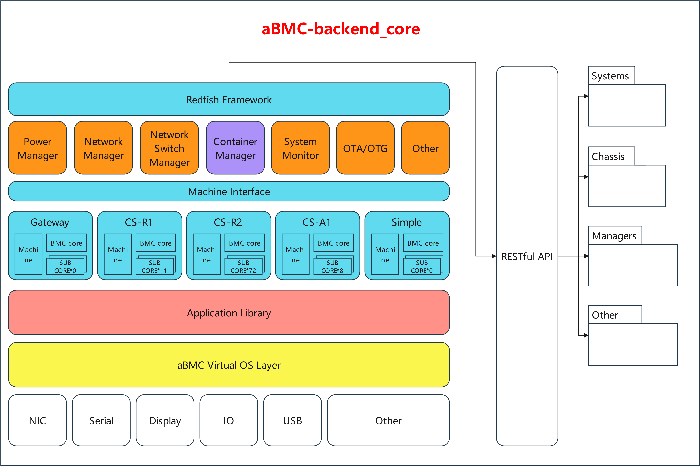

# aBMC

## Introduction
The Firefly Advanced Baseboard Management Controller (hereinafter referred to as aBMC) is an out-of-band centralized management software solution deployed on the BMC and designed specifically for high-density array servers. It provides full lifecycle management from single-node hardware monitoring to array-wide resource pooling, and supports remote operations and maintenance capabilities including IP-KVM (remote desktop over the network) and virtual media mounting. aBMC provides standard Redfish interfaces and a comprehensive CLI command line, making it easy to seamlessly integrate the system into existing automated operations platforms, and facilitating secondary development and intelligent O&M transformation.

## Vision
1. Business side: Help customers complete the full deployment process from device racking to formal launch of business systems within 10 days, greatly shortening the business delivery cycle of array servers.
2. Operations side: Overcome the long-standing pain points of traditional blade and array servers, such as decentralized multi-node management, low batch O&M efficiency, and insufficient hardware monitoring granularity, achieving centralized, visualized, and efficient operations and maintenance.
3. Development side: Open standardized Redfish and CLI interfaces that mask underlying hardware differences, allowing developers to operate the entire array of resources as easily as a single machine.
4. Ecosystem side: All self-developed array server hardware natively adapts to the aBMC management framework. After customer business software is integrated into the Firefly hardware ecosystem, subsequent compute expansion and device iteration upgrades require no re-adaptation of the management software, avoiding compatibility retrofit risks and continuously shortening iterative development cycles.

## Core Terminology
1. aBMC: The Firefly Advanced Baseboard Management Controller (hereinafter referred to as aBMC) is an out-of-band centralized management software solution deployed on the BMC and designed specifically for high-density array servers.
2. BMC: The Baseboard Management Controller is a dedicated controller on the server motherboard that runs independently of the main CPU and operating system, responsible for out-of-band hardware monitoring, power management, and remote operations and maintenance of the server.
3. Out-of-band management: Remote device management and control through an independent hardware channel that does not depend on the server operating system.
4. Redfish: The "standardized REST API" for server management, allowing hardware from different vendors to be managed through the same set of interfaces. (Redfish is a modern server management standard based on RESTful APIs, developed by the DMTF organization to replace the traditional IPMI protocol. Through JSON-formatted HTTP/HTTPS interfaces, it enables remote discovery, monitoring, and management of server hardware such as temperature, power, firmware versions, and network configurations, and is easier to integrate into development while offering higher security.)
5. CLI: A command-line interaction tool for quickly performing batch BMC operations and maintenance locally.
6. KVM: KVM is the abbreviation of Keyboard, Video, and Mouse, as distinguished from hardware KVM switches connected via VGA (rarely HDMI) and USB cables in a data center.
7. IP-KVM: A remote virtual console for remotely operating the server display, keyboard, and mouse.

## Detailed Documentation

For the complete features, operating procedures, and usage of the aBMC Web management platform, please refer to the [aBMC Web User Manual](/docs/server/bmc-software/aBMC/preface).