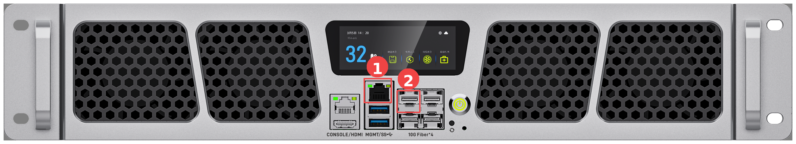
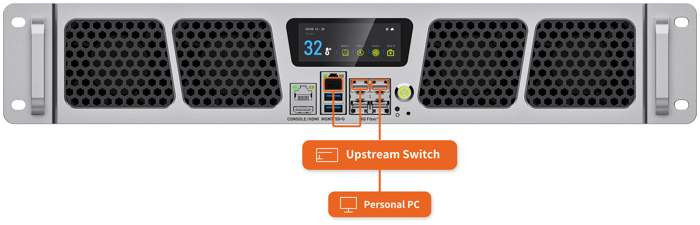

# Network Wiring

This chapter describes the general network wiring methods of the server. The wiring methods below cover most usage scenarios. For special requirements, or if you need the internal network topology of the server, contact sales for technical support.

Before wiring, learn the role of each network port:

- **MGMT port**: Directly connected to the BMC. It is the out-of-band management port of the server.
- **SFP+1 to SFP+4 ports**: The service network ports of the server. They are all connected to the internal switch.

Out-of-band management is a remote management channel that does not rely on the operating system or the service network. As long as the server is powered, you can access the BMC through the MGMT port to power the server on or off, monitor hardware, upgrade firmware, and so on, even when the server is not booted or the system fails. For details, see the "Accessing the BMC" chapter.

**There are two wiring methods: out-of-band management and in-band management. Either of them gives the whole server access to the external network; out-of-band management is recommended.**

<CodeBlockTabs defaultValue="OutOfBand">
    <CodeBlockTabsList>
        <CodeBlockTabsTrigger value="OutOfBand">Out-of-Band Management</CodeBlockTabsTrigger>
        <CodeBlockTabsTrigger value="InBand">In-Band Management</CodeBlockTabsTrigger>
    </CodeBlockTabsList>

    <CodeBlockTab value="OutOfBand">
      ## Out-of-Band Management: Dedicated MGMT Uplink [step]

      

      **Tools**

      - 10G SFP+ to RJ45 module × 1 ([Purchase link](https://item.taobao.com/item.htm?id=615471664761&skuId=4338443096690))
      - Network cables × 2 (one for the MGMT port, one for the module in the external-network port)

      **Wiring steps**

      1. Connect one network cable to the MGMT port of the server (1 in the figure), and the other end to the external network.
      2. Insert the 10G SFP+ to RJ45 module into any one of the SFP+1 to SFP+4 ports of the server (2 in the figure, SFP+1 as an example), connect one end of the other network cable to the module, and the other end to the external network.

      In this method, the out-of-band management (MGMT port) and the service network (SFP+ ports) are connected to the external network independently, without affecting each other.
    </CodeBlockTab>

    <CodeBlockTab value="InBand">
      ## In-Band Management: Management Traffic over the Service Network [step]

      

      **Tools**

      - 10G SFP+ to RJ45 modules × 2 ([Purchase link](https://item.taobao.com/item.htm?id=615471664761&skuId=4338443096690))
      - Network cables × 2 (one for interconnecting the MGMT and SFP+1 ports, one for the external network)

      **Wiring steps**

      1. Insert one 10G SFP+ to RJ45 module into the SFP+1 port of the server, and interconnect the MGMT port and the module with a network cable (1 in the figure).
      2. Insert the other module into any one of the SFP+2, SFP+3, and SFP+4 ports (2 in the figure, SFP+3 as an example), and connect the external network cable to the module.

      Note: The MGMT port is directly connected to the BMC. After it is interconnected with the SFP+1 port, the BMC management port can communicate with the external network through the internal switch and the module in the external-network port. The MGMT port is a gigabit copper port, and the module in the SFP+1 port negotiates to 1 Gbps with it. In this method, out-of-band management traffic goes over the service network and shares the same external cable.
    </CodeBlockTab>
</CodeBlockTabs>