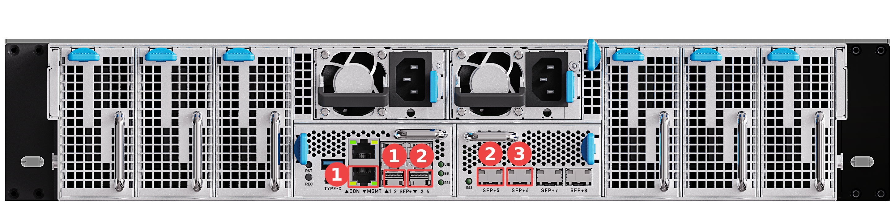
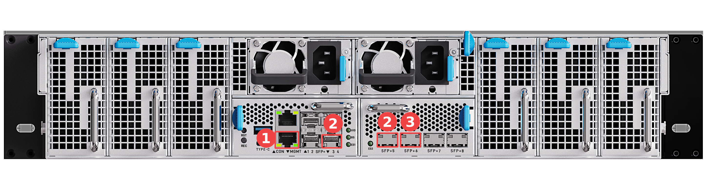

# Network Wiring

This chapter describes the general network wiring methods of the server. The wiring methods below cover most usage scenarios. For special requirements, or if you need the internal network topology of the server, contact sales for technical support.

Before wiring, learn the role of each network port:

- **MGMT port**: Directly connected to the BMC. It is the out-of-band management port of the server.
- **SFP+1 to SFP+8 ports**: The service network ports of the server. SFP+1 to SFP+4 and SFP+5 to SFP+8 belong to two different internal Layer 3 switches.

Out-of-band management is a remote management channel that does not rely on the operating system or the service network. As long as the server is powered, you can access the BMC through the MGMT port to power the server on or off, monitor hardware, upgrade firmware, and so on, even when the server is not booted or the system fails. For details, see the "Accessing the BMC" chapter.

**Either of the following two wiring methods allows the whole server to communicate with the external network; the difference is whether the out-of-band management channel shares the same external cable with the service network.**

## One Cable: Shared Uplink for Service and Out-of-Band Management

**Tools**

- 10G SFP+ to RJ45 modules × 2 ([Purchase link](https://item.taobao.com/item.htm?id=615471664761&skuId=4338443096690))
- 10G optical modules (LC) × 2 and one fiber patch cord (for interconnecting the SFP+4 and SFP+5 ports)
- Network cables × 2 (one for interconnecting the MGMT and SFP+2 ports, one for the external network)

**Wiring steps**

1. Insert one 10G SFP+ to RJ45 module into the SFP+2 port of the server, and interconnect the MGMT port and the SFP+2 port with a network cable (both ports are marked as 1 in the figure).
2. Insert the 10G optical modules into the SFP+4 and SFP+5 ports respectively, and interconnect the two ports with the fiber patch cord (both ports are marked as 2 in the figure) to bridge the two internal switches.
3. Insert the other 10G SFP+ to RJ45 module into the SFP+6 port of the server (marked as 3 in the figure), and connect the external network cable to the module.

Note: The MGMT port is directly connected to the BMC. After it is interconnected with the SFP+2 port, the BMC management port joins the internal switch of SFP+1 to SFP+4. The fiber patch cord between SFP+4 and SFP+5 bridges the two internal switches, so that the BMC and service traffic can communicate with the external network through the module in the SFP+6 port. The MGMT port is a gigabit copper port, and the module in the SFP+2 port negotiates to 1 Gbps with it. In this method, out-of-band management and the service network share the same external cable.

CAUTION: The fiber patch cord between SFP+4 and SFP+5 bridges the two internal switches and must not be omitted. Otherwise, the BMC cannot communicate with the SFP+5 to SFP+8 ports.

The wiring locations are shown below. Ports marked with the same number in the figure form one interconnected group:

## Two Cables: Independent Uplinks for Service and Out-of-Band Management

**Tools**

- 10G SFP+ to RJ45 module × 1 ([Purchase link](https://item.taobao.com/item.htm?id=615471664761&skuId=4338443096690))
- 10G optical modules (LC) × 2 and one fiber patch cord (for interconnecting the SFP+4 and SFP+5 ports)
- Network cables × 2 (one for the MGMT port, one for the module in the SFP+6 port)

**Wiring steps**

1. Connect one network cable to the MGMT port of the server (marked as 1 in the figure), and the other end to the external network.
2. Insert the 10G optical modules into the SFP+4 and SFP+5 ports respectively, and interconnect the two ports with the fiber patch cord (both ports are marked as 2 in the figure) to bridge the two internal switches.
3. Insert the 10G SFP+ to RJ45 module into the SFP+6 port of the server (marked as 3 in the figure), connect one end of the other network cable to the module, and the other end to the external network.

In this method, the out-of-band management (MGMT port) and the service network (SFP+ ports) are connected to the external network independently, without affecting each other.

The wiring locations are shown below. Ports marked with the same number in the figure form one interconnected group:

