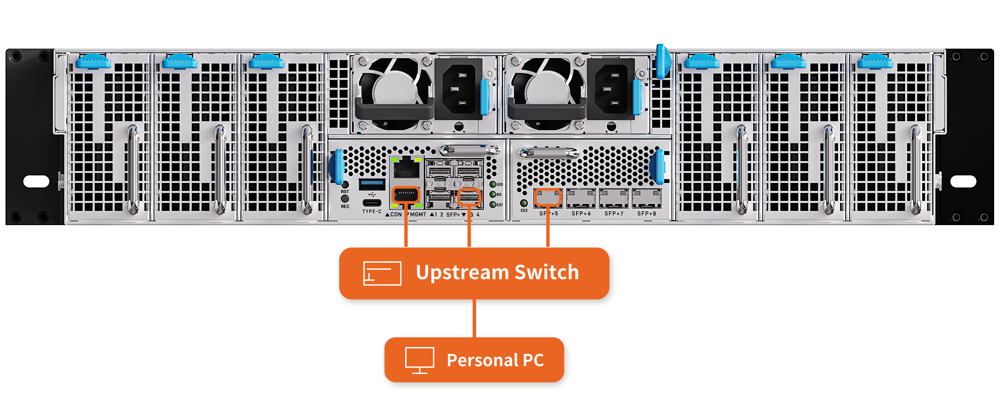
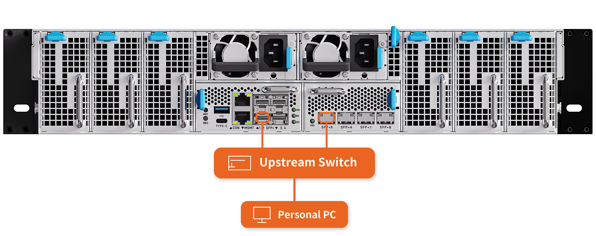

# Network Wiring

This chapter describes the general network wiring methods of the server. The wiring methods below cover most usage scenarios. For special requirements, or if you need the internal network topology of the server, contact sales for technical support.

Before wiring, learn the role of each network port:

- **MGMT port**: Directly connected to the BMC. It is the out-of-band management port of the server.
- **SFP+1 to SFP+8 ports**: The service network ports of the server. SFP+1 to SFP+4 and SFP+5 to SFP+8 belong to two different internal Layer 3 switches.

Out-of-band management is a remote management channel that does not rely on the operating system or the service network. As long as the server is powered, you can access the BMC through the MGMT port to power the server on or off, monitor hardware, upgrade firmware, and so on, even when the server is not booted or the system fails. For details, see the "Accessing the BMC" chapter.

**There are two wiring methods: out-of-band management and in-band management. Either of them gives the whole server access to the external network; out-of-band management is recommended.**

<CodeBlockTabs defaultValue="OutOfBand">
    <CodeBlockTabsList>
        <CodeBlockTabsTrigger value="OutOfBand">Out-of-Band Management</CodeBlockTabsTrigger>
        <CodeBlockTabsTrigger value="InBand">In-Band Management</CodeBlockTabsTrigger>
    </CodeBlockTabsList>

    <CodeBlockTab value="OutOfBand">
      

      **Tools**

      - 10G SFP+ to RJ45 modules × 2
      - Network cables × 3 (one for the MGMT port, the other two for the modules in the SFP+4 and SFP+5 ports)

      **Wiring steps**

      1. Connect one network cable to the MGMT port of the server, and the other end to the upstream switch (Upstream Switch).
      2. Insert one 10G SFP+ to RJ45 module into the SFP+4 port of the server, connect one end of a network cable to the module, and the other end to the upstream switch (Upstream Switch).
      3. Insert the other 10G SFP+ to RJ45 module into the SFP+5 port of the server, connect one end of the last network cable to the module, and the other end to the upstream switch (Upstream Switch).

      In this method, the out-of-band management (MGMT port) and the service network (SFP+ ports) are connected to the upstream switch independently, without affecting each other. The two internal switches are uplinked to the external network separately through SFP+4 and SFP+5, and no jumper between the switches is needed. The upstream switch then connects to endpoints such as a personal computer (Personal PC), so that the server can communicate with the external network.
    </CodeBlockTab>

    <CodeBlockTab value="InBand">
      

      **Tools**

      - 10G SFP+ to RJ45 modules × 2
      - Network cables × 2 (for the modules in the SFP+2 and SFP+5 ports)

      **Wiring steps**

      1. Insert one 10G SFP+ to RJ45 module into the SFP+2 port of the server, connect one end of a network cable to the module, and the other end to the upstream switch (Upstream Switch).
      2. Insert the other 10G SFP+ to RJ45 module into the SFP+5 port of the server, connect one end of the other network cable to the module, and the other end to the same upstream switch (Upstream Switch).

      Note: In this method, the MGMT port needs no cabling, and management traffic goes over the service network: the two internal switches are uplinked to the external network separately through SFP+2 and SFP+5, and the BMC management traffic communicates with the external network through the internal switches. The upstream switch then connects to endpoints such as a personal computer (Personal PC).
    </CodeBlockTab>
</CodeBlockTabs>