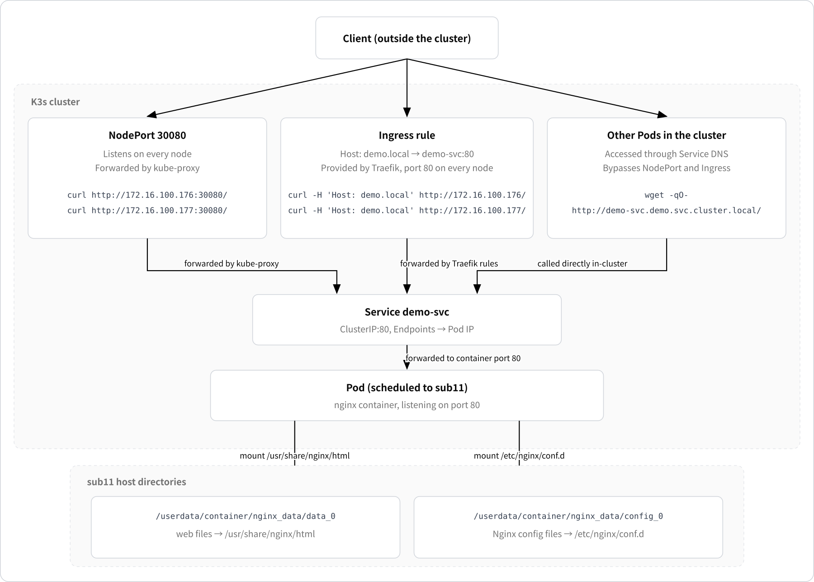

# Deploying a Simple Application

This chapter uses Nginx as an example to deploy a simple application on a K3s cluster that has completed [online deployment](install.md). It covers commonly used resources such as host directory mounts (`hostPath`), Services, and Ingress.

* **What is deployed**: a single YAML file that creates four kinds of resources: `Namespace`, `Deployment`, `Service`, and `Ingress`, and uses `hostPath` to mount a host directory into the Pod.
* **Access methods**: access the Nginx application through NodePort and Ingress.
* **Prerequisites**: at least one `Ready` node in the cluster, and that node can pull the Nginx image (import it in advance in an offline environment).

## Check the Node Status [step]

Before deploying the application, confirm that at least one node is in the `Ready` state:

```bash
sudo k3s kubectl get nodes
```

## Create the Application Manifest [step]

Save the following content as `demo-app.yaml`:

```yaml
apiVersion: v1
kind: Namespace
metadata:
  name: demo                             # Dedicated namespace, easy to manage and clean up
---
apiVersion: apps/v1
kind: Deployment
metadata:
  name: demo-app
  namespace: demo
spec:
  replicas: 1                            # Run one Pod
  selector:
    matchLabels:
      app: demo-app
  template:
    metadata:
      labels:
        app: demo-app                    # The Service finds the Pod through this label
    spec:
      nodeSelector:
        kubernetes.io/hostname: sub11    # hostPath is a node-local directory, so pin the Pod to this node
      containers:
        - name: nginx
          image: nginx:1.27-alpine       # Must match the node CPU architecture; this environment is arm64
          ports:
            - containerPort: 80          # Nginx listens on port 80 in the container
          volumeMounts:
            - name: data
              mountPath: /usr/share/nginx/html   # Web content directory
            - name: config
              mountPath: /etc/nginx/conf.d       # Nginx configuration directory
          resources:
            requests:
              cpu: 100m                  # CPU reserved when the Pod is scheduled
              memory: 64Mi               # Memory reserved when the Pod is scheduled
            limits:
              cpu: 500m                  # The Pod uses at most 500m CPU
              memory: 256Mi              # The Pod uses at most 256Mi of memory
      volumes:
        - name: data
          hostPath:
            path: /userdata/container/nginx_data/data_0     # Web content directory
            type: DirectoryOrCreate   # kubelet creates the directory if it does not exist
        - name: config
          hostPath:
            path: /userdata/container/nginx_data/config_0   # Nginx configuration directory
            type: DirectoryOrCreate
---
apiVersion: v1
kind: Service
metadata:
  name: demo-svc
  namespace: demo
spec:
  type: NodePort                         # Access the application from outside through "<node IP>:<port>"
  selector:
    app: demo-app                        # Forward to Pods labeled app=demo-app
  ports:
    - name: http
      port: 80                           # Port exposed by the Service inside the cluster
      targetPort: 80                     # Forward to port 80 of the Pod
      nodePort: 30080                    # Reach the application at <node IP>:30080 from outside
---
apiVersion: networking.k8s.io/v1
kind: Ingress
metadata:
  name: demo-ingress
  namespace: demo
spec:
  ingressClassName: traefik              # Use the Traefik bundled with K3s to handle Ingress requests
  rules:
    - host: demo.local                   # This rule matches requests whose Host is demo.local
      http:
        paths:
          - path: /
            pathType: Prefix             # Match all requests under /
            backend:
              service:
                name: demo-svc           # Forward requests to demo-svc
                port:
                  number: 80             # Use port 80 of the Service
```

## Deploy the Application [step]

```bash
sudo k3s kubectl apply -f demo-app.yaml
```

Check the created resources:

```bash
sudo k3s kubectl -n demo get all,ingress -o wide
```

Confirm that the Pod `STATUS` is `Running` and that `NODE` is `sub11`.

## Write the Page and Configuration [step]

**Write the configuration and web page on the `sub11` node**

```bash
sudo tee /userdata/container/nginx_data/config_0/default.conf >/dev/null <<'EOF'
server {
    listen 80;
    root /usr/share/nginx/html;
    index index.html;
}
EOF

echo hello-from-hostpath | sudo tee /userdata/container/nginx_data/data_0/index.html
```

**Reload the Nginx configuration on the `bmc` node**

```bash
sudo k3s kubectl -n demo exec deploy/demo-app -- nginx -s reload
```

## Access the Application [step]

After deployment, the application can be accessed in the following ways:

<CodeBlockTabs defaultValue="NodePort">
  <CodeBlockTabsList>
    <CodeBlockTabsTrigger value="NodePort">NodePort</CodeBlockTabsTrigger>
    <CodeBlockTabsTrigger value="Ingress">Ingress</CodeBlockTabsTrigger>
    <CodeBlockTabsTrigger value="In-Cluster Access">In-Cluster Access</CodeBlockTabsTrigger>
  </CodeBlockTabsList>
  <CodeBlockTab value="NodePort">
    The Service uses `30080` as its NodePort, so any node IP works:

    ```bash
    curl http://172.16.100.177:30080/
    ```

    ```text
    hello-from-hostpath
    ```

    The NodePort listens on every node, so accessing it through the `bmc` address also reaches this Pod on `sub11`:

    ```bash
    curl http://172.16.100.176:30080/
    ```

    ```text
    hello-from-hostpath
    ```
  </CodeBlockTab>
  <CodeBlockTab value="Ingress">
    The Ingress rule uses the domain `demo.local`. Without DNS, emulate the domain with the `Host` header:

    ```bash
    curl -H 'Host: demo.local' http://172.16.100.177/
    ```

    ```text
    hello-from-hostpath
    ```
    
  </CodeBlockTab>
  <CodeBlockTab value="In-Cluster Access">
    Inside the cluster, access the Service directly through its DNS name.

    ```bash
    sudo k3s kubectl -n demo exec deploy/demo-app -- \
      sh -c 'wget -qO- http://demo-svc.demo.svc.cluster.local/'
    ```

    ```text
    hello-from-hostpath
    ```
  </CodeBlockTab>
</CodeBlockTabs>

## Manifest Description [step]



| Resource | Key Settings | Purpose |
|---|---|---|
| `Namespace` | `name: demo` | Isolate all resources of this application; deleting the namespace cleans everything up |
| `Deployment` | `image`, `replicas`, `nodeSelector`, `resources` | Run the Nginx Pod and pin it to `sub11` with `nodeSelector` |
| `Deployment.volumes` | `hostPath`, `type: DirectoryOrCreate` | Mount the host directories `data_0` and `config_0` into the container, creating them if they do not exist |
| `Service` | `type: NodePort`, `nodePort: 30080` | Provide a stable entry point for the Pod and listen on `30080` on every node |
| `Ingress` | `host: demo.local`, `ingressClassName: traefik` | Forward requests to `demo-svc` by domain name, handled by Traefik |

## Clean Up the Application [step]

Deleting the namespace also deletes the `Deployment`, `Service`, `Ingress`, and other cluster resources, but **the `hostPath` directories belong to the host and are not deleted**; clean them up separately.

**Delete the cluster resources on the `bmc` node**

```bash
sudo k3s kubectl delete namespace demo
```

**Delete the host data on the `sub11` node**

```bash
sudo ls -l /userdata/container/nginx_data/data_0/

# Back up
sudo tar czf /userdata/nginx_data-backup.tar.gz -C /userdata/container nginx_data

# Delete
sudo rm -rf /userdata/container/nginx_data
```
