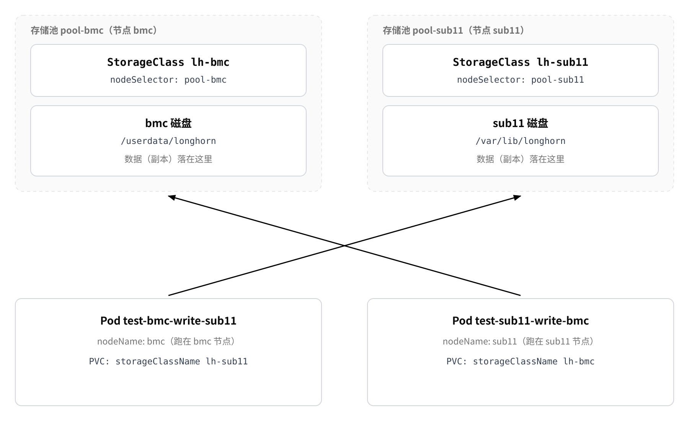

# Longhorn

This chapter describes how to use [Longhorn](https://docs.rancher.cn/docs/k3s/storage/#%E8%AE%BE%E7%BD%AE-longhorn). The example environment is the cluster deployed online in [K3s Deployment](install.md), and the version in use is `v1.5.1`.

* **What Longhorn is**: a cloud-native distributed block storage project open sourced by Rancher that provides volumes to Kubernetes through a CSI driver. A volume can have several replicas spread across different nodes, and supports online expansion, snapshots, and backups.
* **Difference from local-path**: `local-path` stores a volume in a local directory of the node where the Pod runs, while Longhorn decides the volume location itself: replicas can span nodes, and online expansion is supported.


## Environment Preparation

Run the following preparation on both the Server and the Agent nodes.

### Install the Packages [step]

Longhorn attaches volumes to the node that runs the container as **iSCSI block devices** (so open-iscsi is required), and exporting snapshots to an NFS backup target requires an **NFS client**. Both are required:

* `open-iscsi`: provides the iSCSI initiator; Longhorn volumes are attached to the node as iSCSI devices;
* `nfs-common`: required when exporting snapshots to an NFS backup target;
* `jq`: required by the dependency check script to parse JSON output.

```shell
sudo apt install -y open-iscsi nfs-common jq
systemctl is-active iscsid                 # Must print active
```

### Dependency Check [step]

Longhorn provides an official check script that verifies kernel modules, iSCSI, multipath, and other dependencies item by item and reports a conclusion. Run it once on the Server and on each Agent node:

```shell
# Dependency check (Appendix B provides a script for networks in China)
curl -sSfL https://raw.githubusercontent.com/longhorn/longhorn/v1.5.3/scripts/environment_check.sh | bash
```

If the script reports missing dependencies, install the packages it lists and run it again. Continue only after every check passes.


## Deploying Longhorn

### Install Longhorn [step]

```bash
# Install the storage service
sudo k3s kubectl apply -f https://raw.githubusercontent.com/longhorn/longhorn/v1.5.1/deploy/longhorn.yaml

# Watch the installation progress and wait for the Pods to reach Running one by one (Ctrl+C to quit, which does not affect the installation)
sudo k3s kubectl -n longhorn-system get pods --watch
```

### Verify the Installation [step]

```bash
# 1) Are the components ready?
sudo k3s kubectl -n longhorn-system get pods -o wide

# 2) Has the StorageClass been created?
sudo k3s kubectl get sc

# 3) Volumes and replicas (the status of application volumes is also checked here later)
sudo k3s kubectl -n longhorn-system get volumes.longhorn.io
sudo k3s kubectl -n longhorn-system get replicas.longhorn.io -o wide
```

Acceptance criteria:

* Components: `longhorn-manager`, `longhorn-driver-deployer`, and `csi-*` are `Running`;
* StorageClass: `longhorn` appears in the list with `ALLOWVOLUMEEXPANSION` set to `true`;
* Volumes: an empty list is normal when no application volume exists yet; once a volume exists, `STATE` is `attached` and `ROBUSTNESS` is `healthy`.

## Longhorn UI

Longhorn ships with a web interface. The default `longhorn-frontend` Service is a `ClusterIP` and can only be reached inside the cluster. To open the UI from outside, create a NodePort Service that forwards requests to port `8000` of the UI Pod:

```bash
sudo k3s kubectl apply -f - <<'EOF'
apiVersion: v1
kind: Service
metadata:
  name: longhorn-ui-nodeport
  namespace: longhorn-system
spec:
  type: NodePort
  selector:
    app: longhorn-ui              # Matches the label of the longhorn-ui Pod
  ports:
  - port: 80
    targetPort: 8000              # Port the longhorn-ui container listens on
    nodePort: 30880               # A random port in 30000-32767 is assigned if omitted
EOF
```

Verify and open it:

```bash
# Verify on the node; an HTTP 200 and HTML output mean it works
curl -I http://127.0.0.1:30880
```

## Usage Example

This example uses a single YAML file (`lh-pool.yaml`) to create two independent Longhorn storage pools and to store the two data sets on different nodes.
By separating the **node that runs the Pod** from the **storage node that holds the volume replicas**, it shows that a Pod can run on one node while its data is stored on another, which means that **the Pod location and the data location can be chosen independently**.

* **Manifest contents**: 1 `Namespace`, 2 `StorageClass` resources, 2 `PersistentVolumeClaim` resources, and 2 `Pod` resources; the two `StorageClass` resources use `bmc` and `sub11` as their storage nodes.
* **Prerequisites**: the Longhorn node used as storage must have **node-level and disk-level** `allowScheduling` enabled and a matching storage pool tag and storage directory configured; the node that runs the Pod must be able to pull the `busybox:1.36` image.

### Check the Storage Pools [step]

First check the scheduling status and tags of the Longhorn nodes:

```bash
sudo k3s kubectl -n longhorn-system get nodes.longhorn.io \
  -o custom-columns=NAME:.metadata.name,SCHEDULABLE:.spec.allowScheduling,TAGS:.spec.tags
```

```text
NAME    SCHEDULABLE   TAGS
bmc     true          []
sub11   false         []
```

A node used as storage must show `SCHEDULABLE` as `true` and must carry a matching `pool-<node name>` tag.

For example:

```text
bmc     true          [pool-bmc]
sub11   true          [pool-sub11]
```

If the status or the tags do not meet the requirements, configure them in the next step.

### Enable the Storage Pools [step]

Whether a Longhorn node can store replicas is decided by both the **node-level** and the **disk-level** `allowScheduling`, and both must be enabled.

Enabling the disk-level scheduling alone is not enough for Longhorn to create replicas on that node; otherwise the volume may stay in the `detached` / `unknown` state, its replicas in `stopped`, and the Pod may remain in `ContainerCreating`.

Also give every node a unique storage pool tag:

```bash
sudo k3s kubectl -n longhorn-system patch nodes.longhorn.io sub11 --type=merge \
  -p '{"spec":{"allowScheduling":true,"tags":["pool-sub11"]}}'

sudo k3s kubectl -n longhorn-system patch nodes.longhorn.io bmc --type=merge \
  -p '{"spec":{"allowScheduling":true,"tags":["pool-bmc"]}}'
```

### Verify the Storage Pools [step]

Confirm the configuration once more:

```bash
sudo k3s kubectl -n longhorn-system get nodes.longhorn.io \
  -o custom-columns=NAME:.metadata.name,SCHEDULABLE:.spec.allowScheduling,TAGS:.spec.tags
```

Expected result:

```text
NAME    SCHEDULABLE   TAGS
bmc     true          [pool-bmc]
sub11   true          [pool-sub11]
```

`bmc` and `sub11` now correspond to two storage pools:

| Node | Storage pool tag |
| ------- | ------------ |
| `bmc`   | `pool-bmc`   |
| `sub11` | `pool-sub11` |

A `StorageClass` can later point at the matching tag through `nodeSelector` to restrict a volume to a specific storage pool.

### Configure the Storage Directory [step]

Every Longhorn node has at least one disk, and the `path` of that disk decides where replicas are actually stored.

By default Longhorn uses:

```text
/var/lib/longhorn/
```

If the data partition of the device is `/userdata`, store the Longhorn data directory on that partition, for example:

```bash
sudo mkdir -p /userdata/longhorn
```

Then check the current disk configuration of the node:

```bash
sudo k3s kubectl -n longhorn-system get nodes.longhorn.io sub11 \
  -o jsonpath='{.spec.disks}'
```

Example:

```text
{"default-disk-9fabfb0f4ec0d145":{"allowScheduling":false,"diskType":"filesystem","evictionRequested":false,"path":"/var/lib/longhorn/","storageReserved":2000000000,"tags":[]}}
```

Where:

* `default-disk-9fabfb0f4ec0d145`: the disk name created automatically by Longhorn; the suffix is random and cannot be derived, so query it before using it.
* `path`: the storage directory actually used by that disk.
* `allowScheduling`: controls whether Longhorn may schedule replicas on that disk.

Use the disk name you queried to change the storage directory:

```bash
sudo k3s kubectl -n longhorn-system patch nodes.longhorn.io sub11 --type=merge \
  -p '{"spec":{"disks":{"default-disk-9fabfb0f4ec0d145":{"path":"/userdata/longhorn"}}}}'
```

For a manually added disk you can choose the disk name yourself, for example `userdata-disk` on the `bmc` node.

The disk configuration finally used in this environment is:

| Node | Disk name | `path` | `allowScheduling` | `storageReserved` |
| ------- | ------------------------------- | -------------------- | ----------------- | ----------------: |
| `bmc`   | `userdata-disk`                 | `/userdata/longhorn` | `true`            |              8 GB |
| `sub11` | `default-disk-9fabfb0f4ec0d145` | `/var/lib/longhorn/` | `false`           |              2 GB |

> The disk on `sub11` is only used to demonstrate node configuration in this example; whether a storage pool is actually usable depends on the real state of the node-level and disk-level `allowScheduling`.

### Create the Application Manifest [step]

Save the following content as `lh-pool.yaml`:

```yaml
# -----------------------------
# bmc storage pool
# -----------------------------
apiVersion: storage.k8s.io/v1
kind: StorageClass
metadata:
  name: lh-bmc
provisioner: driver.longhorn.io
allowVolumeExpansion: true
reclaimPolicy: Delete
parameters:
  numberOfReplicas: "1"        # Only the bmc storage pool is used, so the replica count can only be 1
  nodeSelector: "pool-bmc"    # Restrict volume replicas to bmc
  staleReplicaTimeout: "30"
  fsType: "ext4"

---
# -----------------------------
# sub11 storage pool
# -----------------------------
apiVersion: storage.k8s.io/v1
kind: StorageClass
metadata:
  name: lh-sub11
provisioner: driver.longhorn.io
allowVolumeExpansion: true
reclaimPolicy: Delete
parameters:
  numberOfReplicas: "1"         # Only the sub11 storage pool is used, so the replica count can only be 1
  nodeSelector: "pool-sub11"   # Restrict volume replicas to sub11
  staleReplicaTimeout: "30"
  fsType: "ext4"

---
# -----------------------------
# Test namespace
# -----------------------------
apiVersion: v1
kind: Namespace
metadata:
  name: lh-pool

---
# -----------------------------
# PVC: data stored on sub11
# Pod runs on bmc
# -----------------------------
apiVersion: v1
kind: PersistentVolumeClaim
metadata:
  name: data-bmc-write-sub11
  namespace: lh-pool
spec:
  accessModes:
    - ReadWriteOnce
  storageClassName: lh-sub11
  resources:
    requests:
      storage: 1Gi

---
apiVersion: v1
kind: Pod
metadata:
  name: test-bmc-write-sub11
  namespace: lh-pool
spec:
  nodeName: bmc
  containers:
    - name: writer
      image: busybox:1.36
      command:
        - sh
        - -c
        - |
          while true; do
            echo "$(hostname) $(date +%s)" >> /data/who.txt
            sync
            sleep 5
          done
      volumeMounts:
        - name: data
          mountPath: /data
  volumes:
    - name: data
      persistentVolumeClaim:
        claimName: data-bmc-write-sub11

---
# -----------------------------
# PVC: data stored on bmc
# Pod runs on sub11
# -----------------------------
apiVersion: v1
kind: PersistentVolumeClaim
metadata:
  name: data-sub11-write-bmc
  namespace: lh-pool
spec:
  accessModes:
    - ReadWriteOnce
  storageClassName: lh-bmc
  resources:
    requests:
      storage: 1Gi

---
apiVersion: v1
kind: Pod
metadata:
  name: test-sub11-write-bmc
  namespace: lh-pool
spec:
  nodeName: sub11
  containers:
    - name: writer
      image: busybox:1.36
      command:
        - sh
        - -c
        - |
          while true; do
            echo "$(hostname) $(date +%s)" >> /data/who.txt
            sync
            sleep 5
          done
      volumeMounts:
        - name: data
          mountPath: /data
  volumes:
    - name: data
      persistentVolumeClaim:
        claimName: data-sub11-write-bmc
```

### Apply the Manifest [step]

Create the resources with the following command:

```bash
sudo k3s kubectl apply -f lh-pool.yaml
```

Check the `StorageClass` resources, the PVCs, and the Pods:

```bash
sudo k3s kubectl get sc

sudo k3s kubectl -n lh-pool get pvc,pods -o wide
```

Both PVCs are expected to be `Bound`, and the two Pods are expected to run on the specified nodes:

```text
NAME                                      STATUS   VOLUME                                     CAPACITY   STORAGECLASS
persistentvolumeclaim/data-bmc-write-sub11   Bound    pvc-97787f2b-e255-4d78-b7dc-63fcf2dccf2b   1Gi        lh-sub11
persistentvolumeclaim/data-sub11-write-bmc   Bound    pvc-8fbd1997-64cf-4224-b6a2-59ca05528a5f   1Gi        lh-bmc

NAME                       READY   STATUS    AGE   IP            NODE
pod/test-bmc-write-sub11   1/1     Running   32s   10.42.0.103   bmc
pod/test-sub11-write-bmc   1/1     Running   32s   10.42.1.62    sub11
```

Where:

* `data-bmc-write-sub11` uses `lh-sub11`, its data is stored on `sub11`, and the Pod runs on `bmc`.
* `data-sub11-write-bmc` uses `lh-bmc`, its data is stored on `bmc`, and the Pod runs on `sub11`.

The `busybox` image is pulled when the Pod runs for the first time, which may take a while. While the image has not finished pulling or the volume has not finished mounting, the Pod may temporarily stay in `Pending` or `ContainerCreating`.

### Check Where the Data Lands [step]

The `storageClassName` of a PVC decides which storage pool the volume uses, while the `nodeName` of a Pod only decides where the Pod runs.

The actual mount node and replica node can be read from the Longhorn Volumes and Replicas:

```bash
sudo k3s kubectl -n longhorn-system get volumes.longhorn.io \
  -o custom-columns=NAME:.metadata.name,STATE:.status.state,NODE:.status.currentNodeID

sudo k3s kubectl -n longhorn-system get replicas.longhorn.io \
  -o custom-columns=NAME:.metadata.name,HOSTID:.spec.nodeID
```

Example:

```text
NAME                                      STATE      NODE
pvc-8fbd1997-64cf-4224-b6a2-59ca05528a5f  attached   sub11
pvc-97787f2b-e255-4d78-b7dc-63fcf2dccf2b  attached   bmc

NAME                                           HOSTID
pvc-8fbd1997-64cf-4224-b6a2-59ca05528a5f-r-363125a9  bmc
pvc-97787f2b-e255-4d78-b7dc-63fcf2dccf2b-r-5a6a5c3f  sub11
```

Two concepts have to be distinguished here:

| Field | Meaning |
| -------- | ------------------------------- |
| `NODE`   | The node the volume is currently attached to, that is, the mount node used by the Pod |
| `HOSTID` | The node that hosts the replica, that is, the node where the volume replica is actually stored |

The example therefore forms a crossed relationship:



If the `nodeSelector` in the `StorageClass` does not match the Longhorn node tags, Longhorn cannot find a suitable storage node and the PVC may stay in the `Pending` state.

### Clean Up the Application [step]

After testing, clean up the resources in the following order:

```bash
# Delete the test namespace, which also deletes the PVCs, Pods, and other application resources in it
sudo k3s kubectl delete ns lh-pool

# A StorageClass is a cluster-scoped resource and must be deleted separately
sudo k3s kubectl delete sc lh-bmc lh-sub11
```

If the storage pools are no longer used, restore the Longhorn node configuration:

```bash
sudo k3s kubectl -n longhorn-system patch nodes.longhorn.io sub11 --type=merge \
  -p '{"spec":{"tags":[],"allowScheduling":false,"disks":{"default-disk-9fabfb0f4ec0d145":{"allowScheduling":false}}}}'
```

To restore the `bmc` node as well, run:

```bash
sudo k3s kubectl -n longhorn-system patch nodes.longhorn.io bmc --type=merge \
  -p '{"spec":{"tags":[],"allowScheduling":false,"disks":{"userdata-disk":{"allowScheduling":false}}}}'
```

