# Screen Casting Management

## Introduction

Screen Casting Management is a centralized screen casting and O&M management feature that aBMC provides for Android devices. The feature consists of two major modules: casting control and device auxiliary management.
1. Casting control: supports filtering Android devices connected via USB or Wi-Fi, and starting casting, stopping casting, expanded preview, and multi-device control for one or more devices.
2. Device auxiliary management: supports sending files to selected devices, installing APKs, executing ADB Shell, scanning for Wi-Fi devices, and setting device groups.

## Development Vision

1. Provide a unified screen preview and control entry point for multiple Android devices, reducing the repeated work of connecting, verifying, and operating devices one by one.
2. Reduce the risk of selecting the wrong devices during bulk casting, application deployment, and remote debugging, through device grouping, connection type, and online status filtering.

# Feature Usage

## Selecting Devices and Managing Casting

<CodeBlockTabs defaultValue="WEB">
  <CodeBlockTabsList>
    <CodeBlockTabsTrigger value="WEB">WEB</CodeBlockTabsTrigger>
  </CodeBlockTabsList>

  <CodeBlockTab value="WEB">
    ### Open the screen casting management page [step]

    1. Select **Services** in the left main navigation bar.
    2. Select **Casting** in the secondary navigation bar.
    3. Check the feature entries such as **Send File**, **Install APK**, **Adb shell**, **Scan Wi-Fi**, and **Set Group**.
    4. Wait for **Device Management** to finish loading, and confirm that device labels, UDIDs, and statuses are displayed.
    5. Check the casting area on the right. When no device is being cast, the page displays **No Devices in Casting**.

    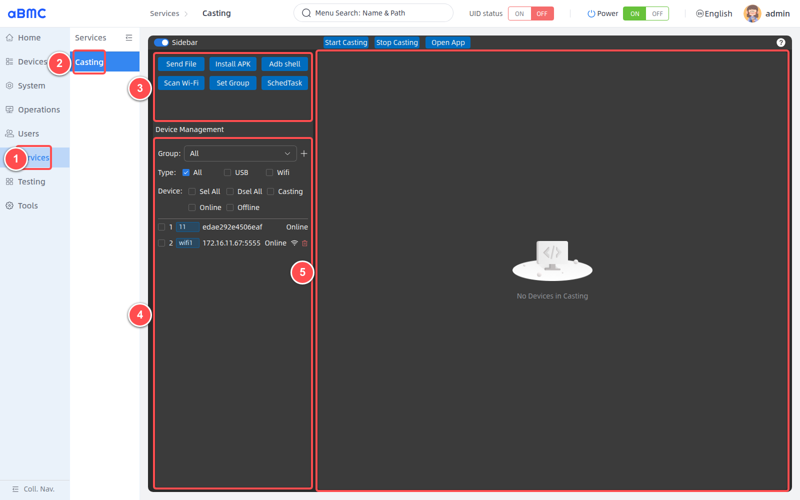

    <Callout title="Android devices only" type="warn">
      Screen casting management supports Android devices only. Before use, confirm that developer options and USB or wireless debugging are enabled on the device, debugging authorization is complete, and the device has been correctly recognized by aBMC via USB or Wi-Fi.
    </Callout>

    ### Filter and select devices [step]

    1. In **Group**, select the target group; selecting **All** displays all devices.
    2. In **Type**, select **All**, **USB**, or **Wifi**. The three options are mutually exclusive; only one connection scope is displayed at a time.
    3. Use **Sel All**, **Dsel All**, **Casting**, **Online**, or **Offline** to quickly change the selected devices.
    4. In the device list, verify the labels, UDIDs, and statuses, then click a device row or its checkbox to select the target devices. USB devices usually display the device serial number, and Wi-Fi devices are displayed as `IP:port`.

    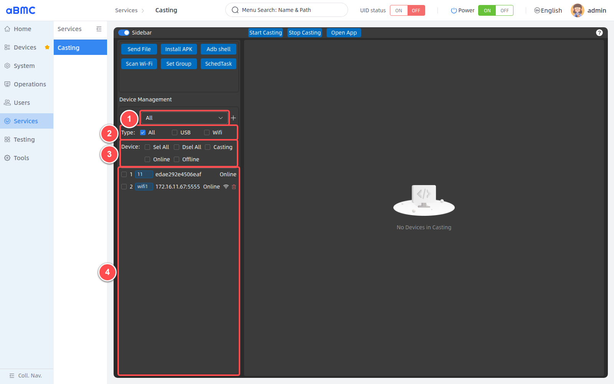

    The quick items in the **Device** area change the selected devices and do not hide the device list.

    | Quick item | Selection result | Recommendation |
    | --- | --- | --- |
    | Sel All | Selects all devices within the current group and connection type scope. | Limit Group and Type before bulk operations to avoid expanding the operation scope. |
    | Dsel All | Clears all current selections. | Recommended once after completing a bulk operation. |
    | Casting | Selects devices that are currently casting and online. | Suitable for stopping casting in bulk or bulk control. |
    | Online | Selects devices that are online but not yet casting. | Suitable for starting casting in bulk. |
    | Offline | Selects devices whose connection status is not online. | Device rows may display **Unauthorized**; restore the connection or complete authorization first. |

    <Callout title="Verifying device identity" type="info">
      Device labels may be modified or duplicated. Before casting, sending files, installing APKs, or executing ADB Shell, verify both the device label and the UDID; do not identify the target device by serial number or list order alone.
    </Callout>

    ### Start and stop casting for a single device [step]

    1. Select one device with the status **Online**.
    2. Click **Start Casting**.
    3. Confirm that the device status changes to **Casting**, and a preview card containing the serial number, UDID, and live screen appears on the right.
    4. To stop casting, keep the target device selected and click **Stop Casting**.

    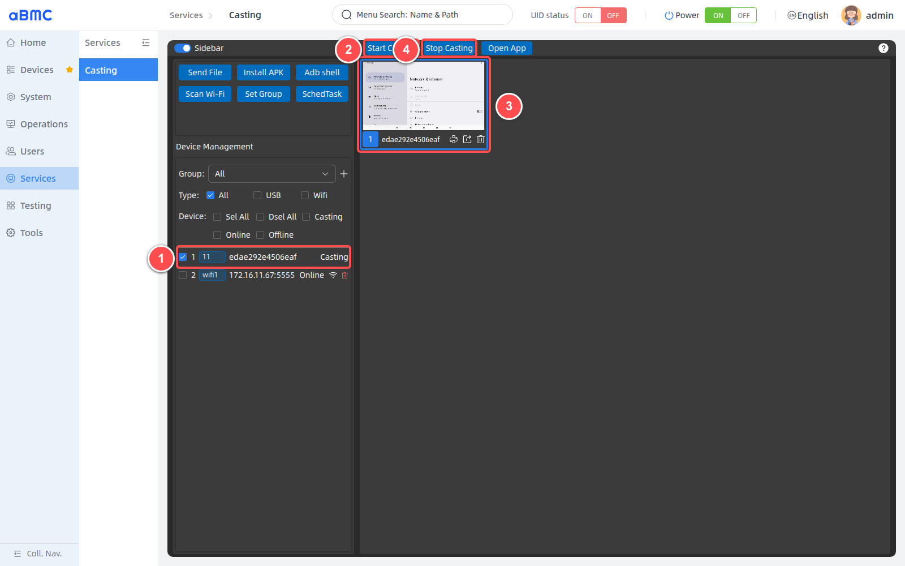

    <Callout title="Signs of successful casting" type="info">
      Confirm all of the following: the device status shows **Casting**, a preview card appears on the right, and the screen keeps refreshing. Clicking **Start Casting** alone is not sufficient evidence of successful casting.
    </Callout>

    You can also click the stop icon at the bottom-right corner of a preview card to stop casting only for the device corresponding to that card.

    ### Start and stop casting in bulk [step]

    1. Use **Group** and **Type** to limit the device scope, then select the target devices one by one, or use **Online** to quickly select devices that are online but not yet casting.
    2. After verifying the device labels and UDIDs, click **Start Casting**.
    3. Confirm that all target devices show **Casting**, and check each preview on the right.
    4. To stop in bulk, select the currently casting devices and click **Stop Casting**.

    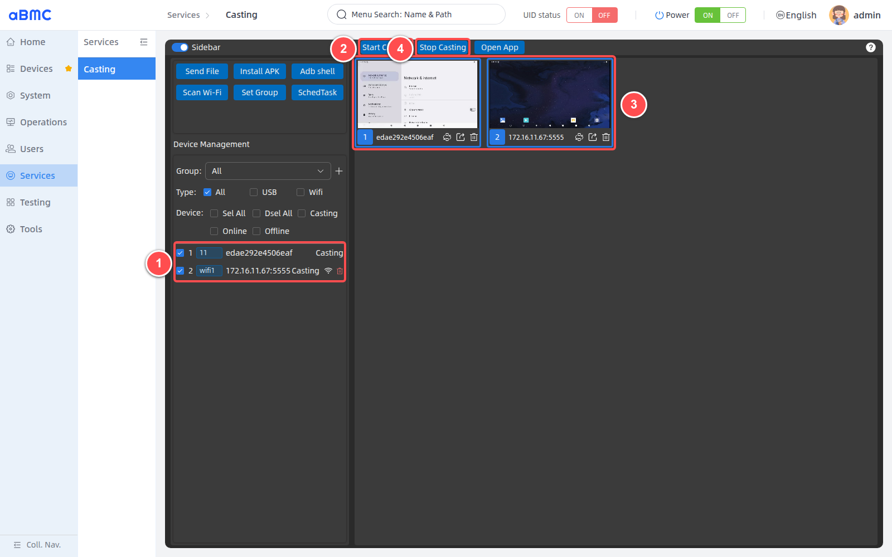

    After the operation, click **Dsel All** to prevent subsequent operations from reusing the previous selection.

    <Callout title="About bulk casting" type="warn">
      Bulk casting increases browser video decoding, aBMC processing, and management network bandwidth usage. When using it for the first time, start with a small number of devices and gradually add more after confirming the screen and controls are stable.
    </Callout>

    ### Use right-click quick actions [step]

    1. Right-click a device row.
    2. When a single device is selected, use **Start Casting** or **Stop Casting**.
    3. When multiple devices are selected, the context menu shows bulk start or bulk stop operations.
    4. After the operation, still confirm the result through device statuses and preview screens.
  </CodeBlockTab>
</CodeBlockTabs>

## Previewing and Controlling Android Devices

<CodeBlockTabs defaultValue="WEB">
  <CodeBlockTabsList>
    <CodeBlockTabsTrigger value="WEB">WEB</CodeBlockTabsTrigger>
  </CodeBlockTabsList>

  <CodeBlockTab value="WEB">
    ### Use preview cards [step]

    After casting succeeds, use the preview cards as shown below:

    1. Verify the live screen, device serial number, and UDID on the preview card; clicking the card selects or deselects the device.
    2. Click **Multi Control** to mark the device as a multi-control target; once enabled, the icon turns red.
    3. Click **Preview** to open the expanded preview; you can also double-click the preview card.
    4. Click **Stop Casting** to stop casting for the device and remove the preview card.

    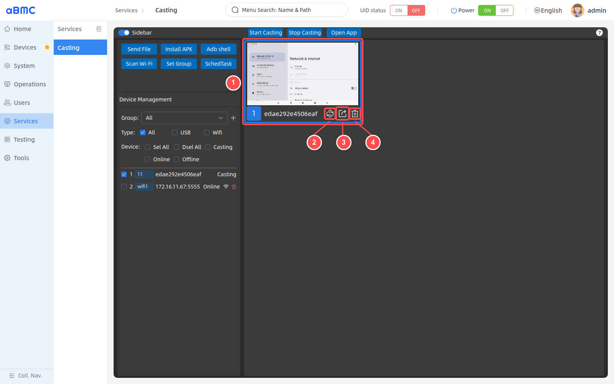

    | Action | Description |
    | --- | --- |
    | Select a preview card | Click the preview card to select or deselect the corresponding device. When selected, the card border is highlighted. |
    | Multi Control | Marks the device as a multi-control target. Once enabled, the icon turns red. |
    | Preview | Opens the expanded preview. Can also be opened by double-clicking the preview card. |
    | Stop Casting | Stops casting for the device and removes the preview card. |

    ### Open the expanded preview [step]

    Click the **Preview** icon at the bottom of a preview card, or double-click the preview card. After the window opens, follow the figure below:

    1. Verify the device serial number and UDID shown at the top of the window.
    2. Wait for the live screen to finish loading, then perform touch operations such as clicks and swipes with the mouse.
    3. Use **Multi Control** to enable or disable multi-control sending.
    4. Use **Power** to control the Android device screen power.
    5. Use **Volume Up** and **Volume Down** to adjust the volume.
    6. Use **Back**, **Home**, and **Overview** to perform Android navigation.
    7. Use **Screenshot** to save the current device screen.
    8. Use **Keyboard**, **Copy Content**, or **Open App** to perform input, clipboard, or application operations.
    9. Click the close button at the upper-right corner to exit the expanded preview. Closing the window does not stop the original casting session.

    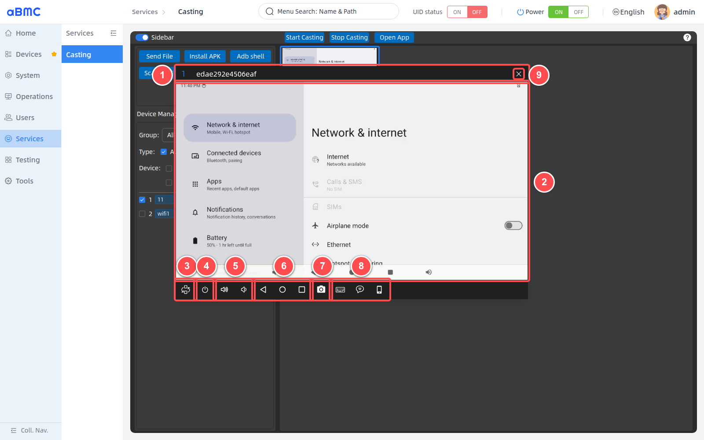

    ### Use quick controls [step]

    | Control | Purpose | Operation notes |
    | --- | --- | --- |
    | Multi Control | Enables multi-control sending for the current expanded window. | Must be used together with the Multi Control marks on other preview cards. |
    | Power | Sends the Android power key. | May turn on, turn off, or wake the screen, depending on the current device state. |
    | Volume Up / Volume Down | Increases or decreases the device volume. | Each action sends one corresponding key event. |
    | Back / Home / Overview | Performs the Android Back, Home, or Recents operation. | The result depends on the device's current page and system state. |
    | Screenshot | Saves a screenshot of the current device screen. | The download is saved by the browser; avoid including sensitive information. |
    | Keyboard | Enables or disables browser keyboard event forwarding. | When the icon is highlighted, keyboard input is sent to the Android device. |
    | Copy Content | Writes the entered text to the Android clipboard. | Enter the text and click **Copy**; click **Cancel** to close the input box when done. |
    | Open App | Shows the device application list and opens a specified app. | Confirm the app is installed and the current account has permission to launch it. |

    <Callout title="About preview loading" type="info">
      When the expanded preview creates a new video display area, the screen may briefly show black before it starts refreshing. Do not immediately conclude that casting has failed during initialization.
    </Callout>

    ### Control devices in bulk [step]

    1. Start casting for the control-source device and all target devices, and confirm the corresponding preview cards appear on the right.
    2. On the preview card of each target device that should synchronously receive operations, click **Multi Control** and confirm the icon turns red.
    3. On the preview card of the device acting as the control source, click **Preview**.

    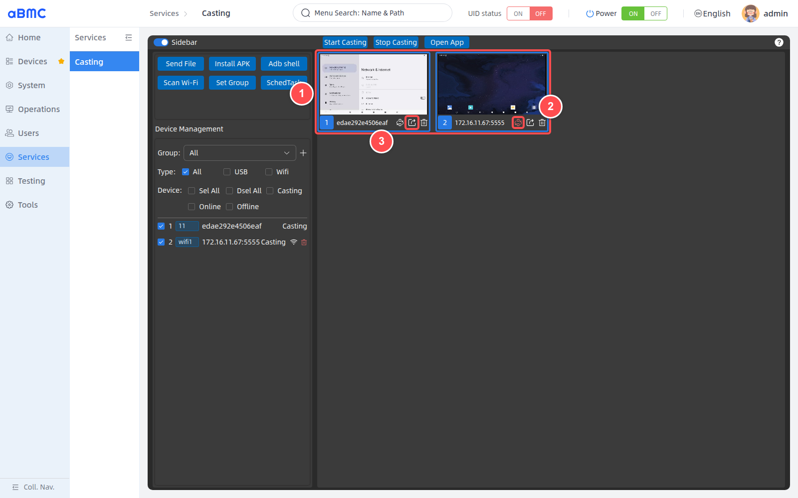

    4. Click **Multi Control** at the bottom of the expanded preview and confirm the icon turns red.
    5. Perform touch, Android navigation, or other quick operations on the control-source screen.
    6. Observe whether the marked target devices respond synchronously, and verify the result on each device.
    7. After the operation, disable **Multi Control** in the expanded preview, and clear the Multi Control marks on the target preview cards.

    <Callout title="Multi Control scope" type="warn">
      Multi Control synchronizes operations only to devices that are casting and marked as multi-control targets. Devices may differ in resolution, system version, current page, and response speed. Validate with a small number of devices before bulk operations, and always verify the result on each device after critical operations.
    </Callout>

    ### Open apps in bulk [step]

    1. Confirm that the target devices are in the **Casting** state.
    2. In the device list on the left or the preview cards on the right, select one or more target devices.
    3. Click **Open App** at the top of the page.
    4. Select the app to launch in the application list.
    5. Verify on each device whether the app opened successfully.

    <Callout title="App consistency" type="info">
      Only the currently selected devices that are casting receive the open-app operation. Before bulk operations, confirm that all target devices have the same app installed; success on one device does not mean success on the others.
    </Callout>
  </CodeBlockTab>
</CodeBlockTabs>

## Maintaining Android Devices in Bulk

<CodeBlockTabs defaultValue="WEB">
  <CodeBlockTabsList>
    <CodeBlockTabsTrigger value="WEB">WEB</CodeBlockTabsTrigger>
  </CodeBlockTabsList>

  <CodeBlockTab value="WEB">
    ### Send files [step]

    In the device list, select one or more target devices, then click **Send File**. After the window opens, follow the figure below:

    1. Click **Selected File** to choose files; at most 5 files can be selected at a time. After checking, click **Send File**.
    2. In the file list, verify the names of the files waiting to be sent.
    3. In **Selected Device**, verify the serial numbers of all target devices.
    4. In the task tree on the right, view the processing status of each device and each file; when a task fails, you can retry a single failed item or all failed items.

    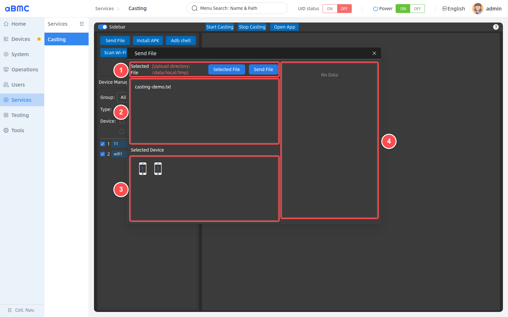

    <Callout title="About sending files" type="warn">
      Files are uploaded to `/data/local/tmp`. The send operation applies to all selected devices; before submitting, verify the file contents, file names, target devices, and remaining space. After the window is closed, subsequent tasks that have not started will no longer be executed.
    </Callout>

    ### Install APKs [step]

    In the device list, select one or more target devices, then click **Install APK**. After the window opens, follow the figure below:

    1. Click **Selected Apk** to choose installation packages with the `.apk` extension; at most 5 files can be selected at a time. After checking, click **Install APK**.
    2. In the file list, verify the names of the APKs waiting to be installed.
    3. In **Selected Device**, verify the serial numbers of all target devices.
    4. In the task tree on the right, view the installation status of each device and each APK; when an installation fails, you can retry the failed tasks.

    

    <Callout title="About APK installation" type="warn">
      Before installing, verify the APK source, package name, signature, Android version, processor architecture, and upgrade-overwrite relationships. A successful installation on one device does not mean success on the others.
    </Callout>

    ### Execute ADB Shell commands [step]

    In the device list, select one or more target devices, then click **Adb shell**. After the window opens, follow the figure below:

    1. In **Selected Device**, verify the serial numbers of all target devices.
    2. In **Command List**, select an existing quick command.
    3. You can also enter a command directly, then click **Execute** or press Enter to run it.
    4. Use **Command Execution Result** to expand or collapse results, and **Clear** to clear the records in the current window.
    5. View the returned content of each device by timestamp and UDID.

    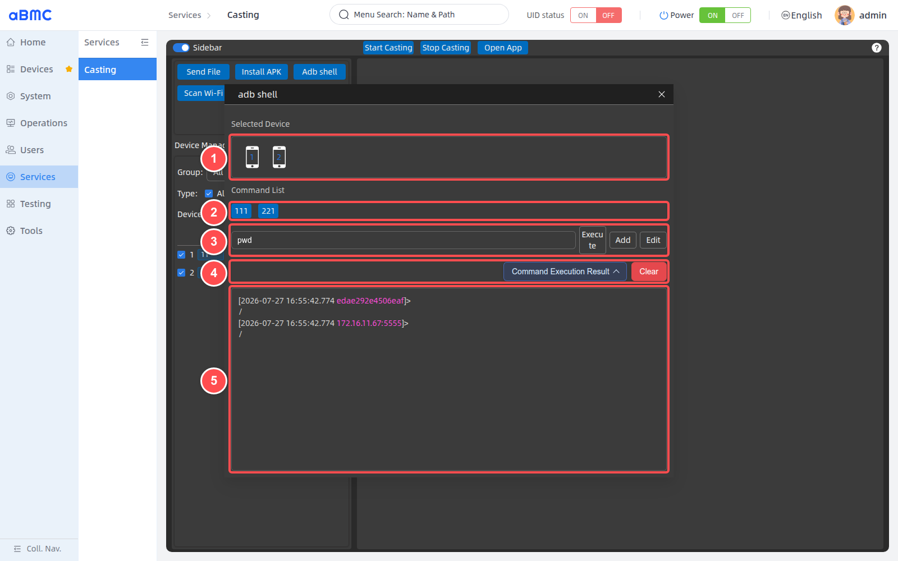

    In actual verification, the read-only command `pwd` was executed simultaneously on a USB device and `172.16.11.67:5555`, and both devices returned `/`.

    ### Manage ADB quick commands [step]

    1. Enter a reviewed command in the command input box.
    2. Click **Add**, fill in the quick command name and command value, then confirm to save.
    3. To maintain quick commands in bulk, click **Edit**.
    4. In the edit window, modify names or command values; use the plus sign to add rows and the minus sign to delete rows.
    5. Click **Confirm** to save the changes.

    <Callout title="About ADB Shell commands" type="warn">
      The same command is sent to all selected devices. ADB Shell commands may modify Android system settings, application data, or runtime state; do not execute commands from unknown sources. It is recommended to first verify the target devices and connections with read-only commands such as `pwd` and `getprop`.
    </Callout>

    ### File and APK task statuses [step]

    | Status | Description | Handling suggestion |
    | --- | --- | --- |
    | Waiting for Upload / Installation | The task has been created and is waiting to be processed. | Keep the window open and wait for preceding tasks to complete. |
    | Uploading / Installing | A file is being sent or an APK is being installed. | Do not disconnect devices or refresh the page. |
    | Upload Successful / Installation Successful | The current task on the current device has completed. | Continue verifying the tasks of other devices and files. |
    | Upload Failed / Installation Failed | The current task failed. | Check the connection, storage space, APK compatibility, or device permissions, then retry. |

  </CodeBlockTab>
</CodeBlockTabs>

## Managing Wi-Fi Devices and Groups

<CodeBlockTabs defaultValue="WEB">
  <CodeBlockTabsList>
    <CodeBlockTabsTrigger value="WEB">WEB</CodeBlockTabsTrigger>
  </CodeBlockTabsList>

  <CodeBlockTab value="WEB">
    ### Scan for Wi-Fi devices [step]

    Click **Scan Wi-Fi** to open the scan window, then follow the figure below:

    1. In **Start IP** and **End IP**, enter the address range to scan. To scan a single device, enter the same address, for example `172.16.11.67`.
    2. In **Start Port** and **End Port**, enter the wireless ADB port range. To scan a single port, enter the same port, for example `5555`.
    3. Click **Scan** and wait for the scan to complete. During the scan you can click **Stop** to abort.
    4. In the scan results, select the `IP:port` entries to connect.
    5. Click **Link** to enter the device label settings window.

    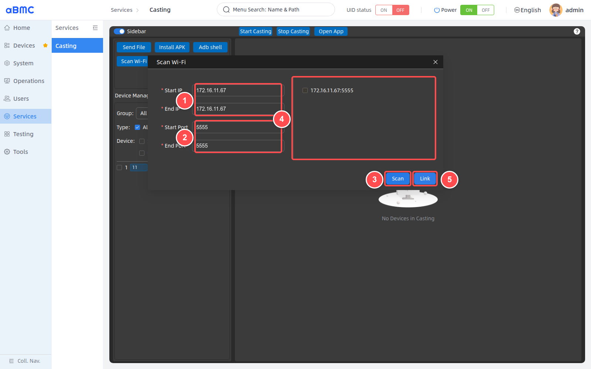

    ### Connect scanned devices [step]

    After the device label settings window opens, follow the figure below:

    1. Verify the device addresses to connect, for example `172.16.11.67:5555`.
    2. Enter an easily recognizable label for the device, for example `wifi1`.
    3. Confirm the label meets the length and character requirements of the page prompt.
    4. Click **Link** and wait for the device to join the list.

    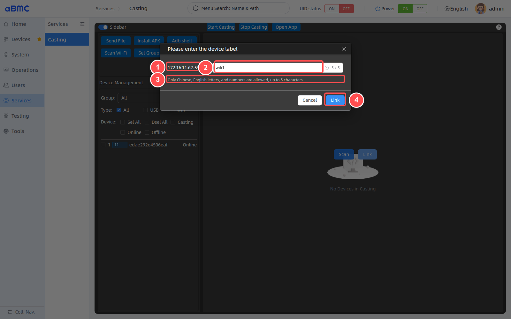

    After the connection completes, return to the device list and confirm that the device label, `172.16.11.67:5555`, and the **Online** status are all displayed.

    <Callout title="Device label rules" type="info">
      All four scan fields are required. Device labels are 1–5 characters long and can contain only Chinese characters, English letters, or digits. The larger the scan range, the longer the completion time; it is recommended to narrow the IP and port ranges according to the actual address plan.
    </Callout>

    ### Maintain Wi-Fi devices [step]

    Wi-Fi device rows are displayed as `IP:port`, with a Wi-Fi badge and a delete entry on the right. Before deleting, verify the device label and address; deleting only removes the wireless ADB device record stored in aBMC and does not replace the wireless debugging configuration on the Android device.

    ### Create a device group [step]

    1. Click the plus sign to the right of **Group**.
    2. In the **Add Group** window, enter the group name.
    3. Click **Confirm** to create the group.

    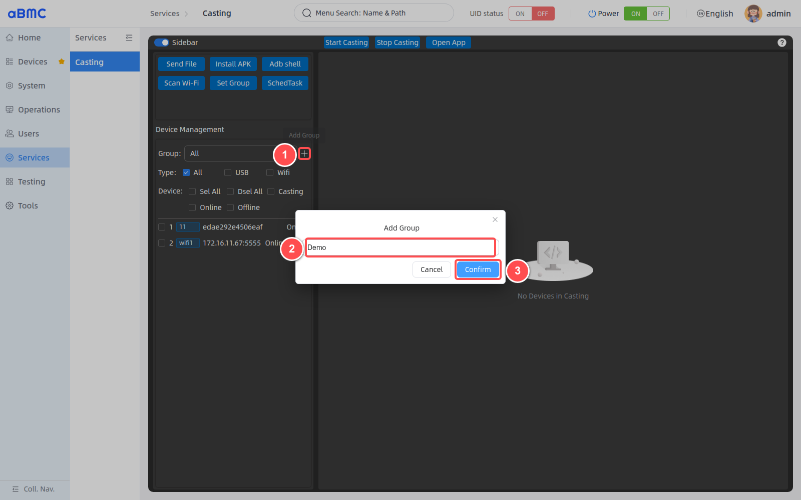

    ### Modify or delete a group [step]

    1. Expand the **Group** drop-down list.
    2. Click the edit icon to the right of the target group to modify the group name.
    3. When clicking the delete icon, confirm the target group is correct before submitting the deletion.
    4. After group changes, select the target group again and confirm the device count and list scope are correct.

    ### Set group members [step]

    Click **Set Group** to open the group settings window, then follow the figure below:

    1. At the top of the window, select the group to maintain.
    2. In the **Device List** on the left, select the devices to add to the group.
    3. Use the middle arrows to move devices to the right side, or move devices on the right back to the left.
    4. In the group list on the right, verify the current group members.
    5. Click **Save** to save the group membership.

    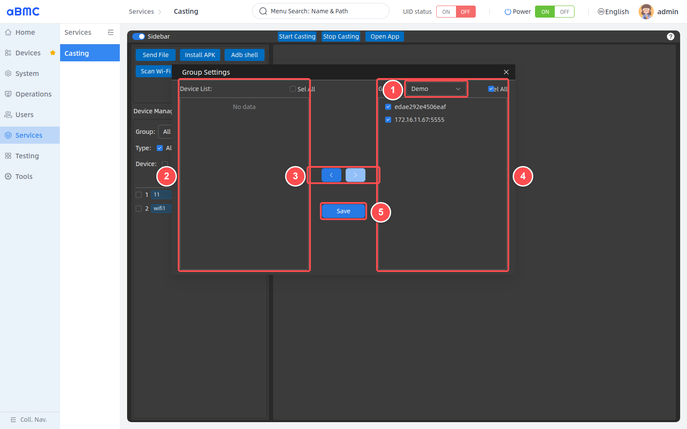

    <Callout title="Empty group" type="info">
      If the **Set Group** window displays **No data** or no group can be selected, first create a group using the plus sign to the right of **Group**. Groups affect the selection scope of subsequent bulk casting and device maintenance; after saving, return to the device list to verify.
    </Callout>
  </CodeBlockTab>
</CodeBlockTabs>

## FAQ

### 1. An Android device does not appear in the list

Check the device power supply, USB or Wi-Fi connection, Android debugging settings, and authorization prompts. After confirming the device can be recognized by aBMC, refresh the page.

### 2. Device shows Unauthorized

The device has been recognized, but Android debugging authorization is incomplete or has expired. Check the authorization dialog on the device, reconnect USB or wireless ADB, and confirm the status returns to **Online** before casting.

### 3. No preview after clicking Start Casting

Re-verify the device selection and UDID, confirm the device is online and debugging authorization is complete, and check the USB or Wi-Fi connection.

### 4. Preview screen is briefly black

The video connection may be initializing, or the Android screen may be off or locked. Wait a few seconds and check the device screen and authorization dialogs; rebuild the casting session only if no screen appears for a long time.

### 5. Only some devices show previews during bulk casting

Click **Casting** to select the devices that cast successfully, then click **Online** to check devices that are still online but not casting. Reduce the number of devices per session, and increase gradually after confirming stability with a few devices.

### 6. Send File or Install APK is unavailable

First confirm that target devices are selected, then open the corresponding window and click **Selected File** or **Selected Apk** to choose files. Until files are selected, the submit button remains unavailable.

### 7. ADB Shell is unavailable

Check Android debugging authorization, the ADB connection, device online status, and the current account permissions; restore the connection before executing reviewed commands.

### 8. Scan Wi-Fi returns no results

Check the IP and port ranges, wireless debugging configuration, and network connectivity. After the scan completes, target devices must be selected before **Link** becomes available.

### 9. Set Group shows No data

No group may have been created yet, or no devices belong to the selected group. First create a group using the plus sign to the right of **Group**, then open **Set Group** to select devices and save.
