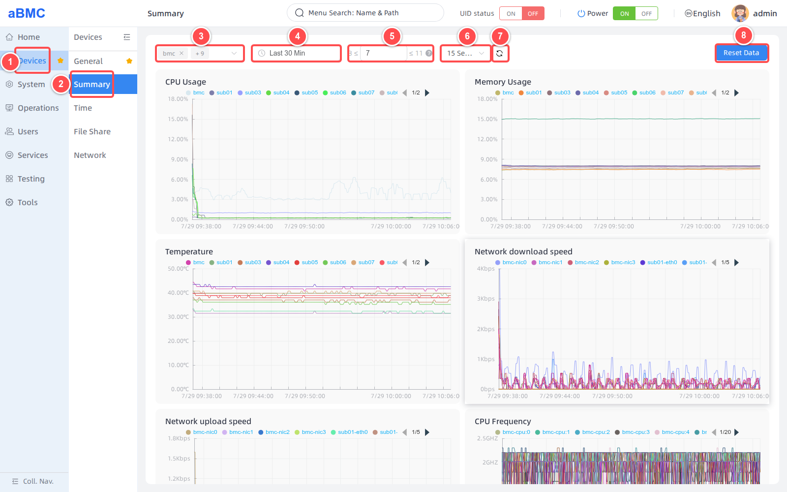
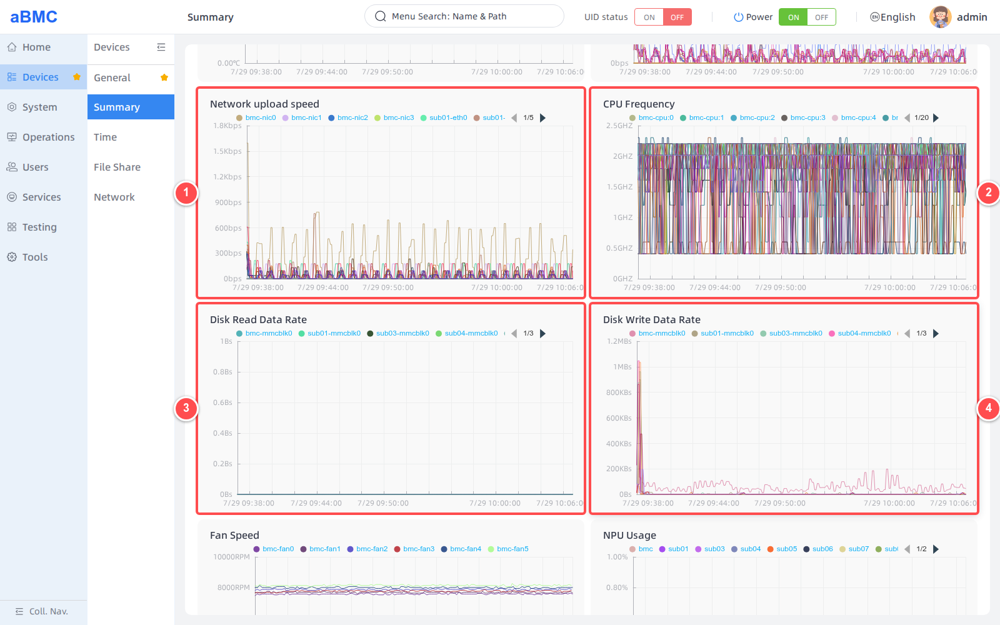
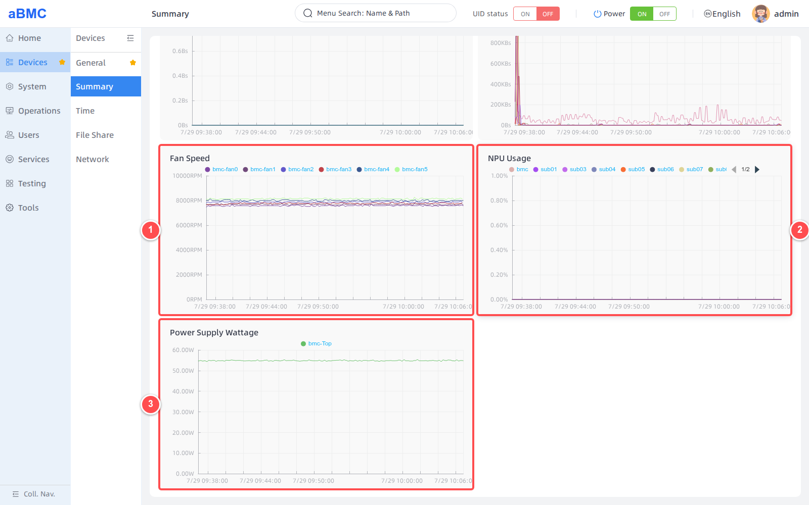

# Device Summary

## Introduction

Device Summary is a feature designed for array servers to view key metrics of array sub-nodes. The page queries historical monitoring data by device and time range, and displays key metrics such as CPU, memory, temperature, network, disk, fan, NPU, and power supply wattage as trend charts.

## Development Vision

1. Provide administrators with a unified multi-node performance trend view to quickly identify resource usage anomalies and sudden changes.
2. Support queries by time range, sampling step, and refresh interval, meeting both real-time inspection and historical trend analysis needs.

<Callout title="Implementation Logic" type="info">
  aBMC queries Prometheus historical data based on the selected nodes, start/end time, and Step, and combines the metrics of each node and device into paginated, hideable trend curves.
</Callout>

# Feature Usage

## Viewing and Analyzing Device Running Trends

<CodeBlockTabs defaultValue="WEB">
  <CodeBlockTabsList>
    <CodeBlockTabsTrigger value="WEB">WEB</CodeBlockTabsTrigger>
    <CodeBlockTabsTrigger value="API">API</CodeBlockTabsTrigger>
  </CodeBlockTabsList>

  <CodeBlockTab value="WEB">
    ### Set Query Conditions [step]

    1. Select **Devices** in the left main navigation bar.
    2. Select **Summary** in the secondary navigation bar.
    3. Select the aBMC or sub-node to query in the device selector. The page supports selecting multiple nodes at the same time, and all enabled nodes are selected by default.
    4. Select the query time range, for example **Last 30 Min**.
    5. Set **Step** within the recommended range displayed on the page.
    6. Select the auto-refresh interval: `15 Seconds`, `30 Seconds`, `1 Minute`, `3 Minutes`, or `5 Minutes`.
    7. Click the refresh button when you need to obtain the latest data immediately.
    8. **Reset Data** is used to reset historical monitoring data; it is not a chart refresh button.

    

    <Callout title="Step Settings" type="info">
      Step indicates the sampling interval of trend data, in seconds. After the time range changes, the page recalculates the recommended value and the available upper and lower limits. A smaller value means denser data points; a larger value means sparser data points.
    </Callout>

    <Callout title="Clear Monitoring Data with Caution" type="warn">
      Reset Data resets the Prometheus monitoring database and affects the historical trends of all nodes, not just the current chart or the currently selected device. Before performing this operation, confirm data retention requirements and allow only authorized administrators to perform it.
    </Callout>

    ### View Basic Resource and Download Traffic Trends [step]

    After setting the query conditions, the page automatically refreshes all trend charts. First check the charts at the top of the page:

    1. **CPU Usage**: View the CPU usage trend of each node.
    2. **Memory Usage**: View the memory usage trend of each node.
    3. **Temperature**: View the CPU or SoC temperature trend of each node.
    4. **Network download speed**: View the download speed of each node and each network interface.

    When comparing multiple nodes, first confirm the node names via the legend, then observe the curve differences at the same time point.

    ### View Upload, Processor, and Disk Trends [step]

    Scroll down the page and check the following in order as shown in the figure:

    1. View the upload speed of each network interface in **Network upload speed**.
    2. View the running frequency of each CPU core in **CPU Frequency**.
    3. View the read speed of each storage device in **Disk Read Data Rate**.
    4. View the write speed of each storage device in **Disk Write Data Rate**.

    

    ### View Fan, NPU, and Power Supply Wattage Trends [step]

    Continue scrolling to the bottom of the page and check the hardware running status as shown in the figure:

    1. View the real-time speed of each fan in **Fan Speed**.
    2. View the NPU usage of each node in **NPU Usage**.
    3. View the device power supply wattage trend in **Power Supply Wattage**.

    

    <Callout title="No Monitoring Data" type="info">
      When the current node does not have the corresponding hardware installed, does not report metrics, or has no collection records within the selected time range, the chart displays **No Data Available**.
    </Callout>

    ### Analyze Chart Data [step]

    1. Move the mouse into a chart to view the metric value at the corresponding time point, node, and device.
    2. Click a legend item to show or hide the curve of the corresponding node, network interface, CPU core, or storage device.
    3. When there are many legend items, use the arrows on both sides of the legend to switch pages.
    4. After changing the device, time range, or Step, wait for all charts to finish refreshing before verifying the time axis and legend.

    ### Trend Chart Metric Description [step]

    | Chart | Description | Common Unit |
    | --- | --- | --- |
    | CPU Usage | CPU usage. | `%` |
    | Memory Usage | Memory usage. | `%` |
    | Temperature | CPU or SoC temperature. | `℃` |
    | Network download speed | Network interface download speed. | The page automatically converts `bps`, `Kbps`, or `Mbps` based on the value |
    | Network upload speed | Network interface upload speed. | The page automatically converts `bps`, `Kbps`, or `Mbps` based on the value |
    | CPU Frequency | Working frequency of each CPU core. | `GHz` |
    | Disk Read Data Rate | Storage device read speed. | The page automatically converts `B/s`, `KB/s`, or `MB/s` based on the value |
    | Disk Write Data Rate | Storage device write speed. | The page automatically converts `B/s`, `KB/s`, or `MB/s` based on the value |
    | Fan Speed | Real-time fan speed. | `RPM` |
    | NPU Usage | NPU usage. | `%` |
    | Power Supply Wattage | Device power supply wattage. | `W` |
  </CodeBlockTab>

  <CodeBlockTab value="API">
    | Operation | Method | URI |
    | --- | --- | --- |
    | View CPU usage trend | POST | `/redfish/v1/Oem/PrometheusServices/CpuUsageList` |
    | View memory usage trend | POST | `/redfish/v1/Oem/PrometheusServices/MemoryUsageList` |
    | View CPU or SoC temperature trend | POST | `/redfish/v1/Oem/PrometheusServices/CpuTempList` |
    | View network download speed trend | POST | `/redfish/v1/Oem/PrometheusServices/DownLoadSpeedList` |
    | View network upload speed trend | POST | `/redfish/v1/Oem/PrometheusServices/UploadSpeedList` |
    | View CPU frequency trend | POST | `/redfish/v1/Oem/PrometheusServices/CpuFrequencyList` |
    | View disk read speed trend | POST | `/redfish/v1/Oem/PrometheusServices/DiskReadSpeedList` |
    | View disk write speed trend | POST | `/redfish/v1/Oem/PrometheusServices/DiskWriteSpeedList` |
    | View fan speed trend | POST | `/redfish/v1/Oem/PrometheusServices/FanSpeedList` |
    | View NPU usage trend | POST | `/redfish/v1/Oem/PrometheusServices/NpuUsageList` |
    | View power supply wattage trend | POST | `/redfish/v1/Oem/PrometheusServices/PowerOutputList` |
    | Reset Prometheus historical data | POST | `/redfish/v1/Oem/PrometheusServices/Reset` |

    <Callout title="Tip" type="info">
      The trend query APIs use the same request fields: `NodeName` is the node name, `Start` and `End` are Unix timestamps (in seconds), and `Step` is the sampling interval (in seconds). For detailed descriptions of API authentication, request parameters, response fields, and error codes, refer to the Redfish API documentation.
    </Callout>

    <Callout title="Reset API Risk" type="warn">
      `/redfish/v1/Oem/PrometheusServices/Reset` resets the Prometheus historical database. This operation does not accept a node scope and should not be used as a regular chart refresh API.
    </Callout>
  </CodeBlockTab>
</CodeBlockTabs>

## FAQ

### 1. Charts Display No Data Available

First confirm that the correct node and time range are selected, then click the refresh button. If only a certain type of chart has no data, the node may not have the corresponding hardware, or the current version may not report the corresponding Prometheus metrics.

### 2. Chart Data Points Are Too Dense or Too Sparse

Adjust Step within the recommended range on the page. A smaller Step can be used for short time ranges, while a larger Step is recommended for long time ranges.

### 3. Curves for Some Nodes or Devices Are Not Displayed

Check the device selector at the top and the legend status. If a legend is hidden, click the corresponding legend item to display the curve again; when there are many legends, use the arrows on both sides to switch to the corresponding page.

### 4. Charts Do Not Update for a Long Time

Click manual refresh, and check the auto-refresh interval, node online status, and management network. When a node is offline or Prometheus collection is abnormal, historical curves may be interrupted or stop updating.

### 5. Fan Speed Keeps Displaying No Data Available

Confirm whether the device supports fan speed collection, and cross-check with the fan presence status and RPM on the **System > Thermal** page.

### 6. Historical Trends Disappear After Reset Data

Reset Data resets the Prometheus historical database, and cleared data cannot be restored through the page. New data will reappear only after each node continues collecting.
