# Disk Management

## Introduction

Disk Management (Disk Management) is a visualized management system that aBMC designs for server storage devices. The system consists of three major modules: disk status monitoring, physical disk management, and software RAID management.
1. Status monitoring module: displays information such as drive slots, capacity, media type, health status, and model.
2. Physical disk management module: manages disk partitions, file systems, volume labels, and mounting, and provides Udev and SMART information query capabilities.
3. Software RAID management module: creates RAID arrays and provides maintenance capabilities such as adding disks, replacing drives, expanding capacity, changing modes, and deletion.

## Development Vision

1. Provide centralized, visualized disk status and storage topology, helping administrators quickly identify drive anomalies, partition differences, and RAID risks.
2. Reduce the operational barrier and probability of misoperation for on-site server storage O&M through unified entry points for partitioning, file systems, mounting, and RAID operations.

# Feature Usage

## Understanding Disk Management

<CodeBlockTabs defaultValue="WEB">
  <CodeBlockTabsList>
    <CodeBlockTabsTrigger value="WEB">WEB</CodeBlockTabsTrigger>
  </CodeBlockTabsList>

  <CodeBlockTab value="WEB">
    ### Feature scope [step]

    | Feature module | Description |
    | --- | --- |
    | Drive status view | View slots, capacity, media type, health status, and model |
    | Disk and partition view | Displays disks, partitions, and unallocated space as graphical segments |
    | Create partition | Create a new partition on unallocated space, with configurable size, offset, alignment, partition label, and file system |
    | Format partition | Format a disk or partition as ext4, exfat, ntfs, ext2, ext3, fat32, or other file systems |
    | Modify label | Modify the Label of an existing file system partition |
    | Mount/unmount | Mount a partition to a specified directory, with support for temporary and persistent mounting |
    | Information view | View Udev properties and SMART diagnostic information |
    | Logical view | Create RAID arrays, and maintain existing RAIDs with disk addition, disk replacement, expansion, mode changes, and deletion |

    <Callout title="Dangerous operations" type="warn">
      Creating partitions, deleting partitions, formatting partitions, deleting RAIDs, RAID expansion, and RAID mode changes may all affect disk data. Before operating, confirm that the target disk, partition, or RAID array is not in use by any service, and that the necessary data backup has been completed.
    </Callout>

    ### Preparation [step]

    1. Log in to aBMC with an account that has system configuration permission.
    2. Confirm that the target drive, partition, or RAID array has no running service writes.
    3. Before formatting, deleting, or changing a RAID, confirm the data has been backed up.
    4. Before mounting, confirm the mount directory is an absolute path and is not the root directory `/`.
    5. Before creating or expanding a RAID, confirm that free drives are available.

    ### UI terminology [step]

    | UI Term | Description |
    | --- | --- |
    | Disk | The Disk Management page under System. |
    | Status View | The chassis drive slot status view. |
    | Physical View | The physical disk and partition operation view. |
    | Logical View | The software RAID management view. |
    | Create Partition | Create a new partition on unallocated space. |
    | Format Partition | Create a new file system on a disk or partition. |
    | Modify Label | Modify the file system volume label. |
    | Delete Partition | Delete an existing partition. |
    | Mount | Mount a partition to a specified directory. |
    | Unmount | Unmount a mounted partition. |
    | Temporary Mount | Mounting that is valid for the current runtime only. |
    | Persistent Mount | Mounting that is restored automatically after reboot. |
    | Create RAID Array | Create a new software RAID array. |
    | Add Disk | Add a hot spare disk to a RAID array. |
    | Replace Disk | Replace an old member disk with a new one. |
    | Expand Disk | Add drives to expand RAID capacity. |
    | Modify RAID Mode | Switch the array to another RAID level. |

    ### Open the Disk Management page [step]

    1. Select **System** in the left main navigation.
    2. Select **Disk** in the secondary system navigation.
    3. At the top of the page, switch between **Status View**, **Physical View**, or **Logical View**.

    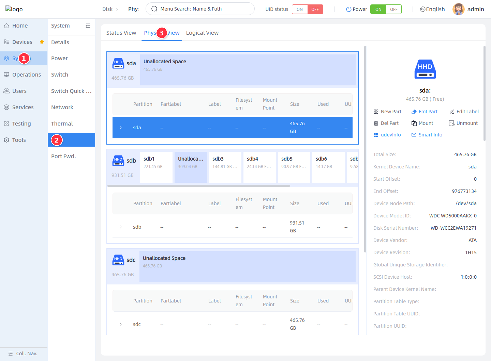

  </CodeBlockTab>
</CodeBlockTabs>

## Viewing Disk Status

<CodeBlockTabs defaultValue="WEB">
  <CodeBlockTabsList>
    <CodeBlockTabsTrigger value="WEB">WEB</CodeBlockTabsTrigger>
  </CodeBlockTabsList>

  <CodeBlockTab value="WEB">
    ### View slot status [step]

    The status view is used to check the chassis drive slot status. The page displays drive capacity, media type, health status, and model per slot. The backend reads the slot list through the `Drives` collection, then reads the details of each drive.

    1. Click **Status View**.
    2. Check the slot cards and confirm the currently recognized drive slots.
    3. Check **Total Capacity** and **Media Type** to confirm capacity and media type.
    4. Check **Health Status** and **Model** to determine drive health and locate the specific device.

    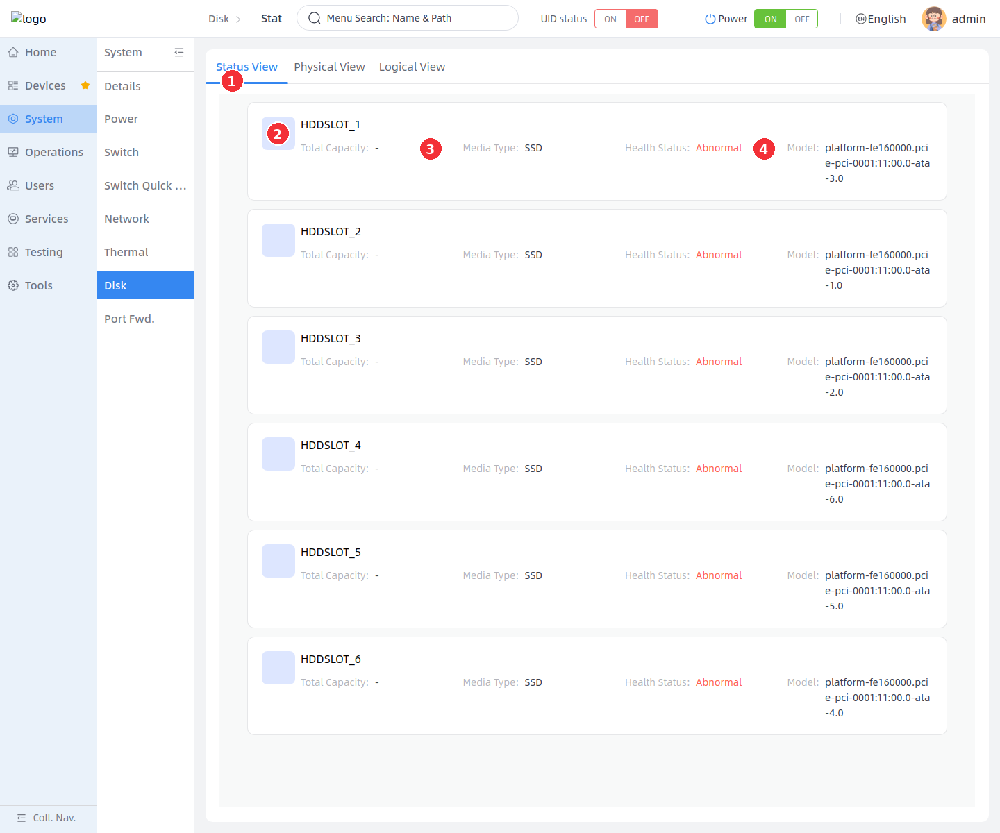

    <Callout title="About the example environment" type="info">
      In the current example environment, all 6 slots show **Abnormal** and the capacity is displayed as `-`. This means the backend returned the slot and device identifiers but did not obtain a valid capacity, and the health status is not a normal value. On-site, continue troubleshooting with drive connections, SMART information, and system logs.
    </Callout>

    ### Status field description [step]

    | Field | Description |
    | --- | --- |
    | Total Capacity | Capacity of the drive in the current slot |
    | Media Type | Media type such as HDD, SSD, NVMe, or MMC |
    | Health Status | Normal or Abnormal |
    | Model | Drive model or unique device identifier |

    ### Health status description [step]

    The health status is converted from the backend `DriveBase.Status.Health`:

    | Backend value | Page display | Description |
    | --- | --- | --- |
    | `true` | Normal | The drive health status is normal |
    | `warning` | Warning | The drive is at risk; the page may show reasons such as `past_threshold`, `error_log`, `self_test_log`, or `smartctl_warning` |
    | Other or empty values | Abnormal | The drive health status is abnormal; commonly caused by SMART read failures, drive faults, or the backend being unable to confirm the health status |

    ### Slot status description [step]

    The slot status is represented by the backend `HDDSlot.LastSent`. The current page mainly displays the health status, while the frontend retains the slot status and LED definition logic, which can be understood as follows:

    | LastSent | Slot status | Description |
    | --- | --- | --- |
    | `0` | Disk Present | The drive is present and has been recognized by the BMC |
    | `1` | Disk Read/Write | The drive is being read from or written to |
    | `2` | Rebuild Slave | The drive is participating in a RAID rebuild |
    | `3` | Located by BMC | The BMC is locating this drive |
    | `4` | Disk Removed from RAID | The drive in the RAID group was removed or a hot-plug anomaly occurred |
    | `5` | Disk Fault | The system detected a drive fault |
    | `6` | Disk Absent | The slot has no drive, or the drive is not present |
    | `7` | Init State | The drive is in the initialization state |

    ### Slot LED description [step]

    The relationship between drive slot LEDs and statuses is as follows:

    | Slot status | Green light | Red light | Blue light |
    | --- | --- | --- | --- |
    | Located by BMC | On | Off | Blinking |
    | Disk Present | On | Off | Off |
    | Disk Read/Write | Blinking | Off | Off |
    | Rebuild Slave | Blinking | Blinking | Off |
    | Disk Absent | Off | Off | Off |
    | Disk Fault | On | On | Off |
    | Disk Removed from RAID | Off | On | Off |

    If a slot has no drive or the backend returns no data, the page displays an empty slot or a no-data state.

  </CodeBlockTab>
</CodeBlockTabs>

## Managing Physical Disks

<CodeBlockTabs defaultValue="WEB">
  <CodeBlockTabsList>
    <CodeBlockTabsTrigger value="WEB">WEB</CodeBlockTabsTrigger>
  </CodeBlockTabsList>

  <CodeBlockTab value="WEB">

    ### View the physical view [step]

    The physical view is the main operation page of Disk Management. The left side shows the disk and partition graphics, the table shows partition fields, and the right side shows the operation buttons and detailed properties of the currently selected object.

    1. Click **Physical View**.
    2. In the disk area on the left, select a whole disk, a partition, or unallocated space.
    3. In the operation area on the right, choose an operation supported by the current object.
    4. In the properties area on the right, view the kernel device name, device node, model, serial number, partition table, file system, mount point, and other information.

    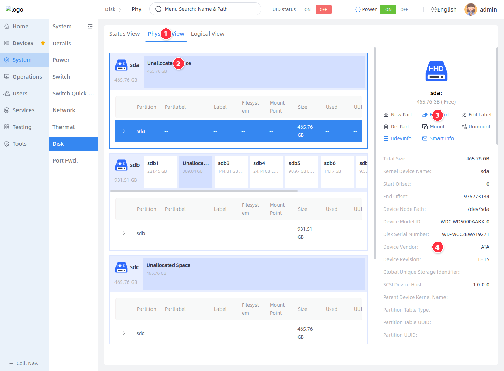

    | Table field | Description |
    | --- | --- |
    | Partition | Name of the disk, partition, or unallocated space |
    | Partlabel | Partition label |
    | Label | File system volume label |
    | File System | Current file system type |
    | Mount Point | Current mount directory |
    | Size | Disk or partition capacity |
    | Used Space | Used percentage or usage of the file system |
    | UUID | File system UUID |

    ### Create a partition [step]

    Creating a partition is available only on **Unallocated** space. The frontend first reads `NewPartitionActionInfo` to obtain the available size, alignment, offset range, and file system types, then submits `NewPartition` to create the partition.

    1. Enter **Physical View**.
    2. Click **Create Partition** on the right.
    3. Select the **Unallocated** space on the target disk.
    4. In the dialog, set the partition size, partition label, byte alignment, offset, file system format, and file system label.
    5. Click **Confirm** to create the partition.

    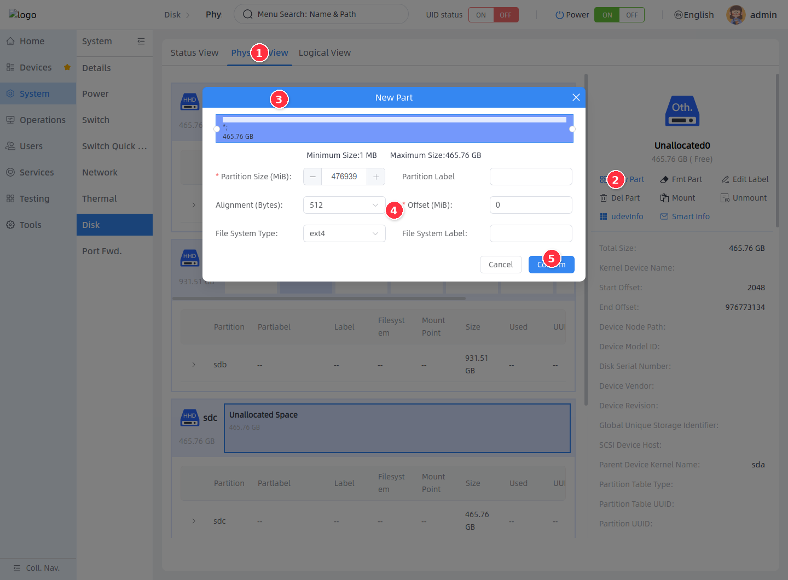

    | Parameter | Description |
    | --- | --- |
    | Partition size (MiB) | Capacity of the new partition; must be within the minimum and maximum values displayed in the dialog |
    | Partition label | Partlabel in the partition table; optional |
    | Byte alignment (B) | Partition alignment parameter; usually the default value returned by the backend |
    | Offset (MiB) | Offset from the start of the unallocated space |
    | File system format | Choose ext4, exfat, ntfs, ext2, ext3, fat32, or no file system |
    | File system label | Label written when creating the file system |

    ### Format a partition [step]

    Formatting creates a new file system on a disk or partition. The backend rejects formatting requests for mounted objects, so you must unmount first.

    1. Enter **Physical View**.
    2. Select the disk or partition to format.
    3. Click **Format Partition** on the right.
    4. In the dialog, select the file system type.
    5. Click **Confirm**, and confirm again in the warning dialog.

    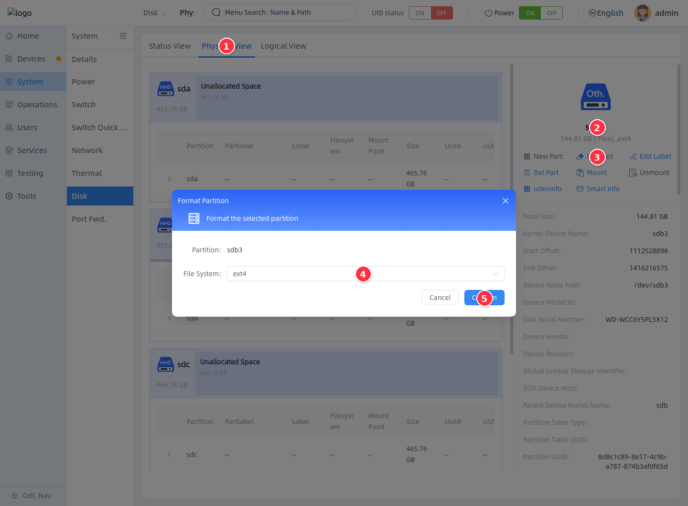

    <Callout title="Formatting erases file system data" type="warn">
      Formatting recreates the file system, and the data in the original partition will become unavailable. Mounted partitions must be unmounted first with **Unmount**; otherwise the backend rejects the formatting.
    </Callout>

    ### Modify the volume label [step]

    Modifying the volume label updates the Label of an existing file system. The button is available only when the current object has a file system.

    1. In **Physical View**, select the target partition.
    2. Click **Modify Label** on the right.
    3. In the dialog, enter the new partition volume label.
    4. Click **Confirm**, and confirm the change in the confirmation dialog.

    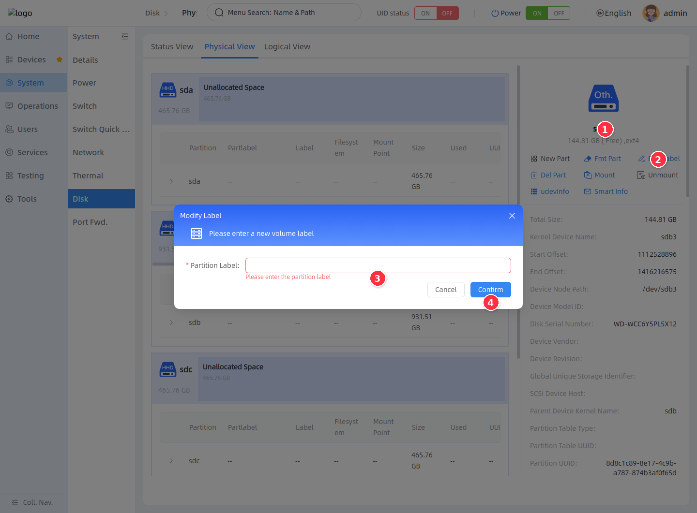

    ### Mount or unmount a partition [step]

    Mounting attaches a partition with an existing file system to a specified directory. The backend requires the mount directory to be an absolute path and not the root directory `/`. Mounting methods include:

    | Mounting method | Description |
    | --- | --- |
    | Temporary Mount | Valid during the current system runtime; must be remounted after reboot |
    | Persistent Mount | The backend creates a systemd mount unit managed by aBMC, which mounts automatically after reboot |

    1. Enter **Physical View**.
    2. Select a partition with a file system.
    3. Click **Mount** on the right.
    4. Enter the mount directory, and select **Temporary Mount** or **Persistent Mount**.
    5. Click **Confirm**.

    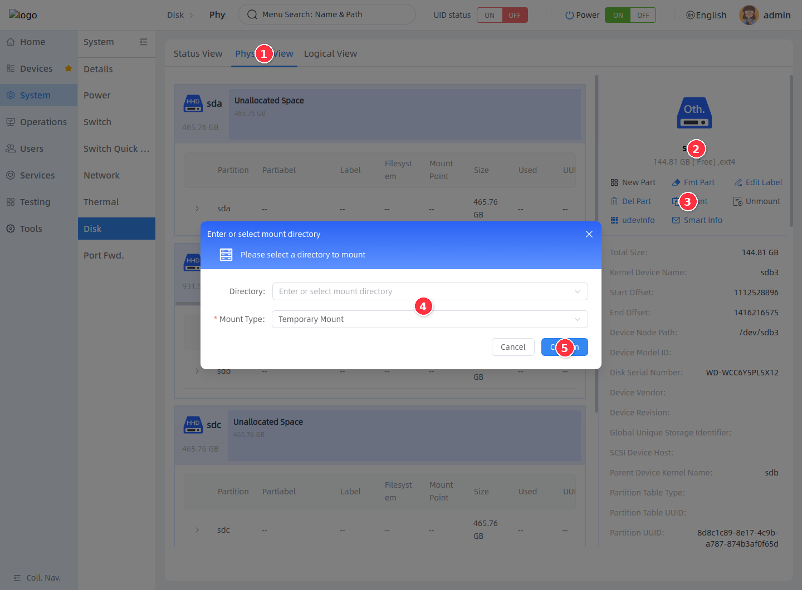

    To unmount, select the mounted partition, click **Unmount** on the right, confirm the directory to unmount in the dialog, and submit. Mounted partitions have the unmount button enabled and some write operations disabled.

    ### View Udev information [step]

    Udev information is used to troubleshoot device paths, buses, vendors, serial numbers, and system identification attributes.

    1. In **Physical View**, select the target disk or partition.
    2. Click **udevInfo** on the right.
    3. In the dialog, view the Udev properties in JSON format.

    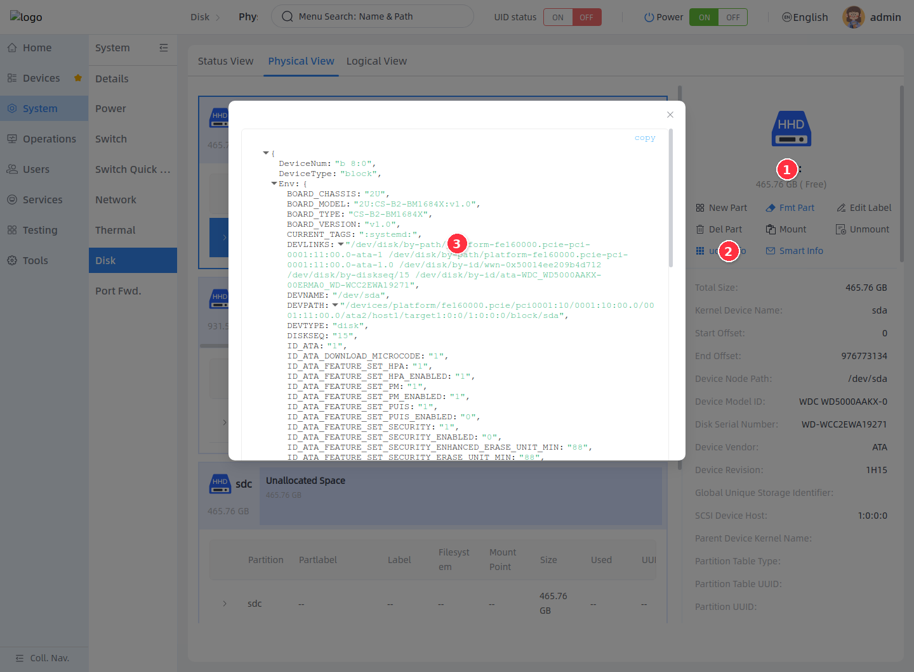

    ### View SMART information [step]

    SMART information shows drive self-tests, error counts, health status, and device diagnostic output. The frontend calls the `SmartInfo` API, and the backend reads the SMART results of the corresponding block device and displays them.

    1. In **Physical View**, select the target drive or one of its partitions.
    2. Click **Smart Info** on the right.
    3. In the dialog, view the SMART output.

    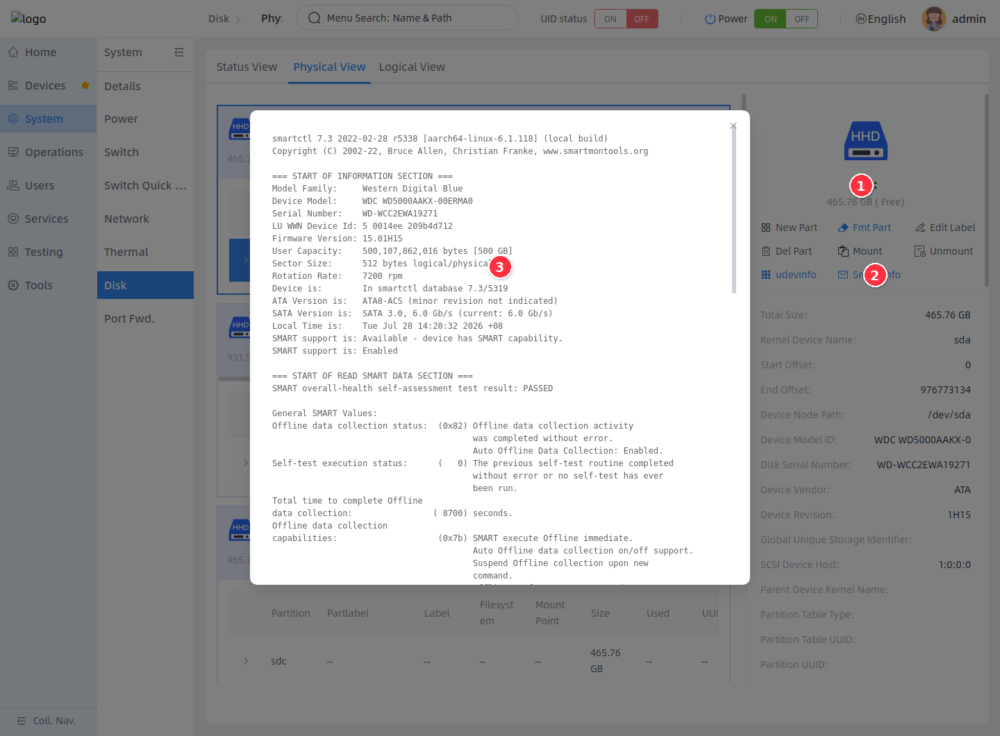

  </CodeBlockTab>
</CodeBlockTabs>

## Managing RAID Arrays

<CodeBlockTabs defaultValue="WEB">
  <CodeBlockTabsList>
    <CodeBlockTabsTrigger value="WEB">WEB</CodeBlockTabsTrigger>
  </CodeBlockTabsList>

  <CodeBlockTab value="WEB">

    ### Understanding the logical view [step]

    The logical view is used to create and maintain software RAID arrays. The page data comes from the Mdraid Redfish resources. Based on the available drives, RAID Level capabilities, and `RaidOps` operation flags returned by the backend, the frontend determines which drives can be selected, which RAID modes can be created, and which maintenance operations can be performed on existing arrays.

    RAID operations are high-risk storage operations. Creating, deleting, expanding, replacing disks, and changing modes all modify disk metadata or trigger array rebuilds. Before executing, confirm the target drives contain no service data, and complete a data backup if necessary.

    ### Create a RAID array [step]

    When creating a RAID array, the left side of the page shows the drives available for building the array, and the right side shows the RAID storage modes supported by the current number of drives. After selecting drives, the page recalculates the available capacity, theoretical read/write performance, and data protection capability.

    1. Enter **Logical View**.
    2. Click **Create RAID Array** in the upper-right corner.
    3. In the dialog, select available drives.
    4. On the right, select the RAID storage mode.
    5. Click **Next** to continue.

    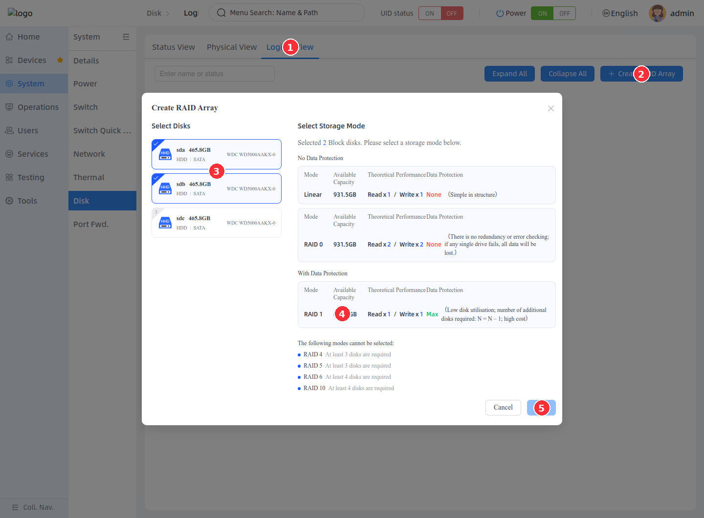

    The key fields of the creation page are described as follows:

    | Field | Description |
    | --- | --- |
    | Select Disks | The list of drives available for creating the RAID. Unavailable drives do not appear as options. |
    | Select Storage Mode | The list of RAID modes calculated from the number of selected drives and backend capabilities. |
    | Available Capacity | The estimated capacity available for storing service data after creation. |
    | Theoretical Performance | The theoretical read/write performance reference returned by the backend based on the RAID Level. |
    | Data Protection | The data protection capability of the current RAID mode, for example None, Medium, Max. |

    The requirements of common RAID modes are as follows:

    | RAID mode | Minimum drives | Description |
    | --- | --- | --- |
    | Linear | 2 | Concatenates the capacity of multiple drives with no redundancy; a failure of any member drive may affect all data. |
    | RAID 0 | 2 | Striped reads and writes; high performance but no redundancy protection. |
    | RAID 1 | 2 | Mirrored protection; high data safety; usable capacity is approximately the capacity of the smallest member drive. |
    | RAID 4 | 3 | Dedicated parity drive; tolerates one drive failure; write performance is affected by the parity drive. |
    | RAID 5 | 3 | Distributed parity; tolerates one drive failure; higher capacity utilization than RAID 1. |
    | RAID 6 | 4 | Dual parity; tolerates two drive failures; higher write overhead. |
    | RAID 10 | 4, usually an even number of drives | Mirroring plus striping; balances performance and redundancy. |

    <Callout title="When no drives are available" type="info">
      If no drives can be selected in the dialog, or the target RAID mode is not selectable, the machine has no free drives that meet the conditions. Release disks, clear old RAID metadata, or insert new usable drives before creating.
    </Callout>

    <Callout title="Capacity and rebuild time" type="info">
      After creation, a RAID may enter the Resync or Recovering state. The larger the array capacity, the longer the initialization or rebuild takes. Some maintenance operations are disabled during a rebuild; wait until the status returns to Clean before continuing.
    </Callout>

    ### View RAID array cards [step]

    After a RAID is created, the logical view displays the array as a card. The card is used to view the array's basic information, member drives, and current status.

    1. Enter **Logical View**.
    2. Check the RAID name, status, RAID Level, and capacity.
    3. Check the **Used Disk** member list.
    4. Click the **More** icon at the upper-right corner of the card to open the maintenance menu.

    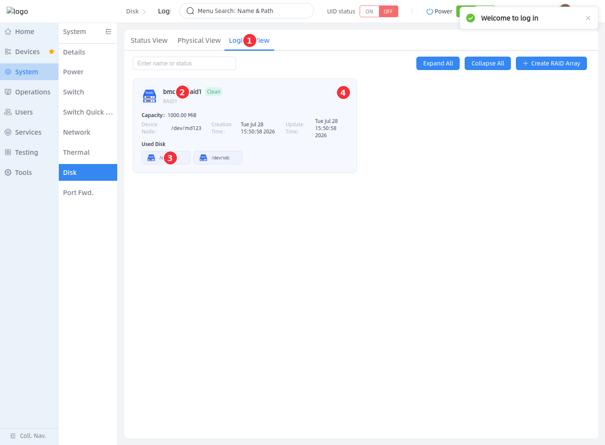

    The RAID card fields are described as follows:

    | Field | Description |
    | --- | --- |
    | RAID name | The MdName written when the array was created, used to distinguish arrays. |
    | Status | The current array status, for example Clean, Degraded, Resync, Recovering, Failed. |
    | RAID Level | The current array mode, for example RAID1, RAID5, RAID10. |
    | Capacity | The current usable capacity of the array. |
    | Device Node | The md device node in the system, for example `/dev/md0`. |
    | Creation Time / Update Time | The array creation time and the latest update time. |
    | Used Disk | The member drives currently in the array. |

    ### Use the RAID operation menu [step]

    The operation menu at the upper-right corner of a RAID card is controlled by the backend `RaidOps` field. Based on the array status, the page enables or disables operations such as adding disks, replacing drives, expanding, modifying the RAID mode, deleting member disks, and deleting the array.

    1. Click the **More** icon at the upper-right corner of the RAID card.
    2. Select **Add Disk** to add a hot spare.
    3. Select **Replace Disk** to replace a member drive.
    4. Select **Expand with Disks** to add drives for expansion.
    5. Select **Modify RAID Mode** to change the RAID Level.
    6. Select **Delete** to delete the RAID array.

    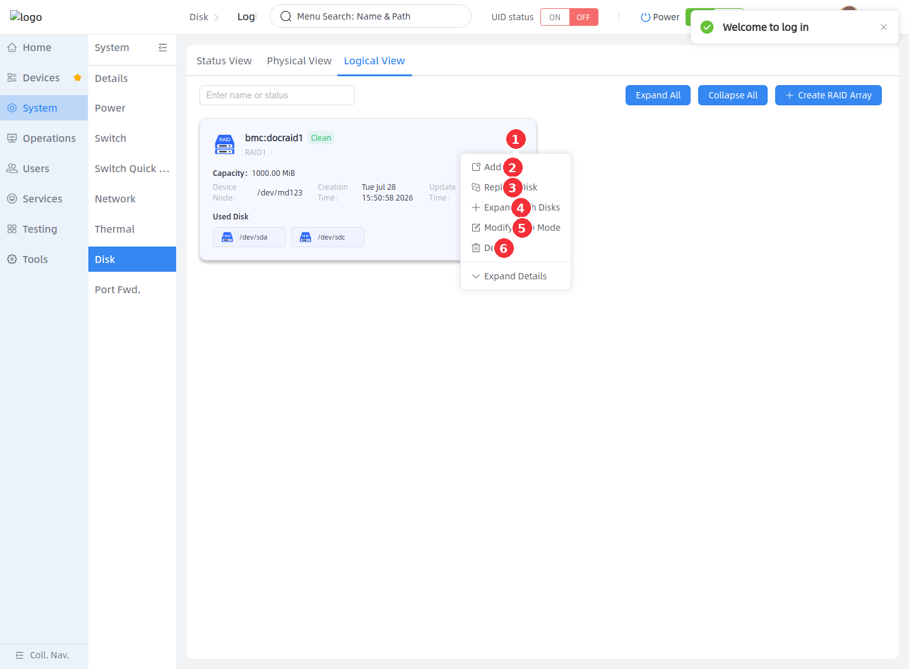

    The common available operations in different statuses are as follows:

    | RAID status | Available operations |
    | --- | --- |
    | Clean | The array is normal. Non-RAID 0/Linear arrays usually support adding disks, replacing disks, expanding, changing modes, deleting member disks, and deleting the array. |
    | Degraded | The array is degraded. Deleting the array or adding a hot spare is usually available; deleting member disks is not recommended. |
    | Resync / Recovering | The array is synchronizing or recovering. Usually only the delete-array entry remains; other maintenance operations must wait for completion. |
    | Reshaping | The array is expanding or changing modes. Apart from deleting the array, other maintenance operations are usually restricted. |
    | Failed / Inactive | The array is abnormal or inactive. Confirm the drive status and data risks first, then proceed. |

    ### Add a disk [step]

    Adding a disk adds a hot spare to an existing RAID array. After joining, a hot spare is usually displayed as spare and does not immediately increase the usable capacity. When an active member drive in the array fails or is removed, the hot spare can participate in automatic recovery.

    1. Open the **Add Disk** dialog.
    2. Confirm the current RAID name, used member drives, capacity, and storage mode.
    3. Select the available drive to add.
    4. Click **Confirm** to submit.

    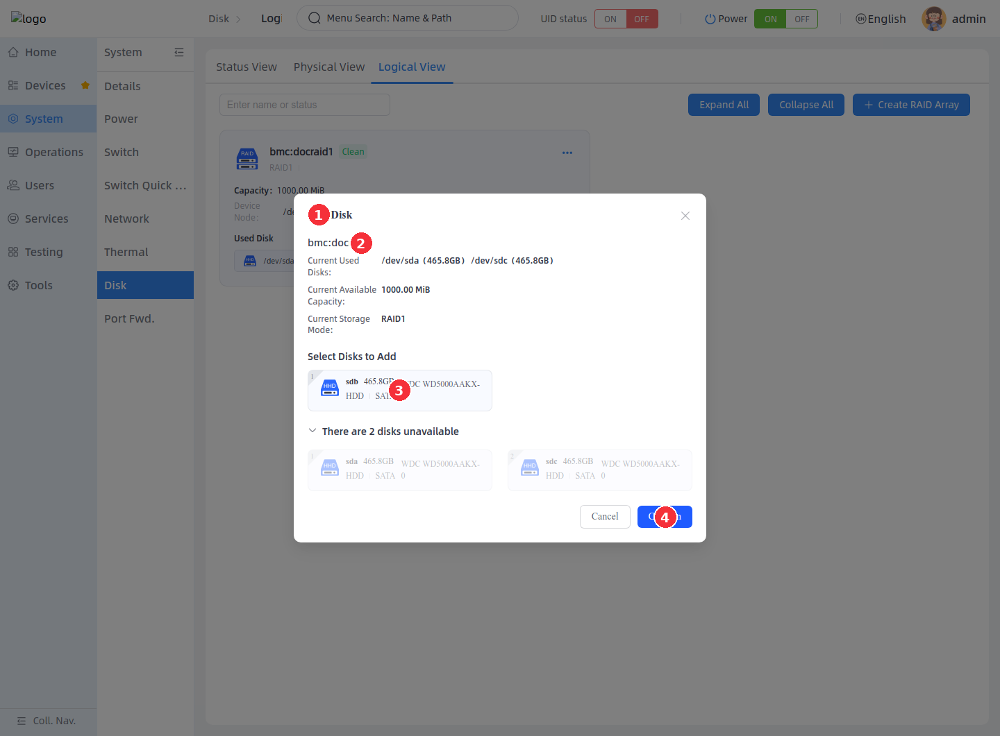

    After adding a disk, return to the RAID card to check the member drive status. If the new drive shows `spare`, it exists as a hot spare; if the array is in a degraded recovery flow, it may enter the rebuild state.

    ### Replace a drive [step]

    Replacing a drive substitutes an old member drive in the RAID array with a new available drive. The operation has two steps: first select the old drive, then select the new one. After submission, the backend calls `ReplaceDisk` and the array enters the rebuild flow.

    1. Open the **Replace Disk** dialog.
    2. Confirm the current RAID information.
    3. Select the old member drive to remove.
    4. Click **Next (1/2)** to continue.

    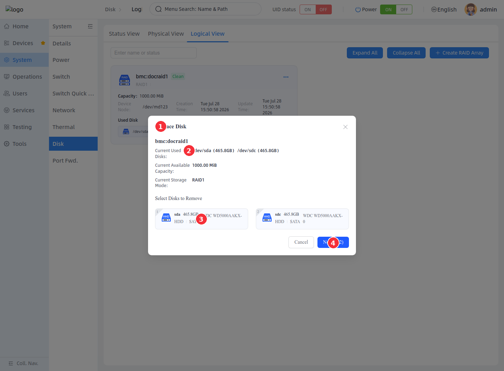

    1. In the second step, select the new drive for replacement.
    2. Confirm the new drive corresponds one-to-one with the old member drive.
    3. Click **Confirm** to submit the replacement.

    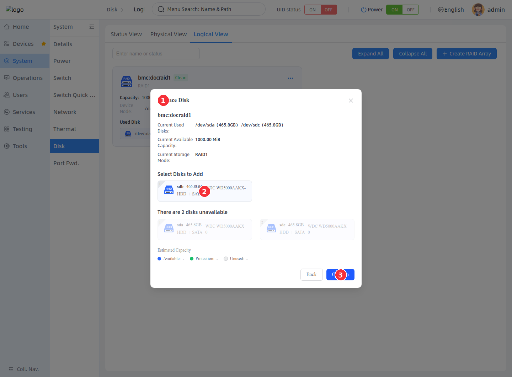

    During replacement, the RAID capacity usually does not change immediately, and the rebuild time depends on the member drive capacity. After completion, the old drive may remain in the array information with a status such as fault or removed; you can then perform the delete-member-disk operation according to the page prompt.

    ### Expand with drives [step]

    Expansion adds new drives to a RAID array to enlarge its capacity. The page shows the current RAID information, selectable drives, and the estimated capacity change. After submission, the backend executes `Reshape/Exec`, and the array enters the Reshaping or Resync state.

    1. Open the **Expand with Disks** dialog.
    2. Confirm the current RAID information.
    3. Select the available drives to add to the array.
    4. Check the estimated capacity change.
    5. Click **Confirm** to submit the expansion.

    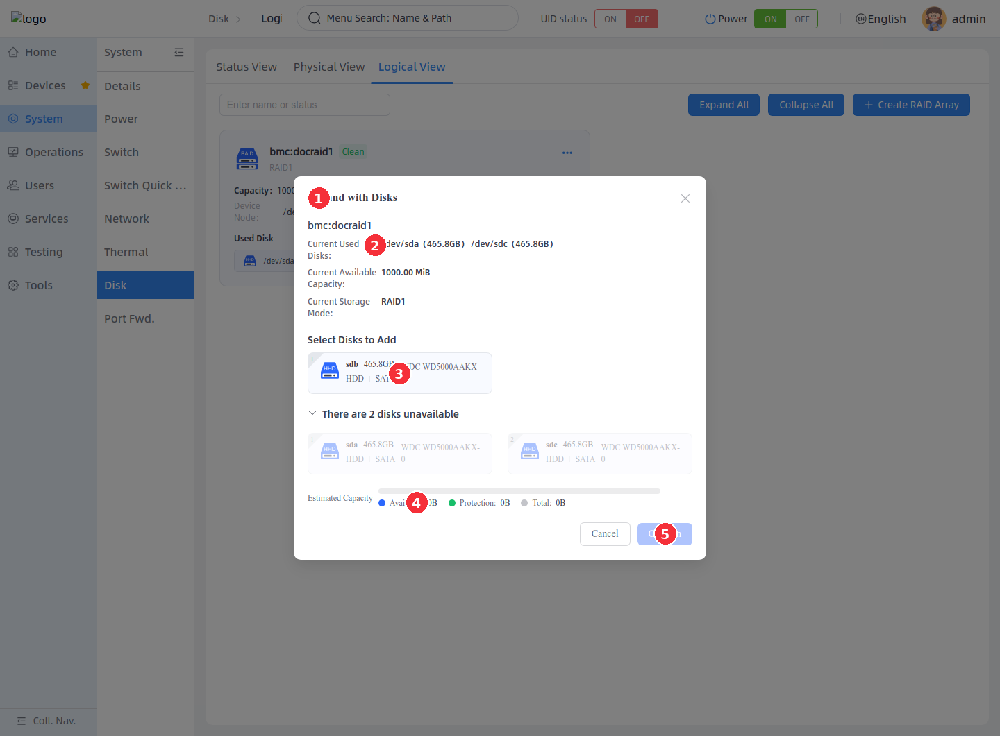

    Expansion rules depend on the RAID Level. For example, when expanding RAID 10, the number of active drives after expansion must be even; if the number of selected drives does not satisfy the backend rules, the page rejects the submission or the backend returns an error.

    <Callout title="Restrictions during expansion" type="warn">
      RAID expansion triggers a background rebuild. During the rebuild, do not cut power, remove drives, or perform other maintenance operations. Wait until the RAID status returns to Clean before formatting, mounting, or writing service data.
    </Callout>

    ### Modify the RAID mode [step]

    Modifying the RAID mode switches the current array to another supported RAID Level. The page first shows the current mode, then the selectable target modes. The target mode may be a downgrade, a lateral change, or an upgrade; if the upgrade requires additional drives, the page enters the drive selection step.

    1. Open the **Modify RAID Mode** dialog.
    2. Check the current RAID mode, capacity, theoretical performance, and data protection capability.
    3. Select the target RAID mode.
    4. Click **Next (1/2)** or **Confirm** to continue.

    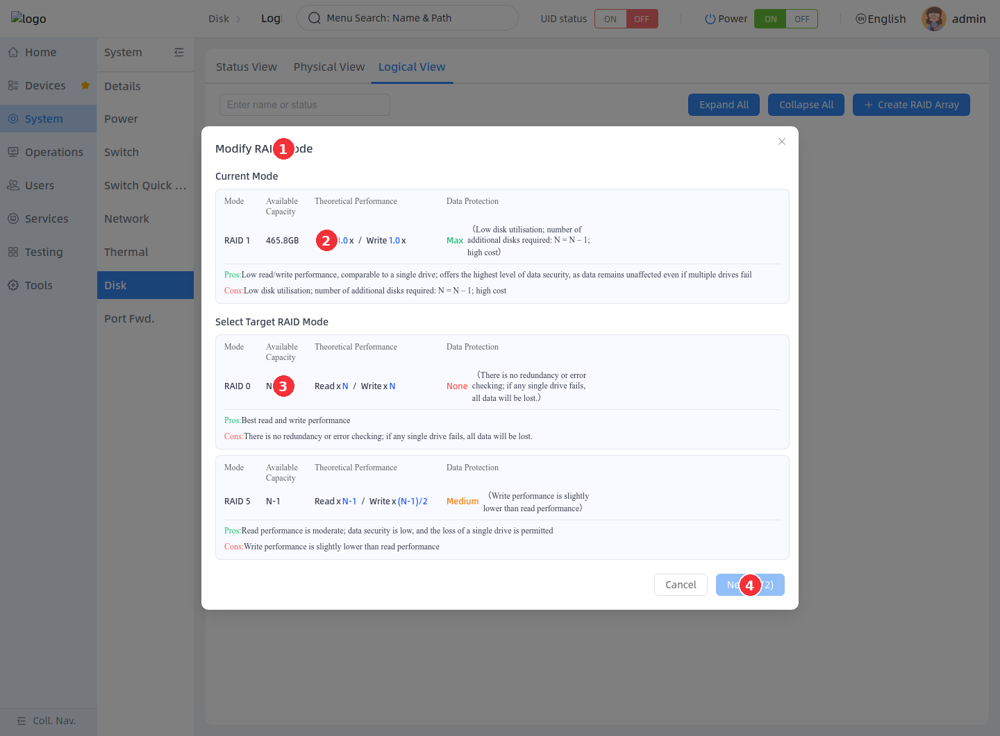

    If the target RAID mode requires additional drives, the page enters the second step.

    1. In the second step, select the new drives to add to the array.
    2. Check the estimated capacity change.
    3. Click **Confirm** to submit the mode change.

    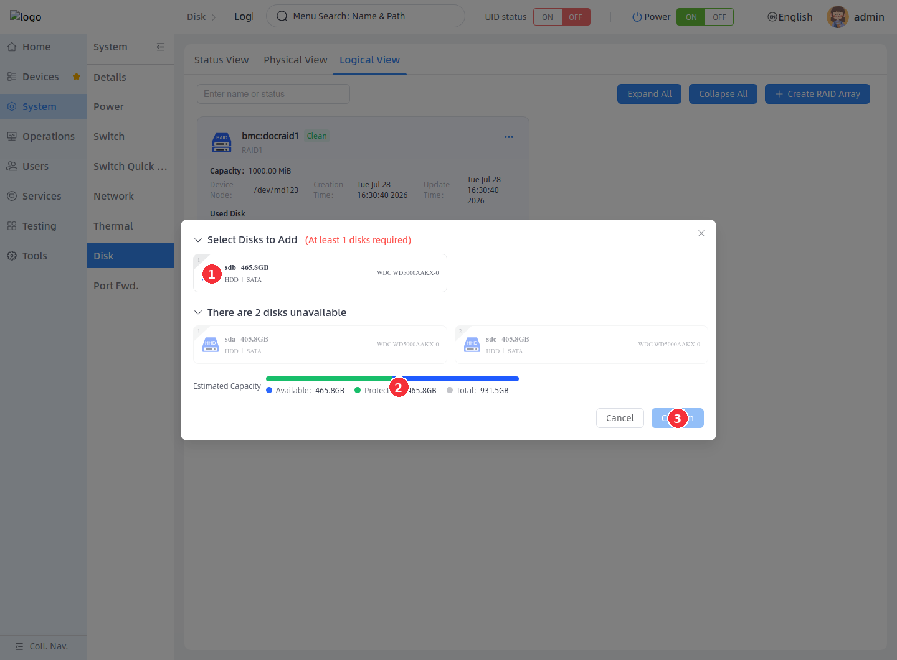

    The common results of a mode change are as follows:

    | Type | Description |
    | --- | --- |
    | Downgrade | Switching from a RAID Level with higher protection to one with lower protection; may reduce redundancy. |
    | Upgrade | Switching to a mode with higher protection or different capacity rules; usually requires additional drives and triggers a rebuild. |
    | Lateral change | Some modes can be switched directly when the drive count and capacity rules are satisfied. |

    Before the mode change completes, the RAID card may show Reshaping, Resync, or Recovering. Wait until the status returns to Clean, then confirm the capacity, member drives, and RAID Level meet expectations.

    ### Delete a member disk [step]

    Deleting a member disk removes a specified drive from the RAID array. This operation only removes the RAID membership and is not equivalent to deleting the entire RAID array.

    1. Click the **X** icon on the member disk tag.
    2. In the deletion confirmation dialog, confirm the target member disk and RAID array name.
    3. Click **Delete** to delete the member disk.

    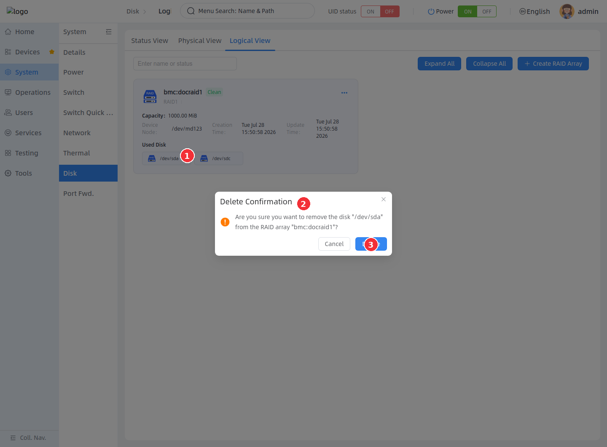

    Deleting a spare, fault, or removed member disk is usually used to clean up the array member list. Deleting an active member disk degrades the array and poses data risks; if the array is already Degraded, the backend usually restricts further member deletion.

    ### Delete a RAID array [step]

    Deleting a RAID array stops the array and clears the RAID superblock on the member drives. After deletion, the original RAID device is no longer usable, and the member drives return to ordinary block devices that can be repartitioned, reformatted, or used to create a new RAID.

    1. Click the **More** icon at the upper-right corner of the RAID card and select **Delete**.
    2. In the deletion confirmation dialog, confirm the RAID array name.
    3. Click **Delete** to delete the RAID array.

    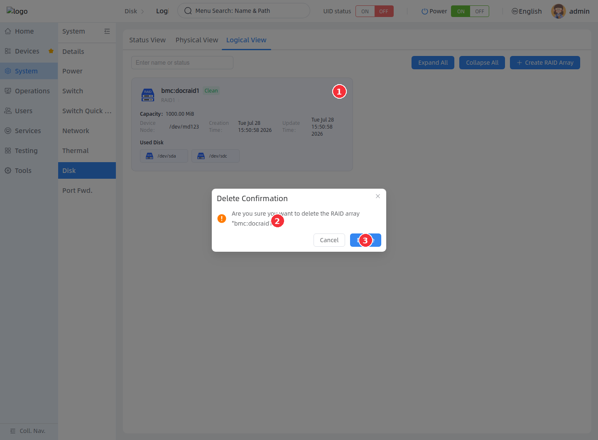

    <Callout title="Deleting a RAID array discards the current array" type="warn">
      Deleting a RAID array makes the file systems and service data on the array unusable. Before executing, confirm that the target RAID array is not in use by any service, and that the necessary data backup has been completed.
    </Callout>

  </CodeBlockTab>
</CodeBlockTabs>

## Verifying Configuration Results

<CodeBlockTabs defaultValue="WEB">
  <CodeBlockTabsList>
    <CodeBlockTabsTrigger value="WEB">WEB</CodeBlockTabsTrigger>
  </CodeBlockTabsList>

  <CodeBlockTab value="WEB">
    ### Confirm disk and RAID status [step]

    After operations complete, verify as follows:

    1. Return to **Physical View** and confirm whether the disk partitions, file systems, mount points, and UUIDs have been updated.
    2. After formatting or checking a file system, view the task progress and results in the log dialog.
    3. Return to **Logical View** and confirm the RAID status is **Clean** and the member drive status is `active sync`.
    4. If RAID expansion or a mode change was performed, wait for the rebuild to complete before writing service data.
    5. If the page has not refreshed, manually refresh it and confirm the backend status again.

  </CodeBlockTab>
</CodeBlockTabs>

## FAQ

### 1. The Create Partition button is unavailable

The currently selected object is not unallocated space. In the disk graphic, select the **Unallocated** block, then perform **Create Partition**.

### 2. The Format button is unavailable or formatting fails

The current disk, partition, or its sub-partition may already be mounted. Perform **Unmount** first, confirm the mount point has been cleared, then perform **Format Partition**.

### 3. The Mount button is unavailable

The current object has no mountable file system. Perform **Format Partition** first to create a supported file system, then perform **Mount**.

### 4. The Unmount button is unavailable

The current partition has no mount point. Select a mounted partition and confirm the mount directory is displayed in the details area.

### 5. A RAID mode is not selectable

The number of available drives is insufficient, or the current number of drives does not meet the minimum requirement of the target RAID Level. Add free drives, or choose a RAID mode with lower drive-count requirements.

### 6. Some operations in the RAID maintenance menu are unavailable

The current RAID status does not allow the corresponding operation. Wait for Resync, Recovering, or Reshaping to complete; when the array is Degraded, check and handle the faulty drive first.

### 7. SMART information is empty

The target device may not support SMART, or the backend failed to read the SMART information. Check the drive connection and system logs, and confirm the target drive supports SMART.
