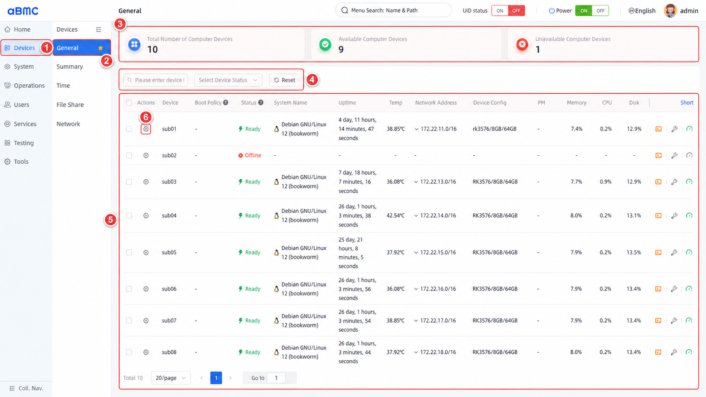
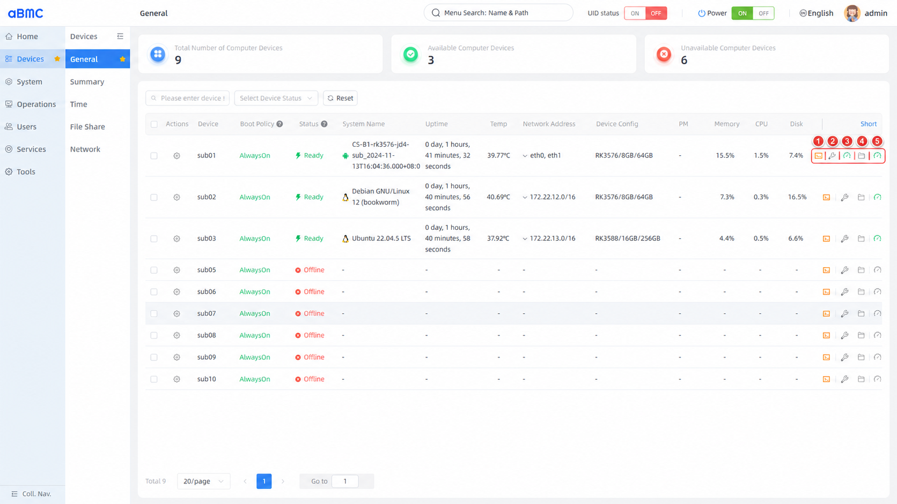
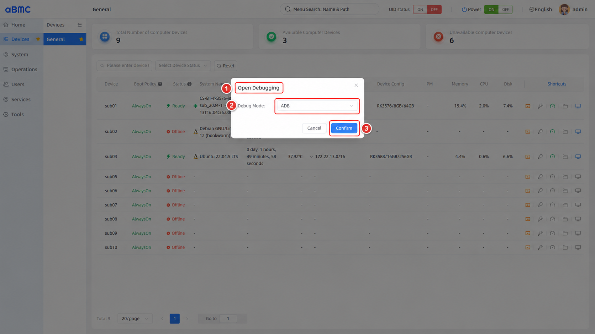
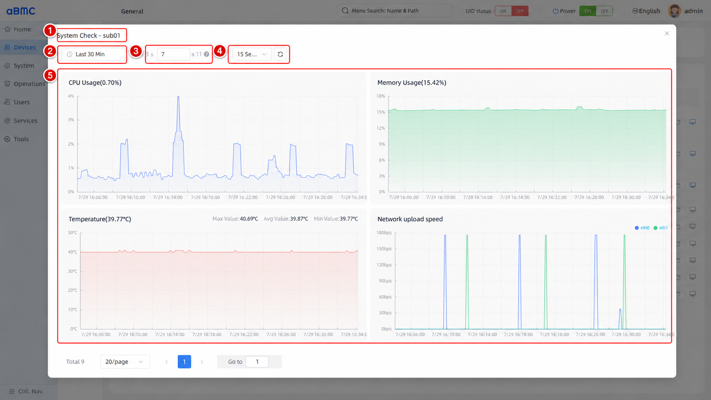
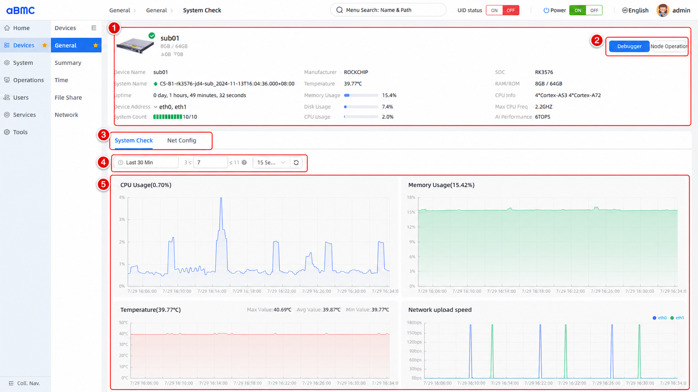
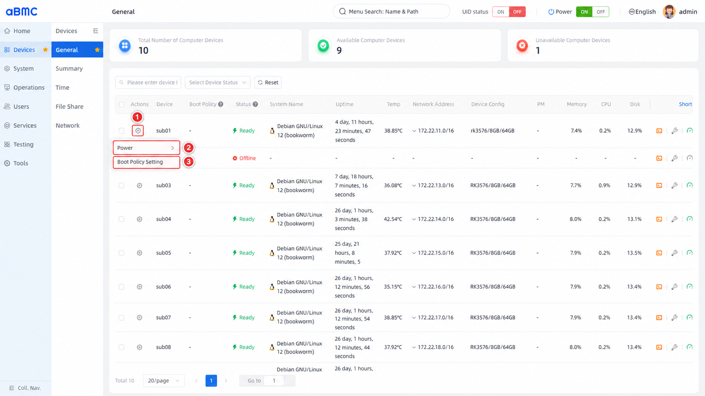
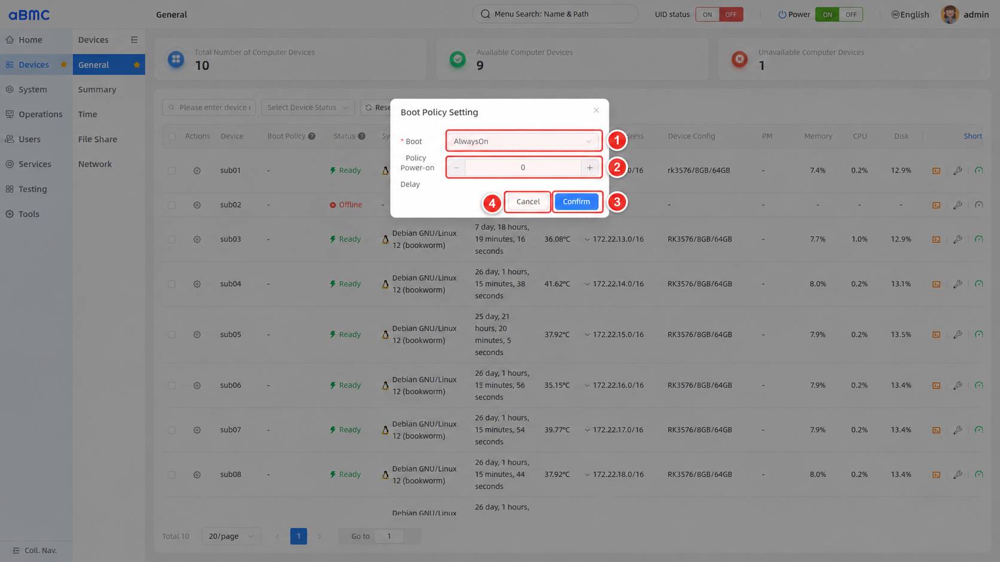

# General Configuration

## Introduction

General Configuration (General) is an array device centralized management system designed by aBMC for array servers. Administrators can uniformly view the online status, system information, uptime, temperature, network address, hardware configuration, and resource utilization of array sub-boards, and perform boot policy and power management operations on one or more devices.

## Development Vision

1. Provide centralized, visualized array device status and resource information, helping administrators quickly identify offline devices, resource anomalies, and configuration differences.
2. Reduce the O&M cost and error probability of operating array sub-boards one by one through unified filtering, boot policy, and bulk power management entry points.


# Feature Usage

## Viewing the Device Overview

<CodeBlockTabs defaultValue="WEB">
  <CodeBlockTabsList>
    <CodeBlockTabsTrigger value="WEB">WEB</CodeBlockTabsTrigger>
  </CodeBlockTabsList>

  <CodeBlockTab value="WEB">
    ### Open the General Configuration page [step]

    1. Select **Devices** in the left main navigation.
    2. Select **General** in the device menu.
    3. At the top of the page, check the total number of devices, available devices, and unavailable devices.
    4. To find a device, enter the device name or system name, or select a status in **Select Device Status**.
    5. Click **Reset** to clear the search and status filter conditions.
    6. In the device list, view device status, boot policy, system information, and resource utilization; to manage a device, use the settings icon in the **Actions** column or the quick entries in **Shortcuts**.

    

    ### Device statistics description [step]

    | Statistic | Description | Checkpoints |
    | --- | --- | --- |
    | Total Number of Computer Devices | The total number of array sub-boards currently managed by aBMC. | Should match the device plan and the number of actually connected devices. |
    | Available Computer Devices | The number of devices currently in **Online** or **Ready** status and usable. | If the number decreases, check device status, network connections, and microservice loading. |
    | Unavailable Computer Devices | The number of devices not currently in a usable state. | Use **Status** in the list to locate the corresponding devices and their current stage. |

    ### Device list field description [step]

    | Field | Description | Checkpoints |
    | --- | --- | --- |
    | Actions | Opens the power management and boot policy menu for a single device or multiple devices. | Confirm the target device before operating; enter bulk mode after selecting at least two devices. |
    | Device | The node name of the device in aBMC. | Should correspond to asset records and the actual position in the array. |
    | Boot Policy | The sub-board boot policy used when the aBMC service initializes or the power button is set to ON; when a delay is configured, `Delay: <seconds>` is also displayed. | Check whether the policy matches the service recovery order and power supply plan. |
    | Status | The current device status, for example **Offline**, **Loader**, **Online**, **Linking**, or **Ready**. | Use the status to determine whether the device is operable and whether microservices have finished loading. |
    | System Name | The name and version of the operating system currently running on the device. | If `-` is displayed, check the device status and the status collection path first. |
    | Uptime | The time the device has been running since its last startup. | A sudden decrease may indicate a recent device restart. |
    | Temp | The current device temperature. | Should be evaluated together with device load, the Thermal page, and alarms. |
    | Network Address | The management network address and prefix length returned by the device. | Confirm the address matches the network plan to avoid address conflicts or wrong subnets. |
    | Device Config | A summary of the device's hardware configuration, such as platform, memory, and storage capacity. | Used to verify node specifications and identify configuration differences within the array. |
    | PM | A reserved power mode field. The current version always displays `-`; the power mode is not yet shown in this list. | Do not interpret `-` as a device fault; the current page provides no configuration entry for this field. |
    | Memory | The current memory utilization. | If persistently high, investigate processes and business load. |
    | CPU | The current CPU utilization. | If persistently high, check business load, system tasks, and abnormal processes. |
    | Disk | The current disk utilization. | Clean up or expand capacity when approaching the limit, to avoid service failures. |
    | Shortcuts | From left to right: **Open Shell Command**, **Self Check**, **System Check**, **File Transfer**, and **Info**. | Shell, System Check, and Info are currently implemented; Self Check and File Transfer are permanently disabled. |

    ### Device status description [step]

    | Status | Description | Recommendation |
    | --- | --- | --- |
    | Offline | The device is not online. | Check device power supply, physical connections, network, and node services. |
    | Loader | The device has entered the upgrade state. | Wait for the upgrade to complete; do not perform power operations during the upgrade. |
    | Online | The device has started. | The device is usable, but microservices may still be loading. |
    | Linking | Device microservices are loading. | Wait for the status to become **Ready**; if it takes too long, check the related services and logs. |
    | Ready | Device microservices have finished loading. | Indicates the device has finished loading the main services and is ready for use. |
    | Unavail | The page cannot recognize the device status as a known status. | Check the device return value, communication status, and aBMC logs. |

    <Callout title="About status data" type="info">
      The statistics, status, and resource metrics on the page are updated with the data reported by devices. When a device is offline, communication is abnormal, or a metric has not been collected yet, the related fields may be displayed as `-`. Restore the device connection first, then refresh the page or wait for it to update.
    </Callout>
  </CodeBlockTab>
</CodeBlockTabs>


## Using Device Shortcuts

<CodeBlockTabs defaultValue="WEB">
  <CodeBlockTabsList>
    <CodeBlockTabsTrigger value="WEB">WEB</CodeBlockTabsTrigger>
    <CodeBlockTabsTrigger value="API">API</CodeBlockTabsTrigger>
  </CodeBlockTabsList>

  <CodeBlockTab value="WEB">
    ### Identify the shortcuts [step]

    The icons in the **Shortcuts** column are displayed in the following order. Hover the pointer over an icon to see its English tooltip.

    | Order | Page tooltip | Current state | Purpose | Availability |
    | --- | --- | --- | --- | --- |
    | 1 | Open Shell Command | Implemented | Queries the debug connection methods supported by the device, and opens the device terminal in a new window after filling in the connection parameters. | The target device must return debug methods; when using SSH, a valid account and credentials must also be provided. |
    | 2 | Self Check | Not implemented | Reserved entry for device self-check. | The icon is permanently disabled and cannot be clicked in the current version. |
    | 3 | System Check | Implemented | Opens the system check window on the current page to view the device's historical resources and I/O trends. | The device status must be **Online** or **Ready**. |
    | 4 | File Transfer | Not implemented | Reserved entry for file transfer. | The icon is permanently disabled and cannot be clicked in the current version. |
    | 5 | Info | Implemented | Enters the device details page to view basic device information, resource status, system check, and network settings. | The device status must be **Online** or **Ready**; network settings additionally require the corresponding permission. |

    

    <Callout title="About disabled icons" type="info">
      **Self Check** and **File Transfer** are displayed on the page, but the frontend currently binds no action events to them and keeps them in a permanently disabled style. They are reserved features and do not indicate a failed device self-check or an abnormal file transfer service.
    </Callout>

    ### Open a device Shell [step]

    1. In the **Shortcuts** of the target device, click the first terminal icon.
    2. Wait for the page to read the device's `SerialConsole.ConnectTypesSupported`, and in **Debug Mode** select a debug method actually supported by the device.
    3. When **SSH** is selected, select or enter a username in **User**.
    4. In **Login Method**, select password or key authentication.
    5. When using password authentication, fill in the port and password; the port range is `1–65535`, with `22` used by default.
    6. When using key authentication, provide the corresponding private key.
    7. Click **Confirm**. The page opens the terminal in a new browser window and connects to the device.

    

    The device in the figure returns only **ADB**, so the dialog shows only the debug method and the confirm button; only when a device returns **SSH** does the page display connection parameters such as user, login method, port, password, or private key.

    The page also allows creating or deleting SSH user configurations for the device. Creating a user requires a username, password, port, and key-related parameters; this operation modifies the SSH user information stored on the target device.

    <Callout title="Shell credential security" type="warn">
      Opening a terminal encodes the connection parameters of this session and passes them to the new window; these may include the username, password, or private key. Use this feature only on trusted management terminals and controlled networks, and do not store production credentials in shared browsers. After use, close the terminal window and clean up SSH users that are no longer needed.
    </Callout>

    ### View System Check [step]

    1. Confirm that the target device status is **Online** or **Ready**.
    2. Click the third trend chart icon in **Shortcuts**.
    3. In the **System Check - `<device>`** window that pops up, select the start time, end time, and sampling step.
    4. View the following trend charts:
       - CPU usage
       - Memory usage
       - Temperature
       - Network upload speed
       - Network download speed
       - CPU frequency
       - Disk read speed
       - Disk write speed
    5. Refresh the data after changing the time or sampling parameters; if the charts show empty data, check the time range, the monitoring service, and the device metric collection status.

    

    System Check only reads monitoring data and does not modify device configuration or interrupt services.

    ### Open device Info [step]

    1. Confirm that the target device status is **Online** or **Ready**.
    2. Click the device info icon at the far right of **Shortcuts**.
    3. The page enters the target device details; the top shows the device name, hardware configuration, network speed, and device status.
    4. In the details area, view the manufacturer, SOC, operating system, temperature, memory and storage capacity, uptime, network address, and resource utilization.
    5. Use the **System Check** tab to view the complete trend charts.
    6. With network configuration permission, use the **Net Config** tab to view or configure the device network.
    7. The details page also provides **Debugger** and **Node Operation**; their Shell and power operations work the same as on the General page.

    

    <Callout title="Shortcut availability" type="info">
      **System Check** and **Info** are only available for devices in **Online** or **Ready** status. When a device is **Offline**, in **Loader**, **Linking**, or an unknown status, these two icons are displayed as unavailable. The Shell icon does not apply the same status-based disabling, but when a device is unreachable, the debug methods may still fail to load or the connection may fail.
    </Callout>
  </CodeBlockTab>

  <CodeBlockTab value="API">
    | Feature | Method | URI |
    | --- | --- | --- |
    | Query Shell connection methods supported by a device | GET | `/redfish/v1/Managers/{{nodename}}` |
    | View device SSH users | GET | `/redfish/v1/Systems/{{nodename}}/Oem/Firefly/SSHUsers` |
    | Add a device SSH user | POST | `/redfish/v1/Systems/{{nodename}}/Oem/Firefly/SSHUsers/Actions/AddSSHUser` |
    | Delete a device SSH user | DELETE | `/redfish/v1/Systems/{{nodename}}/Oem/Firefly/SSHUsers/Actions/DeleteSSHUser` |
    | Query CPU usage trend | POST | `/redfish/v1/Oem/PrometheusServices/CpuUsageList` |
    | Query memory usage trend | POST | `/redfish/v1/Oem/PrometheusServices/MemoryUsageList` |
    | Query CPU temperature trend | POST | `/redfish/v1/Oem/PrometheusServices/CpuTempList` |
    | Query network upload speed trend | POST | `/redfish/v1/Oem/PrometheusServices/UploadSpeedList` |
    | Query network download speed trend | POST | `/redfish/v1/Oem/PrometheusServices/DownLoadSpeedList` |
    | Query CPU frequency trend | POST | `/redfish/v1/Oem/PrometheusServices/CpuFrequencyList` |
    | Query disk read speed trend | POST | `/redfish/v1/Oem/PrometheusServices/DiskReadSpeedList` |
    | Query disk write speed trend | POST | `/redfish/v1/Oem/PrometheusServices/DiskWriteSpeedList` |

    <Callout title="Note" type="info">
      The monitoring trend APIs require the node name, start time, end time, and sampling step. For detailed information about Shell connections, SSH user fields, monitoring request parameters, and error codes, refer to the Redfish API documentation.
    </Callout>
  </CodeBlockTab>
</CodeBlockTabs>


## Setting the Boot Policy for a Single Device

<CodeBlockTabs defaultValue="WEB">
  <CodeBlockTabsList>
    <CodeBlockTabsTrigger value="WEB">WEB</CodeBlockTabsTrigger>
    <CodeBlockTabsTrigger value="API">API</CodeBlockTabsTrigger>
  </CodeBlockTabsList>

  <CodeBlockTab value="WEB">
    ### Open the boot policy window [step]

    1. Click the settings icon in the **Actions** column of the target device.
    2. In the menu, locate the device power-related configuration.
    3. Select **Boot Policy Setting** to open the boot policy window.

    

    ### Configure the boot policy [step]

    1. In **Boot Policy**, select the sub-board boot policy used when the aBMC service initializes or the power button is set to ON.
    2. In **Power-on Delay**, set the number of seconds to wait before the power-on action is executed. The value is an integer no less than `0`; setting `0` adds no delay.
    3. After checking the target device and configuration, click **Confirm**.
    4. To discard the changes, click **Cancel**.

    

    ### Boot policy parameter description [step]

    | Parameter | Available values or range | Description |
    | --- | --- | --- |
    | Boot Policy | **AlwaysOn** | Forces the sub-board's power domain on when the aBMC service initializes or the power button is set to ON. |
    | Boot Policy | **AlwaysOff** | Forces the sub-board's power domain to stay off when the aBMC service initializes or the power button is set to ON. |
    | Boot Policy | **LastState** | Restores the last recorded power state from persistence; with no valid record, the domain is treated as off. |
    | Power-on Delay | Integer no less than `0`, in seconds | The time the power manager waits before executing the power-on callback; can be used to stagger array device startup. |

    <Callout title="About configurable items" type="info">
      The available values of **Boot Policy** and whether the field can be modified are determined by the target device's action parameter API. If a parameter is not editable on the page, the device does not allow modifying that parameter through this action.
    </Callout>

    ### Confirm the configuration result [step]

    1. Return to the **General** list and confirm that the target device's **Boot Policy** has been updated.
    2. If a delay greater than `0` was configured, confirm that `Delay: <seconds>` is displayed below the policy.
    3. Saving the configuration does not immediately restart or power off the device; the policy takes effect in subsequent aBMC initialization or power-button-ON flows, and the power-on delay also applies to subsequent power-on actions.
  </CodeBlockTab>

  <CodeBlockTab value="API">
    | Operation | Method | URI |
    | --- | --- | --- |
    | Query boot policy action parameters | GET | `/redfish/v1/Systems/{{nodename}}/Actions/SetPowerConfig.ActionInfo` |
    | Set the device boot policy | POST | `/redfish/v1/Systems/{{nodename}}/Actions/SetPowerConfig` |

    When setting the boot policy, the request body contains the following fields:

    ```json
    {
      "PowerOnDelaySeconds": 0,
      "PowerRestorePolicy": "AlwaysOn"
    }
    ```

    | Field | Type | Description |
    | --- | --- | --- |
    | `PowerOnDelaySeconds` | integer | Delay in seconds before startup; the UI requires an integer no less than `0`. |
    | `PowerRestorePolicy` | string | Boot policy; available values follow the `AllowableValues` returned by the action parameter API. |

    <Callout title="Note" type="info">
      For detailed information about interface authentication, request parameters, response fields, and error codes, refer to the Redfish API documentation. Before submitting the configuration, query the action parameters first and use values allowed by the target device.
    </Callout>
  </CodeBlockTab>
</CodeBlockTabs>


## Setting Device Boot Policies in Bulk

<CodeBlockTabs defaultValue="WEB">
  <CodeBlockTabsList>
    <CodeBlockTabsTrigger value="WEB">WEB</CodeBlockTabsTrigger>
  </CodeBlockTabsList>

  <CodeBlockTab value="WEB">
    ### Select the bulk target devices [step]

    1. In the device list, select at least two devices that need to use the same boot policy.
    2. Click the settings icon in the **Actions** column of any selected device.
    3. Select **Boot Policy Setting**.

    ### Deliver the bulk boot policy [step]

    1. In **Boot Policy**, select the policy to be used by all target devices.
    2. In **Power-on Delay**, set a unified startup delay in seconds.
    3. Re-check the selected devices and confirm they are suitable for the same configuration.
    4. Click **Confirm**; the page delivers the boot policy to each selected device separately.
    5. Return to the list and verify that **Boot Policy** and the delay have been updated for each device.

    <Callout title="Bulk configuration risk" type="warn">
      Bulk configuration delivers the same boot policy and delay to all selected devices. Devices with different hardware, business roles, or power supply orders may need different policies; confirm the selection scope before submitting to avoid affecting the array recovery order.
    </Callout>
  </CodeBlockTab>
</CodeBlockTabs>


## Managing Device Power

<CodeBlockTabs defaultValue="WEB">
  <CodeBlockTabsList>
    <CodeBlockTabsTrigger value="WEB">WEB</CodeBlockTabsTrigger>
    <CodeBlockTabsTrigger value="API">API</CodeBlockTabsTrigger>
  </CodeBlockTabsList>

  <CodeBlockTab value="WEB">
    ### Open the power management menu [step]

    1. For a single-device operation, click the settings icon in the target device's **Actions** column, then expand **Power**.
    2. For a bulk operation, first select at least two devices, then expand the bulk power management menu from the **Actions** menu of any selected device.
    3. The page reads `ResetActionInfo` and displays only the actions currently returned by the target device; if no actions are available, the **Power** menu is unavailable.
    4. After confirming the action meaning, target device, and business impact, select the power action. Once selected, the page sends the request immediately with no second confirmation dialog.

    ### Power action description [step]

    The current `bmc-core` can return the following actions for array sub-boards. The actual menu displays only the values returned by the target device through `ResetActionInfo`.

    | ResetType | Page meaning | Current backend behavior | Recommendation |
    | --- | --- | --- | --- |
    | `On` | Power on | Calls hardware power control to turn on the sub-board's power domain. | Used to normally start a powered-off device. Usually no need to repeat when the device is already on. |
    | `ForceOn` | Apply power | In the current version, calls the same hardware power-on path as `On`. | Use only when the API returns this action and the device is actually powered off. |
    | `GracefulShutdown` | Graceful shutdown | Linux runs `shutdown now -h`; Android runs `reboot -p`, letting the operating system complete the shutdown. | Preferred shutdown method. Wait for the device status to become offline before removing external power. |
    | `ForceOff` | Force power off | Directly turns off the hardware power domain without waiting for the operating system to exit. | Use only when graceful shutdown is unresponsive; may corrupt the file system or business data. |
    | `GracefulRestart` | Restart | Performs `reboot` through the operating system without directly cutting hardware power. | Preferred restart method. Requires the operating system command channel to be available. |
    | `ForceRestart` | Force power cycle | In the current version, calls the hardware reset path. | Use when the operating system is unresponsive and the device must be recovered; unsaved data will be lost. |
    | `PowerCycle` | Force restart | In the current version, calls the same hardware reset path as `ForceRestart`; depending on hardware capability, it asserts the reset signal or powers off and then on again. | Effectively the same as `ForceRestart` in the current version. |
    | `LoaderByHardware` | Enter hardware Loader | Raises the Maskrom/Loader control signal and performs a hardware reset so the device enters the low-level recovery or flashing mode. | Only for firmware recovery, flashing, or repair; do not use for normal restarts or business O&M. |

    Although `PushPowerButton` and `Nmi` exist in the Redfish schema definitions, the current `ResetActionInfo` does not return them and the backend action handling does not enable them, so they never appear in the page menu.

    ### Perform a single-device power operation [step]

    1. Confirm the target device based on **Device**, **Status**, and the current business context.
    2. Prefer **GracefulShutdown** or **GracefulRestart** so the operating system can stop services and flush data properly.
    3. Use **ForceOff**, **ForceRestart**, or **PowerCycle** only when the operating system is unresponsive.
    4. Execution starts immediately after clicking an action. Observe **Status**, **Uptime**, and the device's business state to confirm completion.
    5. If an action fails, query the available actions again and check device communication, permissions, and hardware power control status; do not click repeatedly in succession.

    ### Perform a bulk power operation [step]

    1. Select at least two devices that need to execute the same action.
    2. Open **Actions > Power** of any selected device.
    3. Confirm that all selected devices support the target `ResetType` in the menu.
    4. After clicking the power action, the page sends requests in parallel to all selected nodes.
    5. After the operation completes, check each device's status; a failed request for one device does not roll back the other devices that already succeeded.

    <Callout title="Source of bulk action capabilities" type="warn">
      The action list in bulk mode comes from the first selected device; other devices may not support the same `ResetType`. Before bulk execution, confirm that device models, firmware, and capabilities are consistent; otherwise some devices may succeed while others fail.
    </Callout>

    <Callout title="Power operation risks" type="warn">
      The power menu has no second confirmation. Power actions may immediately power off, start, or reset devices, or put them into Loader, causing service interruption, loss of unsaved data, file system corruption, or upgrade failures. Before executing, stop the related services, save data, and confirm the device is not in an upgrade or maintenance process. Power actions require the `OemPowerControl` permission.
    </Callout>
  </CodeBlockTab>

  <CodeBlockTab value="API">
    | Operation | Method | URI |
    | --- | --- | --- |
    | Query power actions allowed for a device | GET | `/redfish/v1/Systems/{{nodename}}/Actions/ResetActionInfo` |
    | Perform a device power action | POST | `/redfish/v1/Systems/{{nodename}}/Actions/ComputerSystem.Reset` |

    When performing a power action, the request body has the following format:

    ```json
    {
      "ResetType": "<allowed value returned by ResetActionInfo>"
    }
    ```

    For example, to gracefully restart a device:

    ```json
    {
      "ResetType": "GracefulRestart"
    }
    ```

    | `ResetType` | API behavior summary |
    | --- | --- |
    | `On`, `ForceOn` | Turns on the hardware power domain. |
    | `GracefulShutdown` | Requests the operating system to shut down gracefully. |
    | `ForceOff` | Directly turns off the hardware power domain. |
    | `GracefulRestart` | Requests the operating system to restart gracefully. |
    | `ForceRestart`, `PowerCycle` | Performs a hardware reset. |
    | `LoaderByHardware` | Enters hardware Loader via Maskrom/Loader control. |

    <Callout title="Note" type="info">
      Query the action parameters first, and use only values from `AllowableValues` as `ResetType`. The API requires the `OemPowerControl` permission. For detailed information about authentication, response fields, and error codes, refer to the Redfish API documentation.
    </Callout>
  </CodeBlockTab>
</CodeBlockTabs>


## FAQ

### 1. Device information or resource utilization displayed as `-`

The device may be offline, upgrading, or loading microservices, or may temporarily be unable to return the metric. Check **Status** first; after the device returns to **Online** or **Ready**, wait for the page to update. If fields are still missing, check device communication, the metric collection service, and the related API responses.

### 2. Device stays in **Linking** or **Loader** for a long time

**Linking** means device microservices are loading, and **Loader** means the device is in the upgrade state. Wait for the current process to complete and check the related services, upgrade tasks, and logs. Do not perform shutdown or restart operations during an upgrade.

### 3. Boot Policy or Power-on Delay cannot be modified

The page determines whether a field can be modified based on the boot policy action parameter API. Confirm the device is online, and check `DisallowedInput` and `AllowableValues` returned by `SetPowerConfig.ActionInfo`. If the API disallows input for the field, keep the existing configuration according to the device firmware capability.

### 4. Some devices not updated after bulk configuration

A bulk operation sends a separate request to each selected device; some devices may not update because they are offline, have different capabilities, or the API call failed. Return to the list and verify **Boot Policy** device by device; for failed devices, check the status, action parameters, and API response, then retry individually.

### 5. Power menu is empty or unavailable

The page displays only the power actions returned by the target device through `ResetActionInfo`. Confirm that the current account has the `OemPowerControl` permission, the device is reachable, and check the API response; devices, statuses, or firmware versions may support different actions.

### 6. Self Check or File Transfer icon cannot be clicked

These two entries are permanently disabled in the current frontend version with no self-check or file transfer action bound; they are reserved features. Being unclickable is the current design, and there is no need to troubleshoot device status or backend services.

### 7. Terminal fails to open after clicking Open Shell Command

First check whether `/redfish/v1/Managers/{{nodename}}` returns `SerialConsole.ConnectTypesSupported`. When using SSH, also confirm that the username, password, or private key is correct, the port is reachable, and the browser is allowed to open new windows for aBMC; if the browser blocks pop-ups, the terminal page will not be displayed.

### 8. What is the difference between ForceRestart and PowerCycle

In Redfish semantics, they mean force restart and power cycle respectively; however, the current `bmc-core` implementation maps both to the same hardware reset function. That function prefers to assert the reset signal; only when there is no independent reset control does it power off and then on again to complete the reset. Therefore the actual effects in the current version are basically the same, and both may cause loss of unsaved data.
