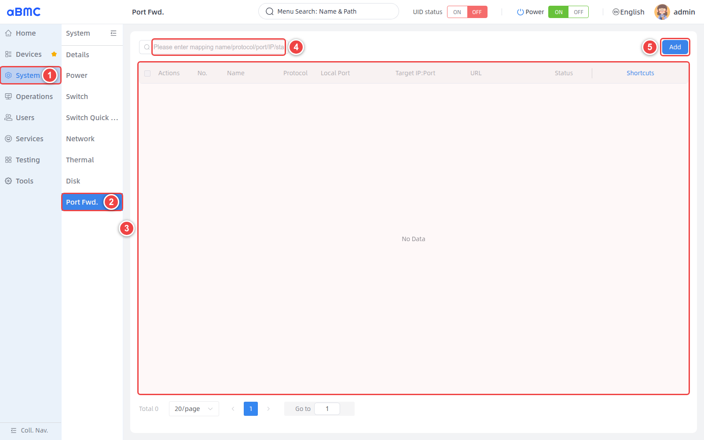
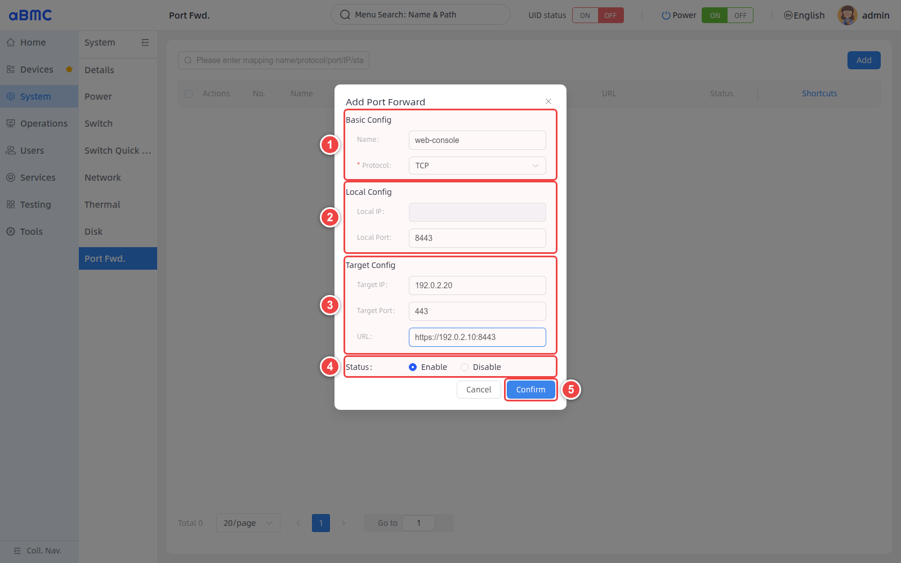
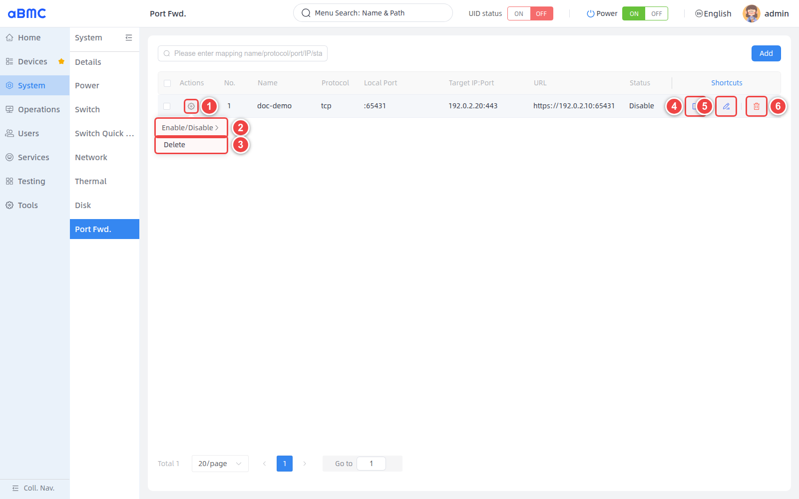
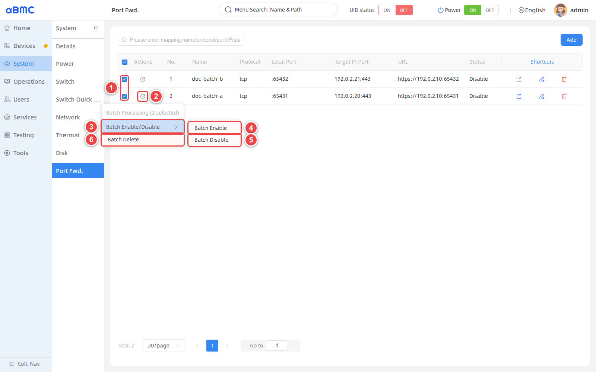

# Port Forwarding

## Introduction

Port Forwarding is a traffic forwarding management feature designed for array servers. It consists of two major modules: rule management and page redirection:

1. Rule management: provides unified creation, enabling, disabling, editing, and deletion of forwarding rules.

2. Page redirection: supports one-click access to the management web pages of array sub-nodes that customers deploy inside the server, enabling quick access

## Development Vision
1. Provide users with a unified network entry point to simplify operations and maintenance and reduce the cost of managing array sub-node addresses, routing, and access entries.

2. Users can use rule management to apply fine-grained control over traffic, effectively avoiding unnecessary port exposure within array sub-nodes.

# Using the Feature

## Viewing Port Forwarding

<CodeBlockTabs defaultValue="WEB">
  <CodeBlockTabsList>
    <CodeBlockTabsTrigger value="WEB">WEB</CodeBlockTabsTrigger>
    <CodeBlockTabsTrigger value="API">API</CodeBlockTabsTrigger>
  </CodeBlockTabsList>

  <CodeBlockTab value="WEB">
    ### Open the Port Forwarding Page [step]

    1. Select **System** in the left main navigation.
    2. Select **Port Fwd.** in the secondary navigation bar.
    3. Wait for the rule list and pagination area to finish loading, then view the current rules; when there are no rules, the list displays **No Data**.
    4. To find a rule, enter a name, protocol, port, IP, status, or URL in the search box.
    5. To create a rule, click **Add**.

    

    ### List Field Description [step]

    | Field | Description |
    | --- | --- |
    | Actions | Opens the rule action menu. After selecting multiple rules, you can batch enable, disable, or delete the selected rules. |
    | No. | The sequence number of the rule on the current page. |
    | Name | The rule name, used to identify the forwarding service or usage scenario. |
    | Protocol | The transport layer protocol used for forwarding; the value is TCP or UDP. |
    | Local Port | The local port on which the BMC listens externally. The management host accesses the mapped service through this port. |
    | Target IP:Port | The destination IPv4 address and service port to which traffic is ultimately forwarded. |
    | URL | The quick access address configured for the Web service. |
    | Status | The rule is currently **Enable** or **Disable**. |
    | Shortcuts | Provides quick actions for opening the URL, editing the rule, and deleting the rule. |

    <Callout title="Access Path" type="info">
      The forwarding path is: management host → `BMC_IP:Local Port` → `Target IP:Target Port`. The URL is only used for quick access from the page and does not replace the actual target IP and target port configuration.
    </Callout>
  </CodeBlockTab>

  <CodeBlockTab value="API">
    | Operation | Method | URI |
    | --- | --- | --- |
    | View the port forwarding list | GET | `/redfish/v1/Systems/bmc/Oem/Firefly/PortMappings` |

    <Callout title="Note" type="info">
      For detailed information about interface authentication, request parameters, response fields, and error codes, refer to the Redfish API documentation.
    </Callout>
  </CodeBlockTab>
</CodeBlockTabs>

## Adding a Port Forwarding Rule

<CodeBlockTabs defaultValue="WEB">
  <CodeBlockTabsList>
    <CodeBlockTabsTrigger value="WEB">WEB</CodeBlockTabsTrigger>
    <CodeBlockTabsTrigger value="API">API</CodeBlockTabsTrigger>
  </CodeBlockTabsList>

  <CodeBlockTab value="WEB">
    ### Confirm the Network Plan [step]

    Before adding a rule, first confirm the forwarding protocol, the BMC local listening port, the target device address, the target service port, and the initial rule status. The local port must not conflict with BMC system services or other mapping rules, and the target service must be reachable from the network where the BMC resides.

    ### Configure Port Forwarding [step]

    Click **Add** on the port forwarding page, then configure it as shown below:

    1. In **Basic Config**, enter the **Name** and select the TCP or UDP protocol.
    2. In **Local Config**, enter the **Local Port** on which the BMC listens externally. **Local IP** is managed by the system and is not editable on the page.
    3. In **Target Config**, enter the **Target IP** and **Target Port**; if a Web quick entry is needed, also fill in the **URL**.
    4. In **Status**, select **Enable** or **Disable**.
    5. After verifying the configuration is correct, click **Confirm**.

    

    ### Parameter Description [step]

    | Parameter | Required | Description | Configuration Requirements |
    | --- | --- | --- | --- |
    | Name | Yes | The rule name. | Length is `1–32` characters; Chinese characters, English letters, digits, underscores, and hyphens are allowed. |
    | Protocol | Yes | The protocol used for port forwarding. | Select TCP or UDP according to the target service. |
    | Local IP | System generated | The local listening address of the BMC. | Read-only on the page; no manual entry required. |
    | Local Port | Yes | The port on which the BMC listens externally. | Enter an integer within `1–65535` that is not occupied by system services or other rules. |
    | Target IP | Yes | The address of the target device that receives the forwarded traffic. | Enter a valid IPv4 address reachable by the BMC. |
    | Target Port | Yes | The service port on the target device. | Enter an integer within `1–65535` and confirm that the target service is listening on that port. |
    | URL | No | The quick access address used by the open icon in **Shortcuts**. | For Web services, a complete URL including protocol, address, and port is recommended; for non-Web services it can be left empty. |
    | Status | Yes | The enable/disable state of the rule after saving. | **Enable** means the rule takes effect after saving; **Disable** means the configuration is only saved and forwarding is postponed. |

    ### Configuration Example [step]

    The example in the figure below indicates: after the management host accesses the BMC's port `8443` using TCP, the traffic is forwarded to `192.0.2.20:443`.

    | Parameter | Example Value |
    | --- | --- |
    | Name | `web-console` |
    | Protocol | `TCP` |
    | Local Port | `8443` |
    | Target IP | `192.0.2.20` |
    | Target Port | `443` |
    | URL | `https://192.0.2.10:8443` |
    | Status | `Enable` |

    <Callout title="Example Address Note" type="info">
      `192.0.2.0/24` is an example address block used in this documentation. In actual configuration, replace it with the on-site usable BMC address, target device address, and ports; do not use the example values directly.
    </Callout>

    ### Verify the Configuration Result [step]

    1. Return to the rule list and confirm that **Name**, **Protocol**, **Local Port**, and **Target IP:Port** match the network plan.
    2. Confirm that **Status** is the expected state; when set to **Enable**, connect to `BMC_IP:Local Port` from a management host that is allowed to access the BMC.
    3. Confirm that requests can reach the target service, and check that the target device's service status, listening port, firewall, and routing are working properly.
    4. If a URL is configured, click the open icon in **Shortcuts** and confirm that the quick access address is reachable.

    <Callout title="Security Note" type="warn">
      Enabling port forwarding adds a new network entry point for the target service. Only map services that are necessary for the business, and restrict access sources according to on-site network policies. Do not keep management ports that do not need external exposure enabled for long periods.
    </Callout>
  </CodeBlockTab>

    <CodeBlockTab value="API">
    | Operation | Method | URI |
    | --- | --- | --- |
    | Query action parameters | GET | `/redfish/v1/Systems/bmc/Oem/Firefly/PortMappings/Actions/ConfigureActionInfo` |
    | Set port forwarding | POST | `/redfish/v1/Systems/bmc/Oem/Firefly/PortMappings/Actions/Configure` |

    <Callout title="Note" type="info">
      For detailed information about interface authentication, request parameters, response fields, and error codes, refer to the Redfish API documentation.
    </Callout>
  </CodeBlockTab>
</CodeBlockTabs>

## Managing Port Forwarding

<CodeBlockTabs defaultValue="WEB">
  <CodeBlockTabsList>
    <CodeBlockTabsTrigger value="WEB">WEB</CodeBlockTabsTrigger>
  </CodeBlockTabsList>

  <CodeBlockTab value="WEB">
    ### Locate the Rule Management Entry [step]

    When port forwarding rules exist in the rule list, select the corresponding operation as shown below:

    1. Click the settings icon in the **Actions** column of the target rule to open the action menu.
    2. Select **Enable/Disable** to enable or disable the rule.
    3. Select **Delete** to delete the current rule.
    4. Click the open icon in **Shortcuts** to access the URL configured for the rule.
    5. Click the edit icon to modify the current rule.
    6. Click the delete icon to quickly delete the current rule.

    

    ### Enable or Disable a Rule [step]

    1. Open the action menu from **Actions** of the target rule.
    2. Select **Enable/Disable**, then select **Enable** or **Disable**.
    3. Return to the list and confirm that **Status** has been updated.
    4. After enabling a rule, verify the forwarding entry; after disabling a rule, confirm that the corresponding local port no longer forwards traffic.

    ### Edit a Rule [step]

    1. Click the edit icon in **Shortcuts** of the target rule.
    2. Modify the protocol, port, target address, URL, or status in the edit window.
    3. After clicking **Confirm**, re-check the list contents and verify the forwarding result.

    <Callout title="Modifying the Local Port" type="warn">
      Modifying the Local Port changes the access entry point for the management host. Before saving, confirm that the new port is not occupied, and update any access addresses, scripts, and operations records that depend on that entry point.
    </Callout>

    ### Open the Quick Access Address [step]

    1. Confirm that a URL has been configured for the target rule.
    2. Click the open icon in **Shortcuts**.
    3. When the URL is empty, the open icon is unavailable; non-Web services such as SSH and databases should be accessed by connecting to `BMC_IP:Local Port` with the corresponding protocol client.

    ### Delete a Rule [step]

    1. Confirm that no business or operations personnel are currently using the forwarding entry.
    2. Select **Delete** in the **Actions** menu, or click the delete icon in **Shortcuts**.
    3. Review the operation in the confirmation window and confirm the deletion.
    4. Return to the list, confirm that the rule has been removed, and verify that the corresponding local port has stopped forwarding.

    ### Batch Manage Rules [step]

    1. Select at least two rules on the left side of the list.
    2. Open the batch operation menu from **Actions** of any selected rule.
    3. Select **Batch Enable/Disable** to expand the batch status operations.
    4. Select **Batch Enable** to enable all selected rules.
    5. Select **Batch Disable** to disable all selected rules.
    6. Select **Batch Delete** to delete all selected rules.

    

    <Callout title="Batch Operation Scope" type="warn">
      Batch operations affect all currently selected rules. Before executing, verify the selected count and rule scope shown on the page; after the operation, check the status of each rule or confirm that the rules have been removed.
    </Callout>

    <Callout title="Temporarily Disabling a Rule" type="info">
      When you only need to temporarily stop forwarding, use **Disable** to keep the rule configuration; delete the rule only when you are certain the entry point will no longer be used.
    </Callout>
  </CodeBlockTab>
</CodeBlockTabs>

## FAQ

### 1. The List Displays No Data

No port forwarding rules have been configured on the device yet. Click **Add** to create a rule; if configuration was just completed but the list is still empty, refresh the page and confirm whether the save operation succeeded.

### 2. The Local Port Cannot Be Used

The port may already be occupied by a BMC system service or another port forwarding rule. Switch to an unoccupied Local Port and update the corresponding access addresses and operations configurations accordingly.

### 3. The URL Fails to Open but Port Forwarding Works

The URL quick entry is independent of the actual forwarding parameters. Check the URL's protocol, address, and port; non-Web services should be accessed by connecting to `BMC_IP:Local Port` with the corresponding protocol client.

### 4. The Rule Is Not Needed Now but Will Be Used Later

Set the rule to **Disable** to keep the original configuration; re-enable it when needed again, without having to delete and recreate it.
