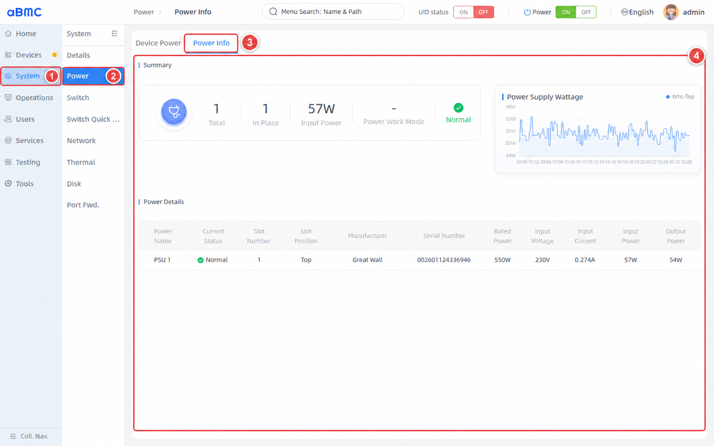

# Power Information

## Introduction

Power Information (Power Info) is an array power monitoring system designed by aBMC for array servers. The system consists of three parts: power overview, output power trends, and power supply module details. Users can centrally view the presence status, health status, rated power, input/output electrical parameters, and power trends of power supply modules, and promptly identify issues such as missing power supplies, abnormal operation, or insufficient power capacity.

## Development Vision

1. Provide users with visualized power status and output power trends, making it easy for customers to continuously understand the power supply conditions and power changes of array servers.
2. Improve the efficiency of diagnosing power failures and reduce the impact of a single abnormal power supply module on the stable operation of the array by uniformly displaying the presence, health, and electrical parameters of power supply modules.

# Feature Usage

## Viewing Power Information

<CodeBlockTabs defaultValue="WEB">
  <CodeBlockTabsList>
    <CodeBlockTabsTrigger value="WEB">WEB</CodeBlockTabsTrigger>
    <CodeBlockTabsTrigger value="API">API</CodeBlockTabsTrigger>
  </CodeBlockTabsList>

  <CodeBlockTab value="WEB">
    ### Open the Power Information Page [step]

    1. Select **System** in the left main navigation.
    2. Select **Power** in the secondary navigation bar.
    3. Click **Power Info** at the top of the page.
    4. Wait for **Summary**, **Power Supply Wattage**, and **Power Details** to finish loading.

    

    ### View the Power Overview [step]

    1. In **Summary**, check the total number of power supply modules and the number in place.
    2. Check the current **Input Power** and **Power Work Mode**.
    3. Check the overall health status on the right side of the overview. When the status is **Abnormal**, continue checking the abnormal power supply modules in **Power Details**.

    ### Power Overview Field Description [step]

    | Field | Description | Check Points |
    | --- | --- | --- |
    | Total | Total number of power supply modules recognized by the system. | Should match the number of power supply modules planned for installation in the server. |
    | In Place | Number of power supply modules currently in place. | If less than **Total**, check the slot, installation status, and power connections of the missing power supply module. |
    | Input Power | Sum of the current input power of all power supply modules; when input power is unavailable, the page may use the consumed power returned by the system. | Judge based on server load and historical trends; do not confirm an anomaly based on a single sample. |
    | Power Work Mode | Current power work mode, which may include **Load Balancing**, **Sharing**, or **Active Standby**. | Displays `-` when the server does not return a work mode; this does not necessarily indicate an abnormal power supply module. |
    | Health Status | Overall judgment generated from the status of power supply modules in place and the power health status returned by the system. | When **Abnormal** is displayed, check the details, server alarms, and system logs item by item. |

    ### View Output Power Trends [step]

    1. In **Power Supply Wattage**, view the output power curves of each power supply module.
    2. Use the position names in the legend to identify the corresponding power supply modules, for example **bmc-Top** indicates the power supply module in the top slot of the BMC.
    3. Observe whether the power fluctuates violently and continuously, suddenly drops to `0`, or lacks data for a long time.
    4. The page automatically refreshes power details and output power trends every `15` seconds; no manual refresh is needed.

    <Callout title="Power Trend Notes" type="info">
      The trend chart displays historical sampled values of the power supply module output power. The value at the end of the trend chart may differ slightly from the current **Output Power** in **Power Details** due to different sampling times; judge comprehensively based on continuous trends and current details.
    </Callout>

    ### View Power Supply Module Details [step]

    1. In **Power Details**, confirm the target power supply module based on **Power Name** and slot information.
    2. Check whether **Current Status** is **Normal**.
    3. Check whether the rated power, input voltage, input current, input power, and output power match the server specifications and the current load.
    4. When a **Not In Place** or **Abnormal** status is found, record the slot, manufacturer, and serial number, and perform further troubleshooting in combination with server alarms and on-site connections.

    ### Power Details Field Description [step]

    | Field | Description | Check Points |
    | --- | --- | --- |
    | Power Name | Power supply module name, for example **PSU 1**. | Confirm the target power supply module before operating and troubleshooting. |
    | Current Status | Current status, including **Normal**, **Not In Place**, and **Abnormal**. | When not **Normal**, check module installation, power connections, and server alarms. |
    | Slot Number | Slot number where the power supply module is located. | Used to locate the physical slot in the server. |
    | Slot Position | Position where the power supply module is located, for example **Top**. | Should match the actual installation position in the server. |
    | Manufacturer | Manufacturer of the power supply module. | Used to verify compatibility and server specifications when replacing a module. |
    | Serial Number | Serial number of the power supply module. | Used for asset records, fault tracking, and after-sales identification. |
    | Rated Power | Rated power of the power supply module, in W. | Should meet the server power supply design requirements; do not judge whether the rated capacity is exceeded based only on the current input power. |
    | Input Voltage | Current input voltage of the power supply module, in V. | Should be within the range allowed by the power supply module and the on-site power supply system. |
    | Input Current | Current input current of the power supply module, in A. | Should be judged comprehensively together with input voltage, input power, and server load. |
    | Input Power | Current input-side power of the power supply module, in W. | Watch for abnormal sudden changes in combination with historical trends. |
    | Output Power | Current output-side power of the power supply module, in W. | Usually lower than input power; the difference is related to power conversion losses and measurement errors. |

    ### Confirm Power Status [step]

    1. Confirm that **Total** matches the number planned for installation in the server and that **In Place** equals the actual number in place.
    2. Confirm that the overall health status and the **Current Status** of each power supply module are all **Normal**.
    3. Continuously observe **Power Supply Wattage** to confirm that the output power updates normally without persistent sudden changes for no business reason.
    4. Compare the rated power, input/output parameters, and current server load; when an anomaly is found, further check server alarms, system logs, power cables, and the on-site power supply environment.

    <Callout title="Status Refresh Notes" type="info">
      The page re-fetches power supply module details and output power trends every `15` seconds. When a power supply module has just been inserted or removed, or the power supply status has just changed, wait for the next refresh before confirming again.
    </Callout>
  </CodeBlockTab>

  <CodeBlockTab value="API">
    | Operation | Method | URI |
    | --- | --- | --- |
    | View the power overview and power supply module details | GET | `/redfish/v1/Chassis/bmc/Power` |
    | Query power supply module output power trends | POST | `/redfish/v1/Oem/PrometheusServices/PowerOutputList` |

    <Callout title="Tip" type="info">
      For detailed descriptions of interface authentication, request parameters, returned fields, and error codes, see the Redfish API documentation. When querying output power trends, provide the node name, start time, end time, and sampling step as needed.
    </Callout>
  </CodeBlockTab>
</CodeBlockTabs>

## FAQ

### 1. Power Work Mode or Electrical Parameters Displayed as `-`

The server may not provide the corresponding field, or the status read may have temporarily failed. First confirm that the power supply module status and BMC communication are normal, wait for the page to refresh automatically, and then check again; if other key fields are also missing, troubleshoot in combination with server alarms and the interface response.

### 2. Power Supply Module Displayed as **Not In Place** or **Abnormal**

Locate the module based on **Slot Number** and **Slot Position**, check whether the module is properly installed, whether the power cable is connected, and whether the on-site power supply is normal, and view server alarms and system logs. Before re-inserting or replacing a power supply module, follow the server maintenance specifications.

### 3. Input Power and Output Power Are Inconsistent

Power supply modules produce losses during conversion, so **Input Power** is usually higher than **Output Power**. The two may also differ slightly due to sampling times and measurement accuracy; if the difference keeps growing abnormally, further troubleshoot in combination with load, temperature, server alarms, and power supply specifications.

### 4. Output Power Trend Has No Data

Confirm that the power supply module is in place and in normal status, and wait for at least one automatic refresh cycle. If output power is already present in the details but the trend chart still has no data, check whether the power monitoring service, historical data collection status, and related interfaces can return data normally.
