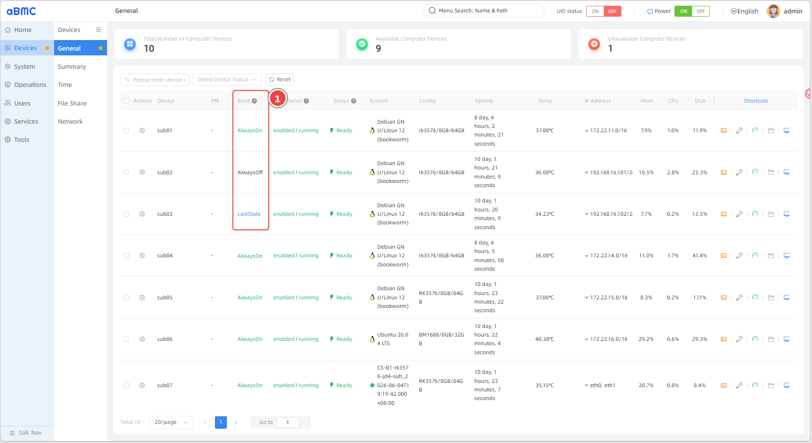
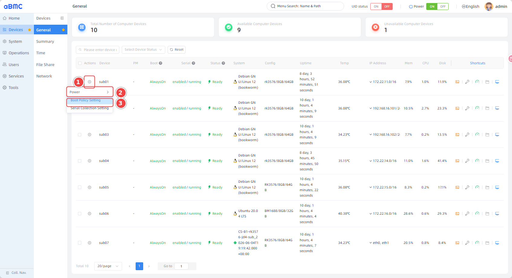
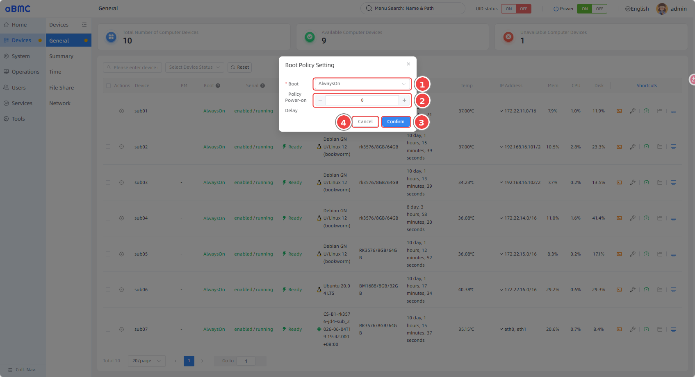
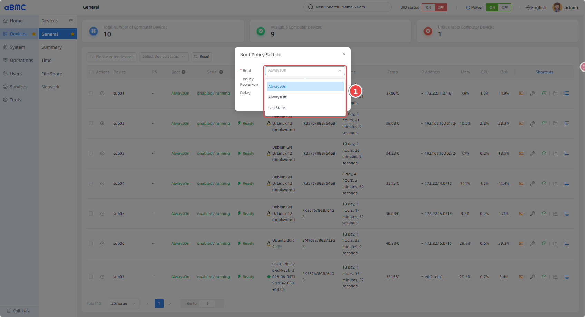
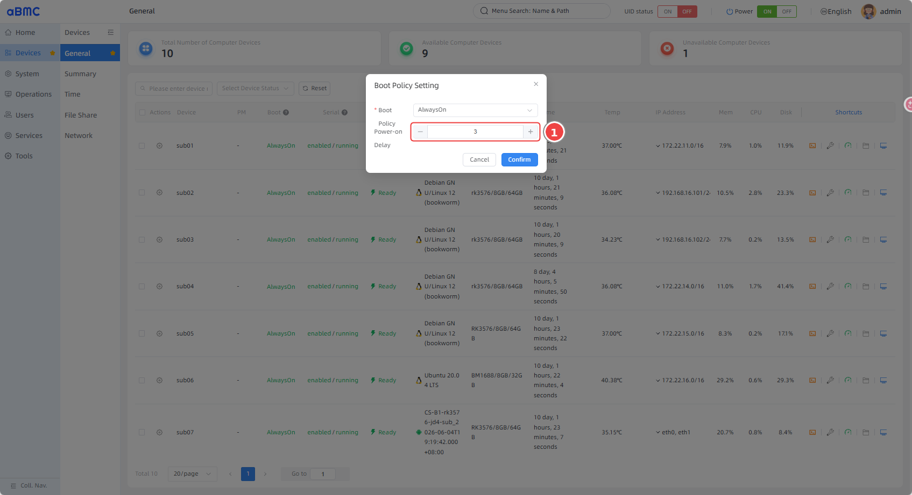

# Sub-Board Power Boot Policy

## Introduction

The sub-board power boot policy (Boot Policy Setting) is a power recovery configuration feature that aBMC provides for array sub-boards. Administrators can set a power recovery policy and a power-on delay for each sub-board, so that sub-boards start in the expected state when the aBMC service initializes or when power is restored.

## Development Vision

1. Provide a unified policy configuration entry that clearly defines the power state of sub-boards after power recovery, reducing the operations cost of powering devices on and restoring configurations one by one.
2. Use power-on delays to stagger sub-board startup within the array, reducing the instantaneous load when many boards power on at once and matching the on-site power supply and service recovery order.

# Using the Feature

## Understanding the Boot Policy

<CodeBlockTabs defaultValue="WEB">
  <CodeBlockTabsList>
    <CodeBlockTabsTrigger value="WEB">WEB</CodeBlockTabsTrigger>
  </CodeBlockTabsList>

  <CodeBlockTab value="WEB">
    ### Feature Scope [step]

    | Feature | Description |
    | --- | --- |
    | View the boot policy | View the current boot policy and delay of a sub-board in the **Boot** column of the **General** device list. |
    | Set the boot policy | Choose **AlwaysOn**, **AlwaysOff**, or **LastState** for an individual sub-board. |
    | Set the power-on delay | Configure the number of seconds to wait before power is applied. The value is an integer no less than `0`. |
    | Query configuration capabilities | Use `SetPowerConfig.ActionInfo` to see which fields and policy values can be modified for the target sub-board. |

    ### Preparation [step]

    1. Log in to aBMC with an account that has configuration permission on the target device.
    2. Confirm that the target sub-board is connected to aBMC and is displayed on the **Devices > General** page.
    3. Before configuring, confirm the target device name, its business role, and the expected power recovery behavior.
    4. Before restoring power in bulk or centrally, confirm that the policy and delay will not break the dependency order of the array devices.

    ### UI Terminology [step]

    | UI Term | Description |
    | --- | --- |
    | Boot Policy | The power recovery policy applied to a sub-board. |
    | Boot Policy Setting | The configuration window where the boot policy and power-on delay are set. |
    | Power-on Delay | The number of seconds to wait before power is applied. |
    | AlwaysOn | Always power on the sub-board when aBMC initializes or power is restored. |
    | AlwaysOff | Keep the sub-board powered off when aBMC initializes or power is restored. |
    | LastState | Restore the sub-board's last recorded power state. |

    ### When the Policy Takes Effect [step]

    aBMC reads and applies sub-board boot policies when PowerManager starts. On models that support sub-board linkage, applying power through the server power button or the sub-board hot-plug flow also re-applies the corresponding policy. Saving a configuration does not immediately restart, power off, or change the state of sub-boards that are already powered on; when a **Power-on Delay** greater than `0` is set, subsequent power-on actions wait the corresponding number of seconds before executing the hardware power-on callback.
  </CodeBlockTab>
</CodeBlockTabs>

## Viewing a Sub-Board's Power Boot Policy

<CodeBlockTabs defaultValue="WEB">
  <CodeBlockTabsList>
    <CodeBlockTabsTrigger value="WEB">WEB</CodeBlockTabsTrigger>
  </CodeBlockTabsList>

  <CodeBlockTab value="WEB">
    ### Open the Device List [step]

    1. Select **Devices** in the left main navigation bar.
    2. Select **General** in the secondary navigation bar.
    3. Locate the target sub-board in the device list.
    4. Check the boot policy in the **Boot** column; when a delay greater than `0` is configured, `Delay: <seconds>s` is also displayed below the policy.

    

    ### List Field Descriptions [step]

    | Field | Description |
    | --- | --- |
    | Device | The node name of the sub-board in aBMC. |
    | Boot | The current boot policy; may show **AlwaysOn**, **AlwaysOff**, or **LastState**. |
    | Delay | The power-on delay for the current boot policy, in seconds; usually not displayed when no delay is set. |
    | Status | The current state of the sub-board. When a device is offline or state collection has not completed, other fields may show `-`. |

    <Callout title="Verifying Status" type="info">
      The page shows the configuration currently reported by the device and refreshed in the aBMC list. If the list does not update immediately after you change the policy, wait for the request to complete and refresh the page, and confirm the target device is still reachable.
    </Callout>
  </CodeBlockTab>
</CodeBlockTabs>

## Setting the Boot Policy for a Single Sub-Board

<CodeBlockTabs defaultValue="WEB">
  <CodeBlockTabsList>
    <CodeBlockTabsTrigger value="WEB">WEB</CodeBlockTabsTrigger>
    <CodeBlockTabsTrigger value="API">API</CodeBlockTabsTrigger>
  </CodeBlockTabsList>

  <CodeBlockTab value="WEB">
    ### Open the Boot Policy Window [step]

    1. On the **Devices > General** page, locate the target sub-board.
    2. Click the settings icon in the **Actions** column of the target device.
    3. Select **Boot Policy Setting** to open the boot policy window.

    

    ### View the Current Configuration [step]

    The boot policy window shows the target sub-board's current **Boot Policy** and **Power-on Delay**. Before submitting, verify the device name at the top of the window to avoid writing the configuration to the wrong sub-board.

    

    ### Select the Boot Policy [step]

    Select the target policy from the **Boot Policy** drop-down list:

    | Policy | Description | Applicable Scenarios |
    | --- | --- | --- |
    | **AlwaysOn** | Forces the sub-board's power domain on when the aBMC service initializes or power is restored. | Critical sub-boards that must start automatically with the system. |
    | **AlwaysOff** | Keeps the sub-board's power domain off when the aBMC service initializes or power is restored. | Sub-boards that require manual confirmation before starting, or that are not currently in service. |
    | **LastState** | Restores the last power state from the persisted state record; if there is no valid record or the state is unknown, the current implementation performs no recovery action for that domain. | Sub-boards that should preserve their recorded pre-power-loss state as much as possible. |

    

    ### Set the Power-on Delay [step]

    1. Enter the number of seconds to wait in **Power-on Delay**.
    2. The value must be an integer no less than `0`; setting `0` adds no delay.
    3. Set a reasonable delay based on the array topology, device dependencies, and power supply capacity. The delay only affects subsequent power-on flows and never automatically restarts a device that is currently running.

    

    ### Save and Confirm the Result [step]

    1. Confirm that the device name, **Boot Policy**, and **Power-on Delay** are all correct.
    2. Click **Confirm** to save; click **Cancel** to discard the changes.
    3. Return to the **General** list and confirm the **Boot** column shows the new policy.
    4. If a delay greater than `0` was set, confirm that `Delay: <seconds>s` is displayed below the policy.

    <Callout title="Configuration Impact" type="warn">
      The boot policy affects the target sub-board's future power recovery behavior. Setting the policy to **AlwaysOff** may prevent services that depend on the sub-board from recovering automatically; setting a large number of sub-boards to **AlwaysOn** may increase the load when power is applied centrally. Before submitting, confirm the on-site power supply plan and service recovery requirements.
    </Callout>
  </CodeBlockTab>

  <CodeBlockTab value="API">
    ### Query the Target Device's Configuration Capabilities [step]

    Before configuring, query the target sub-board's ActionInfo to confirm whether the field accepts input and the allowable values of **PowerRestorePolicy**.

    | Operation | Method | URI |
    | --- | --- | --- |
    | Query boot policies and delays in the device list | GET | `/redfish/v1/Oem/PrometheusServices/NodeConfig` |
    | Query boot policy action parameters | GET | `/redfish/v1/Systems/{{nodename}}/Actions/SetPowerConfig.ActionInfo` |
    | Set the boot policy | POST | `/redfish/v1/Systems/{{nodename}}/Actions/SetPowerConfig` |

    ```json title="ActionInfo response example"
    {
      "Parameters": [
        {
          "DisallowedInput": false,
          "DataType": "Number",
          "Name": "PowerOnDelaySeconds",
          "Required": false
        },
        {
          "DisallowedInput": false,
          "AllowableValues": ["AlwaysOn", "AlwaysOff", "LastState"],
          "DataType": "String",
          "Name": "PowerRestorePolicy",
          "Required": true
        }
      ]
    }
    ```

    ### Submit the Boot Policy [step]

    The request body contains the following fields:

    ```json title="Set the boot policy"
    {
      "PowerRestorePolicy": "AlwaysOn",
      "PowerOnDelaySeconds": 0
    }
    ```

    | Field | Type | Required | Description |
    | --- | --- | --- | --- |
    | `PowerRestorePolicy` | string | Yes | The power recovery policy. Allowable values follow the `AllowableValues` returned by ActionInfo, usually `AlwaysOn`, `AlwaysOff`, or `LastState`. |
    | `PowerOnDelaySeconds` | integer | No | The number of seconds to delay before powering on; the UI requires an integer no less than `0`. If omitted, the server treats it as `0`. |

    <CodeBlockTabs defaultValue="basic-auth">
      <CodeBlockTabsList>
        <CodeBlockTabsTrigger value="basic-auth">Basic Auth</CodeBlockTabsTrigger>
        <CodeBlockTabsTrigger value="token">Token</CodeBlockTabsTrigger>
      </CodeBlockTabsList>

      <CodeBlockTab value="basic-auth">
        ```bash title="Set the power-on policy"
        curl --user '<username>:<password>' \\
          --request POST \\
          --header 'Content-Type: application/json' \\
          --data '{
            "PowerRestorePolicy": "AlwaysOn",
            "PowerOnDelaySeconds": 0
          }' \\
          '<protocol>://<device-ip>:<port>/redfish/v1/Systems/<system-id>/Actions/SetPowerConfig'
        ```
      </CodeBlockTab>

      <CodeBlockTab value="token">
        ```bash title="Set the power-on policy with a token"
        curl --request POST \\
          --header 'X-Xsrf-Token: <token>' \\
          --header 'Content-Type: application/json' \\
          --data '{
            "PowerRestorePolicy": "AlwaysOn",
            "PowerOnDelaySeconds": 0
          }' \\
          '<protocol>://<device-ip>:<port>/redfish/v1/Systems/<system-id>/Actions/SetPowerConfig'
        ```
      </CodeBlockTab>
    </CodeBlockTabs>

    <Callout title="API Permissions and Effective Scope" type="info">
      Both querying ActionInfo and submitting the configuration require the `OemPowerControl` permission on the target device. A successful request means the configuration has been applied to the runtime power domain and persisted; it does not trigger an immediate power action. The policy and delay are used in subsequent aBMC initialization or power recovery flows. The current backend handler does not separately validate the lower bound of `PowerOnDelaySeconds`; when calling the API, make sure you send a non-negative integer yourself. The `bmc` system itself does not support this operation.
    </Callout>
  </CodeBlockTab>
</CodeBlockTabs>

## Setting Boot Policies in Bulk

<CodeBlockTabs defaultValue="WEB">
  <CodeBlockTabsList>
    <CodeBlockTabsTrigger value="WEB">WEB</CodeBlockTabsTrigger>
  </CodeBlockTabsList>

  <CodeBlockTab value="WEB">
    ### Select the Target Devices [step]

    1. On the **Devices > General** page, select at least two sub-boards that need the same configuration.
    2. Click the settings icon in the **Actions** column of any selected device.
    3. Select **Boot Policy Setting** to open the bulk configuration window.

    ### Submit the Bulk Configuration [step]

    1. In **Boot Policy**, select the policy to apply to all target devices.
    2. In **Power-on Delay**, set a unified delay in seconds.
    3. Verify the selected device scope, then click **Confirm**.
    4. The page sends a separate `SetPowerConfig` request to each selected device; after all requests complete, the page updates the policies and delays in the list.

    <Callout title="Bulk Operation Limitations" type="warn">
      The bulk window queries the ActionInfo of only the first selected device and uses its allowable policy values and field capabilities; other devices may have different firmware capabilities. The requests are sent in parallel, and if some devices fail, devices that already succeeded are not rolled back automatically. After submitting, verify the **Boot** column device by device, and check and retry the failed devices individually.
    </Callout>
  </CodeBlockTab>
</CodeBlockTabs>

## FAQ

### 1. The boot policy drop-down list is empty or cannot be modified

The page determines field capabilities from `DisallowedInput` and `AllowableValues` of `SetPowerConfig.ActionInfo`. Confirm that the target device is online, the account has the `OemPowerControl` permission, and that the API allows modifying `PowerRestorePolicy`.

### 2. Power-on Delay cannot be saved

The numeric control in the web UI only accepts integers no less than `0` and rejects decimals and negative numbers. API calls should also send non-negative integers; also confirm the target device's ActionInfo does not mark `PowerOnDelaySeconds` as disallowed input.

### 3. The device does not start or stop immediately after saving

This is expected behavior. Saving the boot policy updates and persists the runtime power domain configuration but does not immediately power on, power off, or restart; it is applied during aBMC startup, whole-server power-on linkage, or specific hot-plug flows. To change the power state immediately, use the **Power** action on the **General** page, and confirm its business impact first.

### 4. Only some sub-boards were updated after bulk configuration

The bulk operation sends requests in parallel to every selected device, and results may differ across devices due to permissions, online status, action parameter capabilities, or API errors. Review the **Boot** and delay display in the list device by device, and for failed devices check the ActionInfo and API response, then retry individually.
