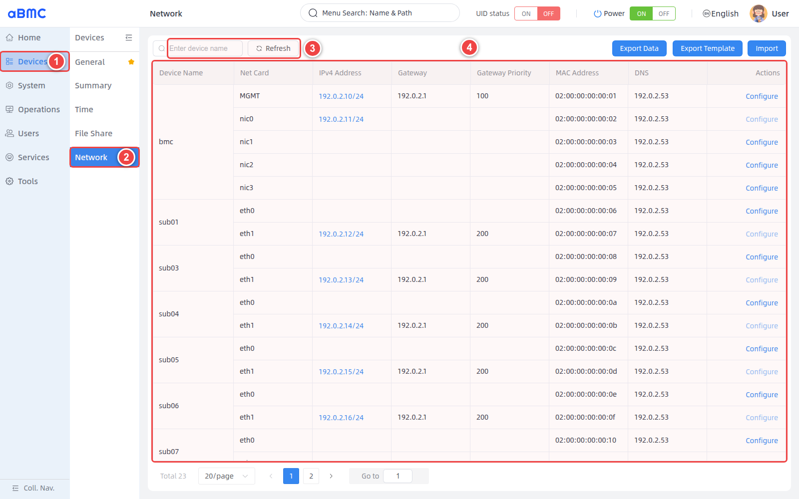
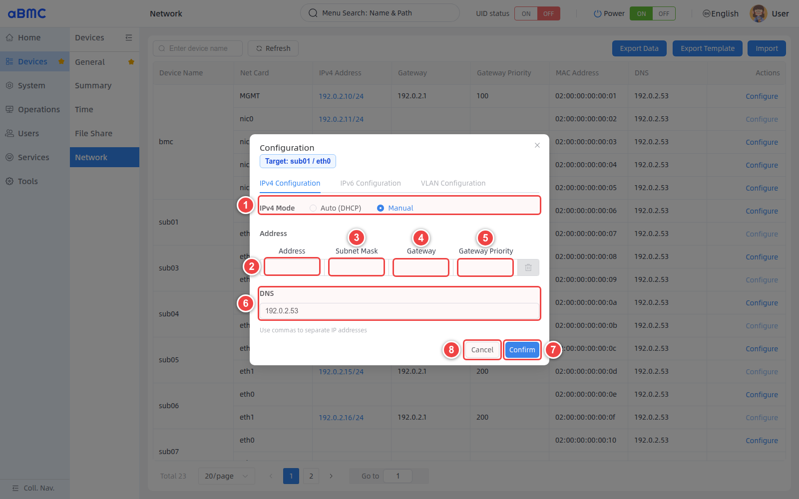
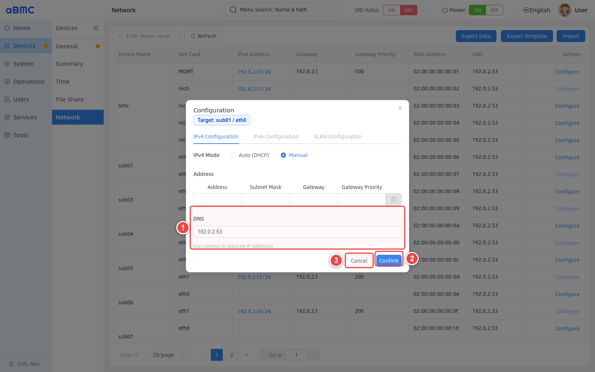
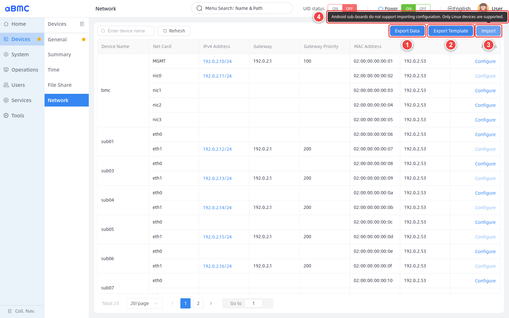

# Sub-Board Network Management

## Introduction

Sub-Board Network Management (Sub Network Manager) is a centralized network configuration feature that aBMC provides for array servers. The feature consists of two major modules: network information management and configuration file operations.
1. Network information management: centrally view the IPv4 addresses, gateways, gateway priorities, MAC addresses, and DNS of array sub-node NICs, with support for DHCP or manual configuration.
2. Configuration file operations: provide entries for exporting network data, exporting templates, and importing configurations; the import feature supports Linux devices only.

## Development Vision

1. Provide a unified, visualized network entry point for managing array sub-nodes of array servers, reducing the effort of logging in to each device to configure the network.
2. Reduce the risk of sub-boards losing connectivity due to incorrect network configuration, through explicit configuration scope, private NIC restrictions, and result validation.


# Feature Usage

## Viewing and Configuring Network Ports

<CodeBlockTabs defaultValue="WEB">
  <CodeBlockTabsList>
    <CodeBlockTabsTrigger value="WEB">WEB</CodeBlockTabsTrigger>
    <CodeBlockTabsTrigger value="CLI">CLI</CodeBlockTabsTrigger>
    <CodeBlockTabsTrigger value="API">API</CodeBlockTabsTrigger>
  </CodeBlockTabsList>

  <CodeBlockTab value="WEB">
    ### Open the network management page [step]

    1. Select **Devices** in the left main navigation bar.
    2. Select **Network** in the secondary navigation bar.
    3. To find a specific device, enter the device name in **Enter device name**; to fetch the data again, click **Refresh**.
    4. In the NIC list, identify the target interface by **Device Name** and **Net Card**. The list shows both BMC and sub-board NICs, and does not show the loopback interface `lo`.

    

    ### View NIC information [step]

    A device may contain multiple NICs. Before configuring, verify both the device name and the NIC name, and record the original address, gateway, and DNS for recovery in case of anomalies.

    | Field | Description |
    | --- | --- |
    | Device Name | Node name, for example `bmc` or `sub01`. |
    | Net Card | NIC name, for example `MGMT`, `eth0`, or `eth1`. |
    | IPv4 Address | Current IPv4 address and prefix length. When an interface has multiple addresses, click the address to expand and view them. |
    | Gateway | Current IPv4 default gateway. |
    | Gateway Priority | Routing priority of the current gateway. |
    | MAC Address | NIC MAC address, used to identify the physical interface. |
    | DNS | Current DNS server list. |
    | Actions | When **Configure** is available, the interface can be configured; when the button is disabled, hover the pointer over it to see the reason for the restriction. |

    ### Determine whether a NIC allows configuration [step]

    - **Configure** available: the interface can be modified.
    - **Configure** disabled: the interface is usually a private NIC used for communication between the BMC and sub-boards, or is restricted by the current topology policy, and cannot be configured.

    <Callout title="Private NIC restrictions" type="warn">
      Do not attempt to bypass page restrictions through the CLI or API. The backend checks the NIC policy and returns an error such as `card eth1 can not setting` when `Oem.Firefly.SettingEnabled` is `false`.
    </Callout>

    ### Obtain an address with DHCP [step]

    1. Click **Configure** in the **Actions** column of the target interface.
    2. Select **Auto (DHCP)** in **IPv4 Mode**.
    3. To specify DNS servers, enter them in **DNS**. Separate multiple addresses with commas.
    4. Click **Confirm**.
    5. Return to the list and click **Refresh** to confirm that the interface has obtained the expected address.

    ### Manually configure IPv4 [step]

    First click **Configure** in the **Actions** column of the target interface to open the **Configuration** window, then follow the figure below:

    1. Select **Manual** in **IPv4 Mode**.
    2. Enter the static IPv4 address in **Address**.
    3. Enter the corresponding subnet mask in **Subnet Mask**. After completing an address row, the page automatically adds a blank row so you can add more addresses.
    4. To configure a default route, enter the gateway address in **Gateway**.
    5. When entering a gateway, enter a positive integer priority in **Gateway Priority**.
    6. To configure DNS, enter the DNS servers in **DNS**; separate multiple addresses with commas.
    7. After verifying the parameters, click **Confirm** to save the configuration.
    8. To discard the changes, click **Cancel**.

    

    ### Modify DNS [step]

    First open the **Configuration** window of the target interface, keep the current IPv4 mode, address, and gateway parameters unchanged, then follow the figure below:

    1. Modify the server addresses in **DNS**. Separate multiple addresses with commas, for example `192.0.2.53,192.0.2.54`.
    2. Click **Confirm** to save the changes.
    3. To discard the changes, click **Cancel**.

    

    ### Configuration rules [step]

    | Item | Rule |
    | --- | --- |
    | Auto (DHCP) | The IPv4 address is assigned by the DHCP service. Do not fill in static addresses and gateways when submitting. |
    | Address | In Manual mode, at least one valid IPv4 address must be entered; multiple addresses on the same interface are supported. |
    | Subnet Mask | Each static address must be accompanied by a valid subnet mask. |
    | Gateway | Optional; when entering a gateway, Gateway Priority must be entered as well. |
    | Gateway Priority | Must be a positive integer. The same gateway and priority combination must not duplicate another NIC or VLAN. |
    | DNS | Optional; must be valid IP addresses, separated by commas. |

    <Callout title="Current page capabilities" type="info">
      The current version only enables **IPv4 Configuration**. The **IPv6 Configuration** and **VLAN Configuration** tabs are disabled.
    </Callout>

    ### Verify the configuration result [step]

    1. Return to the **Network** list and click **Refresh**.
    2. Locate the device and NIC just configured.
    3. Confirm that **IPv4 Address**, **Gateway**, **Gateway Priority**, and **DNS** have been updated.
    4. From the corresponding subnet, verify address connectivity, default route, and domain name resolution.

    <Callout title="Network change risks" type="warn">
      Modifying an address, subnet mask, or default gateway that is in use may immediately disconnect the device. Record the original configuration before operating, and prepare a serial port or another independent recovery channel. The addresses in the screenshots are for illustrating page locations only.
    </Callout>
  </CodeBlockTab>

  <CodeBlockTab value="CLI">
    ### View NIC information [step]

    When no configuration parameters are specified, `bmc ethernet` returns the NIC information of the target node.

    **View all NICs of a node**

    When `--interface` is not specified, the command returns all interfaces of the target node.

    ```bash
    bmc ethernet --protocol http --ip <BMC_IP> --port <BMC_PORT> --user <USERNAME> --password <PASSWORD> --core <NODE_NAME>
    ```

    **View a specific NIC**

    Specify the NIC name with `--interface`. Before configuring a NIC, confirm that `Oem.Firefly.SettingEnabled` in the result is `true`.

    ```bash
    bmc ethernet --protocol http --ip <BMC_IP> --port <BMC_PORT> --user <USERNAME> --password <PASSWORD> --core <NODE_NAME> --interface <INTERFACE>
    ```

    <Callout title="Display differences between WEB and CLI" type="info">
      The WEB page hides the loopback interface `lo`; the CLI returns `lo` when querying all interfaces. Do not configure the loopback interface.
    </Callout>

    ### Use DHCP [step]

    Specify the target NIC with `--core` and `--interface`, and set `--interface-dhcp4` to `true`.

    ```bash
    bmc ethernet --protocol http --ip <BMC_IP> --port <BMC_PORT> --user <USERNAME> --password <PASSWORD> --core <NODE_NAME> --interface <INTERFACE> --interface-dhcp4=true
    ```

    ### Configure static IPv4 [step]

    Set `--interface-dhcp4` to `false` and specify the IPv4 address, prefix length, gateway, gateway priority, and DNS. The following addresses belong to documentation example subnets and must be replaced with on-site planned values before execution.

    ```bash
    bmc ethernet --protocol http --ip <BMC_IP> --port <BMC_PORT> --user <USERNAME> --password <PASSWORD> --core <NODE_NAME> --interface <INTERFACE> --interface-dhcp4=false --interface-ip 192.0.2.10 --interface-ip-cidr 24 --interface-gateway 192.0.2.1 --interface-gateway-metric 100 --interface-dns 192.0.2.53
    ```

    The CLI can submit only one static address and one DNS server at a time. To configure multiple addresses or multiple DNS servers for the same interface, use the WEB or API.

    ### Demo [step]

    The following example assumes an aBMC address of `172.16.100.173`, service port `443`, username `admin`, and target NIC `sub01/eth0`. Modify the address, port, account, and target NIC according to your actual environment.

    ```bash
    # View a specific NIC
    bmc ethernet --protocol http --ip 172.16.100.173 --port 443 --user admin --password admin --core sub01 --interface eth0

    # Set the specific NIC to DHCP
    bmc ethernet --protocol http --ip 172.16.100.173 --port 443 --user admin --password admin --core sub01 --interface eth0 --interface-dhcp4=true

    # Query the configuration result
    bmc ethernet --protocol http --ip 172.16.100.173 --port 443 --user admin --password admin --core sub01 --interface eth0
    ```

    ### Parameter description [step]

    | Parameter | Required | Description |
    | --- | --- | --- |
    | `--protocol` | Yes | Request protocol, for example `http`. |
    | `--ip` | Yes | aBMC management address. |
    | `--port` | Yes | Redfish service port. |
    | `--user` | Yes | HTTP Basic authentication username. |
    | `--password` | Yes | HTTP Basic authentication password. |
    | `--core` | Yes | Target node name, for example `sub01`. |
    | `--interface` | Required when viewing a single interface or configuring | Target NIC name, for example `eth0`. When not specified, all interfaces are queried. |
    | `--interface-dhcp4` | Required when configuring | `true` for DHCP, `false` for static configuration. |
    | `--interface-ip` | Used for static configuration | IPv4 address. |
    | `--interface-ip-cidr` | No | IPv4 prefix length; when not specified, the CLI uses `24` by default. |
    | `--interface-gateway` | No | IPv4 default gateway. |
    | `--interface-gateway-metric` | No | Gateway routing priority; must be an integer. |
    | `--interface-dns` | No | DNS server. The current CLI accepts one DNS address at a time. |
    | `--output-format` | No | Specifies the client output format. |

    ### Command result description [step]

    | Scenario | Result |
    | --- | --- |
    | Query succeeded | Outputs the interface JSON; outputs a JSON array when querying all interfaces. |
    | Configuration succeeded | Outputs `Success`; returns the Redfish success message when using the JSON output format. |
    | Parameter error | Outputs a missing-parameter or format error, for example `interface-dhcp4 is required`. |
    | Request failed | Outputs the error message returned by Redfish and exits with a non-zero status code. |

    <Callout title="Credential and network security" type="warn">
      Passwords on the command line may be retained in shell history or process lists. Before executing the DHCP command in the demo, confirm that the target NIC allows configuration and that a DHCP service is available on-site. Configuring the current communication interface may interrupt the connection immediately; perform it only when an independent recovery channel is available.
    </Callout>
  </CodeBlockTab>

  <CodeBlockTab value="API">
    | Operation | Method | URI |
    | --- | --- | --- |
    | Query action parameters | GET | `/redfish/v1/Systems/{ComputerSystemId}/EthernetInterfaces/{EthernetInterfaceId}/Actions/Oem/Firefly/ConfigureActionInfo` |
    | View the NIC collection | GET | `/redfish/v1/Systems/{ComputerSystemId}/EthernetInterfaces` |
    | View a specific NIC | GET | `/redfish/v1/Systems/{ComputerSystemId}/EthernetInterfaces/{EthernetInterfaceId}` |
    | Configure a specific NIC | POST | `/redfish/v1/Systems/{ComputerSystemId}/EthernetInterfaces/{EthernetInterfaceId}/Actions/Oem/Firefly/EthernetInterface.Configure` |

    <Callout title="Note" type="info">
      For detailed information about interface authentication, request parameters, response fields, and error codes, refer to the Redfish API documentation.
    </Callout>
  </CodeBlockTab>
</CodeBlockTabs>


## Importing and Exporting Network Configurations

<CodeBlockTabs defaultValue="WEB">
  <CodeBlockTabsList>
    <CodeBlockTabsTrigger value="WEB">WEB</CodeBlockTabsTrigger>
  </CodeBlockTabsList>

  <CodeBlockTab value="WEB">
    ### Open the bulk operation entry [step]

    The following operations are available in the upper-right corner of the **Network** page:

    1. **Export Data**: exports the network information within the current query scope.
    2. **Export Template**: exports the network configuration template for Linux devices.
    3. **Import**: imports a completed `.xls` or `.xlsx` file.
    4. Hover the pointer over **Import** to view the import restrictions: currently only Linux devices are supported; Android sub-boards are not supported.

    

    ### Export current network data [step]

    1. To limit the exported devices, first enter the device name in **Enter device name**.
    2. Click **Export Data**.
    3. Open the exported Excel file and confirm that it contains device names, NICs, IPv4 addresses, gateways, gateway priorities, MAC addresses, and DNS.

    **Export Data** exports all data matching the current search criteria and is not limited by page pagination.

    ### Export and fill in the configuration template [step]

    1. To limit the devices in the template, first search by device name.
    2. Click **Export Template**.
    3. Keep the header row and the original column order, and fill in the configuration in the first worksheet of the template.

    | Template column | Required | How to fill in |
    | --- | --- | --- |
    | Device Name | Yes | Target node name, for example `sub01`. Must match the device name on the page. |
    | Net Card | Yes | Target NIC name, for example `eth0`; `lo` is not imported. |
    | IPv4 Address | Required for Manual mode | Use the `IPv4/prefix length` format, for example `192.0.2.10/24`; separate multiple addresses with commas. |
    | Gateway | No | IPv4 default gateway. |
    | Dhcp4 | Recommended | Fill in `yes` or `no`. `yes`, `true`, or `1` means DHCP; when left blank or set to other values, it is treated as Manual. |
    | Gateway Priority | No | Gateway routing priority, as a number. |
    | DNS | No | DNS servers; separate multiple addresses with commas. |

    <Callout title="Template row limit" type="info">
      When the file contains a header, a maximum of `100` rows is allowed, that is, at most `99` configuration records. The page reads only the first worksheet.
    </Callout>

    ### Import network configurations [step]

    1. Confirm that the devices and NICs in the template exist, and delete rows that do not need modification.
    2. Click **Import** and select the completed Excel file.
    3. Wait for the success or failure prompt of each `device/NIC`. The page processes at most `5` configuration requests concurrently.
    4. After the import completes, the page fetches the network information again.

    ### Import processing rules [step]

    | Rule | Handling |
    | --- | --- |
    | Device name or NIC name is empty | File validation fails and the import does not start. |
    | NIC is `lo` | File validation fails. |
    | Device or NIC does not exist in the current list | The row is skipped. |
    | Configuration content is empty | The row is skipped. |
    | Configuration is identical to the current value | The row is skipped. |
    | Linux device | Import is supported. |
    | Android sub-board | Import is not supported in the current version. |

    ### Verify the import result [step]

    1. After the import completes, click **Refresh**.
    2. Verify the IPv4 address, gateway, gateway priority, and DNS of the affected interfaces.
    3. Verify network connectivity and domain name resolution of the target devices.

    <Callout title="Bulk import risks" type="warn">
      Bulk import directly modifies the network configurations of multiple devices. Before importing, back up the current information with **Export Data**, and make sure all target devices have independent recovery channels.
    </Callout>
  </CodeBlockTab>
</CodeBlockTabs>

## FAQ

### 1. Cannot find the target device

Clear or correct the search criteria in **Enter device name**, click **Refresh**, and search again.

### 2. Configure is unavailable

The interface may be a dedicated private NIC used for BMC-sub-board communication. Check the page tooltip; if it is confirmed to be a private NIC, it cannot be modified by the user.

### 3. IPv6 Configuration or VLAN Configuration cannot be selected

These two configuration tabs are not yet enabled in the current interface. Use the available **IPv4 Configuration**; do not treat the disabled tabs as supported features.

### 4. How to enter multiple DNS addresses

Follow the page prompt **Use commas to separate IP addresses** and separate multiple addresses with commas; do not use full-width commas.

### 5. Import cannot import Android sub-boards

This is a feature limitation of the current version. Import supports Linux devices only; Android sub-boards do not support importing network configurations.
