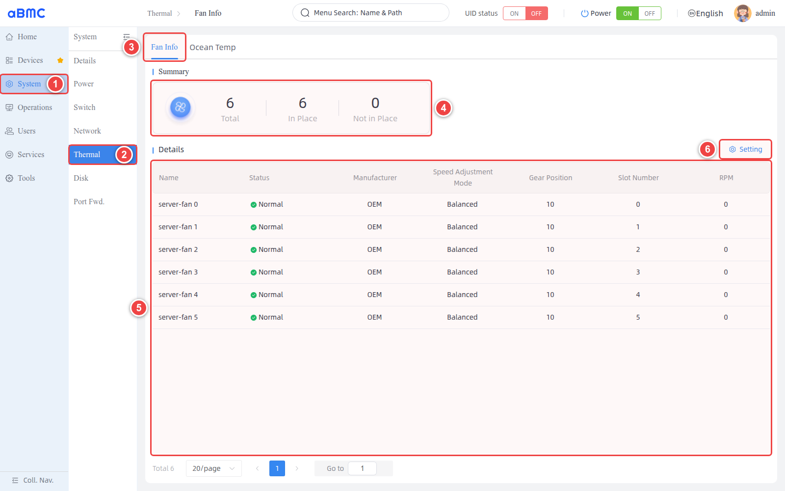
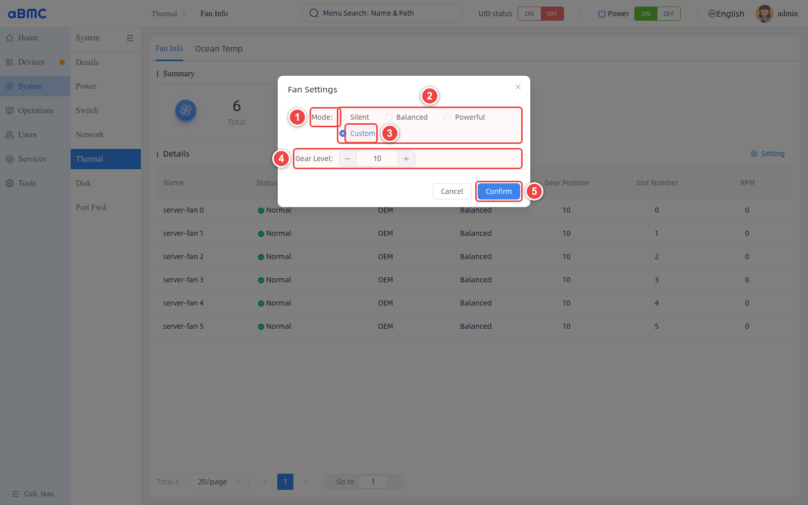
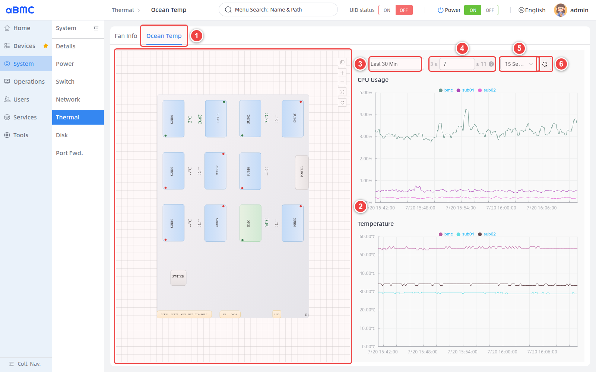

# Thermal Management

## Introduction

Thermal Management (Thermal Control) is an array-wide cooling group control system designed by aBMC for array servers. The system consists of two major modules: status monitoring and temperature control.
1. Monitoring module: collects hardware thermal information such as SOC temperatures across the array and real-time fan speeds.
2. Temperature control module: provides three preset cooling strategies—Silent, Balanced (default), and Powerful—along with customizable temperature control settings, so users can choose flexibly based on data center environment and compute load.

## Development Vision

1. Provide users with visualized temperature charts, making it easy for customers to adjust algorithm intensity based on cooling conditions.
2. The Balanced cooling strategy of the temperature control module helps effectively prevent single-point thermal runaway in array clusters.


# Feature Usage

## Setting the Fan Operating Mode

<CodeBlockTabs defaultValue="WEB">
  <CodeBlockTabsList>
    <CodeBlockTabsTrigger value="WEB">WEB</CodeBlockTabsTrigger>
    <CodeBlockTabsTrigger value="CLI">CLI</CodeBlockTabsTrigger>
    <CodeBlockTabsTrigger value="API">API</CodeBlockTabsTrigger>
  </CodeBlockTabsList>

  <CodeBlockTab value="WEB">
    ### Open the fan settings window [step]

    1. Select **System** in the left navigation bar.
    2. Select **Thermal** in the secondary navigation bar.
    3. On the **Fan Info** page, check the fan presence status under **Summary**.
    4. Check **Status** and **RPM** under **Details**.
    5. Click **Setting** to open the **Fan Settings** window.

    

    ### Select the fan operating mode [step]

    1. In **Mode**, select **Silent**, **Balanced**, **Powerful**, or **Custom**.
    2. If **Custom** is selected, enter an integer between `1–20` in **Gear Level**.
    3. After verifying the configuration, click **Confirm**.

    

    ### Confirm the configuration result [step]

    Return to **Fan Info**, confirm that **Speed Adjustment Mode** has been updated, and continue to observe whether **RPM** and board temperatures are as expected.

    ### Mode selection guidelines [step]

    | Mode | Description | Recommendation |
    | --- | --- | --- |
    | Silent | Prioritizes reducing fan noise. | Suitable for environments with low load and stable temperatures. Continue monitoring temperatures after applying. |
    | Balanced | Balances cooling capacity, power consumption, and noise. | Recommended as the common mode for typical operating scenarios. |
    | Powerful | Increases cooling capacity. | Suitable for high-load or high-temperature scenarios; noise and power consumption may increase. |
    | Custom | Controls fans using the specified Gear Level. | Use only when you understand the device cooling requirements; verify temperature and RPM after configuration. |

    <Callout title="About Custom mode" type="info">
      The valid range for Gear Level is `1–20`. The mapping between gear levels and actual RPM or cooling performance is determined by the device, and the gear value does not represent a speed percentage. After making changes, continue to monitor fan speed and board temperatures.
    </Callout>
  </CodeBlockTab>
  <CodeBlockTab value="CLI">
    ### View fan information [step]

    When `--mode` is not specified, the command returns current fan and temperature information.

    ```bash
    bmc fan --protocol http --ip <BMC_IP> --port <BMC_PORT> --user <USERNAME> --password <PASSWORD>
    ```

    ### Set a preset operating mode [step]

    Choose one of the preset modes to execute, based on cooling and noise requirements.

    **Silent mode**

    ```bash
    bmc fan --protocol http --ip <BMC_IP> --port <BMC_PORT> --user <USERNAME> --password <PASSWORD> --mode Silent
    ```

    **Balanced mode**

    ```bash
    bmc fan --protocol http --ip <BMC_IP> --port <BMC_PORT> --user <USERNAME> --password <PASSWORD> --mode Balanced
    ```

    **Powerful mode**

    ```bash
    bmc fan --protocol http --ip <BMC_IP> --port <BMC_PORT> --user <USERNAME> --password <PASSWORD> --mode Powerful
    ```

    ### Set a custom gear level [step]

    When using **Custom** mode, you must specify a gear level between `1–20` via `--level`.

    ```bash
    bmc fan --protocol http --ip <BMC_IP> --port <BMC_PORT> --user <USERNAME> --password <PASSWORD> --mode Custom --level 20
    ```

    ### Demo [step]

    The following example assumes a BMC address of 172.16.100.173, service port 443, and username admin. Replace admin with the actual password, and adjust the address, port, and account according to your deployment.

    ```bash
    # Set to Balanced mode
    bmc fan --protocol http --ip 172.16.100.173 --port 2108 --user admin --password admin --mode Balanced

    # Query the configuration result
    bmc fan --protocol http --ip 172.16.100.173 --port 2108 --user admin --password admin
    ```

    ### Parameter description [step]

    | Parameter | Required | Description |
    | --- | --- | --- |
    | `--protocol` | Yes | Request protocol, for example `http`. |
    | `--ip` | Yes | BMC management address. |
    | `--port` | Yes | BMC service port. |
    | `--user` | Yes | HTTP Basic authentication username. |
    | `--password` | Yes | HTTP Basic authentication password. |
    | `--mode` | Required when setting a mode | Valid values are `Silent`, `Balanced`, `Powerful`, or `Custom`. |
    | `--level` | Required for Custom mode | Fan gear level, in the range `1–20`. |
    | `--output-format` | No | Specifies the client output format. |

    <Callout title="Credential security" type="warn">
      Command-line arguments may be retained in shell history or process lists. Avoid using real passwords directly in shared environments, and use a secure credential delivery method appropriate for your deployment.
    </Callout>
  </CodeBlockTab>
  <CodeBlockTab value="API">

    | Operation | Method | URI |
    | --- | --- | --- |
    | Query action parameters | GET | `/redfish/v1/Chassis/bmc/FanModeActionInfo` |
    | View fan and temperature information | GET | `/redfish/v1/Chassis/bmc/Thermal` |
    | Set the fan operating mode | POST | `/redfish/v1/Chassis/bmc/Actions/FanMode.Setting` |

    <Callout title="Note" type="info">
      For detailed information about interface authentication, request parameters, response fields, and error codes, refer to the Redfish API documentation.
    </Callout>

  </CodeBlockTab>
</CodeBlockTabs>


## Viewing Thermal Monitoring Charts

<CodeBlockTabs defaultValue="WEB">
  <CodeBlockTabsList>
    <CodeBlockTabsTrigger value="WEB">
      WEB
    </CodeBlockTabsTrigger>
  </CodeBlockTabsList>

  <CodeBlockTab value="WEB">
    ### Open the temperature monitoring page [step]

    1. Select **System > Thermal** in the left navigation bar.
    2. Click **Ocean Temp** at the top of the page.
    3. Wait for the device topology, temperature data, and trend charts to finish loading.

    ### View the temperature topology [step]

    1. Check the current temperature and status indicators of each monitoring point.
    2. To adjust the view, use the topology controls to zoom, fit, or reset.

    ### Configure temperature trend parameters [step]

    1. Use **Select Time Range** to choose the historical data range, for example **Last 30 Min**.
    2. Set the data sampling **Step** within the recommended range displayed beside the input box.
    3. Select the automatic refresh interval, for example **15 Seconds**.
    4. To update the data immediately, click **Refresh**.

    

    ### Confirm the monitoring result [step]

    1. Confirm that the temperature monitoring points in the device topology are displayed correctly.
    2. Confirm that the time range and data density of the trend chart meet expectations.
    3. After a manual refresh or waiting for the automatic refresh, confirm that temperature data and status update properly.
    4. If a monitoring point shows an abnormal status or the temperature keeps rising, perform further troubleshooting in combination with fan RPM, the current operating mode, and device alarms.

    ### Temperature monitoring parameter description [step]

    | Parameter or area | Description | Usage requirements |
    | --- | --- | --- |
    | Device Topology | Displays boards, interfaces, temperature values, and status points according to the physical device layout. | Judge whether temperatures are normal in combination with device specifications, current load, and device alarms. |
    | Select Time Range | Selects the query time range for temperature trend data. | For larger time ranges, a larger sampling step is recommended. |
    | Step | Controls the sampling interval of chart data. Smaller values produce denser data points; larger values produce sparser data points. | Must stay within the system-recommended range displayed beside the input box. |
    | Refresh Interval | Controls how often the page automatically fetches the latest data. | Shorter intervals result in more frequent requests; choose based on monitoring needs. |
    | Refresh | Immediately fetches temperature and status data again. | Use a manual refresh when data has not updated for a long time. |
    | Topology Controls | Used to zoom, fit the view, or reset the topology. | Affects the page view only and does not change device state. |

    <Callout title="About the sampling step" type="info">
      Step controls the data sampling interval of the trend chart. Smaller values produce denser data points; larger values produce sparser data points. Use the recommended range provided by the page for the current time range, and avoid excessively dense data points that could affect query and rendering performance.
    </Callout>
  </CodeBlockTab>
</CodeBlockTabs>

## FAQ

### 1. Abnormal RPM display

If the fan status is **Normal** but RPM is `0`, refresh manually and observe for a while, and check device alarms to determine whether the fan has stopped or the data read failed.

### 2. Trend data too dense or too sparse

Adjust Step within the range recommended by the page. Use a smaller value for short time ranges and a larger value for long time ranges.
