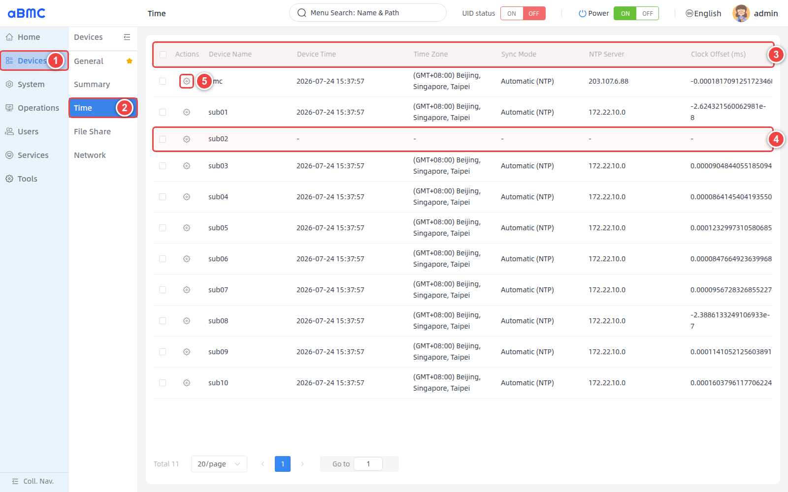
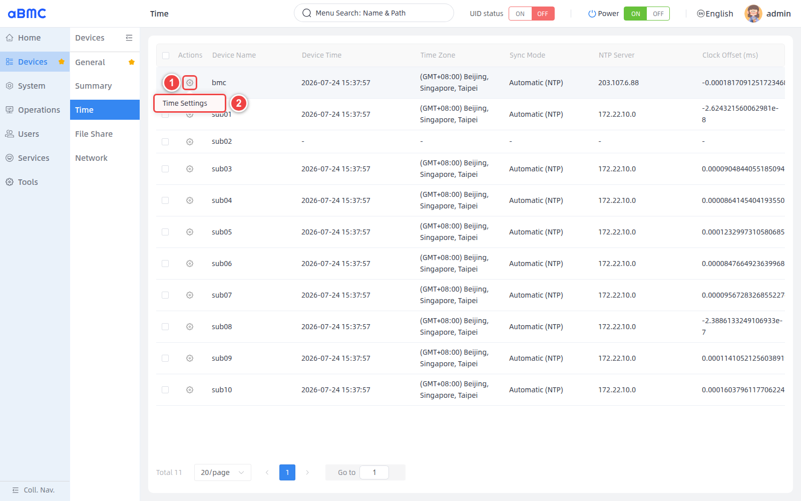
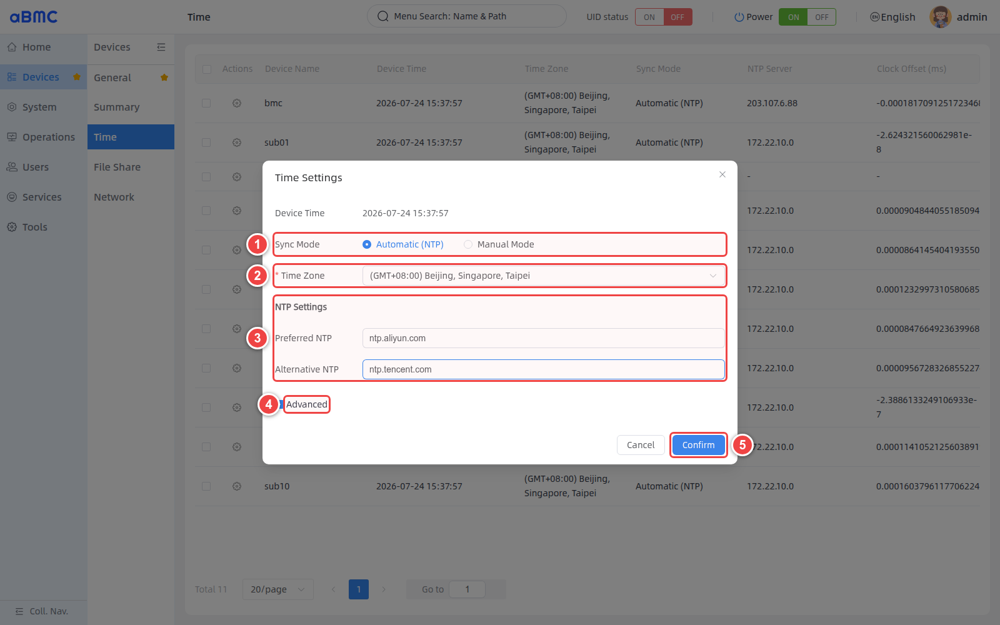
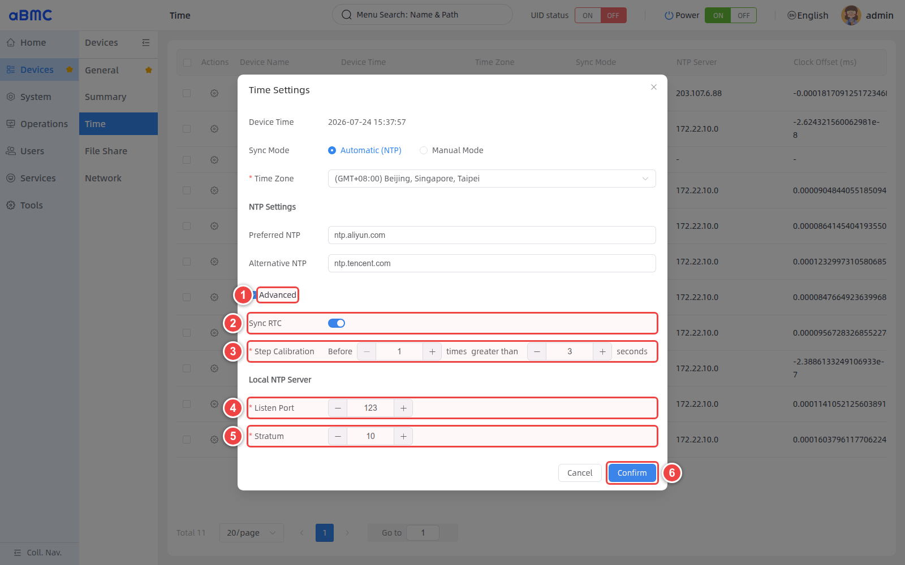
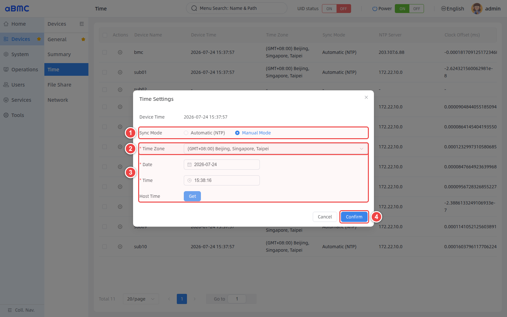
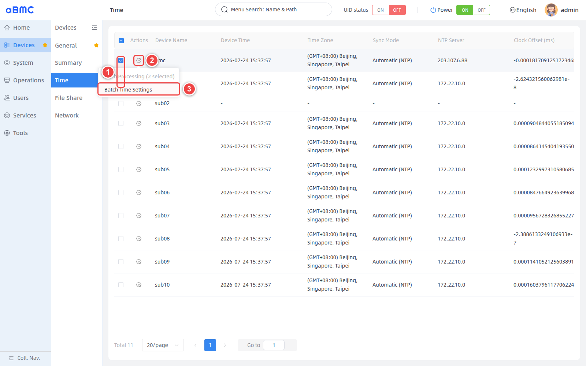
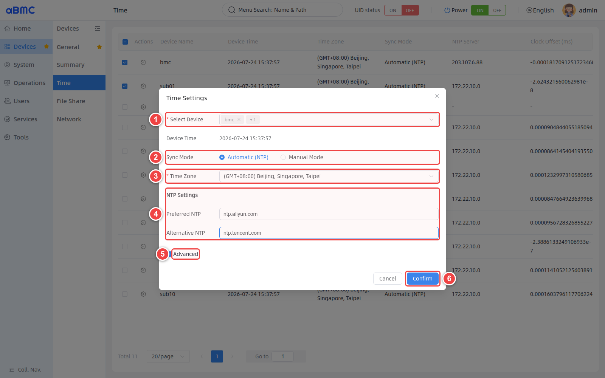

# Time Management

## Introduction

Time Management (Time Manager) is an array-wide time group control system designed by aBMC for array servers. Administrators can check device time, time zone, synchronization mode, NTP time source, and clock offset, and set the time of one or more devices via NTP or manually.

## Development Vision

1. Establish a unified time baseline for the BMC and array sub-boards, reducing the impact of time deviation on log ordering, alarm correlation, task scheduling, and fault localization.
2. Reduce the O&M cost and error probability of configuring devices one by one through a unified entry point for NTP, time zone, and bulk configuration.


# Feature Usage

## Viewing Device Time

<CodeBlockTabs defaultValue="WEB">
  <CodeBlockTabsList>
    <CodeBlockTabsTrigger value="WEB">WEB</CodeBlockTabsTrigger>
    <CodeBlockTabsTrigger value="API">API</CodeBlockTabsTrigger>
  </CodeBlockTabsList>

  <CodeBlockTab value="WEB">
    ### Open the time management page [step]

    1. Select **Devices** in the left main navigation.
    2. Select **Time** in the device menu.
    3. Wait for the device time list to finish loading, and check the time status fields displayed on the page.
    4. If the time information of a device is displayed as `-`, the current time status of that device could not be retrieved.
    5. To modify the device time, use the settings icon in the **Actions** column of the corresponding device.

    

    ### Time status field description [step]

    | Field | Description | Checkpoints |
    | --- | --- | --- |
    | Device Name | The name of the device in aBMC, for example the BMC or an array sub-board name. | Confirm the target device before operating, to avoid modifying the wrong node. |
    | Device Time | The system date and time currently returned by the device. | Should match the expected time baseline; if `-` is displayed, check the device status first. |
    | Time Zone | The time zone and GMT offset currently used by the device. | The same business cluster should generally use a unified time zone. |
    | Sync Mode | The current time synchronization method, including **Automatic (NTP)** and **Manual Mode**. | For long-term operation, an available NTP time source is recommended. |
    | NTP Server | The NTP time source currently used by the device. | Should match the planned upstream server or the BMC address. |
    | Clock Offset (ms) | The device clock offset returned by the page. | Observe whether the offset keeps growing or stays abnormal over time; do not judge based on a single sample. |

    ### Determine device time status [step]

    1. Confirm that **Device Time** is basically consistent with the current standard time.
    2. Confirm that **Time Zone** matches the device region and business specifications.
    3. When using NTP, confirm that **Sync Mode** is **Automatic (NTP)** and check that **NTP Server** is correct.
    4. Observe **Clock Offset (ms)** continuously; if the offset keeps growing, check the stability of the time source and the network quality.

    <Callout title="About status display" type="info">
      The time list shows the status most recently returned by each device. When a device is offline, communication is abnormal, or the status read fails, the related fields may be displayed as `-`. Restore the device connection first, then refresh the page to check again.
    </Callout>
  </CodeBlockTab>
  <CodeBlockTab value="API">
    | Operation | Method | URI |
    | --- | --- | --- |
    | View node time information | GET | `/redfish/v1/Systems/{{nodename}}/Oem/Firefly/TimeService` |

    <Callout title="Note" type="info">
      For detailed information about interface authentication, request parameters, response fields, and error codes, refer to the Redfish API documentation.
    </Callout>
  </CodeBlockTab>
</CodeBlockTabs>


## Setting the Time of a Single Device

<CodeBlockTabs defaultValue="WEB">
  <CodeBlockTabsList>
    <CodeBlockTabsTrigger value="WEB">WEB</CodeBlockTabsTrigger>
    <CodeBlockTabsTrigger value="API">API</CodeBlockTabsTrigger>
  </CodeBlockTabsList>

  <CodeBlockTab value="WEB">
    ### Open the time settings window [step]

    1. Click the settings icon in the **Actions** column of the target device.
    2. Select **Time Settings** to open the time settings window.

    

    ### Configure NTP automatic synchronization [step]

    1. Select **Automatic (NTP)** in **Sync Mode**.
    2. In **Time Zone**, select the time zone used in the device's region.
    3. Fill in **Preferred NTP**; if a backup time source is needed, also fill in **Alternative NTP**.
    4. To configure RTC, time calibration thresholds, or the local NTP service, expand **Advanced**.
    5. After verifying the configuration, click **Confirm**.

    

    ### NTP parameter description [step]

    | Parameter | Description | Configuration advice |
    | --- | --- | --- |
    | Device Time | The current device time, for verification before configuration only. | This field is not editable. |
    | Sync Mode | Selects automatic synchronization or manual setting. | Choose **Automatic (NTP)** for continuous time calibration. |
    | Time Zone | The time zone used by the device. | Should stay consistent with business, logging, and O&M specifications. |
    | Preferred NTP | The preferred NTP time source. | Configure an IP address or domain name that the device can access stably. |
    | Alternative NTP | The backup NTP time source. | Should be independent of the preferred time source to improve time source availability. |

    The NTP address can be an IP address or domain name accessible to the device, for example:

    ```text
    192.168.10.20
    ntp.example.com
    ```

    <Callout title="NTP network requirements" type="info">
      When using a domain name, make sure the device can resolve it correctly. Also confirm that routing and the firewall allow the device to access the NTP service; UDP port `123` usually needs to be permitted. The first synchronization may take some time to complete.
    </Callout>

    ### Configure two-level synchronization between the BMC and sub-boards [step]

    1. For the BMC, select **Automatic (NTP)** and set **Preferred NTP** to a reliable external time source.
    2. Configure the BMC's **Local NTP Server** parameter according to your site plan so that it can provide time service to the sub-boards.
    3. Return to the time list and confirm that the BMC's **NTP Server** and **Clock Offset (ms)** are normal.
    4. Open the sub-board's **Time Settings** and select **Automatic (NTP)**.
    5. Set the sub-board's **Preferred NTP** to the BMC address reachable from the sub-board management network.
    6. After saving, confirm that the sub-board's **NTP Server** points to the BMC, and observe whether the clock offset remains stable.

    <Callout title="Avoid time synchronization loops" type="warn">
      Do not configure the BMC's upstream NTP time source as one of its downstream sub-boards; otherwise a time synchronization loop may form. NTP service ports should also be permitted between the BMC and sub-boards.
    </Callout>

    ### Configure advanced NTP parameters [step]

    1. Select **Advanced** to expand the advanced parameters.
    2. Set **Sync RTC** according to device requirements.
    3. In **Step Calibration**, set the number of initial calibrations and the offset threshold.
    4. In **Listen Port**, set the listening port of the local NTP service.
    5. In **Stratum**, set the stratum level of the local NTP server.
    6. After verifying the configuration, click **Confirm**.

    

    | Parameter | Page range or default | Description |
    | --- | --- | --- |
    | Sync RTC | Enabled or disabled | Controls synchronization between the system time and the device's RTC hardware clock. |
    | Step Calibration - Before | Minimum value `1` | Specifies the first N calibrations for which step calibration judgment applies. |
    | Step Calibration - greater than | Minimum value `0` seconds | When the offset of the initial calibrations exceeds this threshold, the time may be corrected directly. |
    | Listen Port | `1–65535`, page default `123` | The listening port used by the local NTP service. |
    | Stratum | `1–16`, page default `10` | The stratum of the local NTP server; a smaller value indicates a time source closer to the reference clock. |

    <Callout title="Advanced parameter guidelines" type="warn">
      Advanced parameters affect how the device calibrates time and the NTP service it provides to downstream devices. Modify them only when you understand the on-site time synchronization topology and device requirements, and validate on a small number of devices first.
    </Callout>

    ### Manually set date and time [step]

    1. Select **Manual Mode** in **Sync Mode**.
    2. In **Time Zone**, select the time zone used by the device.
    3. Set **Date** and **Time**; to use the current management host time, click **Get**.
    4. After checking the date, time, and time zone, click **Confirm**.

    

    <Callout title="About Manual mode" type="warn">
      Manual mode only sets the current time and cannot continuously correct device clock drift. After switching to Manual mode, the device no longer relies on the configured NTP time source; when network conditions permit, NTP automatic synchronization is recommended.
    </Callout>

    ### Confirm the single-device configuration result [step]

    1. Return to the **Time** list and confirm that the target device's **Device Time** and **Time Zone** have been updated.
    2. Confirm that **Sync Mode** matches the configuration.
    3. When using NTP, confirm that **NTP Server** shows the expected time source.
    4. Refresh the page after waiting for a while, and confirm that **Clock Offset (ms)** does not keep growing.
  </CodeBlockTab>

  <CodeBlockTab value="API">
    | Operation | Method | URI |
    | --- | --- | --- |
    | Query action parameters | GET | `/redfish/v1/Systems/{{nodename}}/Oem/Firefly/TimeService/Actions/ConfigureTimeServiceActionInfo` |
    | Set node time service | POST | `/redfish/v1/Systems/{{nodename}}/Oem/Firefly/TimeService/Actions/ConfigueTimeService` |


    <Callout title="Note" type="info">
      For detailed information about interface authentication, request parameters, response fields, and error codes, refer to the Redfish API documentation.
    </Callout>
  </CodeBlockTab>
</CodeBlockTabs>


## Setting Device Time in Bulk

<CodeBlockTabs defaultValue="WEB">
  <CodeBlockTabsList>
    <CodeBlockTabsTrigger value="WEB">WEB</CodeBlockTabsTrigger>
  </CodeBlockTabsList>

  <CodeBlockTab value="WEB">
    ### Open bulk time settings [step]

    1. In the device list, select at least two devices that need to use the same time configuration.
    2. Click the settings icon in the **Actions** column of any selected device.
    3. Select **Batch Time Settings**.

    

    ### Deliver bulk NTP configuration [step]

    1. In **Select Device**, verify the target devices and the number of selected devices.
    2. In **Sync Mode**, select the synchronization method shared by all target devices.
    3. In **Time Zone**, select a unified time zone.
    4. When using **Automatic (NTP)**, fill in the preferred and alternative NTP time sources.
    5. To apply the same advanced parameters, expand **Advanced**.
    6. After verifying all configurations, click **Confirm**.

    

    When using **Manual Mode** for bulk configuration, the window displays **Date**, **Time**, and **Host Time**. The settings are the same as in single-device Manual mode; after submission, the same date, time, and time zone are delivered to all selected devices.

    <Callout title="Bulk configuration scope" type="warn">
      A bulk operation overwrites the time policy of all selected devices. Before executing, verify the devices and count in **Select Device**, and do not mix devices that require different time sources, time zones, or advanced parameters.
    </Callout>

    ### Confirm the bulk configuration result [step]

    1. Return to the **Time** list and verify **Sync Mode** and **Time Zone** for each device.
    2. When using NTP, check that **NTP Server** is the expected time source for each device.
    3. Check whether any device still displays `-` or retains the old configuration.
    4. For devices where the configuration did not take effect, open **Time Settings** individually, and check the device connection status and whether the fields are editable.
  </CodeBlockTab>
</CodeBlockTabs>


## FAQ

### 1. Device time or time zone displayed as `-`

The device may be offline, not connected, or its status read failed. First confirm the device running status and the network connection between aBMC and the device, then refresh the time page after recovery.

### 2. Some devices not updated after bulk configuration

Some devices may be offline, have different capabilities, or be temporarily unable to modify time configuration. Open the **Time Settings** of the failed devices individually, check the status and parameters, and set them again.

### 3. Sub-board cannot synchronize time through the BMC

Confirm that the BMC has completed synchronization with the upstream time source, and check the BMC's local NTP listen port, Stratum, the BMC address used by the sub-board, and the routing and firewall policies between them.

### 4. BMC cannot synchronize with a domain-name time source

Check DNS resolution and ping the domain name to confirm network connectivity. If it fails, test with an IP address instead.
