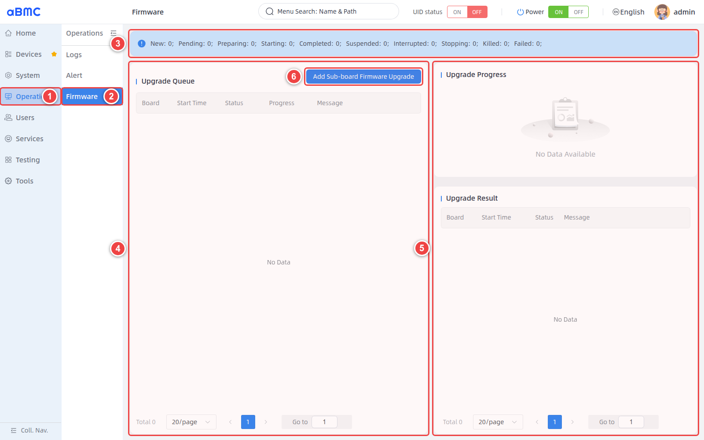
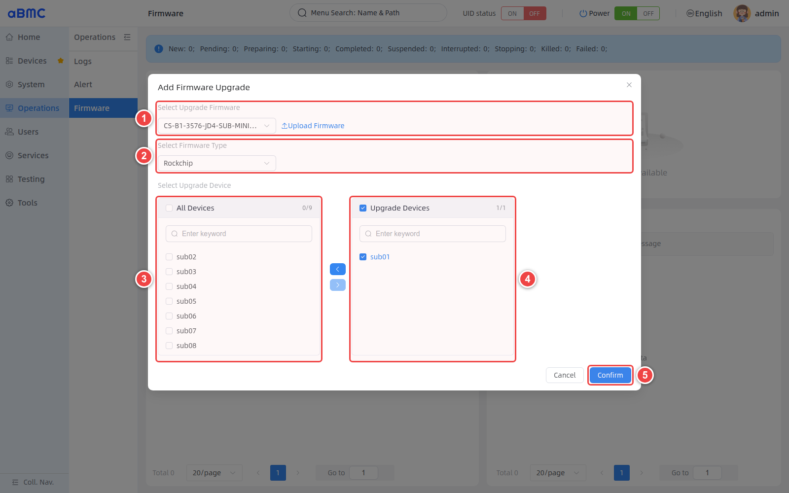
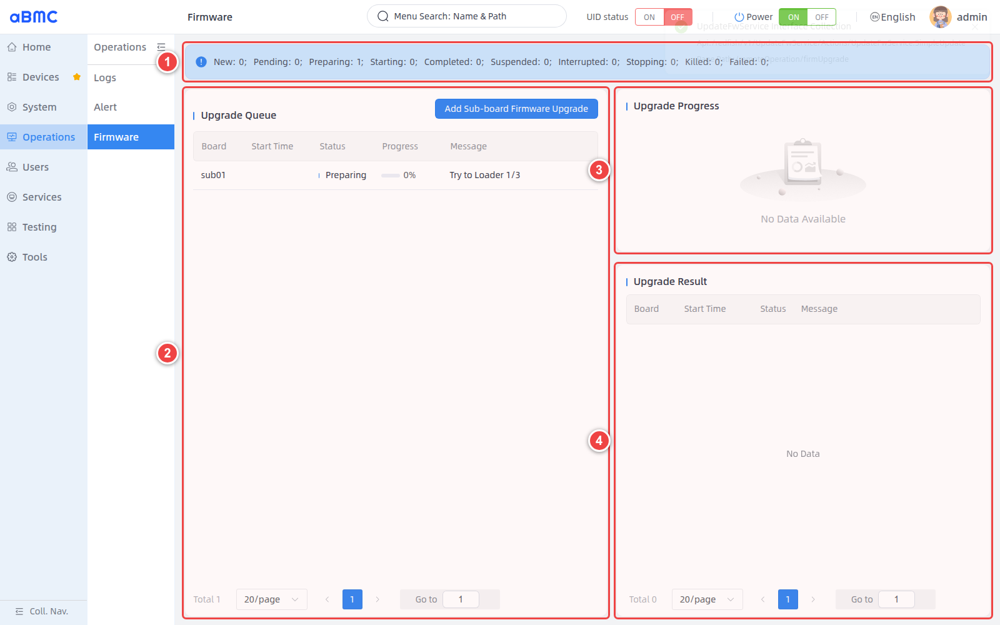
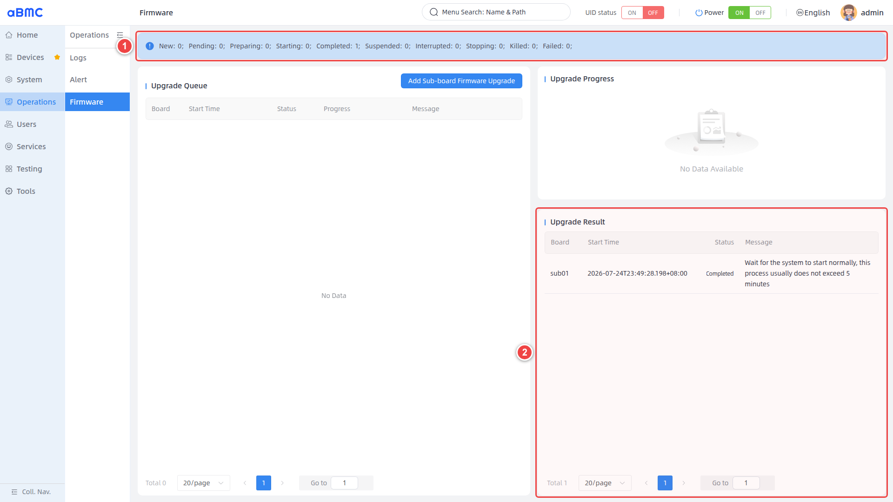

# Firmware Upgrade


## Introduction

Firmware Upgrade is a unified remote firmware O&M service that array servers provide for internal sub-nodes. It integrates three core capabilities—firmware package upload, bulk node upgrade, and full-process task monitoring—supporting sub-node firmware version iteration, downgrade rollback, and standardized bulk deployment.
Firmware upgrade.
1. Firmware upload: supports two interaction channels, the web management interface and the CLI, to upload firmware image packages to the cluster management node for unified storage.
2. Bulk upgrade: for scenarios such as outdated factory firmware versions or business adaptation requiring a specific firmware, users can obtain standard firmware packages from official channels, or compile customized firmware independently based on the open-source SDK. After uploading the image, select the target sub-nodes to deliver the upgrade in bulk, flexibly completing firmware version switching and downgrade rollback.
3. Upgrade task monitoring: visually displays the real-time status of all upgrade tasks, including per-node upgrade progress and global success/failure node statistics, and fully retains all upgrade logs for fault tracing.


## Development Vision

1. Provide lightweight remote sub-node firmware delivery capability. O&M personnel can complete firmware upload and bulk deployment through web pages or terminal commands without physically touching the servers on-site, simplifying low-level hardware O&M workload and letting R&D and O&M personnel focus on upper-layer business development.
Build a standardized, efficient, and secure on-site service delivery pipeline: users are recommended to use official original firmware packages together with the official repacking tool to integrate their self-developed business programs with the underlying firmware, generating an all-in-one customized firmware image with built-in business applications. Leveraging the array server bulk upgrade capability, all sub-nodes in the cluster can be deployed synchronously in one pass. The R&D side can complete full firmware debugging and verification in the laboratory before on-site implementation. The core values are as follows:
1.1 Greatly shortens the on-site deployment cycle and reduces manual on-site implementation costs;
1.2 Unifies the laboratory debugging environment and the on-site production environment, eliminating adaptation faults caused by version inconsistency;
1.3 Protects customer business code security at the root. Under the traditional outsourced delivery model, customers must hand over business programs to the device vendor; to prevent core code leakage, they often develop complex network/local key activation mechanisms, which increases both customer R&D costs and vendor production process management complexity. With the official repacking tool, users can independently complete the fusion of firmware and business software locally, never exposing core source code to third parties throughout the process, completely eliminating the risk of business asset leakage.

# Feature Usage

## Upgrading Array Sub-Node Firmware

<CodeBlockTabs defaultValue="WEB">
  <CodeBlockTabsList>
    <CodeBlockTabsTrigger value="WEB">WEB</CodeBlockTabsTrigger>
    <CodeBlockTabsTrigger value="CLI">CLI</CodeBlockTabsTrigger>
    <CodeBlockTabsTrigger value="API">API</CodeBlockTabsTrigger>
  </CodeBlockTabsList>

  <CodeBlockTab value="WEB">
    <Callout title="Confirm before upgrading" type="warn">
      Firmware upgrade rewrites the underlying software of the target array sub-node and may trigger a device restart. Before executing, you must confirm that the firmware package, firmware type, device model, and hardware version match, and that power supply and the management network are stable. During the upgrade, do not cut power, restart devices, or submit duplicate tasks.
    </Callout>

    ### Open the firmware upgrade page [step]

    1. Select **Operations** in the left main navigation.
    2. Select **Firmware** in the secondary navigation.
    3. At the top of the page, check the number of tasks in each status.
    4. In **Upgrade Queue**, check the upgrade tasks being processed.
    5. In **Upgrade Progress** and **Upgrade Result**, check the execution progress and final results.
    6. Click **Add Sub-board Firmware Upgrade** to open the upgrade configuration window.

    

    <Callout title="About empty lists" type="info">
      When the page displays **No Data** or **No Data Available**, it means there are currently no corresponding queue, progress, or result records; it does not indicate a page loading failure.
    </Callout>

    ### Configure an upgrade task [step]

    1. In **Select Upgrade Firmware**, select the firmware matching the target devices; if the required firmware is not in the list, click **Upload Firmware** to upload it.
    2. In **Select Firmware Type**, select the platform type corresponding to the firmware.
    3. In the device list on the left, select the target devices, and use the right arrow to move them into the list on the right.
    4. In **Upgrade Devices**, verify the target devices one by one, and remove nodes that should not participate in the upgrade.
    5. After re-checking the firmware, type, and target devices, click **Confirm** to submit the task.

    

    <Callout title="Real-device upgrade example" type="info">
      In this real-device operation, **CS-B1-3576-JD4-SUB-MINIMAL_Debian_debug_250428.img** was selected, the firmware type was **Rockchip**, and the only target device was **sub01**. Before submission, the page displayed **Upgrade Devices 1/1**, with no other sub-boards selected.
    </Callout>

    ### Upgrade parameter description [step]

    | Parameter or area | Description | Usage requirements |
    | --- | --- | --- |
    | Select Upgrade Firmware | Selects a firmware image already uploaded to aBMC. | Verify the complete file name, applicable model, hardware version, and release notes. |
    | Upload Firmware | Opens the firmware upload window. | Upload only firmware from trusted sources that passes integrity verification. |
    | Select Firmware Type | Selects the firmware type corresponding to the target hardware platform. | Must match the firmware package and the target devices, for example Rockchip. |
    | All Devices | Selects all devices in the left list. | Usable only when all devices apply to the same firmware. |
    | Upgrade Devices | Shows the devices actually upgraded by this task. | Verify the device count and names before submitting. |
    | Confirm | Creates and executes the upgrade task. | Clicking triggers a real upgrade operation; do not submit repeatedly. |

    ### Monitor the upgrade process [step]

    1. In the status summary at the top, confirm that the task has entered **Preparing** or **Starting**.
    2. In **Upgrade Queue**, confirm that the **Board** is the device planned for upgrade.
    3. Keep observing **Status**, **Progress**, and **Message**, and confirm the progress grows normally.
    4. While the task is running, do not power off devices, restart the target devices, or create the same task again.

    

    In this real-device upgrade, the task passed through **Preparing** and **Starting** in turn. When the task entered **Preparing**, the page displayed **Try to Loader 1/3**; after entering **Starting**, the progress grew continuously from 0% to 96%, and then changed to **Completed**.

    ### Upgrade status description [step]

    | Status | Description | Handling suggestion |
    | --- | --- | --- |
    | New | The upgrade task has been created and usually quickly enters **Pending**. | Confirm the target device and firmware information are correct. |
    | Pending | The task has entered the scheduling queue and is waiting for execution or required resources. | Keep waiting; if there is no change for a long time, check other upgrade tasks and resource usage. |
    | Preparing | Checking the firmware, preparing the upgrade environment, and putting the target device into upgrade mode. | Keep power and network stable; do not submit duplicate upgrade tasks. |
    | Starting | Firmware flashing to the target device has started. | Keep observing **Progress** and **Message**; do not restart or cut power. |
    | Completed | The firmware flashing process has finished successfully, and the task progress is 100%. | Keep waiting for the device to start, and verify online status, firmware information, alarms, and business functions. |
    | Failed | The upgrade task failed. | Check firmware compatibility, device status, network, power supply, and error logs. |

    ### Confirm the upgrade result [step]

    1. Confirm that the **Completed** count at the top of the page has increased, and the **Failed** count has not.
    2. In **Upgrade Result**, confirm the target **Board**, **Start Time**, and **Status**.
    3. Read **Message**. If the page prompts you to wait for the system to start, keep waiting as prompted; do not immediately cut power or repeat the upgrade.
    4. After the device recovers, check the power status, system status, firmware version, alarms, logs, and key business functions.

    

    The results of this real-device upgrade are as follows:

    | Check item | Actual result |
    | --- | --- |
    | Target device | sub01 |
    | Task start time | 2026-07-24T23:49:28.198+08:00 |
    | Final status | Completed |
    | Result message | Wait for the system to start normally, this process usually does not exceed 5 minutes |
    | PowerState | On |
    | StateSoc | Ready |
    | ComputerSystem Health | Critical |
    | Operating system | Debian GNU/Linux 12 (bookworm) |
    | KernelVersion | 6.1.84 |
    | Firmware date | 2025-04-28T12:44:54.000Z |

    <Callout title="Verify the device even after Completed" type="warn">
      **Completed** means the upgrade task flow has finished; it does not mean the target device and its services have immediately recovered. In this real-device verification, sub01 had recovered to **PowerState: On** and **StateSoc: Ready**, but **ComputerSystem Health** was still **Critical**. Continue checking device alarms and logs; do not judge overall device health solely by task completion and system reachability.
    </Callout>

    ### Upgrade devices in bulk [step]

    1. Perform bulk upgrades only when the model, hardware version, and target firmware of multiple devices are completely identical.
    2. Use the search box to select devices one by one, or select **All Devices** after confirming all devices apply.
    3. After moving devices into **Upgrade Devices**, verify the device count and names.
    4. After submission, check the status of each device in the queue and result areas; do not judge all devices as successful based only on overall progress.

    <Callout title="Validate on a single node first" type="info">
      Before a bulk upgrade, select one non-critical node for real-device validation. Expand the upgrade scope only after confirming firmware compatibility, normal device startup, and passing business verification.
    </Callout>
  </CodeBlockTab>

  <CodeBlockTab value="CLI">
    <Callout title="Confirm before upgrading" type="warn">
      `bmc upgrade update` immediately submits a real firmware upgrade task to the specified sub-node. Before executing, verify the firmware file name, platform type, and target node, and ensure power supply and the management network are stable.
    </Callout>

    ### Upload firmware [step]

    After specifying a local firmware path, the CLI automatically calculates the file MD5, uploads it in 10 MiB chunks, and merges the firmware after all chunks are uploaded.

    ```bash
    bmc upgrade upload --protocol <PROTOCOL> --ip <BMC_IP> --port <BMC_PORT> --user <USERNAME> --password <PASSWORD> --image <LOCAL_IMAGE_PATH>
    ```

    <Callout title="About the upload command" type="info">
      The CLI help example may show `bmc upload`, but the actual available command is `bmc upgrade upload`.
    </Callout>

    ### View uploaded firmware [step]

    Before creating an upgrade task, confirm the firmware file has been completely saved in aBMC.

    ```bash
    bmc upgrade image --protocol <PROTOCOL> --ip <BMC_IP> --port <BMC_PORT> --user <USERNAME> --password <PASSWORD>
    ```

    ### Create a single-node upgrade task [step]

    Specify the target node with `--core` and the firmware platform with `--platform`; `--image` takes only the file name of an uploaded firmware.

    ```bash
    bmc upgrade update --protocol <PROTOCOL> --ip <BMC_IP> --port <BMC_PORT> --user <USERNAME> --password <PASSWORD> --core <NODE_NAME> --platform <PLATFORM> --image <IMAGE_NAME>
    ```

    ### Create a bulk upgrade task [step]

    Separate multiple node names with commas. A bulk upgrade can be executed only when all nodes match the firmware and platform.

    ```bash
    bmc upgrade update --protocol <PROTOCOL> --ip <BMC_IP> --port <BMC_PORT> --user <USERNAME> --password <PASSWORD> --core <NODE_1>,<NODE_2> --platform <PLATFORM> --image <IMAGE_NAME>
    ```

    ### Query upgrade progress [step]

    This command returns the task status, progress, and messages of all nodes. After creating a task, keep querying until the target node enters **Completed** or **Failed**.

    ```bash
    bmc upgrade progress --protocol <PROTOCOL> --ip <BMC_IP> --port <BMC_PORT> --user <USERNAME> --password <PASSWORD>
    ```

    ### Demo [step]

    Using a real device with address `172.16.100.173`, port `443`, and account `admin` as an example:

    ```bash
    # View the firmware list on the real device
    bmc upgrade image --protocol http --ip 172.16.100.173 --port 443 --user admin --password admin
    # Upgrade a Rockchip node
    bmc upgrade update --protocol http --ip 172.16.100.173 --port 443 --user admin --password admin --core sub01 --platform Rockchip --image CS-B1-3576-JD4-SUB-MINIMAL_Debian_debug_250428.img
    # Query the upgrade result on the real device
    bmc upgrade progress --protocol http --ip 172.16.100.173 --port 443 --user admin --password admin
    ```

    <Callout title="Credential security" type="warn">
      Command-line arguments may be retained in shell history or process lists. Avoid using real passwords directly in shared environments, and use a secure credential delivery method appropriate for your deployment.
    </Callout>
  </CodeBlockTab>

  <CodeBlockTab value="API">
    <Callout title="Upgrade operation risks" type="warn">
      Calling `UpdateFwService.SimpleUpdate` immediately creates a real upgrade task. Before calling, confirm the firmware, platform, and target node match, and validate on a single non-critical node first.
    </Callout>

    | Operation | Method | URI |
    | --- | --- | --- |
    | Query upgrade action parameters | GET | `/redfish/v1/UpdateFwService/Actions/UpdateFwServiceActionInfo` |
    | View uploaded firmware | GET | `/redfish/v1/UpdateFwService/LocalFirmwareLists` |
    | Delete uploaded firmware | DELETE | `/redfish/v1/UpdateFwService/LocalFirmwareLists/{FirmwareID}` |
    | Upload a firmware chunk | POST | `/redfish/v1/UpdateFwService/Actions/UpdateFwService.UploadFirmwareChunck` |
    | Merge firmware chunks | POST | `/redfish/v1/UpdateFwService/Actions/UpdateFwService.FirmwareChunckMerage` |
    | Create a sub-node upgrade task | POST | `/redfish/v1/UpdateFwService/Actions/UpdateFwService.SimpleUpdate` |
    | Query upgrade progress of all nodes | GET | `/redfish/v1/UpdateFwService/UpdateFwServiceTasksLists` |
    | Query upgrade details of a single node | GET | `/redfish/v1/UpdateFwService/{ComputerSystemId}/Actions/Oem/Firefly/UpdateFwService.ServiceInfo` |

    <Callout title="Note" type="info">
      For detailed information about interface authentication, permissions, complete request definitions, and error codes, refer to the Redfish API documentation.
    </Callout>
  </CodeBlockTab>
</CodeBlockTabs>


## FAQ

### 1. The target firmware is not in Select Upgrade Firmware

Confirm whether the firmware has been uploaded and recognized by the page. If no firmware is available, click **Upload Firmware** to upload a trusted image matching the device, then reopen the upgrade window.

### 2. The task stays in Pending or Preparing for a long time

Check whether other tasks exist, whether the target device can enter upgrade mode, and whether the management network is stable; also check **Message** and related logs. Do not resubmit before the cause is confirmed.

## Firmware Preprocessing

`firmware-kits` is used to preprocess BM1684 and RK3588 firmware packages before a formal firmware upgrade. It can unpack the original firmware according to a specified flow, adjust the sizes of partitions such as ROOTFS/DATA/CUSTOM, mount the rootfs for manual modification of the system content, and repack the firmware into a deliverable or upgradable package after the modifications are complete.

This tool applies to scenarios where firmware content must be customized before upgrading, such as expanding partitions, preloading files, adjusting rootfs configuration, or generating TFTP or SD card upgrade packages. Ordinary firmware upgrades should still prefer the upgrade management feature described earlier on this page; use `firmware-kits` only when the firmware must first be modified or repacked.

The following describes how to use `firmware-kits` to unpack, modify, and repack BM1684 and RK3588 firmware. Follow the steps strictly.

All commands are executed in the `firmware-kits` directory.

### 1. Preparation

#### 1.1 Operating system requirements

An Ubuntu 20.04/22.04 x86_64 host is recommended.

#### 1.2 Install dependencies

```bash
sudo apt-get update
sudo apt-get install -y u-boot-tools qemu-user-static p7zip-full unzip e2fsprogs
```

#### 1.3 Check the toolkit directory

Enter the toolkit directory:

```bash
cd firmware-kits
```

Confirm the directory contains at least the following:

```text
firmware-kits
flow/
scripts/
tools/
bin/
```

Confirm the main program is executable:

```bash
./firmware-kits --help
```

Firmware processing performs mounting, chroot, file system adjustments, and repacking, so `sudo` is required for formal operations.

### 2. Basic commands

Process a firmware from scratch:

```bash
sudo ./firmware-kits run -l <flow file> -f <firmware file>
```

Continue after the flow pauses:

```bash
sudo ./firmware-kits resume
```

Parameter description:

| Parameter | Description |
| ---- | ---- |
| `run` | Executes a firmware processing flow from scratch |
| `resume` | Continues from the position of the last pause |
| `-l` | Specifies the flow file, for example `flow/bm1684_tftp_data.yaml` |
| `-f` | Specifies the original firmware file |
| `-o` | Advanced parameter, appended and passed to the processing script; do not use unless specifically instructed |

The tool automatically pauses when it reaches a point that requires manual handling, and prompts the next command to execute. After the manual operation is complete, run `sudo ./firmware-kits resume` to continue.

### 3. Important notes

1. Do not delete `out/`, `.firmware-kits_state.json`, or `tools/.env` while the flow is paused.
2. Do not shut down the host after the rootfs is mounted, unless unmounting has been confirmed complete.
3. Process only one firmware flow at a time; do not run multiple `firmware-kits run/resume` in multiple terminals simultaneously.
4. The output directory is `out/`. After confirming the artifacts are no longer needed, use `sudo rm -rf out/` to free space.
5. If the flow prompts that an interrupted record exists, run `sudo ./firmware-kits resume` first; do not directly `run` again.

### 4. BM1684 Firmware Operations

#### 4.1 Input files

BM1684 uses zip firmware packages, for example:

```text
Public-All-1684-Ubuntu2004-Sdk2309LTS_SP5-Build20260522.zip
```

Put the firmware file into the `firmware-kits` directory, then execute the subsequent commands.

#### 4.2 Select the output type and flow

BM1684 has multiple flows. The differences between flows are mainly the output type, whether BOOT/DATA partitions are processed, and whether the CUSTOM partition is processed.

| Flow file | Applicable scenario | Output artifact | Pause points | Key parameters |
| ---- | ---- | ---- | ---- | ---- |
| `flow/bm1684.yaml` | Basic SD card upgrade package; processes ROOTFS only | `out/bm1684/ubuntu20/update/sdcard-YYYY-MM-DD.zip` | ROOTFS partition size, rootfs content modification | Packaging parameter `sdcard` |
| `flow/bm1684_tftp.yaml` | Basic TFTP upgrade package; processes ROOTFS only | `out/bm1684/ubuntu20/update/tftp-YYYY-MM-DD.zip` | ROOTFS partition size, rootfs content modification | Packaging parameter `tftp` |
| `flow/bm1684_sdcard_data.yaml` | SD card upgrade package; processes ROOTFS, BOOT, DATA | `out/bm1684/ubuntu20/update/sdcard-YYYY-MM-DD.zip` | ROOTFS partition size, DATA partition size, rootfs content modification | Packaging parameter `sdcard`; BOOT processed automatically |
| `flow/bm1684_tftp_data.yaml` | TFTP upgrade package; processes ROOTFS, BOOT, DATA | `out/bm1684/ubuntu20/update/tftp-YYYY-MM-DD.zip` | ROOTFS partition size, DATA partition size, rootfs content modification | Packaging parameter `tftp`; BOOT processed automatically |
| `flow/bm1684_custom_overlay.yaml` | TFTP upgrade package; adds or expands CUSTOM, and binds CUSTOM/DATA to rootfs | `out/bm1684/ubuntu20/update/tftp-YYYY-MM-DD.zip` | ROOTFS partition size, CUSTOM partition size, DATA partition size, rootfs content modification | Default CUSTOM bind size is `20`; packaging parameter `tftp` |
| `flow/bm1684_custom_ro.yaml` | TFTP upgrade package; CUSTOM processed with the read-only scheme, and BOOT/DATA also processed | `out/bm1684/ubuntu20/update/tftp-YYYY-MM-DD.zip` | ROOTFS partition size, DATA partition size, rootfs content modification | Packaging parameter `tftp custom_ro`; CUSTOM/BOOT processed automatically |

Notes:

1. The input firmware is always a BM1684 zip package, for example `Public-All-1684-Ubuntu2004-Sdk2309LTS_SP5-Build20260522.zip`.
2. At the `ROOTFS partition size` pause point, you can view or expand ROOTFS.
3. At the `DATA partition size` pause point, you can view or expand DATA. This appears only in flows with `_data` or custom.
4. The `CUSTOM partition size` pause point appears only in `bm1684_custom_overlay.yaml`.
5. If a pause point requires no modification, simply run `sudo ./firmware-kits resume`.

Common command examples:

Generate a TFTP upgrade package, processing ROOTFS/BOOT/DATA:

```bash
sudo ./firmware-kits run -l flow/bm1684_tftp_data.yaml -f ./Public-All-1684-Ubuntu2004-Sdk2309LTS_SP5-Build20260522.zip
```

Generate an SD card upgrade package, processing ROOTFS/BOOT/DATA:

```bash
sudo ./firmware-kits run -l flow/bm1684_sdcard_data.yaml -f ./Public-All-1684-Ubuntu2004-Sdk2309LTS_SP5-Build20260522.zip
```

Process ROOTFS only and generate a TFTP upgrade package:

```bash
sudo ./firmware-kits run -l flow/bm1684_tftp.yaml -f ./Public-All-1684-Ubuntu2004-Sdk2309LTS_SP5-Build20260522.zip
```

Process ROOTFS only and generate an SD card upgrade package:

```bash
sudo ./firmware-kits run -l flow/bm1684.yaml -f ./Public-All-1684-Ubuntu2004-Sdk2309LTS_SP5-Build20260522.zip
```

If there is no special requirement, execute the flow specified by the delivery personnel.

#### 4.3 First pause: modify the ROOTFS partition size

The program displays information similar to:

```text
[Step 3/13] Modify the root file system size
Firmware processing is paused. After completing the manual operation above, enter `sudo ./firmware-kits resume` to continue.
```

View the current ROOTFS size:

```bash
sudo ./tools/chroot-p-bm1684.sh -p ROOTFS -r
```

To expand, for example to 4000 MB:

```bash
sudo ./tools/chroot-p-bm1684.sh -p ROOTFS -w 4000
```

If the size does not need to be changed, continue directly:

```bash
sudo ./firmware-kits resume
```

If the size has been modified, run the same continue command:

```bash
sudo ./firmware-kits resume
```

#### 4.4 Second pause: modify the DATA partition size

The program displays information similar to:

```text
[Step 7/13] Modify the DATA partition size
Firmware processing is paused. After completing the manual operation above, enter `sudo ./firmware-kits resume` to continue.
```

View the current DATA size:

```bash
sudo ./tools/chroot-p-bm1684.sh -p DATA -r
```

To expand, for example to 6000 MB:

```bash
sudo ./tools/chroot-p-bm1684.sh -p DATA -w 6000
```

If the size does not need to be changed, continue directly:

```bash
sudo ./firmware-kits resume
```

#### 4.5 Third pause: modify the rootfs content

The program displays information similar to:

```text
[Step 9/13] Modify the root file system content
Firmware processing is paused. After completing the manual operation above, enter `sudo ./firmware-kits resume` to continue.
```

Execute a command inside the rootfs:

```bash
sudo ./tools/chroot-e.sh 'apt-get update'
```

Example of installing a package:

```bash
sudo ./tools/chroot-e.sh 'apt-get install -y figlet'
```

Copy a local file into the rootfs, for example copying `a.txt` from the current directory to `/home/` of the target system:

```bash
sudo ./tools/chroot-c.sh -s ./a.txt -d /home/
```

Notes:

| Operation | Command |
| ---- | ---- |
| Execute a command inside the rootfs | `sudo ./tools/chroot-e.sh 'COMMAND'` |
| Copy a file or directory into the rootfs | `sudo ./tools/chroot-c.sh -s <local path> -d <target path inside rootfs>` |

After the modifications, continue:

```bash
sudo ./firmware-kits resume
```

The program then automatically unmounts DATA, BOOT, and ROOTFS, and repacks the firmware.

#### 4.6 BM1684 output files

TFTP flow output:

```text
out/bm1684/ubuntu20/update/tftp-YYYY-MM-DD.zip
```

SD card flow output:

```text
out/bm1684/ubuntu20/update/sdcard-YYYY-MM-DD.zip
```

Actual verification example:

```text
out/bm1684/ubuntu20/update/tftp-2026-07-28.zip
```

The output files may be owned by root. Use `sudo` if permissions are insufficient when copying or deleting.

### 5. RK3588 Firmware Operations

#### 5.1 Input files

RK3588 supports directly using `.7z`, `.zip`, or `.img` as input. For example:

```text
CS-B1-N10-SUB-3588JD4_Debian12-Xfce-r1275_debug_260710.7z
```

The tool automatically extracts the `.img` from `.7z/.zip` and continues processing.

#### 5.2 Start processing

```bash
sudo ./firmware-kits run -l flow/rk3588.yaml -f ./CS-B1-N10-SUB-3588JD4_Debian12-Xfce-r1275_debug_260710.7z
```

#### 5.3 First pause: modify the ROOTFS partition size

The program displays information similar to:

```text
[Step 3/7] Modify the root file system size
Firmware processing is paused. After completing the manual operation above, enter `sudo ./firmware-kits resume` to continue.
```

View the current rootfs size:

```bash
sudo ./tools/chroot-p-rk3588.sh -p rootfs -r
```

To expand, for example to 4000 MB:

```bash
sudo ./tools/chroot-p-rk3588.sh -p rootfs -w 4000
```

If the size does not need to be changed, continue directly:

```bash
sudo ./firmware-kits resume
```

#### 5.4 Second pause: modify the rootfs content

The program displays information similar to:

```text
[Step 5/7] Modify the root file system content
Firmware processing is paused. After completing the manual operation above, enter `sudo ./firmware-kits resume` to continue.
```

Execute a command inside the rootfs:

```bash
sudo ./tools/chroot-e.sh 'apt-get update'
```

Copy a file into the rootfs:

```bash
sudo ./tools/chroot-c.sh -s ./a.txt -d /home/
```

After the modifications, continue:

```bash
sudo ./firmware-kits resume
```

The program then automatically unmounts the rootfs and repacks the RK3588 firmware.

#### 5.5 RK3588 output files

Output file location:

```text
out/rk3588/ubuntu20/update/rockdev/rk3588-YYYY-MM-DD.img
```

Actual verification example:

```text
out/rk3588/ubuntu20/update/rockdev/rk3588-2026-07-28.img
```

The output files may be owned by root. Use `sudo` if permissions are insufficient when copying or deleting.

### 6. Interrupted run recovery

If you see a prompt similar to the following when executing `run`:

```text
An interrupted record was found. Use `sudo ./firmware-kits resume` to continue.
```

it means the previous flow did not complete. Run:

```bash
sudo ./firmware-kits resume
```

If the previous flow is confirmed to be abandoned, clean up the state and output:

```bash
sudo rm -f .firmware-kits_state.json tools/.env
sudo rm -rf out/
```

After cleanup, `run` can be executed again.

### 7. Execution records

Two actual execution records are provided with the package; download them to view the complete operation process:

- [Download the BM1684 actual execution record](/docs-assets/server-docs/aBMC_img/v3.0/firmware-kits/bm1684-run-2026-07-28.zip)
- [Download the RK3588 actual execution record](/docs-assets/server-docs/aBMC_img/v3.0/firmware-kits/rk3588-run-2026-07-28.zip)

The logs retain only the firmware processing commands, terminal output, pause point operations, rootfs command execution demos, file copy demos, final artifact paths, and mount check results that customers care about.

### 8. firmware-kits FAQ

#### 8.1 Permission denied prompt

Firmware processing involves mounting, chroot, and root-owned files. Confirm the commands use `sudo`.

If deleting the output directory fails, run:

```bash
sudo rm -rf out/
```

#### 8.2 Not sure what to execute next

If the flow is paused, the terminal usually prompts the next command. Generally you only need to:

1. View or modify the partition size, or modify the rootfs content, as prompted.
2. After finishing, run `sudo ./firmware-kits resume`.

#### 8.3 What if the partition size does not need to be changed

At a partition size pause point, if no modification is needed, simply run:

```bash
sudo ./firmware-kits resume
```

#### 8.4 What if the rootfs content does not need to be changed

At the rootfs content modification pause point, if no modification is needed, simply run:

```bash
sudo ./firmware-kits resume
```

#### 8.5 apt commands show locale or /dev/pts warnings

Some rootfs environments may show locale or `/dev/pts` related warnings. As long as the commands eventually succeed, this generally does not affect firmware production.

#### 8.6 How to confirm there are no leftover mounts

Normally, no leftover mounts remain after the flow completes. To check, run:

```bash
mount | grep firmware-kits/out
```

No output means there are no leftover mounts.

If there is output, contact the delivery personnel; do not arbitrarily delete directories that are currently mounted.
