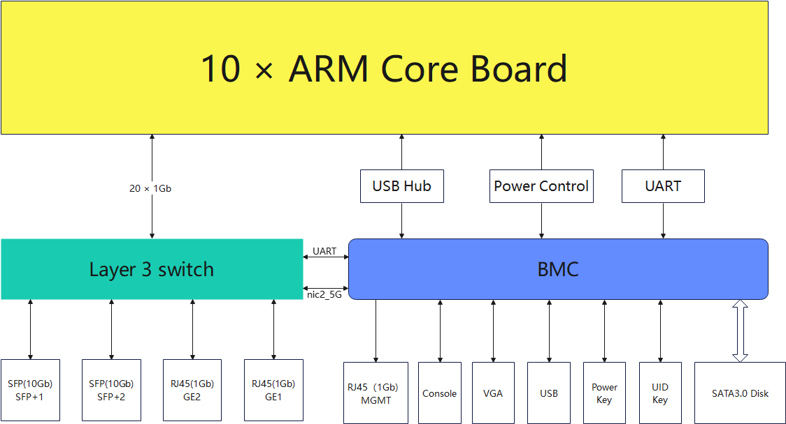
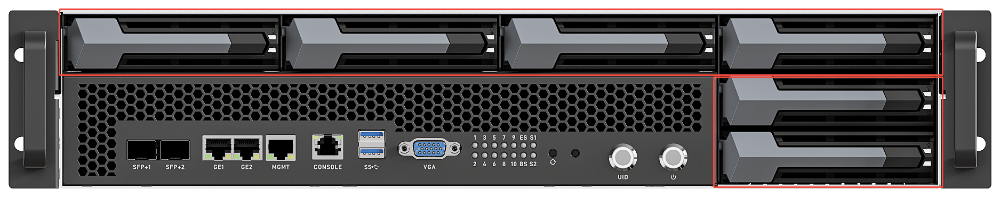
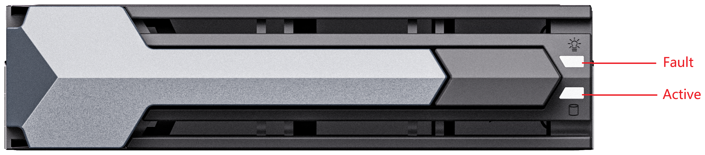

# Product Specifications and Components

## Server Specifications

| Item | Specification |
| :--- | :--- |
| **Server Form Factor** | 2U rack-mount server |
| **Compute Node Model** | Supports 10 distributed compute nodes |
| **Display Interface** | 1080P VGA interface |
| **USB** | - 2 × USB3.0 (the lower USB port is a USB3.0 OTG port; a USB drive can be used to perform an OTG upgrade of the BMC)  - 1 × USB2.0 (a built-in USB2.0 interface that preserves the appearance integrity and can be used to expand built-in modules such as dongles, Bluetooth, and Wi-Fi) |
| **Network Interfaces** | - 2 × 10 Gbps SFP+ shared network ports   - 2 × 10/100/1000 Mbps RJ45 shared network ports |
| **Expansion Hard Drive** | 6 × 3.5-inch/2.5-inch SATA3.0 SSD drive bays (hot-swappable; the BMC can operate the drives directly, and compute sub-nodes can indirectly access the drives through the network sharing provided by the BMC) |
| **Console Interface** | 1 × RJ45 Console interface for debugging |
| **Indicators and Buttons** | - 1 UID button/indicator - 1 POWER button/indicator - 10 compute node system indicators - 2 SFP+ indicators - 1 switch indicator - 1 BMC system indicator |
| **Fans** | 4 redundant fans |
| **PCIe Expansion Slot** | Supports 1 half-height, half-length PCIe 2.0 x4 standard slot (signal is PCIe 2.0 x1) |
| **System Management** | - Adapted to the aBMC management system (supports Redfish, VNC, NTP, advanced monitoring, and virtual media) - 1 × 10/100/1000 Mbps RJ45 management network port |
| **Security Features** | - Administrator password - Fault alarms - Emergency recovery mode |

## Environmental Specifications

| Item | Specification |
| :--- | :--- |
| **Temperature** | - Operating temperature: 5℃ to 40℃ (41℉ to 104℉) -  Storage temperature (24H): -40℃ to +65℃ -  Storage temperature (within 3 months): -30℃ to +60℃ (-22℉ to +140℉) -  Storage temperature (within 6 months): -15℃ to +45℃ (5℉ to 113℉) -  Storage temperature (within 1 year): -10℃ to +35℃ (14℉ to 95℉) -  Maximum temperature change rate: 20℃ (36℉)/hour, 5℃ (9℉)/15 minutes |
| **Relative Humidity (RH, non-condensing)** | - Operating humidity: 8% to 90% -  Storage humidity (within 3 months): 8% to 85% -  Storage humidity (within 6 months): 8% to 80% -  Storage humidity (within 1 year): 20% to 75% -  Maximum humidity change rate: 20%/hour |

<Callout title="Hard Drive Storage Time Requirements" type="info">
Due to the limitations of the storage principles of SSD drives and mechanical drives (including NL-SAS, SAS, and SATA), they cannot be stored for long periods in a powered-off state. Exceeding the maximum storage time may cause data loss or drive failure. Under the condition that the storage temperature and storage humidity requirements are met, the drive storage time requirements are as follows:
* Maximum storage time for SSD drives:
    * Powered-off state with no data stored: 12 months
    * Powered-off state with data stored: 3 months
* Maximum storage time for mechanical drives:
    * Unopened packaging, or opened packaging in a powered-off state: 6 months
The maximum storage times are determined based on the powered-off storage time specifications provided by the drive manufacturers.
</Callout>

## Physical Specifications

### Product Specifications
| Item | Specification |
| :--- | :--- |
| **Dimensions (H×W×D)** | Chassis: 88.8mm (2U)× 530.59mm × 487.9mm |
| **Installation Dimension Requirements** | Can be installed in a general-purpose cabinet that complies with the IEC 297 standard: - Width 19 inches - Depth 800 mm or more  The rail installation requirements are as follows: - Telescopic rails: the distance between the front and rear square-hole rails of the cabinet ranges from 543.5 mm to 848.5 mm |
| **Weight (Fully Configured)** | - Net weight: 11.5kg - Packaging material weight: 13.7kg |
| **Power Consumption** | The power consumption of the whole server varies depending on the quantity and types of the compute units installed. The following are reference values: - Standby power consumption: 150 W - Maximum power consumption: 450 W |
| **Power Supply** | - The power module does not support hot swapping - The recommended current ratings of the external power air circuit breaker connected to the server are as follows: &nbsp;&nbsp;- AC power: 32 A &nbsp;&nbsp;- DC power: 63 A - The power supply wattage should be greater than the maximum power consumption, with a margin of no less than 50 W |

### Network Specifications

#### Network Topology Diagram
| Symbol | Name | Description |
| :--- | :--- | :--- |
| nic0_5G | Ethernet NIC (speed 5 Gbps) | Supports VLAN division |
| Layer 3 switch | Internal Layer 3 switch | Supports VLAN division, link aggregation, QoS, and other features |

According to the hardware logical topology diagram, the ARM core boards integrated in the array server are interconnected with the BMC at high speed through a Layer 3 switch. This Layer 3 switch supports VLAN division and link aggregation, which allows users to flexibly configure network isolation policies according to actual business needs. **Contact an engineer to obtain the specific network topology diagram.**

#### Switch Performance Specifications

| Features | L3 Switch |
| ---- | ---- |
| Switching Capacity | 216 Gbps (full‑duplex) |
| Packet Forwarding Rate | 162 Mpps |
| **Port** | |
| Port Shutdown | Support |
| Port Speed | Support autonegotiate, full‑10000, full‑2500, full‑1000, full‑100, half‑100, full‑10, half‑10 |
| Flow Control | support full‑duplex IEEE 802.3x, half‑duplex back pressure |
| Storm Control | Supports rate limit for broadcast, multicast, and DLF packets |
| Storm Constrain | Support the detection of broadcast packets, multicast packets, or unicast packets on the port, shutdown the port if the rate is over the threshold. |
| Port Mirror | Support |
| Port Rate Limit | Support port ingress and egress rate limit |
| Link Aggregation | Support manual link aggregation Support LACP dynamic link aggregation Supports up to 32 aggregation groups, each group up to 8 ports Support source MAC, destination MAC, source destination MAC, source IP, destination IP, source destination IP routing strategy |
| Port Isolate | Support |
| Jumbo Frame | Support up to 12KB packet |
| Redundant Port | Support |
| The DDM of fiber ports | Support |
| **MAC** | |
| MAC Table Capacity | 930x: 16K  931x:32K |
| MAC Table Management | Support |
| Forwarding mode | Support IVL forwarding mode |
| Static MAC Address | Support |
| MAC Address Binding | Support |
| MAC Address Filtering | Support |
| MAC Learning Control | Control the MAC learning based on port |
| **VLAN** | |
| Number of VLANs | 4K |
| 802.1q‑based VLAN | Support |
| MAC‑based VLAN | Support |
| IP‑based VLAN | Support |
| Protocol‑based VLAN | Support |
| PVLAN | Support |
| Voice VLAN | Support |
| VLAN Mapping | Support 1:1 mapping |
| QinQ | Support basic QinQ Support flexible QinQ |
| GVRP | Support |
| **Reliability** | |
| Spanning Tree Protocol | Support STP/RSTP/MSTP |
| Port Loop Detection | Support |
| EAPS | Support RFC3619 |
| ERPS | Support G.8032/Y.1344 |
| LLDP | Support LLDP & LLDP‑MED |
| UDLD | Fully compatible with CISCO's UDLD protocol |
| VLLP (VRRP Layer‑2 Loop Protection) | Support, Only used with VRRP |
| **L3** | |
| ARP | Support static and dynamic ARP |
| Static Route | Support static route based on IPv4 and IPv6 |
| VLAN Interface | Support 32 VLAN interfaces |
| RIP | Support RIP v1/v2 & IPv6 RIPng |
| OSPF | Support OSPFv2 & IPv6 OSPFv3 |
| BGP | Support BGP4 & IPv6 BGP4+ |
| Policy Route | Support |
| VRRP | Support |
| **Multicast** | |
| Static Multicast MAC Address | Support |
| IGMP SNOOPING | Support IGMP SNOOPING v1/v2/v3 Support IGMP Querier Support IGMP SNOOPING Filter |
| MVR | Support |
| GMRP | Support |
| IGMP | Support IGMP v1/v2/v3 |
| PIM‑SM | Support |
| **ACL** | |
| Standard IP‑based ACL | Support |
| Extended IP based ACL | Support |
| MAC IP‑based ACL | Support |
| MAC ARP‑based ACL | Support |
| ACL Port Filtering | Support |
| Time‑based ACL | Support |
| **QoS** | |
| Port Queue Number | 8 |
| Port Queue Scheduling Mode | Support WRR，WFQ，SP |
| Port‑based Classification | Support |
| 802.1p‑based Classification | Support |
| DSCP‑based Classification | Support |
| ACL‑based Classification | Support |
| QoS Policy | Support packets mapping to queue Support COS or DSCP Remarking Support rate limits of data flow Support data flow statistics Support mirroring of data flow |
| **DHCP** | |
| DHCP Client | Support |
| DHCP Snooping | Support |
| DHCP Relay | Support |
| DHCP Server | Support |
| DHCP option 82 | Support |
| **Management** | |
| CLI Management | Support Console, Telnet and SSH Support multiple TELNET connections based on IPv4 and IPv6 Support multiple SSH connections based on IPv4 and IPv6 |
| WEB Management | Support HTTP based on IPv4 and IPv6 Support HTTPS based on IPv4 and IPv6 |
| SNMP Management | Support SNMP v1, v2c, v3 Support SNMP TRAP Support lots of standard and private MIBs Support SNMP and TRAP based on IPv4 and IPv6 |
| User Management | Support multiple user management |
| TACACS+ | support switch authentication via TACACS+ server remote username and password Support password encryption in PAP and CHAP mode Support TACACS+ server to authorize the switch’s commands Support TACACS+ based on IPv4 and IPv6 |
| Log Management | Support local log management Support SYSLOG |
| RMON | Support RMON 1, 2, 3 and 9 groups |
| Cluster Management | Support NDP Support NTDP Support manual and automatic joining of cluster groups Support cluster unified management |
| Configuration File | Support uploading and downloading configuration file Support TFTP transmission based IPv4 and IPv6 |
| Upgrade software | Support TFTP transmission based IPv4 and IPv6 |
| Clock Management | Support local clock management Support SNTP |
| **Security** | |
| Switch Management Security | Support enabling and disabling TELNET、SSH、HTTP、HTTPS and SNMP services Support TELNET、SSH、HTTP、HTTPS and SNMP services to bind to standard IP ACLs Support for limiting the number of TELNET and SSH connections |
| CPU Protection | The switch's own security protection prevents large data streams from attacking the switch itself. |
| AAA | Support 802.1x Support RADIUS Supports authentication, authorization, and accounting through RADIUS server Support port‑based and MAC‑based 802.1x Support 802.1x guest VLAN |
| IP MAC Binding | Support static configuration of IP, MAC and port binding |
| DHCP SNOOPING | Support dynamic ARP binding to prevent ARP spoofing Support dynamic IP, MAC and port binding Support fixed port to connect to DHCP server to prevent private connection to DHCP server |
| Prevent ARP Spoofing | Support manually configuring MAC ARP‑based ACL rules to prevent ARP spoofing. Support the DHCP SNOOPING function. During the process of obtaining an IP address by DHCP, the switch dynamically binds ARP to the port to prevent ARP spoofing. |
| **POE** | |
| Supported PoE chips | MAX5980,LTC4259,LTC4271,TPS23851,TPS23861,TPS23880,TPS23881,IP808,PD69100/69108,PD69200/69208 and hasivo poe, etc. |
| Switch Control | Support POE powering of ports on and off |
| Power Control | Support setting total power |
| Other Advanced Features | Support POE scheduling policy and PD online query, etc. |
| **IPv6** | |
| IPv4/IPv6 Dual Protocol Stack | Support |
| IPv6 Address | Support manual address configuration and stateless address auto‑configuration |
| IPv6 Neighbor Discovery | Support |
| ICMPv6 | Support |
| IPv6 Path MTU Discovery | Support |
| **Debugging** | |
| PING | Support |
| PING6 | Support |
| TRACEROUTE | Support |
| TELNET Client | Support TELNET client based IPv4 and IPv6 |
| SSH Client | Support SSH client based IPv4 and IPv6 |
#### Network Topology Diagram
According to the hardware logical topology diagram, the ARM core boards integrated in the array server are interconnected with the BMC at high speed through a Layer 3 switch. This Layer 3 switch supports VLAN division and link aggregation, which allows users to flexibly configure network isolation policies according to actual business needs. **Contact an engineer to obtain the specific network topology diagram.**

## Components
### Front Panel Buttons and Indicators

| Marking | Indicator/Button | Status Description |
| :--- | :--- | :--- |
| 1-10 | Compute node status indicator | - Green (steady on): the compute node has powered on normally. - Off: the compute node is not powered on. |
| | Power button/indicator | **Power indicator description:** - Yellow (steady on): the server is in Standby state. - Yellow (blinking): the BMC management system is starting up. - Green (steady on): the server has powered on. - Off: the server is not powered on.  **Power button description:** - In the powered-on state, briefly pressing this button can shut down the sub-board OS normally.  **Detailed shutdown process:** - Seconds 1 to 5: Green (blinking) — notifies the sub-compute units to shut down business programs in an orderly manner within 5 seconds. - Seconds 5 to 20: Yellow/green (alternating blinking) — the sub-compute units formally begin shutting down. - Second 20: Yellow (steady on) — each compute unit is powered off (all units except the BMC are powered off). - In the Standby state, briefly pressing this button powers the server on. |
| | UID button and indicator | The UID button/indicator is used to locate the server to be operated.  **UID indicator description:** - Off: the server is not being located. - Yellow blinking (blinks for 255 seconds): the server is being specifically located. |
| BS | Health Status Indicator | - Red (steady on): the system has a critical alarm. |
| ES | Ethernet Switch Indicator | - Green slow blinking (1 Hz): the switch is starting up. - Green fast blinking: the switch has powered on. - Off: the switch is not powered on or has not finished starting up. |
| S1/S2 | Optical module presence indicators (1, 2) | - 1, 2: 1 represents SFP1; 2 represents SFP2. - Green (steady on): the SFP is present and can be recognized normally. - Off: the SFP is not present or is faulty. |
| | Reset button | - **Restart BMC**: short press. - **Reset password**: long press for 5 seconds until the BS indicator blinks slowly. - **Restore factory settings**: long press for 10 seconds until the BS indicator blinks fast. - **Recover from accidental press**: keep holding without releasing (about 15 seconds) until the BS indicator returns to steady on. |
| | OTG USB (lower) | A USB drive can be used to perform an OTG upgrade of the BMC. |

### Network Interfaces

| Marking | Interface Name | Description |
| :--- | :--- | :--- |
| SFP+1 / SFP+2 | SFP+ ports | - The default rate of the 10G optical ports is 10 Gbps. - In a gigabit network environment, manually switch to 1 Gbps. |
| GE1 / GE2 | RJ45 | - Gigabit Ethernet ports, 1000/100/10 Mbps auto-negotiation. |
| MGMT | RJ45 | - Used as the BMC management network. - 1000/100/10 Mbps auto-negotiation. |
### Debug Interface

| Marking | Interface Name | Description |
| :--- | :--- | :--- |
| Console | RJ45 | - BMC debug serial port - Baud rate 115200 |
### Display Interface

| Marking | Interface Name | Description |
| :--- | :--- | :--- |
| VGA | VGA interface | - VGA output directly from the BMC. - Resolution 1080P. |
### Hard Drives and Indicators

#### Hard Drive Location

#### Hard Drive Configuration

<table border="1" cellPadding="8" cellSpacing="0" width="100%">
  <thead>
    <tr>
      <th>Configuration</th>
      <th>Maximum Number of Hard Drives</th>
      <th>Management Method for Ordinary Hard Drives</th>
    </tr>
  </thead>
  <tbody>
    <tr>
      <td>
        3.5-inch (or 2.5-inch) hard drive passthrough configuration
        <ul style="margin: 6px 0; padding-left: 20px;">
          <li>Configured with a standard 3.5-inch hard drive tray, compatible with 2.5-inch drives.</li>
          <li>Supports the SATA III protocol.</li>
          <li>The drives are passed through to the BMC; the BMC operates the drives directly and can support drives up to 16 TB or larger.</li>
          <li>Compute sub-nodes can indirectly access the drives through the network sharing provided by the BMC.</li>
        </ul>
      </td>
      <td>6 (SATA drives)</td>
      <td>BMC PCIE to SATA</td>
    </tr>
  </tbody>
</table>

#### SATA Hard Drive Indicators

<table border="1" cellPadding="8" cellSpacing="0" width="100%">
  <thead>
    <tr>
      <th>Hardware Active Indicator (green indicator)</th>
      <th>Hardware Fault Indicator (yellow indicator)</th>
      <th>Management Method for Ordinary Hard Drives</th>
      <th>Handling Steps and Description</th>
    </tr>
  </thead>
  <tbody>
    <tr>
      <td>Steady on</td>
      <td rowSpan="2">Off</td>
      <td>Drive present</td>
      <td rowSpan="4">No action required</td>
    </tr>
    <tr>
      <td>Blinking (4 Hz)</td>
      <td>The drive is in a normal read/write state or in the rebuilding primary drive state</td>
    </tr>
    <tr>
      <td>Steady on</td>
      <td rowSpan="2">Blinking (1 Hz)</td>
      <td>The drive is being located by the BMC</td>
    </tr>
    <tr>
      <td>Blinking (1 Hz)</td>
      <td>The drive is in the rebuilding secondary drive state</td>
    </tr>
    <tr>
      <td>Off</td>
      <td rowSpan="2">Steady on</td>
      <td>The drive has been removed</td>
      <td rowSpan="2">
        1. Check whether the drive is present 
        2. Check whether the drive is faulty
      </td>
    </tr>
    <tr>
      <td>Steady on</td>
      <td>Drive failure</td>
    </tr>
  </tbody>
</table>