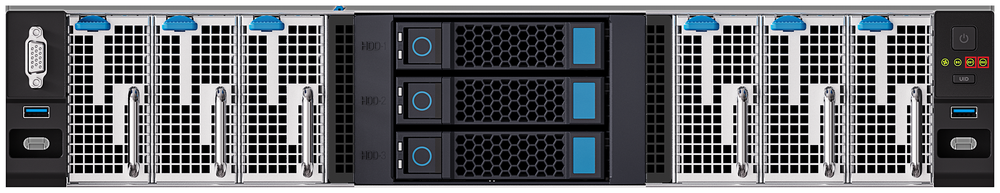
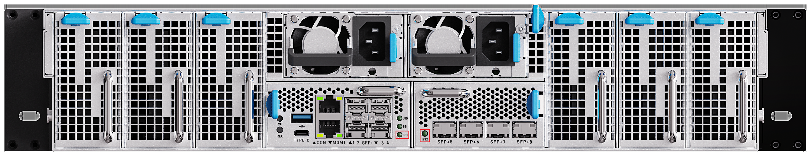
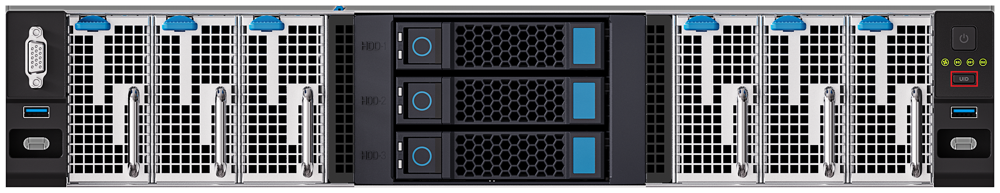

# Server Status Identification

After the server is connected to the power outlet, the BMC is powered on automatically.

Before using the server, check the indicators on the server to determine its current operating status.

## BMC Status Indicator

The indicator marked with the silkscreen BS on the front panel is the system status indicator of the BMC. It is a red/green dual-color indicator that shows the operating status of the BMC through its on/off state and color:

- **Off**: The BMC is not powered on.
- **Steady green**: The BMC has entered the system normally.
- **Steady red**: The BMC has a fault.

The rear panel also has a BS indicator with the same states as the one on the front panel:

## Switch Indicators

The two indicators marked with the silkscreen ES1 and ES2 on the front panel are the system status indicators of the two Layer 3 switches respectively. Each indicator is a single-color green indicator that shows the operating status of the corresponding Layer 3 switch through its on/off state and blinking frequency:

- **Off**: The switch is not powered on or has a fault.
- **Fast blinking (4 Hz)**: The switch is starting up.
- **Slow blinking (1 Hz)**: The switch is working normally.

The rear panel also has ES1 and ES2 indicators with the same states as those on the front panel:

## Fan Indicator

The fan indicator is a red/green dual-color indicator that shows the operating status of the fan through its color:

- **Steady green**: The fan is working normally.
- **Steady red**: The fan has a fault.

## UID Button

The UID button/indicator is a blue button indicator with the button and the indicator integrated together. After the button is pressed, the indicator lights up.

The rear panel also has a UID indicator:

The UID indicator is used to help O&M personnel quickly locate a server. When multiple servers of the same model are deployed in the data center:

- **Light the UID indicator remotely**: When remote O&M personnel find a server abnormal, they can turn on its UID indicator on the aBMC web page, so that on-site personnel can locate the abnormal server accordingly.
- **Press the UID button on site**: The virtual UID LED on the aBMC web page lights up in sync, so remote O&M personnel can confirm the server to be decommissioned and perform data operations before decommissioning.

## Power Button/Indicator

The front panel has a power button used to power on and off all sub-boards. The button indicator shows the power status of the sub-boards through its color and blinking state:

- **Off**: The server is not powered on.
- **Blinking blue**: The power-on stage after a cold start, when the power is not yet ready. After the power is ready, the indicator turns steady green, and all sub-boards are powered on by default.
- **Steady green**: The sub-boards are powered on. Press the button again, and the indicator turns to alternating blue/green blinking while the sub-boards are shutting down; after the shutdown is completed, the indicator turns steady blue.
- **Steady blue**: All sub-boards are powered off. Press the button again, and the indicator turns steady green, and the sub-boards will be powered on one by one.