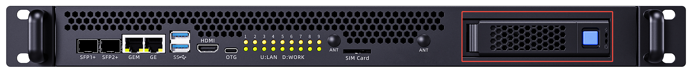
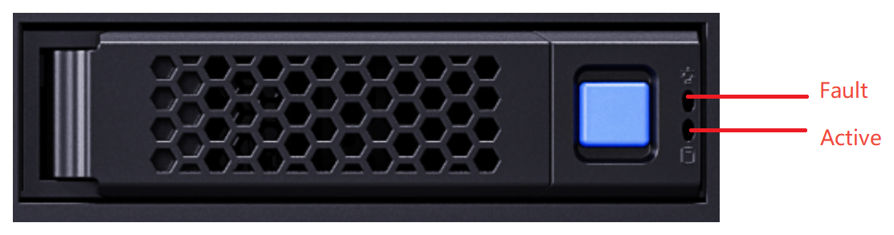

# Product Specifications and Components

## Server Specifications

| Item | Specification |
| :--- | :--- |
| **Server Form Factor** | 1U rack-mount server |
| **Compute Node Model** | Supports 8 distributed compute nodes |
| **Display Interface** | 1080P HDMI interface |
| **USB** | 2 USB 3.0 ports |
| **Network Interfaces** | - 2 × 10 Gbps SFP+ shared network ports - 1 × 10/100/1000 Mbps RJ45 shared network port |
| **Expansion Hard Drive** | 1 × 3.5-inch/2.5-inch SATA3.0 SSD drive bay (hot-swappable; the BMC can operate the drive directly, and compute sub-nodes can indirectly access the drive through the network sharing provided by the BMC) |
| **Indicators and Buttons** | - 8 compute node system indicators - 1 BMC system indicator |
| **Fans** | 6 redundant fans |
| **System Management** | - Adapted to the aBMC management system (supports Redfish, VNC, NTP, advanced monitoring, and virtual media) - 1 × 10/100/1000 Mbps RJ45 management network port |
| **Security Features** | - Administrator password - Fault alarms - Emergency recovery mode |

## Environmental Specifications

| Item | Specification |
| :--- | :--- |
| **Temperature** | - Operating temperature: 5℃ to 40℃ (41℉ to 104℉) -  Storage temperature (24H): -40℃ to +65℃ -  Storage temperature (within 3 months): -30℃ to +60℃ (-22℉ to +140℉) -  Storage temperature (within 6 months): -15℃ to +45℃ (5℉ to 113℉) -  Storage temperature (within 1 year): -10℃ to +35℃ (14℉ to 95℉) -  Maximum temperature change rate: 20℃ (36℉)/hour, 5℃ (9℉)/15 minutes |
| **Relative Humidity (RH, non-condensing)** | - Operating humidity: 8% to 90% -  Storage humidity (within 3 months): 8% to 85% -  Storage humidity (within 6 months): 8% to 80% -  Storage humidity (within 1 year): 20% to 75% -  Maximum humidity change rate: 20%/hour |

<Callout title="Hard Drive Storage Time Requirements" type="info">
Due to the limitations of the storage principles of SSD drives and mechanical drives (including NL-SAS, SAS, and SATA), they cannot be stored for long periods in a powered-off state. Exceeding the maximum storage time may cause data loss or drive failure. Under the condition that the storage temperature and storage humidity requirements are met, the drive storage time requirements are as follows:
* Maximum storage time for SSD drives:
    * Powered-off state with no data stored: 12 months
    * Powered-off state with data stored: 3 months
* Maximum storage time for mechanical drives:
    * Unopened packaging, or opened packaging in a powered-off state: 6 months
The maximum storage times are determined based on the powered-off storage time specifications provided by the drive manufacturers.
</Callout>

## Physical Specifications

| Item | Specification |
| :--- | :--- |
| **Dimensions (H×W×D)** | Chassis: 44.4mm (1U) × 417.3mm × 490.0mm |
| **Installation Dimension Requirements** | Can be installed in a general-purpose cabinet that complies with the IEC 297 standard: - Width 19 inches - Depth 800 mm or more  The rail installation requirements are as follows: - Telescopic rails: the distance between the front and rear square-hole rails of the cabinet ranges from 543.5 mm to 848.5 mm |
| **Weight (Fully Configured)** | - Net weight: 6.7kg - Packaging material weight: 8.9kg |
| **Power Consumption** | The power consumption of the whole server varies depending on the quantity and types of the compute units installed. The following are reference values: - Standby power consumption: 300 W - Maximum power consumption: 430 W |
| **Power Supply** | - The power module does not support hot swapping - The recommended current ratings of the external power air circuit breaker connected to the server are as follows: &nbsp;&nbsp;- AC power: 32 A &nbsp;&nbsp;- DC power: 63 A - The power supply wattage should be greater than the maximum power consumption, with a margin of no less than 50 W |

## Components
### Front Panel Buttons and Indicators

| Marking | Indicator/Button | Status Description |
| :--- | :--- | :--- |
| 1-8 | Compute node status indicator | - Green (steady on): the compute node has powered on normally. - Off: the compute node is not powered on. |
| OTG | TYPE-C | A USB drive can be used to perform an OTG upgrade of the BMC. |

### Network Interfaces

| Marking | Interface Name | Description |
| :--- | :--- | :--- |
| SFP+1 / SFP+2 | SFP+ ports | - The default rate of the 10G optical ports is 10 Gbps. - In a gigabit network environment, manually switch to 1 Gbps. |
| GE | RJ45 | - Gigabit Ethernet port, 1000/100/10 Mbps auto-negotiation. |
| GE M | RJ45 | - Used as the BMC management network. - 1000/100/10 Mbps auto-negotiation. |
### Display Interface

| Marking | Interface Name | Description |
| :--- | :--- | :--- |
| HDMI | HDMI interface | - HDMI output directly from the BMC. - Resolution 1080P. |
### Hard Drives and Indicators

#### Hard Drive Location

#### Hard Drive Configuration

<table border="1" cellPadding="8" cellSpacing="0" width="100%">
  <thead>
    <tr>
      <th>Configuration</th>
      <th>Maximum Number of Hard Drives</th>
      <th>Management Method for Ordinary Hard Drives</th>
    </tr>
  </thead>
  <tbody>
    <tr>
      <td>
        3.5-inch (or 2.5-inch) hard drive passthrough configuration
        <ul style="margin: 6px 0; padding-left: 20px;">
          <li>Configured with a standard 3.5-inch hard drive tray, compatible with 2.5-inch drives.</li>
          <li>Supports the SATA III protocol.</li>
          <li>The drives are passed through to the BMC; the BMC operates the drives directly and can support drives up to 16 TB or larger.</li>
          <li>Compute sub-nodes can indirectly access the drives through the network sharing provided by the BMC.</li>
        </ul>
      </td>
      <td>1 (SATA drive)</td>
      <td>SATA output directly from the BMC</td>
    </tr>
  </tbody>
</table>

#### SATA Hard Drive Indicators

<table border="1" cellPadding="8" cellSpacing="0" width="100%">
  <thead>
    <tr>
      <th>Hardware Active Indicator (green indicator)</th>
      <th>Hardware Fault Indicator (yellow indicator)</th>
      <th>Management Method for Ordinary Hard Drives</th>
      <th>Handling Steps and Description</th>
    </tr>
  </thead>
  <tbody>
    <tr>
      <td>Steady on</td>
      <td rowSpan="2">Off</td>
      <td>Drive present</td>
      <td rowSpan="4">No action required</td>
    </tr>
    <tr>
      <td>Blinking (4 Hz)</td>
      <td>The drive is in a normal read/write state or in the rebuilding primary drive state</td>
    </tr>
    <tr>
      <td>Steady on</td>
      <td rowSpan="2">Blinking (1 Hz)</td>
      <td>The drive is being located by the BMC</td>
    </tr>
    <tr>
      <td>Blinking (1 Hz)</td>
      <td>The drive is in the rebuilding secondary drive state</td>
    </tr>
    <tr>
      <td>Off</td>
      <td rowSpan="2">Steady on</td>
      <td>The drive has been removed</td>
      <td rowSpan="2">
        1. Check whether the drive is present 
        2. Check whether the drive is faulty
      </td>
    </tr>
    <tr>
      <td>Steady on</td>
      <td>Drive failure</td>
    </tr>
  </tbody>
</table>