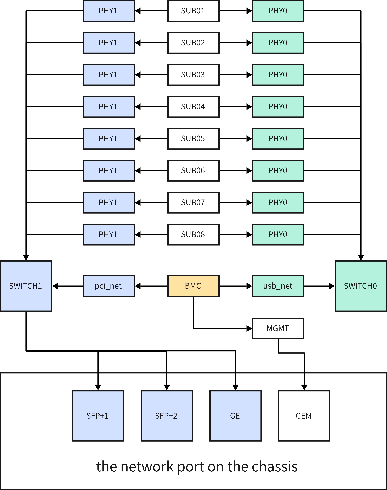
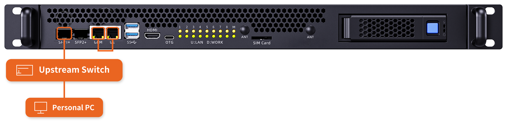
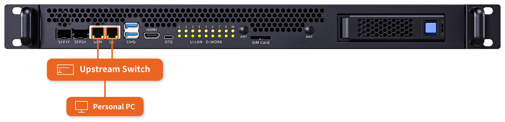

# Network Wiring

This chapter first explains how the network inside the server is connected, and then introduces the common wiring methods. The wiring methods below cover most usage scenarios. For special requirements, contact sales for technical support.

Before wiring, learn the role of each network port:

- **GEM port**: The MGMT port directly connected to the BMC. It is the out-of-band management port of the server.
- **SFP+1, SFP+2, and GE ports**: The service network ports of the server. They are all connected to the internal switch, which in turn connects to the sub-boards and the BMC.

Out-of-band management is a remote management channel that does not rely on the operating system or the service network. As long as the server is powered, you can access the BMC through the GEM port to power the server on or off, monitor hardware, upgrade firmware, and so on, even when the server is not booted or the system fails. For details, see the "Accessing the BMC" chapter.

## 1 Internal Network Topology

Inside the server, these ports fall into two parts: the service channel and the management channel.

- **Service channel**: The SFP+1, SFP+2, and GE ports on the chassis are connected to the internal switch chip SWITCH1, which connects the PHY1 ports of the sub-boards. The BMC is also connected to SWITCH1 through pci_net.
- **Management channel**: The BMC is connected to another switch chip, SWITCH0, through usb_net, and SWITCH0 connects the PHY0 ports of the sub-boards. The MGMT port of the BMC is routed directly to the GEM port on the chassis, without going through any switch chip.

In other words, each sub-board (SUB01–SUB08) has two network ports, PHY1 and PHY0, attached to SWITCH1 and SWITCH0 respectively, and the GEM port is a direct outlet of the BMC. Because out-of-band management and the service network belong to two separate channels, out-of-band management can be uplinked independently in the second wiring method below.

**Either of the following two wiring methods allows the whole server to communicate with the external network; the difference is whether the out-of-band management channel shares the same external cable with the service network.**

## 2 One Cable: Shared Uplink for Service and Out-of-Band Management

**Tools**

- 10G SFP+ to RJ45 module × 1 ([Purchase link](https://item.taobao.com/item.htm?id=615471664761&skuId=4338443096690))
- Network cables × 2 (one for the external network, one for interconnecting the GEM and GE ports)

**Wiring steps**

1. Insert the 10G SFP+ to RJ45 module into the SFP+1 port of the server (1 in the figure), and connect the external network cable to the module.
2. Interconnect the GEM port and the GE port with a network cable (2 in the figure).

Note: The GEM port is directly connected to the BMC. After it is interconnected with the GE port, the BMC management port can communicate with the external network through the internal switch. In this method, out-of-band management and the service network share the same external cable on the SFP+1 port.

## 3 Two Cables: Independent Uplinks for Service and Out-of-Band Management

**Tools**

- Network cables × 2 (one for the GEM port, one for the GE port)

**Wiring steps**

1. Connect one network cable to the GEM port of the server (1 in the figure), and the other end to the external network.
2. Connect the other network cable to the GE port (2 in the figure), and the other end to the external network.

In this method, the out-of-band management (GEM port) and the service network (GE port) are connected to the external network independently, without affecting each other.