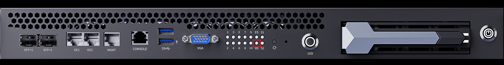
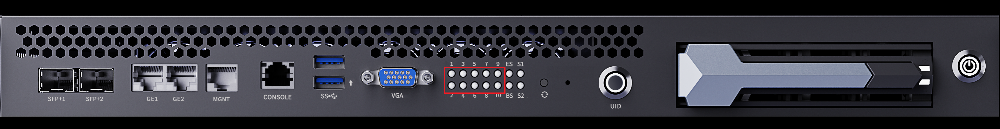
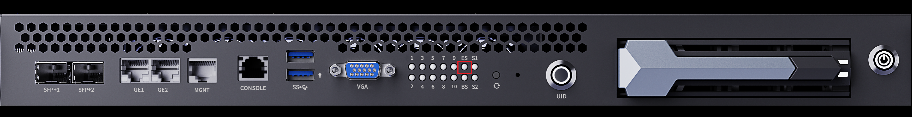
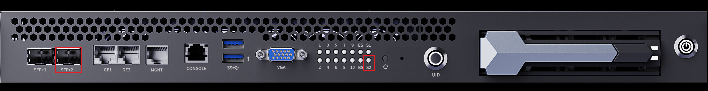
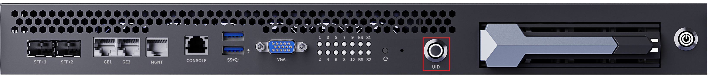
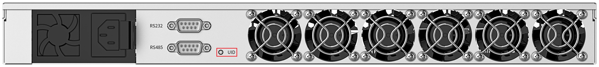
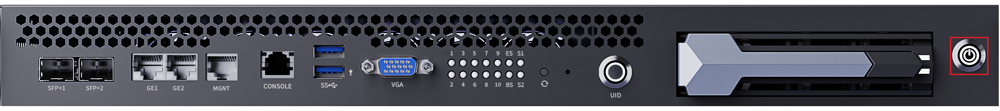

# Server Status Identification

After the server is connected to the power outlet, the BMC is powered on automatically.

Before using the server, check the indicators on the server to determine its current operating status.

## BMC Status Indicator

The indicator marked with the silkscreen BS on the front panel is the system status indicator of the BMC. It is a red/green dual-color indicator that shows the operating status of the BMC through its on/off state and color:

- **Off**: The BMC is not powered on.
- **Steady green**: The BMC has entered the system normally.
- **Steady red**: The BMC has a fault.

## Sub-board Status Indicators

The 10 indicators marked with the silkscreen 1 to 10 on the front panel correspond to the system status of the 10 sub-boards respectively. Each indicator is a red/green dual-color indicator that shows the operating status of the sub-board through its on/off state and color:

- **Off**: The sub-board is not powered on.
- **Steady green**: The sub-board has entered the system normally.
- **Steady red**: The sub-board has a fault.

## Switch Indicator

The indicator marked with the silkscreen ES on the front panel is the system status indicator of the Layer 3 switch. It is a single-color green indicator that shows the operating status of the Layer 3 switch through its on/off state and blinking frequency:

- **Off**: The switch is not powered on or has a fault.
- **Fast blinking (4 Hz)**: The switch is starting up.
- **Slow blinking (1 Hz)**: The switch is working normally.

## 10G Port Indicators

The two indicators marked with the silkscreen S1 and S2 on the front panel are the status indicators of the 10G optical ports, corresponding to the SFP+1 port on the left and the SFP+2 port on the right respectively. Each indicator is a single-color green indicator that shows the operating status of the corresponding port through its steady-on and blinking states:

- **Steady on**: The corresponding 10G optical port has successfully detected the optical module.
- **Blinking**: The corresponding 10G optical port is transmitting data.

## UID Button/Indicator

The UID button/indicator is a yellow button indicator with the button and the indicator integrated together. After the button is pressed, the indicator lights up.

There is also a UID indicator on the rear panel of the server, which works in sync with the front button indicator: when the UID indicator on the front panel lights up, the UID indicator on the rear panel lights up as well.

The UID indicator is used to help O&M personnel quickly locate a server. When multiple servers of the same model are deployed in the data center:

- **Press the UID button on the front panel**: When O&M personnel go to the rear panel for cabling or inspection, they can locate the server by the lit UID indicator.
- **Light the UID indicator remotely**: When remote O&M personnel find a server abnormal, they can turn on its UID indicator on the aBMC web page, so that on-site personnel can locate the abnormal server accordingly.
- **Press the UID button on site**: The virtual UID LED on the aBMC web page lights up in sync, so remote O&M personnel can confirm the server to be decommissioned and perform data operations before decommissioning.

## Sub-board Power Button/Indicator

The front panel of the server has a power button used to power on and off all sub-boards. The button indicator shows the power status of the sub-boards through its color and blinking state:

- **Off**: The server is not powered on.
- **Blinking yellow**: The power-on stage after a cold start, when the power is not yet ready. After the power is ready, the indicator turns steady green, and all sub-boards are powered on by default.
- **Steady green**: The sub-boards are powered on. Press the button again, and the indicator turns to alternating yellow/green blinking while the sub-boards are shutting down; after the shutdown is completed, the indicator turns steady yellow.
- **Steady yellow**: All sub-boards are powered off. Press the button again, and the indicator turns steady green, and the sub-boards will be powered on one by one.