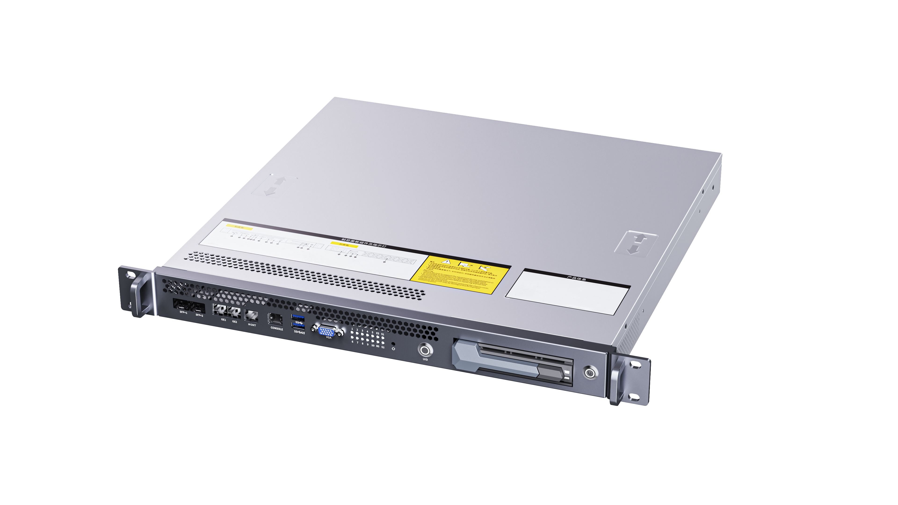
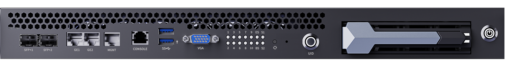
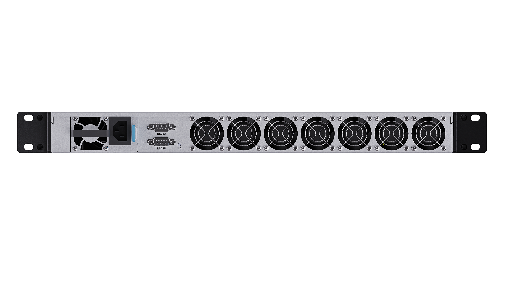

# Introduction
The CSB1-N10SPK3 is a 1U rack-mount ARM barebone high-density array server. Targeting the Internet, AI edge computing, cloud computing, big data, and video edge computing markets, it delivers high-performance computing, low power consumption, and easy management and deployment.

Key Features
- Barebone Server aBMC
    Equipped with the Firefly self-developed BMC management system, the Firefly Advanced Baseboard Management Controller (hereinafter referred to as aBMC) is an embedded server management system designed specifically for array servers. It enables efficient monitoring of array servers, simplified configuration, exception alarms, remote operations and maintenance (such as software KVM), and virtual media management. aBMC provides a series of management tools including a CLI command line and Redfish, offering rich potential for secondary development.
- Flexible Configuration
    Users can freely combine the types and quantities of compute units according to business needs, customize the optimal deployment solution on demand, and adapt to different business scenarios.
- Network Management
    An integrated Layer 3 switch supports mainstream network configuration features such as VLAN and QoS, enabling flexible network zoning, optimized network service quality, and comprehensive protection of customer network security and stability.
- High Energy Efficiency
    Built on the efficient ARM instruction set architecture, it effectively avoids the performance loss of translating the x86 instruction set to ARM, balancing device performance with power consumption and delivering an excellent energy efficiency ratio.

## Physical View

### Front View

### Rear View

### Perspective View
