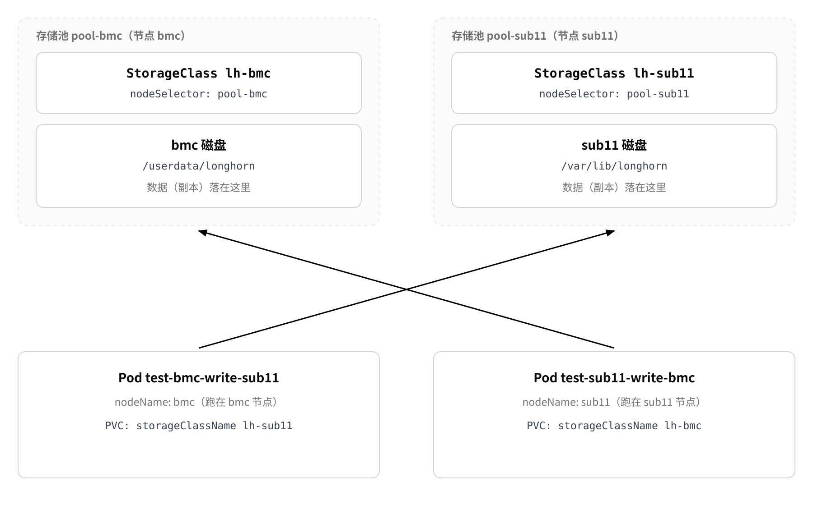

# Longhorn

本章介绍 [Longhorn](https://docs.rancher.cn/docs/k3s/storage/#%E8%AE%BE%E7%BD%AE-longhorn) 的用法，示例环境为[K3s部署](install.md)中在线部署完成的集群，当前使用的版本为 `v1.5.1`。

* **Longhorn 是什么**：Rancher 开源的云原生分布式块存储，以 CSI 驱动的方式为 Kubernetes 提供卷。一个卷可以有多份副本，分布在不同节点上，并支持在线扩容、快照和备份。
* **与 local-path 的区别**：`local-path` 把卷放在 Pod 所在节点的本地目录，Longhorn 则自行决定卷的位置，副本可以跨节点，也支持在线扩容。
* **经典使用案例**：从申请卷、挂载给应用，到查看卷与副本状态、在线扩容，最后清理，完整走一遍。


## 准备环境

Server 与 Agent 节点都需要执行以下准备。

### 软件安装 [step]

Longhorn 把卷以 **iSCSI 块设备**接到容器所在节点（所以必须装 open-iscsi），快照导出到 NFS 备份端需要 **NFS 客户端**，缺一不可：

* `open-iscsi`：提供 iSCSI 发起端，Longhorn 的卷就是以 iSCSI 设备的形式挂载到节点上的；
* `nfs-common`：把快照导出到 NFS 备份端时需要；
* `jq`：依赖检测脚本解析 JSON 输出时需要。

```shell
sudo apt install -y open-iscsi nfs-common jq
systemctl is-active iscsid                 # 必须输出 active
```

### 依赖检测 [step]

Longhorn 官方提供检测脚本，会逐项检查内核模块、iSCSI、多路径等依赖并给出结论，Server 与 Agent 节点都执行一次：

```shell
# 依赖检测（国内网络可使用附录 B 的脚本）
curl -sSfL https://raw.githubusercontent.com/longhorn/longhorn/v1.5.3/scripts/environment_check.sh | bash
```

脚本提示缺少依赖时，按提示安装对应软件包后重新执行，全部通过再继续后续步骤。


## 部署 Longhorn

### Longhorn 安装 [step]

```bash
# 安装存储服务
sudo k3s kubectl apply -f https://raw.githubusercontent.com/longhorn/longhorn/v1.5.1/deploy/longhorn.yaml

# 监控安装进度，看 Pod 逐个进入 Running（Ctrl+C 退出，不影响安装）
sudo k3s kubectl -n longhorn-system get pods --watch
```

### Longhorn 验证 [step]

```bash
# 1) 组件是否就绪
sudo k3s kubectl -n longhorn-system get pods -o wide

# 2) StorageClass 是否创建
sudo k3s kubectl get sc

# 3) 卷与副本（后续业务卷的状态也在这里看）
sudo k3s kubectl -n longhorn-system get volumes.longhorn.io
sudo k3s kubectl -n longhorn-system get replicas.longhorn.io -o wide
```

判定标准：

* 组件：`longhorn-manager`、`longhorn-driver-deployer`、`csi-*` 为 `Running`；
* StorageClass：列表中出现 `longhorn`，`ALLOWVOLUMEEXPANSION` 为 `true`；
* 卷：还没有业务卷时列表为空属于正常；有卷时 `STATE` 为 `attached`、`ROBUSTNESS` 为 `healthy`。

## Longhorn UI

Longhorn 自带 Web 界面。默认的 `longhorn-frontend` 是 `ClusterIP`，只能在集群内访问；要从外部打开，需要再建一个 NodePort Service，把请求转发到 UI Pod 的 `8000` 端口：

```bash
sudo k3s kubectl apply -f - <<'EOF'
apiVersion: v1
kind: Service
metadata:
  name: longhorn-ui-nodeport
  namespace: longhorn-system
spec:
  type: NodePort
  selector:
    app: longhorn-ui              # 与 longhorn-ui Pod 的标签一致
  ports:
  - port: 80
    targetPort: 8000              # longhorn-ui 容器监听端口
    nodePort: 30880               # 不写则随机分配 30000-32767
EOF
```

验证与访问：

```bash
# 在节点上验证，返回 200 与 HTML 即正常
curl -I http://127.0.0.1:30880
```

## 使用案例

本案例通过一个 YAML 文件创建两个 Longhorn 存储池，并分别在两个节点上创建存储卷。通过将 `Pod` 的运行节点与 PVC 的存储节点交叉配置，验证 **Pod 运行位置与数据存储位置可以独立指定**。

* **配方内容**：创建 2 个 `StorageClass`、2 个 `PersistentVolumeClaim` 和 2 个 `Pod`，分别将 `bmc` 和 `sub11` 配置为独立的存储池。
* **数据落点**：PVC 通过 `storageClassName` 选择存储池，Pod 通过 `nodeName` 指定运行节点，两者可以配置为不同节点。
* **前置条件**：作为存储节点的 Longhorn 节点必须允许调度，并配置对应的节点标签和存储目录；同时，运行 Pod 的节点需要能够拉取 `busybox` 镜像。

### 确认存储池 [step]

首先查看 Longhorn 节点的调度状态和标签：

```bash
sudo k3s kubectl -n longhorn-system get nodes.longhorn.io \
  -o custom-columns=NAME:.metadata.name,SCHEDULABLE:.spec.allowScheduling,TAGS:.spec.tags
```

```text
NAME    SCHEDULABLE   TAGS
bmc     true          []
sub11   false         []
```

作为存储节点的 `SCHEDULABLE` 应为 `true`，并且需要配置对应的 `pool-<节点名>` 标签。

例如：

```text
bmc     true          [pool-bmc]
sub11   true          [pool-sub11]
```

如果状态或标签不符合要求，请继续执行下一步进行配置。

### 开启存储池 [step]

Longhorn 节点是否可以存储副本，由**节点级**和**磁盘级**的 `allowScheduling` 共同决定，两者都需要开启。

仅开启磁盘级调度并不能让 Longhorn 在该节点上正常创建副本，否则卷可能保持 `detached` / `unknown` 状态，副本为 `stopped`，Pod 也可能一直处于 `ContainerCreating`。

同时，为每个节点配置唯一的存储池标签：

```bash
sudo k3s kubectl -n longhorn-system patch nodes.longhorn.io sub11 --type=merge \
  -p '{"spec":{"allowScheduling":true,"tags":["pool-sub11"]}}'

sudo k3s kubectl -n longhorn-system patch nodes.longhorn.io bmc --type=merge \
  -p '{"spec":{"allowScheduling":true,"tags":["pool-bmc"]}}'
```

### 检查存储池 [step]

配置完成后再次确认：

```bash
sudo k3s kubectl -n longhorn-system get nodes.longhorn.io \
  -o custom-columns=NAME:.metadata.name,SCHEDULABLE:.spec.allowScheduling,TAGS:.spec.tags
```

预期结果：

```text
NAME    SCHEDULABLE   TAGS
bmc     true          [pool-bmc]
sub11   true          [pool-sub11]
```

此时，`bmc` 和 `sub11` 分别对应两个存储池：

| 节点      | 存储池标签        |
| ------- | ------------ |
| `bmc`   | `pool-bmc`   |
| `sub11` | `pool-sub11` |

后续 `StorageClass` 通过 `nodeSelector` 指定对应标签，即可将卷限制在指定存储池中。

### 配置存储目录 [step]

Longhorn 每个节点至少有一块磁盘，磁盘的 `path` 决定副本实际存储的位置。

默认情况下，Longhorn 会使用：

```text
/var/lib/longhorn/
```

如果设备的数据分区位于 `/userdata`，建议将 Longhorn 数据目录放到数据分区，例如：

```bash
sudo mkdir -p /userdata/longhorn
```

然后查看节点当前的磁盘配置：

```bash
sudo k3s kubectl -n longhorn-system get nodes.longhorn.io sub11 \
  -o jsonpath='{.spec.disks}'
```

示例：

```text
{"default-disk-9fabfb0f4ec0d145":{"allowScheduling":false,"diskType":"filesystem","evictionRequested":false,"path":"/var/lib/longhorn/","storageReserved":2000000000,"tags":[]}}
```

其中：

* `default-disk-9fabfb0f4ec0d145`：Longhorn 自动创建的磁盘名称，后缀为随机值，不能自行推算，应先查询再使用。
* `path`：该磁盘实际使用的存储目录。
* `allowScheduling`：控制该磁盘是否允许 Longhorn 调度副本。

将查询到的磁盘名称用于修改存储目录：

```bash
sudo k3s kubectl -n longhorn-system patch nodes.longhorn.io sub11 --type=merge \
  -p '{"spec":{"disks":{"default-disk-9fabfb0f4ec0d145":{"path":"/userdata/longhorn"}}}}'
```

如果是手动添加的磁盘，可以自行指定磁盘名称，例如 `bmc` 节点上的 `userdata-disk`。

本环境最终使用的磁盘配置如下：

| 节点      | 磁盘名                             | `path`               | `allowScheduling` | `storageReserved` |
| ------- | ------------------------------- | -------------------- | ----------------- | ----------------: |
| `bmc`   | `userdata-disk`                 | `/userdata/longhorn` | `true`            |              8 GB |
| `sub11` | `default-disk-9fabfb0f4ec0d145` | `/var/lib/longhorn/` | `false`           |              2 GB |

> `sub11` 的磁盘在本案例中仅用于演示节点配置，实际存储池是否可用以节点级和磁盘级 `allowScheduling` 的实际状态为准。

### 创建应用清单 [step]

将以下内容保存为 `lh-pool.yaml`：

```yaml
# -----------------------------
# bmc 存储池
# -----------------------------
apiVersion: storage.k8s.io/v1
kind: StorageClass
metadata:
  name: lh-bmc
provisioner: driver.longhorn.io
allowVolumeExpansion: true
reclaimPolicy: Delete
parameters:
  numberOfReplicas: "1"        # 仅使用 bmc 存储池，因此副本数只能设置为 1
  nodeSelector: "pool-bmc"    # 将卷副本限制在 bmc
  staleReplicaTimeout: "30"
  fsType: "ext4"

---
# -----------------------------
# sub11 存储池
# -----------------------------
apiVersion: storage.k8s.io/v1
kind: StorageClass
metadata:
  name: lh-sub11
provisioner: driver.longhorn.io
allowVolumeExpansion: true
reclaimPolicy: Delete
parameters:
  numberOfReplicas: "1"         # 仅使用 sub11 存储池，因此副本数只能设置为 1
  nodeSelector: "pool-sub11"   # 将卷副本限制在 sub11
  staleReplicaTimeout: "30"
  fsType: "ext4"

---
# -----------------------------
# 测试命名空间
# -----------------------------
apiVersion: v1
kind: Namespace
metadata:
  name: lh-pool

---
# -----------------------------
# PVC：数据存储在 sub11
# Pod 运行在 bmc
# -----------------------------
apiVersion: v1
kind: PersistentVolumeClaim
metadata:
  name: data-bmc-write-sub11
  namespace: lh-pool
spec:
  accessModes:
    - ReadWriteOnce
  storageClassName: lh-sub11
  resources:
    requests:
      storage: 1Gi

---
apiVersion: v1
kind: Pod
metadata:
  name: test-bmc-write-sub11
  namespace: lh-pool
spec:
  nodeName: bmc
  containers:
    - name: writer
      image: busybox:1.36
      command:
        - sh
        - -c
        - |
          while true; do
            echo "$(hostname) $(date +%s)" >> /data/who.txt
            sync
            sleep 5
          done
      volumeMounts:
        - name: data
          mountPath: /data
  volumes:
    - name: data
      persistentVolumeClaim:
        claimName: data-bmc-write-sub11

---
# -----------------------------
# PVC：数据存储在 bmc
# Pod 运行在 sub11
# -----------------------------
apiVersion: v1
kind: PersistentVolumeClaim
metadata:
  name: data-sub11-write-bmc
  namespace: lh-pool
spec:
  accessModes:
    - ReadWriteOnce
  storageClassName: lh-bmc
  resources:
    requests:
      storage: 1Gi

---
apiVersion: v1
kind: Pod
metadata:
  name: test-sub11-write-bmc
  namespace: lh-pool
spec:
  nodeName: sub11
  containers:
    - name: writer
      image: busybox:1.36
      command:
        - sh
        - -c
        - |
          while true; do
            echo "$(hostname) $(date +%s)" >> /data/who.txt
            sync
            sleep 5
          done
      volumeMounts:
        - name: data
          mountPath: /data
  volumes:
    - name: data
      persistentVolumeClaim:
        claimName: data-sub11-write-bmc
```

> `busybox:1.36` 需要与节点 CPU 架构匹配。本环境节点为 `arm64`。

### 应用清单 [step]

执行以下命令创建资源：

```bash
sudo k3s kubectl apply -f lh-pool.yaml
```

查看 `StorageClass`、PVC 和 Pod：

```bash
sudo k3s kubectl get sc

sudo k3s kubectl -n lh-pool get pvc,pods -o wide
```

预期 PVC 均为 `Bound`，并且两个 Pod 分别运行在指定节点：

```text
NAME                                      STATUS   VOLUME                                     CAPACITY   STORAGECLASS
persistentvolumeclaim/data-bmc-write-sub11   Bound    pvc-97787f2b-e255-4d78-b7dc-63fcf2dccf2b   1Gi        lh-sub11
persistentvolumeclaim/data-sub11-write-bmc   Bound    pvc-8fbd1997-64cf-4224-b6a2-59ca05528a5f   1Gi        lh-bmc

NAME                       READY   STATUS    AGE   IP            NODE
pod/test-bmc-write-sub11   1/1     Running   32s   10.42.0.103   bmc
pod/test-sub11-write-bmc   1/1     Running   32s   10.42.1.62    sub11
```

其中：

* `data-bmc-write-sub11` 使用 `lh-sub11`，数据存储在 `sub11`，Pod 运行在 `bmc`。
* `data-sub11-write-bmc` 使用 `lh-bmc`，数据存储在 `bmc`，Pod 运行在 `sub11`。

首次运行 Pod 时需要拉取 `busybox` 镜像，可能需要等待一段时间。在镜像尚未拉取完成或卷尚未挂载完成时，Pod 可能暂时处于 `Pending` 或 `ContainerCreating` 状态。

### 查看数据落点 [step]

PVC 的 `storageClassName` 决定卷使用哪个存储池，而 Pod 的 `nodeName` 只决定 Pod 的运行节点。

可以通过 Longhorn 的 Volume 和 Replica 查看实际的挂载节点和副本节点：

```bash
sudo k3s kubectl -n longhorn-system get volumes.longhorn.io \
  -o custom-columns=NAME:.metadata.name,STATE:.status.state,NODE:.status.currentNodeID

sudo k3s kubectl -n longhorn-system get replicas.longhorn.io \
  -o custom-columns=NAME:.metadata.name,HOSTID:.spec.nodeID
```

示例：

```text
NAME                                      STATE      NODE
pvc-8fbd1997-64cf-4224-b6a2-59ca05528a5f  attached   sub11
pvc-97787f2b-e255-4d78-b7dc-63fcf2dccf2b  attached   bmc

NAME                                           HOSTID
pvc-8fbd1997-64cf-4224-b6a2-59ca05528a5f-r-363125a9  bmc
pvc-97787f2b-e255-4d78-b7dc-63fcf2dccf2b-r-5a6a5c3f  sub11
```

这里需要区分两个概念：

| 字段       | 含义                              |
| -------- | ------------------------------- |
| `NODE`   | Volume 当前挂载到的节点，即 Pod 使用卷时的挂载节点 |
| `HOSTID` | Replica 所在的节点，即卷副本实际存储的节点       |

因此，本案例形成了交叉关系：



如果 `StorageClass` 中的 `nodeSelector` 与 Longhorn 节点标签不匹配，Longhorn 找不到符合条件的存储节点，PVC 可能会一直处于 `Pending` 状态。

### 清除应用 [step]

测试完成后，可以按以下顺序清理资源：

```bash
# 删除测试命名空间，同时删除其中的 PVC、Pod 等业务资源
sudo k3s kubectl delete ns lh-pool

# StorageClass 是集群级资源，需要单独删除
sudo k3s kubectl delete sc lh-bmc lh-sub11
```

如果后续不再使用该存储池，可以恢复 Longhorn 节点配置：

```bash
sudo k3s kubectl -n longhorn-system patch nodes.longhorn.io sub11 --type=merge \
  -p '{"spec":{"tags":[],"allowScheduling":false,"disks":{"default-disk-9fabfb0f4ec0d145":{"allowScheduling":false}}}}'
```

`bmc` 节点如需同时恢复，可执行：

```bash
sudo k3s kubectl -n longhorn-system patch nodes.longhorn.io bmc --type=merge \
  -p '{"spec":{"tags":[],"allowScheduling":false,"disks":{"userdata-disk":{"allowScheduling":false}}}}'
```

