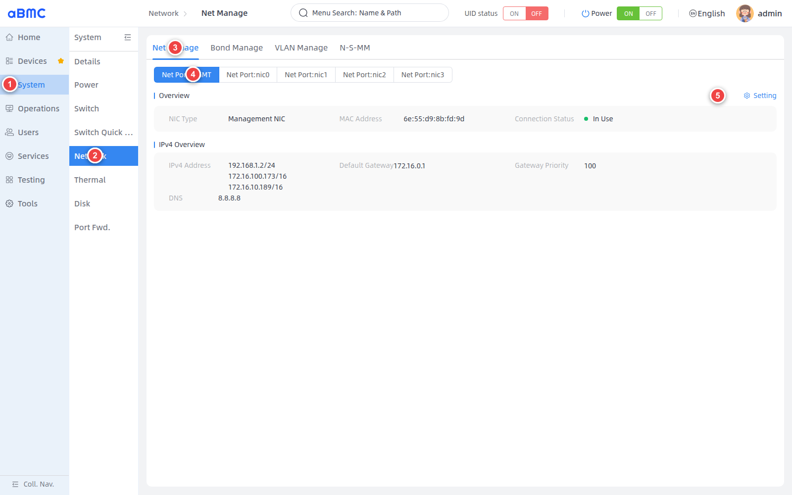
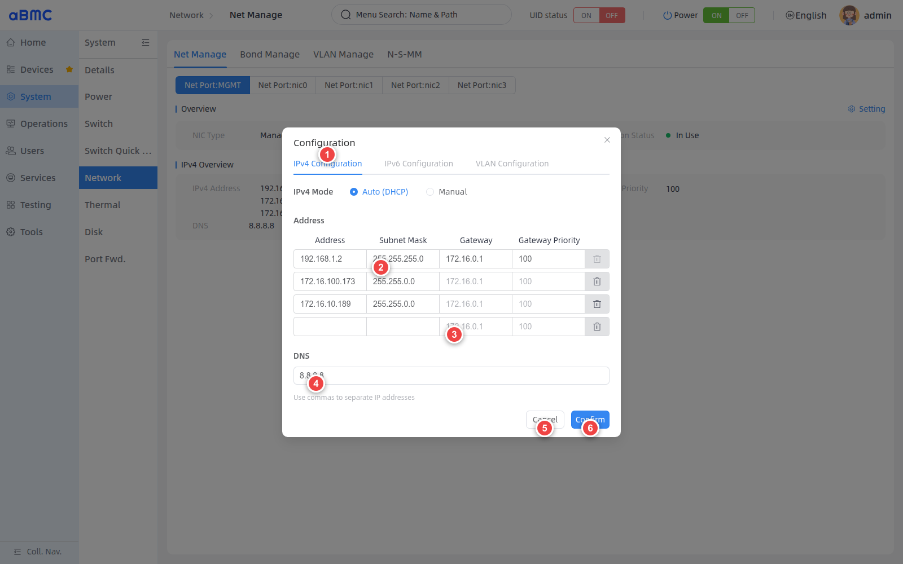
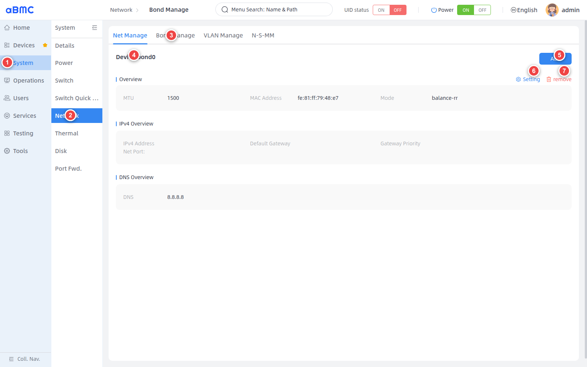
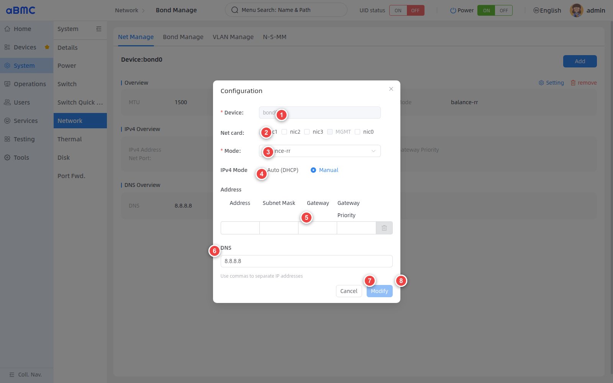
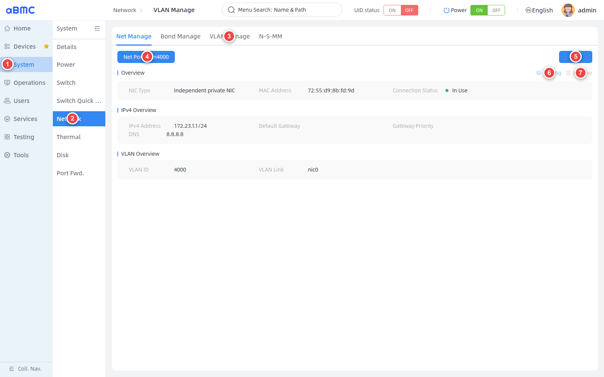
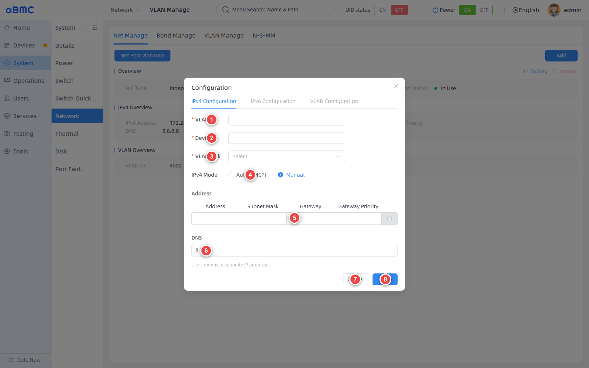

# BMC 网络管理

## 简介

BMC 网络管理（BMC Network Manager是aBMC面向管理控制器提供的网络状态查看和配置功能，由以下三个模块组成。
1. Net Manage：查看物理网口状态，并通过 DHCP 或手动方式配置 IPv4 地址、默认网关、网关优先级和 DNS。
2. Bond Manage：将多个可用网口组成 Bond 聚合设备，并配置聚合模式和 IPv4 网络参数。
3. VLAN Manage：在指定网口上创建 VLAN 子接口，并配置 VLAN ID、关联网口和 IPv4 网络参数。

## 开发愿景
1. 为用户提供统一、可视化的 BMC 网络状态和配置入口，方便快速确认管理网络、聚合网络和 VLAN 网络状态。
2. 通过网卡类型限制、参数校验和配置结果确认，降低误修改关键网口导致 BMC 失联的风险。


# 功能使用

## 查看和配置 BMC 网卡

<CodeBlockTabs defaultValue="WEB">
  <CodeBlockTabsList>
    <CodeBlockTabsTrigger value="WEB">WEB</CodeBlockTabsTrigger>
    <CodeBlockTabsTrigger value="CLI">CLI</CodeBlockTabsTrigger>
    <CodeBlockTabsTrigger value="API">API</CodeBlockTabsTrigger>
  </CodeBlockTabsList>

  <CodeBlockTab value="WEB">
    ### 进入 BMC 网络管理页面 [step]

    1. 在左侧主导航栏中选择 **System**。
    2. 在二级导航栏中选择 **Network**。
    3. 在页面顶部选择 **Net Manage**。
    4. 在网口页签中选择目标网卡，例如 **Net Port:MGMT** 或 **Net Port:nic1**。
    5. 需要修改配置时，单击 **Setting**。

    

    ### 查看网卡信息 [step]

    在修改配置前，应根据网口名称和 MAC 地址确认目标网卡，并记录原有网络配置。

    | 页面字段 | 说明 |
    | --- | --- |
    | Net Port | BMC 网卡名称，例如 `MGMT`、`nic0` 或 `nic1`。页面不显示回环接口 `lo`。 |
    | NIC Type | 网卡的管理类型。将鼠标指针移至 **Setting** 可查看当前类型的用途和配置限制。 |
    | MAC Address | 网卡 MAC 地址，用于识别物理接口。 |
    | Connection Status | 网口当前连接状态，例如 **In Use**、**Not In Use** 或 **Exception**。 |
    | IPv4 Address | 当前 IPv4 地址和前缀长度。同一网卡可显示多个地址。 |
    | Default Gateway | 当前 IPv4 默认网关。 |
    | Gateway Priority | 当前默认网关的路由优先级。 |
    | DNS | 当前 DNS 服务器。 |

    ### 判断网卡是否允许配置 [step]

    - **Setting** 可用：当前网卡允许用户修改配置。
    - **Setting** 禁用：当前网卡可能是 BMC 与子板通信使用的私有网卡、Bond 设备或 Bond 成员，不允许用户直接配置。

    <Callout title="网卡类型限制" type="warn">
      不要尝试通过 CLI 或 API 绕过页面限制。配置前应确认网卡资源中的 `Oem.Firefly.SettingEnabled` 为 `true`。
    </Callout>

    ### 配置 IPv4 [step]

    1. 确认当前为 **IPv4 Configuration**。**IPv6 Configuration** 和 **VLAN Configuration** 当前不可用。
    2. 在 **IPv4 Mode** 中选择 **Auto (DHCP)** 或 **Manual**。
    3. 使用 Manual 时，输入 **Address** 和 **Subnet Mask**。填写完整地址后，页面会自动增加空白行；如需默认路由，在第一行填写 **Gateway** 和 **Gateway Priority**。
    4. 在 **DNS** 中输入 DNS 服务器；多个地址使用英文逗号分隔。
    5. 如果不保存修改，单击 **Cancel**。
    6. 检查参数无误后，单击 **Confirm**。

    

    ### 配置规则 [step]

    | 配置项 | 规则 |
    | --- | --- |
    | Auto (DHCP) | 由 DHCP 服务分配 IPv4 地址。 |
    | Address | Manual 模式至少填写一个有效 IPv4 地址；支持同一网卡配置多个地址。 |
    | Subnet Mask | Manual 模式中，每个静态地址必须同时填写有效的子网掩码。 |
    | Gateway | 可选；必须为有效 IPv4 地址。多地址场景中只在第一行输入。 |
    | Gateway Priority | 填写网关时应同时填写正整数优先级。同一网关和优先级组合不能与其他网卡或 VLAN 重复。 |
    | DNS | 可选；必须为有效 IP 地址，多个地址使用英文逗号分隔。 |

    ### 确认配置结果 [step]

    1. 关闭设置窗口并等待页面重新获取网卡信息。
    2. 重新选择目标 **Net Port**。
    3. 确认 **IPv4 Address**、**Default Gateway**、**Gateway Priority** 和 **DNS** 已更新。
    4. 从对应网段验证 BMC 地址连通性、默认路由和域名解析。

    <Callout title="BMC 网络变更风险" type="warn">
      修改当前正在使用的管理地址、子网掩码或默认网关可能使 WEB、CLI 和 API 连接立即中断。操作前应记录原配置，并准备串口或其他独立恢复通道。截图中的地址仅用于说明页面位置。
    </Callout>
  </CodeBlockTab>

  <CodeBlockTab value="CLI">
    ### 查看 BMC 网卡信息 [step]

    不指定配置参数时，`bmc ethernet` 返回 BMC 网卡信息。

    ```bash
    bmc ethernet --protocol https --ip <BMC_IP> --port <BMC_PORT> --user <USERNAME> --password <PASSWORD> --core bmc
    ```

    使用 `--interface` 查看指定网卡。

    ```bash
    bmc ethernet --protocol https --ip <BMC_IP> --port <BMC_PORT> --user <USERNAME> --password <PASSWORD> --core bmc --interface <INTERFACE>
    ```

    ### 使用 DHCP [step]

    ```bash
    bmc ethernet --protocol https --ip <BMC_IP> --port <BMC_PORT> --user <USERNAME> --password <PASSWORD> --core bmc --interface <INTERFACE> --interface-dhcp4=true
    ```

    ### 配置静态 IPv4 [step]

    以下地址属于文档示例网段，执行前必须替换为现场规划值。

    ```bash
    bmc ethernet --protocol https --ip <BMC_IP> --port <BMC_PORT> --user <USERNAME> --password <PASSWORD> --core bmc --interface <INTERFACE> --interface-dhcp4=false --interface-ip 192.0.2.10 --interface-ip-cidr 24 --interface-gateway 192.0.2.1 --interface-gateway-metric 100 --interface-dns 192.0.2.53
    ```

    CLI 每次只能提交一个静态地址和一个 DNS 服务器。如需为同一网卡配置多个地址或多个 DNS，请使用 WEB 或 API。

    ### 参数说明 [step]

    | 参数 | 是否必填 | 说明 |
    | --- | --- | --- |
    | `--protocol` | 是 | 请求协议，例如 `https`。 |
    | `--ip` | 是 | BMC 管理地址。 |
    | `--port` | 是 | Redfish 服务端口。 |
    | `--user` | 是 | HTTP Basic 认证用户名。 |
    | `--password` | 是 | HTTP Basic 认证密码。 |
    | `--core` | 是 | BMC 网络管理固定使用 `bmc`。 |
    | `--interface` | 查看单个接口或配置时必填 | 目标网卡名称，例如 `MGMT` 或 `nic1`。 |
    | `--interface-dhcp4` | 配置时必填 | `true` 表示 DHCP，`false` 表示静态配置。 |
    | `--interface-ip` | 静态配置时使用 | IPv4 地址。 |
    | `--interface-ip-cidr` | 否 | IPv4 前缀长度；指定 IP 但未指定该参数时，CLI 默认使用 `24`。 |
    | `--interface-gateway` | 否 | IPv4 默认网关。 |
    | `--interface-gateway-metric` | 否 | 网关路由优先级，必须为整数。 |
    | `--interface-dns` | 否 | DNS 服务器。当前 CLI 每次接收一个 DNS 地址。 |
    | `--output-format` | 否 | 指定客户端输出格式。 |

    <Callout title="凭据和网络安全" type="warn">
      命令行中的密码可能被 Shell 历史记录或进程列表保存。执行配置命令前，应确认目标网卡允许配置，并准备独立恢复通道。
    </Callout>
  </CodeBlockTab>

  <CodeBlockTab value="API">
    | 操作 | 方法 | URI |
    | --- | --- | --- |
    | 查看 BMC 网卡集合 | GET | `/redfish/v1/Systems/bmc/EthernetInterfaces` |
    | 查看指定 BMC 网卡 | GET | `/redfish/v1/Systems/bmc/EthernetInterfaces/{EthernetInterfaceId}` |
    | 查询配置动作参数 | GET | `/redfish/v1/Systems/bmc/EthernetInterfaces/{EthernetInterfaceId}/Actions/Oem/Firefly/ConfigureActionInfo` |
    | 配置指定 BMC 网卡 | POST | `/redfish/v1/Systems/bmc/EthernetInterfaces/{EthernetInterfaceId}/Actions/Oem/Firefly/EthernetInterface.Configure` |

    <Callout title="提示" type="info">
      关于接口认证、请求参数、返回字段和错误码的详细说明，请查看 Redfish API 文档。
    </Callout>
  </CodeBlockTab>
</CodeBlockTabs>


## 配置 BMC 网络聚合

<CodeBlockTabs defaultValue="WEB">
  <CodeBlockTabsList>
    <CodeBlockTabsTrigger value="WEB">WEB</CodeBlockTabsTrigger>
    <CodeBlockTabsTrigger value="API">API</CodeBlockTabsTrigger>
  </CodeBlockTabsList>

  <CodeBlockTab value="WEB">
    ### 打开 Bond Manage [step]

    1. 在左侧主导航栏中选择 **System**。
    2. 在二级导航栏中选择 **Network**。
    3. 在页面顶部选择 **Bond Manage**。
    4. 有多个 Bond 设备时，选择目标 **Device**。
    5. 单击 **Add** 新增 Bond 设备。
    6. 单击 **Setting** 修改当前 Bond 设备。
    7. 单击 **remove** 删除当前 Bond 设备。

    

    ### 查看 Bond 状态 [step]

    | 页面字段 | 说明 |
    | --- | --- |
    | Device | Bond 设备名称，例如 `bond0`。 |
    | MTU | Bond 设备的最大传输单元。 |
    | MAC Address | Bond 设备的 MAC 地址。 |
    | Mode | 当前网络聚合模式。 |
    | IPv4 Address | Bond 设备当前的 IPv4 地址。 |
    | Default Gateway | 当前 IPv4 默认网关。 |
    | Gateway Priority | 默认网关的路由优先级。 |
    | Net Port | 当前 Bond 的成员网口。 |
    | DNS | 当前 DNS 服务器。 |

    ### 新增 Bond 设备 [step]

    1. 在 **Device** 中输入 Bond 设备名称。
    2. 在 **Net card** 中选择至少两个可用网口。灰色网口当前不能加入新 Bond。
    3. 在 **Mode** 中选择聚合模式。
    4. 在 **IPv4 Mode** 中选择 **Auto (DHCP)** 或 **Manual**。
    5. 使用 Manual 时，填写地址、子网掩码、网关和网关优先级。
    6. 根据需要填写 DNS；多个地址使用英文逗号分隔。
    7. 不保存时单击 **Cancel**。
    8. 检查配置后单击 **Add**。

    

    ### 修改或删除 Bond 设备 [step]

    修改 Bond 时，设备名称不可更改，可调整成员网口、聚合模式和 IPv4 参数。至少选择两个可用成员网口后，**Modify** 才可提交。

    

    删除 Bond 时，单击 **remove**，在确认窗口中检查设备名称后再确认删除。删除前应先确认该 Bond 未承载当前管理连接或业务流量。

    ### Bond 配置规则 [step]

    | 配置项 | 规则 |
    | --- | --- |
    | Device | 必填；长度为 `3–15` 个字符，必须以 `bond` 开头，只能包含英文字母和数字。新增后不能在修改窗口中更名。 |
    | Net card | 至少选择两个非回环网口。私有网口、禁止配置的网口和已属于其他 Bond 的网口不可选。 |
    | Mode | 可选值为 `802.3ad`、`active-backup`、`balance-alb`、`balance-rr`、`balance-tlb`、`balance-xor`、`broadcast`。 |
    | Auto (DHCP) | 由 DHCP 服务为 Bond 设备分配 IPv4 地址。 |
    | Manual | 支持配置一个或多个 IPv4 地址、子网掩码、默认网关、网关优先级和 DNS。 |
    | Setting | 仅当 Bond 资源的 `Oem.Firefly.SettingEnabled` 为 `true` 时可用。 |

    <Callout title="成员网口影响" type="warn">
      网口加入 Bond 后，不能继续作为独立网口直接配置。变更 Bond 成员或模式可能造成链路短暂中断；使用 `802.3ad` 等模式时，还应确保对端交换机配置与服务器一致。
    </Callout>
  </CodeBlockTab>

  <CodeBlockTab value="API">
    | 操作 | 方法 | URI |
    | --- | --- | --- |
    | 查看 Bond 集合 | GET | `/redfish/v1/Systems/bmc/NetworkBondings` |
    | 查看指定 Bond | GET | `/redfish/v1/Systems/bmc/NetworkBondings/{NetworkBondingId}` |
    | 查询新增动作参数 | GET | `/redfish/v1/Systems/bmc/NetworkBondings/Actions/Oem/Firefly/AddConfigureActionInfo` |
    | 查询修改动作参数 | GET | `/redfish/v1/Systems/bmc/NetworkBondings/{NetworkBondingId}/Actions/Oem/Firefly/ConfigureActionInfo` |
    | 查询删除动作参数 | GET | `/redfish/v1/Systems/bmc/NetworkBondings/Actions/Oem/Firefly/DelConfigureActionInfo` |
    | 新增 Bond | POST | `/redfish/v1/Systems/bmc/NetworkBondings/Actions/Oem/Firefly/NetworkBondingAdd.Configure` |
    | 修改 Bond | POST | `/redfish/v1/Systems/bmc/NetworkBondings/{NetworkBondingId}/Actions/Oem/Firefly/NetworkBonding.Configure` |
    | 删除 Bond | POST | `/redfish/v1/Systems/bmc/NetworkBondings/Actions/Oem/Firefly/NetworkBondingDel.Configure` |

    新增请求主要包含 `Device`、`Mode`、`Interfaces` 和 `IPv4Addresses`；修改时通过 URI 指定 Bond 设备，不提交 `Device`；删除请求提交目标 `Device`。

    <Callout title="提示" type="info">
      关于接口认证、请求参数、返回字段和错误码的详细说明，请查看 Redfish API 文档。
    </Callout>
  </CodeBlockTab>
</CodeBlockTabs>


## 管理 BMC VLAN

<CodeBlockTabs defaultValue="WEB">
  <CodeBlockTabsList>
    <CodeBlockTabsTrigger value="WEB">WEB</CodeBlockTabsTrigger>
    <CodeBlockTabsTrigger value="API">API</CodeBlockTabsTrigger>
  </CodeBlockTabsList>

  <CodeBlockTab value="WEB">
    ### 打开 VLAN Manage [step]

    1. 在左侧主导航栏中选择 **System**。
    2. 在二级导航栏中选择 **Network**。
    3. 在页面顶部选择 **VLAN Manage**。
    4. 有多个 VLAN 设备时，选择目标 **Net Port**。
    5. 单击 **Add** 新增 VLAN 设备。
    6. **Setting** 可用时，可修改当前 VLAN 的 IPv4 配置。
    7. **remove** 可用时，可删除当前 VLAN。

    

    ### 查看 VLAN 状态 [step]

    | 页面字段 | 说明 |
    | --- | --- |
    | Net Port | VLAN 设备名称，例如 `vlan4000`。 |
    | NIC Type | VLAN 设备的管理类型。 |
    | MAC Address | VLAN 设备的 MAC 地址。 |
    | Connection Status | VLAN 设备当前的连接状态。 |
    | IPv4 Address | VLAN 设备当前的 IPv4 地址和前缀长度。 |
    | Default Gateway | 当前 IPv4 默认网关。 |
    | Gateway Priority | 默认网关的路由优先级。 |
    | DNS | 当前 DNS 服务器。 |
    | VLAN ID | VLAN 标识。 |
    | VLAN Link | VLAN 子接口关联的底层网口。 |

    ### 新增 VLAN 设备 [step]

    1. 在 **VLAN ID** 中输入 VLAN 标识。
    2. 在 **Device** 中确认 VLAN 设备名称。输入有效 VLAN ID 并离开输入框后，页面会在该字段为空时自动生成 `vlan<VLAN_ID>`。
    3. 在 **VLAN Link** 中选择底层网口。
    4. 在 **IPv4 Mode** 中选择 **Auto (DHCP)** 或 **Manual**。
    5. 使用 Manual 时，填写地址、子网掩码、网关和网关优先级。
    6. 根据需要填写 DNS；多个地址使用英文逗号分隔。
    7. 不保存时单击 **Cancel**。
    8. 检查配置后单击 **Add**。

    

    ### 修改或删除 VLAN [step]

    - **Setting** 可用时，可修改 IPv4 模式、地址、子网掩码、网关、网关优先级和 DNS。已有 VLAN 的 VLAN ID、设备名称和 VLAN Link 不能在修改窗口中更改。
    - **remove** 可用时，单击该按钮并在确认窗口中确认删除。
    - **Setting** 和 **remove** 同时禁用时，表示当前 VLAN 的 `Oem.Firefly.SettingEnabled` 为 `false`，例如系统内部通信使用的独立私有 VLAN。此类 VLAN 不能通过当前页面修改或删除。

    ### VLAN 配置规则 [step]

    | 配置项 | 规则 |
    | --- | --- |
    | VLAN ID | 必填；必须为 `1–4094` 范围内的整数。 |
    | Device | 新增时必填。默认可按 `vlan<VLAN_ID>` 生成；创建后不能在修改窗口中更名。 |
    | VLAN Link | 新增时必填；选择承载 VLAN 的底层网口，回环接口 `lo` 不可用。 |
    | Auto (DHCP) | 由 DHCP 服务为 VLAN 设备分配 IPv4 地址。 |
    | Manual | 支持配置一个或多个 IPv4 地址、子网掩码、默认网关、网关优先级和 DNS。 |
    | Gateway Priority | 同一网关和优先级组合不能与其他网卡或 VLAN 重复。 |
    | SettingEnabled | 为 `false` 时，WEB 中的修改和删除按钮均不可用。不要绕过限制操作系统内部 VLAN。 |

    <Callout title="VLAN 连通性要求" type="warn">
      创建 VLAN 前，应确认对端交换机端口允许对应 VLAN ID，并确认 VLAN Link 选择正确。错误的 VLAN ID、底层网口或网关配置可能导致 VLAN 地址无法访问。
    </Callout>
  </CodeBlockTab>
  
  <CodeBlockTab value="API">
    | 操作 | 方法 | URI |
    | --- | --- | --- |
    | 查看 VLAN 集合 | GET | `/redfish/v1/Systems/bmc/NetworkVLANs` |
    | 查看指定 VLAN | GET | `/redfish/v1/Systems/bmc/NetworkVLANs/{NetworkVLANId}` |
    | 查询新增动作参数 | GET | `/redfish/v1/Systems/bmc/NetworkVLANs/Actions/Oem/Firefly/AddConfigureActionInfo` |
    | 查询修改动作参数 | GET | `/redfish/v1/Systems/bmc/NetworkVLANs/{NetworkVLANId}/Actions/Oem/Firefly/ConfigureActionInfo` |
    | 查询删除动作参数 | GET | `/redfish/v1/Systems/bmc/NetworkVLANs/Actions/Oem/Firefly/DelConfigureActionInfo` |
    | 新增 VLAN | POST | `/redfish/v1/Systems/bmc/NetworkVLANs/Actions/Oem/Firefly/NetworkVlANAdd.Configure` |
    | 修改 VLAN | POST | `/redfish/v1/Systems/bmc/NetworkVLANs/{NetworkVLANId}/Actions/Oem/Firefly/NetworkVLAN.Configure` |
    | 删除 VLAN | POST | `/redfish/v1/Systems/bmc/NetworkVLANs/Actions/Oem/Firefly/NetworkVLANDel.Configure` |

    新增请求主要包含 `Device`、`Id`、`Link` 和 `IPv4Addresses`；修改时通过 URI 指定 VLAN 设备，并提交 `Id`、`Link` 和 `IPv4Addresses`；删除请求提交目标 `Device`。

    <Callout title="提示" type="info">
      关于接口认证、请求参数、返回字段和错误码的详细说明，请查看 Redfish API 文档。
    </Callout>
  </CodeBlockTab>
</CodeBlockTabs>


## 常见问题 FAQ

### 1.Setting 不可用
当前网卡、Bond 或 VLAN 可能是系统内部通信接口、禁止配置的私有接口或 Bond 成员。查询对应资源并确认 `Oem.Firefly.SettingEnabled`；该值为 `false` 时不能修改。

### 2.修改后无法继续访问 BMC
如果修改的是当前通信网口、Bond 或 VLAN，原地址可能立即失效。使用新地址重新连接；如无法连接，通过串口或其他独立通道恢复原配置。

### 3.为什么部分网口不能加入 Bond
回环接口、私有网口、`SettingEnabled` 为 `false` 的网口，以及已经属于其他 Bond 的网口不可加入新 Bond。一个 Bond 至少需要两个可用成员网口。

### 4.Bond 模式如何选择
一般主备场景可使用 `active-backup`；需要链路聚合控制协议时使用 `802.3ad`，并同步配置交换机；其他负载均衡模式应根据网络拓扑和对端能力选择。

### 5.VLAN 的 Setting 和 remove 为什么同时禁用
当前 VLAN 的 `SettingEnabled` 为 `false`，通常表示该 VLAN 用于系统内部或私有通信。不要通过 API 绕过限制修改或删除。

### 6.如何配置多个 IPv4 地址
在 WEB 的 Manual 模式中填完一行 **Address** 和 **Subnet Mask** 后，页面会自动增加空白行。CLI 每次只能为物理网卡提交一个地址，多地址场景请使用 WEB 或 API。

### 7.网关优先级提示冲突
同一网关和优先级组合已被其他网卡或 VLAN 使用。请调整 **Gateway** 或 **Gateway Priority**，避免与已有配置完全相同。
