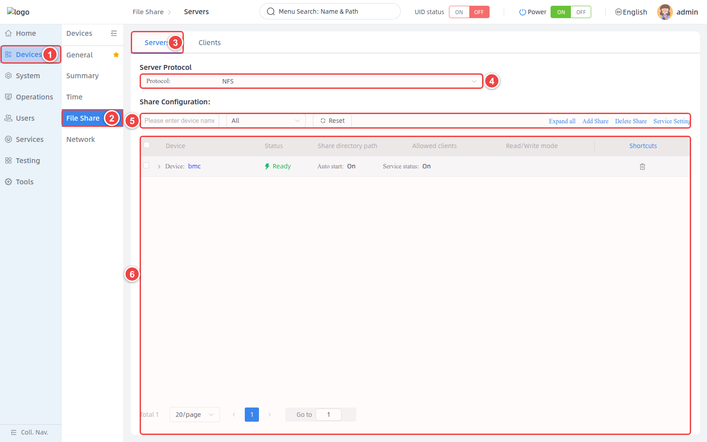
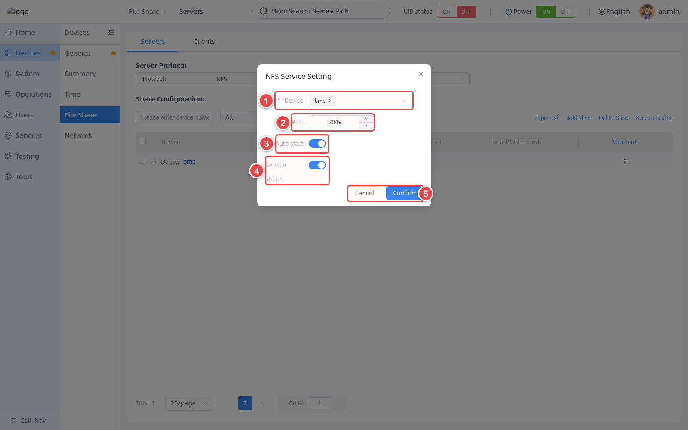
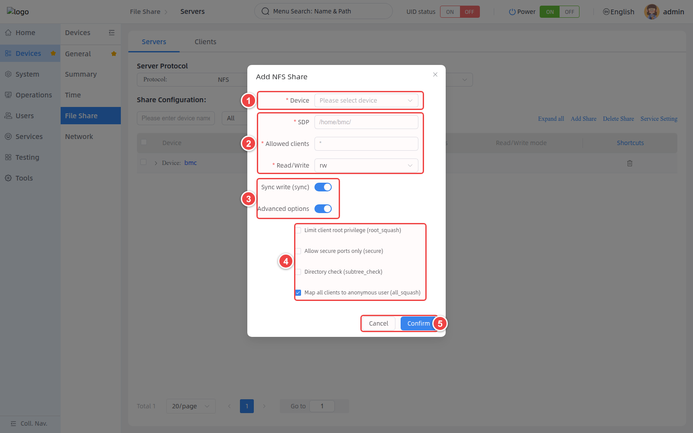
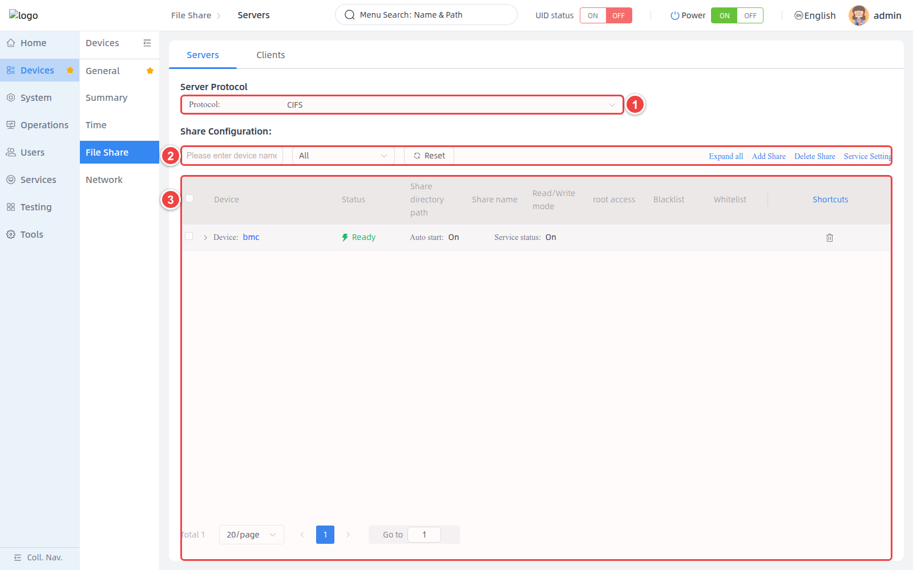
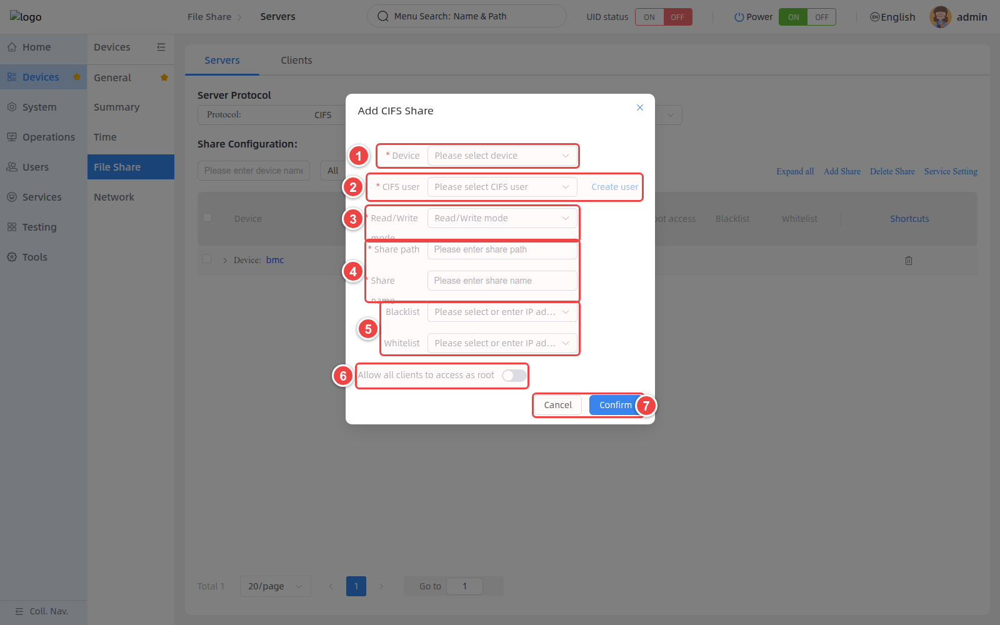
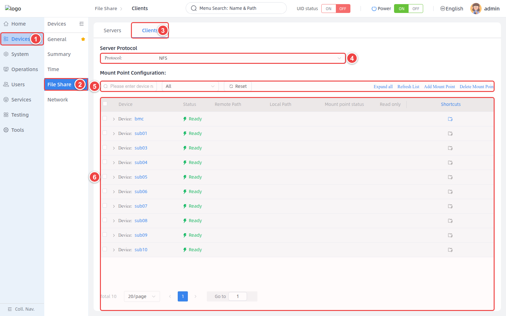
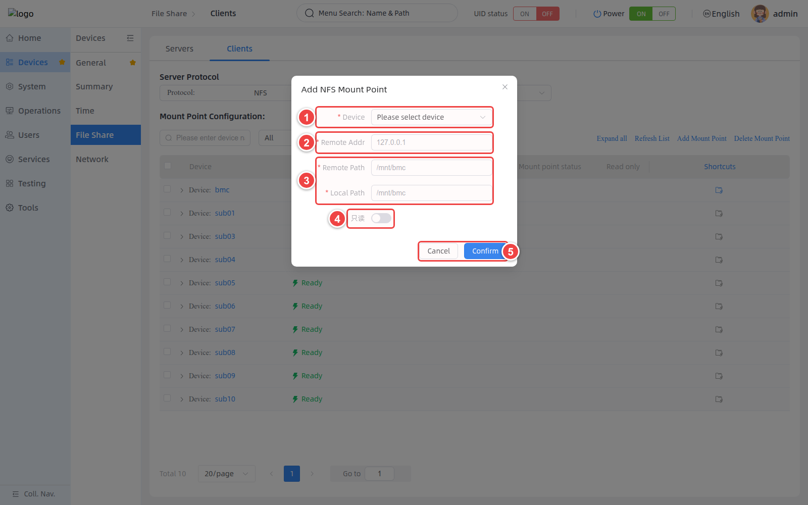
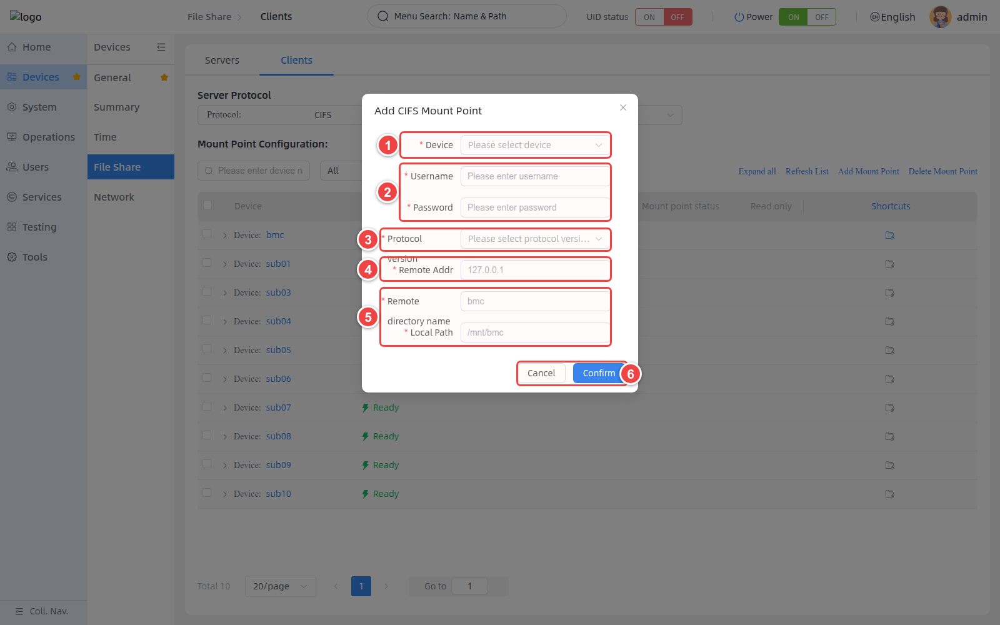
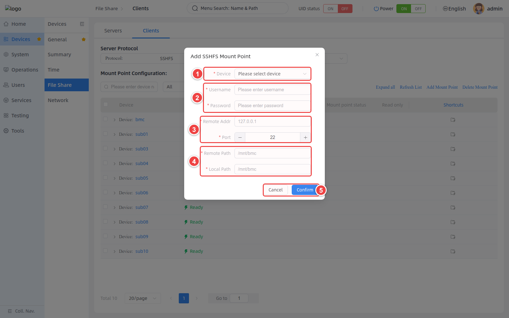

# 文件共享

## 简介

文件共享（File Share）是aBMC面向阵列式服务器设计的阵列文件共享群控系统。**Servers** 页面支持通过 NFS 和 CIFS 对外提供共享目录；**Clients** 页面支持将 NFS、CIFS 或 SSHFS 远程资源挂载到目标设备。

1. NFS 适用于 Linux/Unix 类客户端，支持设置允许的客户端、读写模式和 NFS 导出选项。
2. CIFS 适用于需要 Samba/SMB 兼容访问的客户端，支持共享用户、共享名称、读写模式和访问名单。
3. SSHFS 仅用于客户端挂载，通过 SSH 账号将远程目录挂载到设备本地路径。

## 开发愿景

1. 为多设备环境提供统一的共享服务和目录管理入口。
2. 通过最小权限、客户端范围和读写模式配置，降低共享目录被误写或未授权访问的风险。

# 功能使用

## 打开文件共享服务端页面

<CodeBlockTabs defaultValue="WEB">
  <CodeBlockTabsList>
    <CodeBlockTabsTrigger value="WEB">WEB</CodeBlockTabsTrigger>
  </CodeBlockTabsList>

  <CodeBlockTab value="WEB">
    ### 进入 Server 页面 [step]

    1. 在左侧导航栏中选择 **Devices**。
    2. 在二级导航栏中选择 **File Share**。
    3. 在页面顶部选择 **Servers**。
    4. 在 **Protocol** 中选择 **NFS** 或 **CIFS**。
    5. 使用搜索、状态筛选、**Reset**、**Expand all** 和页面右侧的共享操作。
    6. 在列表中查看设备状态、服务状态和已配置的共享目录。

    

    ### 页面操作说明 [step]

    | 操作 | 说明 |
    | --- | --- |
    | All / Online / Offline | 按设备在线状态筛选列表。 |
    | Reset | 清除搜索和筛选条件。 |
    | Expand all / Collapse all | 展开或收起所有设备的共享目录明细。 |
    | Add Share | 在选定设备上新增 NFS 或 CIFS 共享。 |
    | Delete Share | 删除勾选的共享目录。 |
    | Service Setting | 设置共享服务的自启动、运行状态和端口。 |

    <Callout title="状态说明" type="info">
      设备显示 **Ready** 仅表示设备可用。**Auto start** 表示共享服务是否随系统启动，**Service status** 表示服务当前是否运行。
    </Callout>
  </CodeBlockTab>
</CodeBlockTabs>

## 管理 NFS 共享

<CodeBlockTabs defaultValue="WEB">
  <CodeBlockTabsList>
    <CodeBlockTabsTrigger value="WEB">WEB</CodeBlockTabsTrigger>
    <CodeBlockTabsTrigger value="CLI">CLI</CodeBlockTabsTrigger>
    <CodeBlockTabsTrigger value="API">API</CodeBlockTabsTrigger>
  </CodeBlockTabsList>

  <CodeBlockTab value="WEB">
    ### 设置 NFS 服务 [step]

    1. 将 **Protocol** 设置为 **NFS**。
    2. 单击 **Service Setting**。
    3. 在 **Device** 中选择一个或多个设备。
    4. 在 **Port** 中设置 NFS 服务端口，端口取值范围为 `1–65535`，默认端口为 `2049`。
    5. 使用 **Auto start** 设置服务是否随系统启动。
    6. 使用 **Service status** 启动或停止当前服务。
    7. 检查配置无误后，单击 **Confirm**。

    

    ### 新增 NFS 共享 [step]

    1. 单击 **Add Share**，打开 **Add NFS Share** 窗口。
    2. 在 **Device** 中选择一个或多个目标设备。Android 设备不支持此处的 NFS 共享配置。
    3. 在 **SDP** 中输入要导出的共享目录路径，例如 `/home/bmc/share`。
    4. 在 **Allowed clients** 中输入允许访问的客户端地址或网段。`*` 表示允许所有客户端。
    5. 在 **Read/Write** 中选择 `rw` 或 `ro`。
    6. 根据需要设置 **Sync write (sync)** 和 **Advanced options**。
    7. 检查高级选项和访问范围，然后单击 **Confirm**。

    

    ### NFS 共享参数说明 [step]

    | 参数 | 说明 | 配置建议 |
    | --- | --- | --- |
    | Device | 应用配置的目标设备，支持多选。 | 多设备批量配置前，确认目录在每个设备上均符合预期。 |
    | SDP | 要通过 NFS 导出的本地目录路径。 | 使用绝对路径，并确认目录及其权限正确。 |
    | Allowed clients | 允许访问的客户端地址、主机或网段。 | 优先指定可信网段；仅在隔离网络中使用 `*`。 |
    | rw / ro | `rw` 允许读写，`ro` 仅允许读取。 | 不需要客户端修改内容时使用 `ro`。 |
    | sync | 同步写入，服务端完成实际写入后再返回。 | 数据一致性优先时建议开启。 |
    | root_squash | 将客户端 root 用户映射为低权限用户。 | 除非已明确评估 root 访问需求，否则建议开启。 |
    | secure | 仅允许客户端使用特权源端口访问。 | 开启前确认客户端支持该限制。 |
    | subtree_check | 检查客户端访问的文件是否位于导出子树中。 | 根据目录结构和兼容性要求设置。 |
    | all_squash | 将所有客户端用户映射为匿名用户。 | 适用于不希望保留客户端用户身份的共享。 |

    <Callout title="默认选项" type="info">
      WEB 窗口默认使用 `rw`，开启 `sync` 和高级选项，并默认选中 `all_squash`。提交前应根据实际权限策略重新检查。
    </Callout>

    ### 查看和删除 NFS 共享 [step]

    1. 在 NFS 列表中展开目标设备，查看 **Share directory path**、**Allowed clients** 和 **Read/Write mode**。
    2. 要删除共享时，勾选对应目录后单击 **Delete Share**，或使用该行的删除图标。
    3. 确认删除对象时，同时核对共享路径和允许的客户端。

    <Callout title="删除影响" type="warn">
      删除 NFS 共享会取消目录导出，已连接的客户端可能立即无法继续访问。请先确认没有关键读写任务。
    </Callout>
  </CodeBlockTab>

  <CodeBlockTab value="CLI">
    ### 查看 NFS 服务状态 [step]

    ```bash
    bmc share server nfs status --protocol http --ip <BMC_IP> --port <BMC_PORT> --user <USERNAME> --password <PASSWORD> --core <NODE_ID>
    ```

    ### 设置 NFS 服务 [step]

    以下示例设置服务随系统启动、立即运行，并将服务端口设为 `2049`。

    ```bash
    bmc share server nfs set-status --protocol http --ip <BMC_IP> --port <BMC_PORT> --user <USERNAME> --password <PASSWORD> --core <NODE_ID> --enabled --active --service-port 2049
    ```

    要停止服务并取消自启动，应显式传入布尔值，同时保留有效端口。

    ```bash
    bmc share server nfs set-status --protocol http --ip <BMC_IP> --port <BMC_PORT> --user <USERNAME> --password <PASSWORD> --core <NODE_ID> --enabled=false --active=false --service-port 2049
    ```

    ### 查看 NFS 共享目录 [step]

    ```bash
    bmc share server nfs show --protocol http --ip <BMC_IP> --port <BMC_PORT> --user <USERNAME> --password <PASSWORD> --core <NODE_ID>
    ```

    ### 创建 NFS 共享 [step]

    ```bash
    bmc share server nfs create --protocol http --ip <BMC_IP> --port <BMC_PORT> --user <USERNAME> --password <PASSWORD> --core <NODE_ID> --path /share --allow "*" --sync --all-squash
    ```

    ### 删除 NFS 共享 [step]

    NFS 共享由共享路径和允许的客户端共同定位，删除时必须同时提供 `--path` 和 `--allow`。

    ```bash
    bmc share server nfs delete --protocol http --ip <BMC_IP> --port <BMC_PORT> --user <USERNAME> --password <PASSWORD> --core <NODE_ID> --path /share --allow "*"
    ```

    ### NFS CLI 参数说明 [step]

    | 参数 | 适用命令 | 说明 |
    | --- | --- | --- |
    | `--core` | 全部 | 目标设备或子板的 Node ID。 |
    | `--enabled` | `set-status` | 设置服务是否随系统启动。 |
    | `--active` | `set-status` | 设置服务当前是否运行。 |
    | `--service-port` | `set-status` | 共享服务监听端口。 |
    | `--path` | `create` / `delete` | 共享目录路径。 |
    | `--allow` | `create` / `delete` | 允许的客户端地址或网段。 |
    | `--ro` | `create` | 将共享设置为只读；不指定时为可读写。 |
    | `--sync` | `create` | 开启同步写入。 |
    | `--root-squash` | `create` | 开启 root 用户映射。 |
    | `--secure` | `create` | 仅允许特权源端口。 |
    | `--subtree-check` | `create` | 开启子树检查。 |
    | `--all-squash` | `create` | 将所有客户端用户映射为匿名用户。 |

    <Callout title="CLI 布尔选项" type="warn">
      CLI 中未指定的布尔选项默认为 `false`，与 WEB 新增 NFS 共享时的默认值不完全相同。使用 `create` 或 `set-status` 时应显式传入需要开启的选项。
    </Callout>
  </CodeBlockTab>

  <CodeBlockTab value="API">
    ### NFS Server API [step]

    | 操作 | 方法 | URI |
    | --- | --- | --- |
    | 查看 NFS 共享服务 | GET | `/redfish/v1/Systems/bmc/Oem/Firefly/NFS/ShareService` |
    | 查看指定设备的 NFS 共享 | GET | `/redfish/v1/Systems/{NodeId}/Oem/Firefly/NFS/ShareDirs` |
    | 设置 NFS 共享服务 | POST | `/redfish/v1/Systems/{NodeId}/Oem/Firefly/NFS/ShareService/Actions/SetShareService` |
    | 新增 NFS 共享 | POST | `/redfish/v1/Systems/{NodeId}/Oem/Firefly/NFS/ShareDirs/Actions/AddShareDir` |
    | 删除 NFS 共享 | POST | `/redfish/v1/Systems/{NodeId}/Oem/Firefly/NFS/ShareDirs/Actions/DeleteShareDir` |

    **设置 NFS 共享服务请求体**

    ```json
    {
      "Enabled": true,
      "Active": true,
      "Port": 2049
    }
    ```

    **新增 NFS 共享请求体**

    ```json
    {
      "DirPath": "/share",
      "AllowCliAddr": "*",
      "Config": {
        "ReadOnly": false,
        "Sync": true,
        "RootSquash": false,
        "AllSquash": true,
        "Secure": false,
        "SubtreeCheck": false
      }
    }
    ```

    **删除 NFS 共享请求体**

    ```json
    {
      "DirPath": "/share",
      "AllowCliAddr": "*"
    }
    ```

    <Callout title="API 说明" type="info">
      `{NodeId}` 为目标设备的 Node ID。关于接口认证、返回字段、错误码和设备支持情况，请查看 Redfish API 文档。
    </Callout>
  </CodeBlockTab>
</CodeBlockTabs>

## 管理 CIFS 共享

<CodeBlockTabs defaultValue="WEB">
  <CodeBlockTabsList>
    <CodeBlockTabsTrigger value="WEB">WEB</CodeBlockTabsTrigger>
    <CodeBlockTabsTrigger value="CLI">CLI</CodeBlockTabsTrigger>
    <CodeBlockTabsTrigger value="API">API</CodeBlockTabsTrigger>
  </CodeBlockTabsList>

  <CodeBlockTab value="WEB">
    ### 切换到 CIFS 共享 [step]

    1. 在 **Protocol** 中选择 **CIFS**。
    2. 使用页面操作区搜索、筛选、展开、新增、删除共享或设置服务。
    3. 在列表中查看 **Share directory path**、**Share name**、**Read/Write mode**、**root access**、**Blacklist** 和 **Whitelist**。

    

    ### 设置 CIFS 服务 [step]

    1. 单击 **Service Setting**。
    2. 选择目标设备，检查服务端口、**Auto start** 和 **Service status**。
    3. CIFS 默认服务端口为 `445`，端口取值范围为 `1–65535`。
    4. 检查配置无误后，单击 **Confirm**。

    <Callout title="端口兼容性" type="info">
      修改 CIFS 服务端口前，请确认服务端和客户端均支持自定义端口。如无明确需求，建议保持默认端口 `445`。
    </Callout>

    ### 新增 CIFS 共享 [step]

    1. 单击 **Add Share**，打开 **Add CIFS Share** 窗口。
    2. 在 **Device** 中选择目标设备。
    3. 在 **CIFS user** 中选择已有用户。如果没有可用用户，先选择设备，再单击 **Create user**。
    4. 在 **Read/Write mode** 中选择读写或只读。
    5. 输入 **Share path** 和 **Share name**。
    6. 根据访问策略设置 **Blacklist** 和 **Whitelist**，列表项必须为有效 IPv4 地址。
    7. 如需将所有客户端访问映射为 root，开启 **Allow all clients to access as root**。
    8. 检查配置无误后，单击 **Confirm**。

    

    ### CIFS 共享参数说明 [step]

    | 参数 | 说明 | 配置建议 |
    | --- | --- | --- |
    | Device | 应用配置的目标设备。 | 选择设备后系统才能加载该设备的 CIFS 用户。 |
    | CIFS user | 允许访问共享的 Samba 用户。 | 使用专用低权限用户，不要共用管理员账号。 |
    | Read/Write mode | 设置共享可读写或只读。 | 不需要上传或修改文件时选择只读。 |
    | Share path | 要导出的本地目录路径。 | 使用绝对路径，并确认目录权限正确。 |
    | Share name | 客户端访问 CIFS 共享时使用的名称。 | 在同一设备上使用唯一且易识别的名称。 |
    | Blacklist | 禁止访问的 IPv4 地址列表。 | 不要将同一地址同时放入黑名单和白名单。 |
    | Whitelist | 允许访问的 IPv4 地址列表。 | 对访问源明确的共享优先使用白名单。 |
    | root access | 将客户端访问强制映射为 root。 | 该选项会显著扩大权限，默认保持关闭。 |

    ### 创建 CIFS 用户 [step]

    1. 在 **Add CIFS Share** 窗口中先选择 **Device**。
    2. 单击 **Create user**。
    3. 输入用户名和密码，确认后返回共享配置窗口选择新用户。

    | 字段 | 要求 |
    | --- | --- |
    | Username | `4–16` 位，仅支持英文字母和数字。 |
    | Password | `6–20` 位，必须同时包含小写字母、大写字母和数字，不支持特殊字符。 |

    <Callout title="CIFS 用户加载失败" type="warn">
      如果获取 CIFS 用户列表失败，**Create user** 和 **Confirm** 可能不可用。请先确认已选择设备，然后检查设备在线状态和 CIFS 服务状态。
    </Callout>

    ### 删除 CIFS 共享 [step]

    1. 展开目标设备，核对共享路径、共享名称和当前访问配置。
    2. 勾选对应共享后单击 **Delete Share**，或使用该行的删除图标。
    3. 确认删除对象时，重点核对 **Share name**。
  </CodeBlockTab>

  <CodeBlockTab value="CLI">
    ### 查看 CIFS 服务状态 [step]

    ```bash
    bmc share server cifs status --protocol http --ip <BMC_IP> --port <BMC_PORT> --user <USERNAME> --password <PASSWORD> --core <NODE_ID>
    ```

    ### 设置 CIFS 服务 [step]

    ```bash
    bmc share server cifs set-status --protocol http --ip <BMC_IP> --port <BMC_PORT> --user <USERNAME> --password <PASSWORD> --core <NODE_ID> --enabled --active --service-port 445
    ```

    ### 查看 CIFS 共享目录 [step]

    ```bash
    bmc share server cifs show --protocol http --ip <BMC_IP> --port <BMC_PORT> --user <USERNAME> --password <PASSWORD> --core <NODE_ID>
    ```

    ### 创建 CIFS 共享 [step]

    以下示例允许 `user1` 和 `user2` 访问名为 `shareDir` 的共享。

    ```bash
    bmc share server cifs create --protocol http --ip <BMC_IP> --port <BMC_PORT> --user <USERNAME> --password <PASSWORD> --core <NODE_ID> --path /share --name shareDir --allow user1,user2
    ```

    如需配置客户端名单，可传入逗号分隔的 IPv4 地址。

    ```bash
    bmc share server cifs create --protocol http --ip <BMC_IP> --port <BMC_PORT> --user <USERNAME> --password <PASSWORD> --core <NODE_ID> --path /share --name shareDir --allow user1 --whitelist 192.168.1.10,192.168.1.11
    ```

    ### 删除 CIFS 共享 [step]

    ```bash
    bmc share server cifs delete --protocol http --ip <BMC_IP> --port <BMC_PORT> --user <USERNAME> --password <PASSWORD> --core <NODE_ID> --name shareDir
    ```

    ### CIFS CLI 参数说明 [step]

    | 参数 | 适用命令 | 说明 |
    | --- | --- | --- |
    | `--core` | 全部 | 目标设备或子板的 Node ID。 |
    | `--enabled` | `set-status` | 设置服务是否随系统启动。 |
    | `--active` | `set-status` | 设置服务当前是否运行。 |
    | `--service-port` | `set-status` | CIFS 服务监听端口。 |
    | `--path` | `create` | 要导出的本地目录路径。 |
    | `--name` | `create` / `delete` | CIFS 共享名称。 |
    | `--allow` | `create` | 允许访问的 Samba 用户列表，多个用户使用逗号分隔。 |
    | `--ro` | `create` | 将共享设置为只读。 |
    | `--force-root` | `create` | 将客户端访问强制映射为 root。 |
    | `--whitelist` | `create` | 允许访问的客户端列表。 |
    | `--blacklist` | `create` | 禁止访问的客户端列表。 |

    <Callout title="CIFS 用户" type="info">
      `--allow` 中的 Samba 用户必须已经存在于目标设备。当前 Server CLI 未提供创建 CIFS 用户的子命令，可通过 WEB 或 Redfish API 创建用户。
    </Callout>
  </CodeBlockTab>

  <CodeBlockTab value="API">
    ### CIFS Server API [step]

    | 操作 | 方法 | URI |
    | --- | --- | --- |
    | 查看 CIFS 共享服务 | GET | `/redfish/v1/Systems/bmc/Oem/Firefly/CIFS/ShareService` |
    | 查看指定设备的 CIFS 共享 | GET | `/redfish/v1/Systems/{NodeId}/Oem/Firefly/CIFS/ShareDirs` |
    | 设置 CIFS 共享服务 | POST | `/redfish/v1/Systems/{NodeId}/Oem/Firefly/CIFS/ShareService/Actions/SetShareService` |
    | 新增 CIFS 共享 | POST | `/redfish/v1/Systems/{NodeId}/Oem/Firefly/CIFS/ShareDirs/Actions/AddShareDir` |
    | 删除 CIFS 共享 | POST | `/redfish/v1/Systems/{NodeId}/Oem/Firefly/CIFS/ShareDirs/Actions/DeleteShareDir` |
    | 查看 CIFS 用户 | GET | `/redfish/v1/Systems/{NodeId}/Oem/Firefly/CIFS/SambaUsers` |
    | 新增 CIFS 用户 | POST | `/redfish/v1/Systems/{NodeId}/Oem/Firefly/CIFS/SambaUsers/Actions/AddSambaUser` |

    <Callout title="API 说明" type="info">
      `{NodeId}` 为目标设备的 Node ID。创建 CIFS 共享前，应先确认 `AllowUsers` 中的用户已存在。关于认证、响应字段和错误码，请查看 Redfish API 文档。
    </Callout>
  </CodeBlockTab>
</CodeBlockTabs>

## 管理客户端挂载点

<CodeBlockTabs defaultValue="WEB">
  <CodeBlockTabsList>
    <CodeBlockTabsTrigger value="WEB">WEB</CodeBlockTabsTrigger>
    <CodeBlockTabsTrigger value="CLI">CLI</CodeBlockTabsTrigger>
    <CodeBlockTabsTrigger value="API">API</CodeBlockTabsTrigger>
  </CodeBlockTabsList>

  <CodeBlockTab value="WEB">
    ### 打开 Clients 页面 [step]

    1. 在左侧导航栏中选择 **Devices**。
    2. 在二级导航栏中选择 **File Share**。
    3. 在页面顶部选择 **Clients**。
    4. 在 **Protocol** 中选择 **NFS**、**CIFS** 或 **SSHFS**。
    5. 使用搜索、状态筛选、**Reset**、**Expand all**、**Refresh List** 和挂载点操作。
    6. 在列表中查看设备、远程路径、本地路径、挂载状态和只读状态。

    

    ### Clients 页面操作说明 [step]

    | 操作 | 说明 |
    | --- | --- |
    | All / Online / Offline | 按设备在线状态筛选列表。 |
    | Reset | 清除搜索和状态筛选条件。 |
    | Expand all / Collapse all | 展开或收起所有设备的挂载点明细。 |
    | Refresh List | 重新获取挂载点和挂载状态。 |
    | Add Mount Point | 为目标设备新增当前协议的挂载点。 |
    | Delete Mount Point | 删除勾选的挂载点。 |
    | Shortcuts | 使用设备行右侧的挂载图标，直接为该设备新增挂载点。 |

    <Callout title="设备范围" type="info">
      Clients 列表不显示 Android 设备。如果设备行右侧的挂载快捷图标不可用，请先检查设备状态和当前协议的服务状态。
    </Callout>

    ### 新增 NFS 挂载点 [step]

    1. 将 **Protocol** 设置为 **NFS**，然后单击 **Add Mount Point**。
    2. 在 **Device** 中选择要执行挂载的目标设备。
    3. 在 **Remote Addr** 中输入 NFS 服务器的 IPv4 地址。
    4. 在 **Remote Path** 中输入 NFS 服务器已导出的目录，在 **Local Path** 中输入目标设备的本地挂载路径。
    5. 如果仅允许读取远程内容，开启 **只读**。
    6. 检查配置无误后，单击 **Confirm**。

    

    | 参数 | 说明 | 要求 |
    | --- | --- | --- |
    | Device | 执行挂载的目标设备。 | 设备应处于可用状态。 |
    | Remote Addr | NFS 服务器地址。 | 必须为有效 IPv4 地址。 |
    | Remote Path | NFS 服务器的导出目录。 | 必须为不包含空格的 Unix 绝对路径。 |
    | Local Path | 目标设备的本地挂载点。 | 必须为不包含空格的 Unix 绝对路径。 |
    | 只读 | 将挂载设置为只读。 | 默认关闭。 |

    ### 新增 CIFS 挂载点 [step]

    1. 将 **Protocol** 设置为 **CIFS**，然后单击 **Add Mount Point**。
    2. 选择 **Device**，输入远程 CIFS 服务器的 **Username** 和 **Password**。
    3. 在 **Protocol version** 中选择 `auto`、`SMB1`、`SMB2` 或 `SMB3`。
    4. 在 **Remote Addr** 中输入 CIFS 服务器的 IPv4 地址。
    5. 在 **Remote directory name** 中输入服务端的共享名称，在 **Local Path** 中输入本地挂载路径。
    6. 检查配置无误后，单击 **Confirm**。

    

    | 参数 | 说明 | 要求 |
    | --- | --- | --- |
    | Device | 执行挂载的目标设备。 | 设备应处于可用状态。 |
    | Username / Password | 远程 CIFS 服务器的访问凭据。 | 用户必须对目标共享具有访问权限。 |
    | Protocol version | SMB 协议版本。 | 优先使用 `auto` 或服务端支持的较新版本。 |
    | Remote Addr | CIFS 服务器地址。 | 必须为有效 IPv4 地址。 |
    | Remote directory name | CIFS 服务器的共享名称。 | 输入共享名，不要输入本地文件系统路径。 |
    | Local Path | 目标设备的本地挂载点。 | 必须为不包含空格的 Unix 绝对路径。 |

    | 版本 | 说明 | 使用建议 |
    | --- | --- | --- |
    | auto | 自动协商双方支持的版本。 | 一般场景优先使用。 |
    | SMB1 | 老旧 SMB 版本。 | 安全性较低，仅在必须兼容老旧服务器时使用。 |
    | SMB2 | 兼容性和性能较好。 | 适用于不支持 SMB3 的环境。 |
    | SMB3 | 较新的 SMB 版本。 | 服务端和网络环境支持时优先使用。 |

    ### 新增 SSHFS 挂载点 [step]

    1. 将 **Protocol** 设置为 **SSHFS**，然后单击 **Add Mount Point**。
    2. 选择 **Device**，输入远程 SSH 服务器的 **Username** 和 **Password**。
    3. 在 **Remote Addr** 中输入远程服务器的 IPv4 地址，在 **Port** 中输入 SSH 端口。默认端口为 `22`。
    4. 在 **Remote Path** 中输入远程目录，在 **Local Path** 中输入目标设备的本地挂载路径。
    5. 检查配置无误后，单击 **Confirm**。

    

    | 参数 | 说明 | 要求 |
    | --- | --- | --- |
    | Device | 执行挂载的目标设备。 | 设备应处于可用状态。 |
    | Username / Password | 远程 SSH 账号凭据。 | 账号必须有权访问远程目录。 |
    | Remote Addr | SSH 服务器地址。 | 必须为有效 IPv4 地址。 |
    | Port | SSH 服务器端口。 | 取值范围为 `1–65535`，默认为 `22`。 |
    | Remote Path | SSH 服务器上的远程目录。 | 必须为不包含空格的 Unix 绝对路径。 |
    | Local Path | 目标设备的本地挂载点。 | 必须为不包含空格的 Unix 绝对路径。 |

    ### 查看、刷新和删除挂载点 [step]

    1. 选择目标协议，展开设备行查看 **Remote Path**、**Local Path**、**Mount point status** 和 **Read only**。
    2. 单击 **Refresh List**，重新获取挂载状态。
    3. 要删除挂载点时，勾选展开列表中的挂载点后单击 **Delete Mount Point**，或使用挂载点行右侧的删除图标。
    4. 删除前核对协议、目标设备和本地挂载路径。

    <Callout title="删除影响" type="warn">
      删除挂载点会在目标设备上卸载远程资源并清理挂载配置。请先停止使用该目录的进程，并确认没有未完成的读写任务。
    </Callout>
  </CodeBlockTab>

  <CodeBlockTab value="CLI">
    ### 管理 NFS 挂载点 [step]

    **查看挂载点**

    ```bash
    bmc share client nfs show --protocol http --ip <BMC_IP> --port <BMC_PORT> --user <USERNAME> --password <PASSWORD> --core <NODE_ID>
    ```

    **创建挂载点**

    ```bash
    bmc share client nfs create --protocol http --ip <BMC_IP> --port <BMC_PORT> --user <USERNAME> --password <PASSWORD> --core <NODE_ID> --host 172.16.10.122 --remote-path /share --mount-point /mnt/share
    ```

    **删除挂载点**

    ```bash
    bmc share client nfs delete --protocol http --ip <BMC_IP> --port <BMC_PORT> --user <USERNAME> --password <PASSWORD> --core <NODE_ID> --mount-point /mnt/share
    ```

    ### 管理 CIFS 挂载点 [step]

    **查看挂载点**

    ```bash
    bmc share client cifs show --protocol http --ip <BMC_IP> --port <BMC_PORT> --user <USERNAME> --password <PASSWORD> --core <NODE_ID>
    ```

    **创建挂载点**

    ```bash
    bmc share client cifs create --protocol http --ip <BMC_IP> --port <BMC_PORT> --user <USERNAME> --password <PASSWORD> --core <NODE_ID> --host 172.16.10.122 --smb-user user1 --smb-pwd <SMB_PASSWORD> --share-name shareDir --mount-point /mnt/share --smb-version auto
    ```

    **删除挂载点**

    ```bash
    bmc share client cifs delete --protocol http --ip <BMC_IP> --port <BMC_PORT> --user <USERNAME> --password <PASSWORD> --core <NODE_ID> --mount-point /mnt/share
    ```

    ### 管理 SSHFS 挂载点 [step]

    **查看挂载点**

    ```bash
    bmc share client sshfs show --protocol http --ip <BMC_IP> --port <BMC_PORT> --user <USERNAME> --password <PASSWORD> --core <NODE_ID>
    ```

    **创建挂载点**

    ```bash
    bmc share client sshfs create --protocol http --ip <BMC_IP> --port <BMC_PORT> --user <USERNAME> --password <PASSWORD> --core <NODE_ID> --host 172.16.10.122 --ssh-port 22 --ssh-user root --ssh-pwd <SSH_PASSWORD> --remote-path /share --mount-point /mnt/share
    ```

    **删除挂载点**

    ```bash
    bmc share client sshfs delete --protocol http --ip <BMC_IP> --port <BMC_PORT> --user <USERNAME> --password <PASSWORD> --core <NODE_ID> --mount-point /mnt/share
    ```

    ### Client CLI 参数说明 [step]

    | 参数 | 适用协议 | 说明 |
    | --- | --- | --- |
    | `--core` | 全部 | 执行挂载或卸载的目标设备 Node ID。 |
    | `--host` | NFS / CIFS / SSHFS | 远程服务器地址。 |
    | `--remote-path` | NFS / SSHFS | 远程目录路径。 |
    | `--mount-point` | NFS / CIFS / SSHFS | 目标设备的本地挂载点；删除时也使用此参数定位挂载。 |
    | `--smb-user` / `--smb-pwd` | CIFS | 远程 CIFS 服务器凭据。 |
    | `--share-name` | CIFS | 远程 CIFS 共享名称。 |
    | `--smb-version` | CIFS | SMB 协议版本，可选 `auto`、`SMB1`、`SMB2` 或 `SMB3`，默认为 `auto`。 |
    | `--ssh-port` | SSHFS | SSH 服务器端口，默认为 `22`。 |
    | `--ssh-user` / `--ssh-pwd` | SSHFS | 远程 SSH 服务器凭据。 |

    <Callout title="CLI 只读选项" type="info">
      当前 Client CLI 的 `create` 子命令未提供只读参数。NFS 只读挂载可通过 WEB 配置；API 是否支持 `ReadOnly` 字段以对应设备实现为准。
    </Callout>
  </CodeBlockTab>

  <CodeBlockTab value="API">
    ### Client 挂载点 API [step]

    | 操作 | 方法 | URI |
    | --- | --- | --- |
    | 查看挂载点 | GET | `/redfish/v1/Systems/bmc/Oem/Firefly/{Protocol}/MountPoints` |
    | 新增挂载点 | POST | `/redfish/v1/Systems/{NodeId}/Oem/Firefly/{Protocol}/MountPoints/Actions/AddMountPoint` |
    | 删除挂载点 | POST | `/redfish/v1/Systems/{NodeId}/Oem/Firefly/{Protocol}/MountPoints/Actions/DeleteMountPoint` |

     <Callout title="提示" type="info">
      关于接口认证、请求参数、返回字段和错误码的详细说明，请查看 Redfish API 文档。
    </Callout>
  </CodeBlockTab>
</CodeBlockTabs>

## 常见问题 FAQ

### 1. 设备显示 Ready，但没有共享目录

**Ready** 只表示设备可用，不表示已配置共享。请展开设备检查目录明细，并确认 **Service status** 已开启。

### 2. NFS 客户端无法访问共享

检查 NFS 服务状态和端口，确认 **Allowed clients** 包含客户端地址，并检查网络防火墙、目录权限以及 `secure`、`root_squash` 等选项是否与客户端匹配。

### 3. CIFS 用户列表为空或加载失败

先在 **Device** 中选择目标设备。如果仍然失败，检查设备在线状态、CIFS 服务状态和 Redfish 接口连通性。

### 4. 修改服务端口后客户端无法连接

确认端口在 `1–65535` 范围内且未被其他服务占用，同时更新防火墙和客户端连接配置。NFS 默认使用 `2049`，CIFS 默认使用 `445`。

### 5. 删除共享后客户端仍显示挂载点

Server 侧删除操作只取消目录导出。客户端仍可能保留原挂载记录，需在客户端上卸载或清理对应挂载点。

### 6. 挂载点状态显示异常

单击 **Refresh List** 重新获取状态。如果仍然异常，检查远程服务器地址、服务端口、共享名称或远程路径、访问凭据、网络连通性和本地挂载点权限。

### 7. CIFS 挂载提示协议版本不匹配

优先将 **Protocol version** 设置为 `auto`。如果服务端仅支持特定版本，根据服务端配置选择 `SMB2` 或 `SMB3`。仅在必须兼容老旧服务器时使用 `SMB1`。

### 8. 本地路径或远程路径无法通过校验

NFS 和 SSHFS 的远程路径以及所有本地挂载路径必须为 Unix 绝对路径，以 `/` 开头且不包含空格。CIFS 的 **Remote directory name** 应填写共享名称，不是本地目录路径。