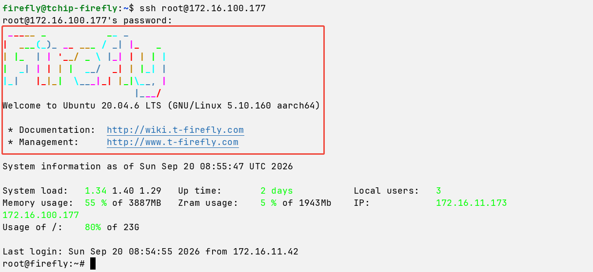

# 异常排查

## Q：aBMC 可以远程访问吗？ [step]

A：可以。aBMC 为独立带外管理单元，设备通电且管理网口网络连通时，支持远程访问 Web 管理界面、Redfish/IPMI 接口，可实现远程开关机、KVM 控制台、硬件监控、虚拟介质等运维操作。
本地局域网访问：同一内网环境下，电脑与 aBMC 管理网互通，输入 aBMC 内网 IP 即可直接访问；
* 互联网跨地域访问：无法直接公网暴露端口使用，有两种合规方案：
 1. 终端通过 VPN 接入设备本地局域网，再访问 aBMC；
 2. 部署云端代理服务器，内网 aBMC 主动向外建立长连接，依托代理实现互联网远程运维。
 <Callout title="安全提醒" type="warn">
      禁止直接对公网开放 aBMC 服务端口，存在高权限安全风险；跨外网远程运维优先采用 VPN 或云端代理方案。
</Callout>

## Q：服务器运行过程中无法访问 aBMC？ [step]

A：先区分两种故障场景排查：

* 场景 1：无法 ping 通 aBMC 管理 IP
    优先排查物理链路与二层 / 三层网络：网线、交换机端口状态、IP 网段、VLAN 划分、访问控制策略。

* 场景 2：可 ping 通 aBMC IP，但无法访问 Web 管理界面
    1. 若现场可外接显示器排查
        显示器正常输出终端 / 系统界面，代表底层操作系统正常运行。可在本机执行访问测试：`https://127.0.0.1`
            1.1 本机能够正常打开 aBMC 页面：aBMC 业务服务运行正常，故障点位于运维终端与设备之间网络，排查方向：网段互通、交换机 ACL 策略、VPN、代理等；
            1.2 本机同样无法访问 aBMC 页面：判定 aBMC 服务异常，按以下顺序排查
                1.2.1 查看服务运行状态
                    `systemctl status aBMC`
                1.2.2 服务状态为 active（运行中）：核查业务配置
                    `cat /etc/aBMC/config.ini`
                    1.2.2.1 确认启用访问协议（默认 HTTPS）
                    1.2.2.2 确认 Web 监听端口是否被修改
                    1.2.2.3 确认 Redis 通信端口配置
                1.2.3 若服务异常、未启动：根据日志排查服务启动失败原因。

    2. 若现场无法外接显示器，或显示器黑屏、花屏无输出
        ```bash
        2.1 使用 Console 调试线（USB 转 RJ45 串口，波特率 115200）接入串口终端登录命令行系统；
        2.2 登录成功后，复用上文 1.2 流程排查 aBMC 服务问题。
        ```
    3. 若显示器终端登录、Console 登录均无响应，则大概率为 BMC 程序卡死、系统死机，常见诱因：
        3.1 用户业务进程以 root 权限运行引发内核异常
            3.1.1 优先查阅系统日志、内核日志定位应用 BUG；
            3.1.2 若发生内核崩溃 Oops/panic，日志往往无法落盘留存。建议持续抓取串口日志复现问题，便于开发定位根因。

        3.2 BMC 系统分区磁盘占满（客户高频问题）
            多为用户自行部署业务产生大量调试日志、临时文件未定期清理，磁盘耗尽引发系统功能异常。

        3.3 用户修改 `/etc/fstab` 挂载配置不当阻塞系统启动
            若在 `/etc/fstab` 中配置开机自动挂载磁盘时，未添加 `nofail` 参数，一旦挂载过程出现异常，系统将因等待超时而陷入启动阻塞状态。常见引发此故障的典型场景包括：
            3.3.1 资源标识错配：开发调试阶段固化的磁盘UUID与实际生产环境不符，且未在部署前修正。
            3.3.2 底层硬件失效：磁盘发生物理性故障，导致内核无法获取设备响应，挂载请求被永久阻塞。
            3.3.3 设备命名漂移：依赖设备路径（如 `/dev/sda1`）的挂载方式，因系统重启后内核枚举顺序变动而失效。
            3.3.4 存储介质未预处理：新增磁盘未执行格式化和分区操作，导致系统在挂载时无法识别有效文件系统结构。

## Q：如何在 aBMC 上使用 Redis？ [step]

A：aBMC 系统默认已内置 Redis 7.2。业务服务如有 Redis 使用需求，可直接使用系统自带实例，无需重新安装部署。
如需自定义 Redis 端口、数据库编号、访问密码：
    1. 修改配置文件 `/etc/aBMC/config.ini` 中的 Redis 相关参数；
    2. 重启 aBMC 服务，新配置方可生效。

<Callout title="提示" type="info">
    提示：请勿手动独立安装、启动额外 Redis 进程，防止出现端口冲突、资源抢占等系统异常。
</Callout>


## Q：如何修改会话登录后的 LOGO？ [step]

A：默认情况下，用户通过 SSH、串口等方式登录 aBMC 后，终端会显示系统默认的 LOGO。

如需修改会话登录后显示的 LOGO，可编辑以下文件

```bash
/etc/update-motd.d/00-header
```

保存文件后，**重新建立会话**即可查看修改后的显示效果。

<Callout title="禁止" type="error">
  请勿修改 `/etc/profile.d/` 目录下的文件来配置会话登录后的 LOGO。
</Callout>


## Q：aBMC Web 页面显示子板断联，如何排查？ [step]

A：先通过串口确认子板系统是否仍在运行（子板系统本身异常时，必然无法与 aBMC 建立连接），再根据子板平台与运行状态采取相应处理。

* 场景 1：串口终端敲击回车键有响应（子板系统仍在运行）

    子板系统正常运行时断联，多为连接通道异常，根据子板平台分别处理：

    1. Rockchip Linux 平台（Ubuntu、Debian 等）

        重启 USB 设备服务：

        `systemctl restart usbdevice.service`

        若连续三次重启均失败，执行 `df -h` 检查磁盘占用情况：若已用 100%，需清理文件释放磁盘空间（建议系统盘保留至少 10% 可用空间），然后重启子板，子板应可恢复连接。

    2. Rockchip Android 平台

        重启 adbd 服务：

        `setprop ctl.restart adbd`

        重启后确认 aBMC 是否恢复连接。若恢复，说明故障为 USB 瞬断 / 重枚举后 adbd 的 functionfs 传输卡死，重启 adbd 服务即可恢复；如需彻底解决，可联系 Firefly 技术支持更新固件。

    3. Sophgo 平台

        多为网络中断所致，在子板上 ping aBMC 管理 IP 确认连通性：

        3.1 若无法 ping 通且网络设置有误，修正网络配置后即可恢复；

        3.2 若网络设置无误仍无法 ping 通，执行 `df -h` 检查磁盘占用情况：磁盘占满也会导致 SSH 服务异常而无法连接，若已用 100%，需清理文件释放磁盘空间（建议系统盘保留至少 10% 可用空间），清理后确认是否恢复；

        3.3 若磁盘占用正常仍无法 ping 通，大概率为网卡故障，可重启设备再试；重启后仍未恢复，请联系 Firefly 技术支持。

* 场景 2：串口终端敲击回车键无响应（子板系统疑似宕机）

    保持串口连接状态，重启子板并观察有无日志输出：

    1. 有日志输出，且系统可正常操作

        查看此时 aBMC 是否已恢复连接：

        1.1 若已恢复，说明子板曾因未知原因宕机。建议开启该子板的串口采集，持续跟踪该子板串口日志，待问题再次复现时，将日志提供给 Firefly 技术支持分析。

        1.2 若仍未恢复，请联系 Firefly 技术支持处理。

    2. 无任何日志输出

        请联系 Firefly 技术支持处理。