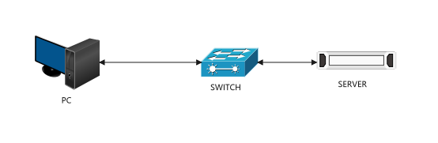
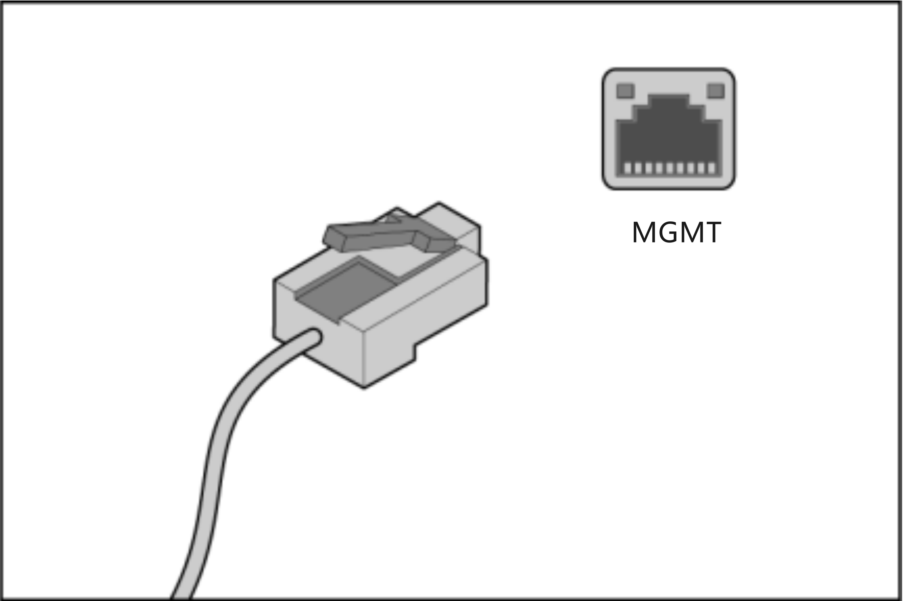
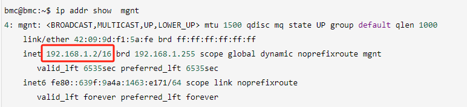
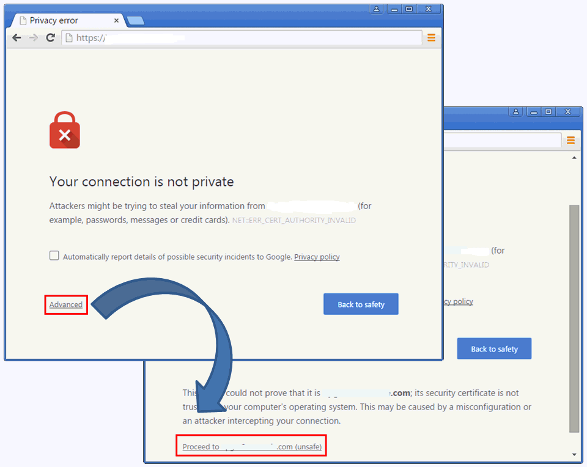
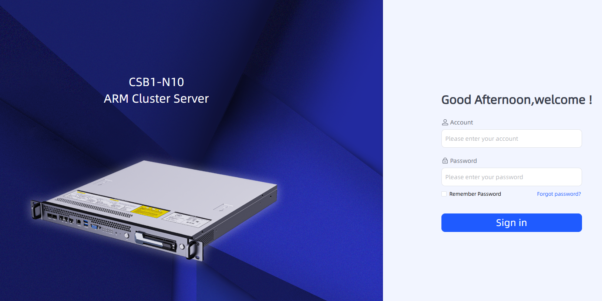
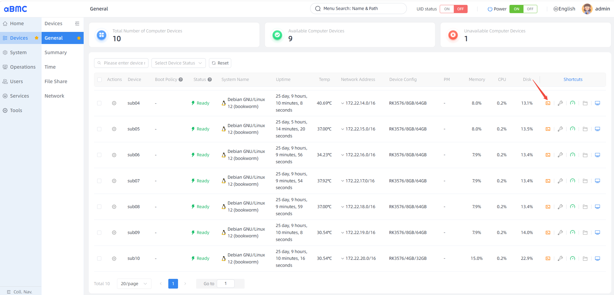
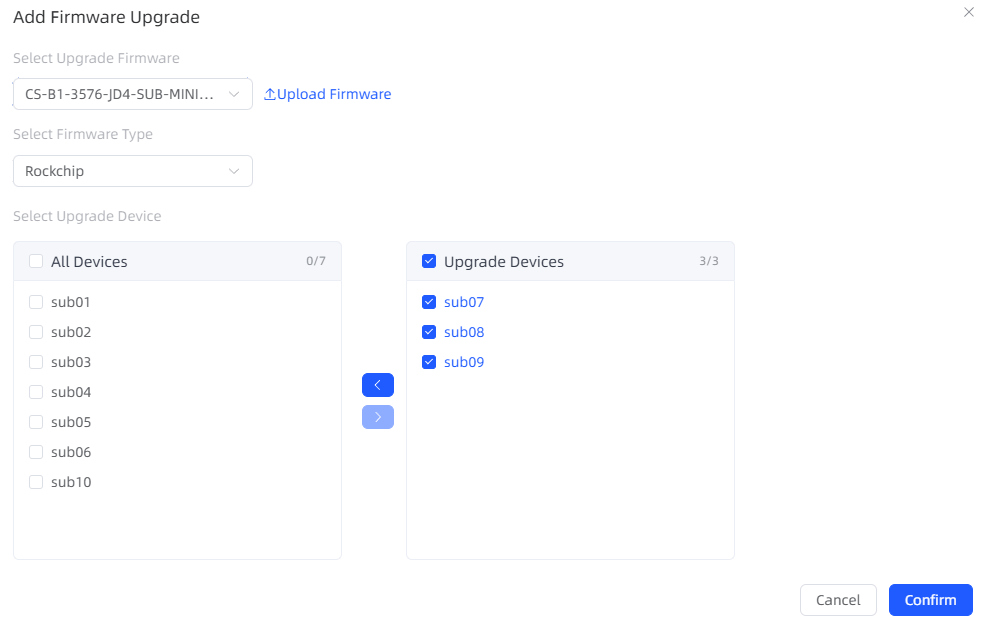
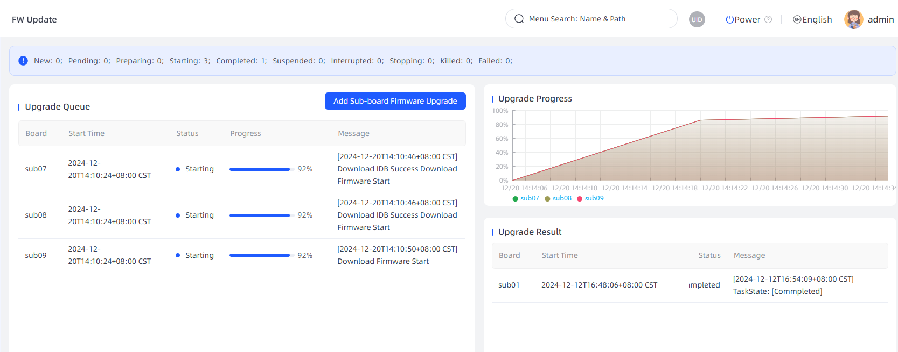

# 访问服务器（BMC）
## 登录须知
aBMC 出厂预设默认参数便于初次调试，下表为默认登录、网络、串口配置。出于设备安全，首次登录务必修改默认账号密码，并定期轮换更新。

<table border="1" cellPadding="8" cellSpacing="0" width="100%">
  <thead>
    <tr>
      <th>类别</th>
      <th>名称</th>
      <th>默认值</th>
    </tr>
  </thead>
  <tbody>
    <tr>
      <td rowSpan="2">aBMC 管理系统数据</td>
      <td>登录用户名</td>
      <td>admin</td>
    </tr>
    <tr>
      <td>登录密码</td>
      <td>admin</td>
    </tr>
    <tr>
      <td rowSpan="2">aBMC 管理网口 IPv4 地址 ● MGNT 或 GM 网口</td>
      <td rowSpan="2">管理网口 IP 与子网掩码</td>
      <td>默认 IP 地址：192.168.1.2</td>
    </tr>
    <tr>
      <td>默认子网掩码：255.255.255.0</td>
    </tr>
    <tr>
      <td>BMC Console 串口</td>
      <td>波特率</td>
      <td>115200</td>
    </tr>
    <tr>
      <td rowSpan="2">BMC Linux 用户数据</td>
      <td>登录用户名</td>
      <td>bmc</td>
    </tr>
    <tr>
      <td>登录密码</td>
      <td>bmc</td>
    </tr>
  </tbody>
</table>

## 1 Web远程控制台登录
aBMC 提供可视化Web管理界面，可完成服务器整机监控、硬件运维、固件升级等操作。

### 1.1 环境准备
#### 1.1.1 服务器网络接线
登录前将 aBMC 管理网口接入局域网，保证操作PC与BMC管理IP三层互通。

支持两类管理网口，按需选用：
- **共享网口**：复用服务器业务网卡，同时承载业务流量与BMC管理流量；
- **专用MGMT网口**：独立硬件网口，仅传输BMC管理指令，隔离业务网络。

#### 1.1.2 查询aBMC管理IP
可在服务器本地Linux系统执行 `ip` / `ifconfig` 命令，读取MGMT网口IP地址。

### 1.2 Web客户端环境要求
浏览器兼容性与分辨率标准如下：
| 浏览器 | 最低版本 | 分辨率要求 |
| :--- | :--- | :--- |
| Google Chrome | 48.0 及以上 | ≥1366*768，推荐 1600*900 及以上 |
| Mozilla Firefox | 50.0 及以上 | ≥1366*768，推荐 1600*900 及以上 |
| Internet Explorer | 11 及以上 | ≥1366*768，推荐 1600*900 及以上 |
| Microsoft Edge | 97 及以上 | ≥1366*768，推荐 1600*900 及以上 |

### 1.3 Web页面登录步骤
以Chrome浏览器为例：
1. 浏览器地址栏输入 `https://aBMC管理IP`，访问时弹出证书安全告警。
    
2. 点击页面 `Advanced（高级）`；
3. 选择 `Proceed to (site) (unsafe)` 忽略证书告警，跳转登录页。
    
4. 输入默认账号密码登录，进入整机总览面板：
    - 设备面板：查看ARM计算单元硬件运行状态、执行底层Shell命令；
    
    - 固件升级页面：批量更新各计算单元固件；
    
    

> 安全提示：首次登录请立即修改默认账号密码，并定期更新，降低设备入侵风险。
> 完整功能说明参考配套《aBMC用户指南》。

## 2 Console串口登录
1. 使用RJ45串口线连接服务器Console口与调试终端；
2. 终端软件参数配置：
    - 波特率：115200
    - 数据位：8
    - 奇偶校验：无
    - 停止位：1
    - 流控：无
3. 连接建立后输入BMC Linux账号密码；
4. 登录完成，可执行底层系统查询命令。

## 3 SSH远程登录
1. 本地使用系统自带 `ssh` 工具或MobaXterm等终端软件；
2. 填入aBMC管理IP、默认账号密码完成登录。