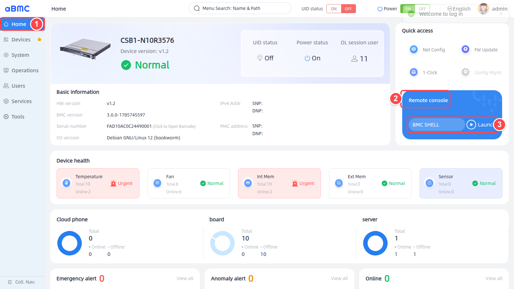
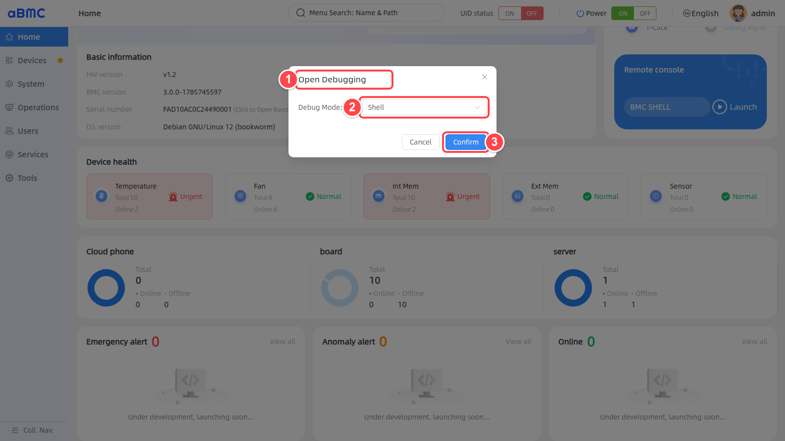
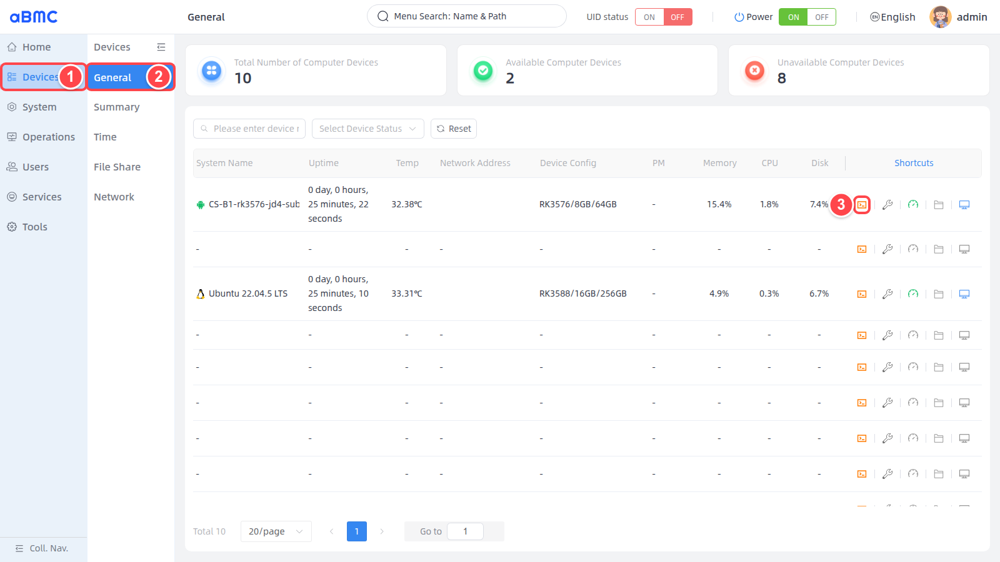
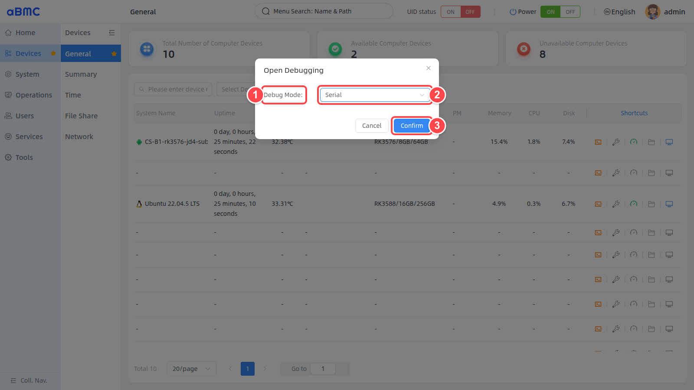
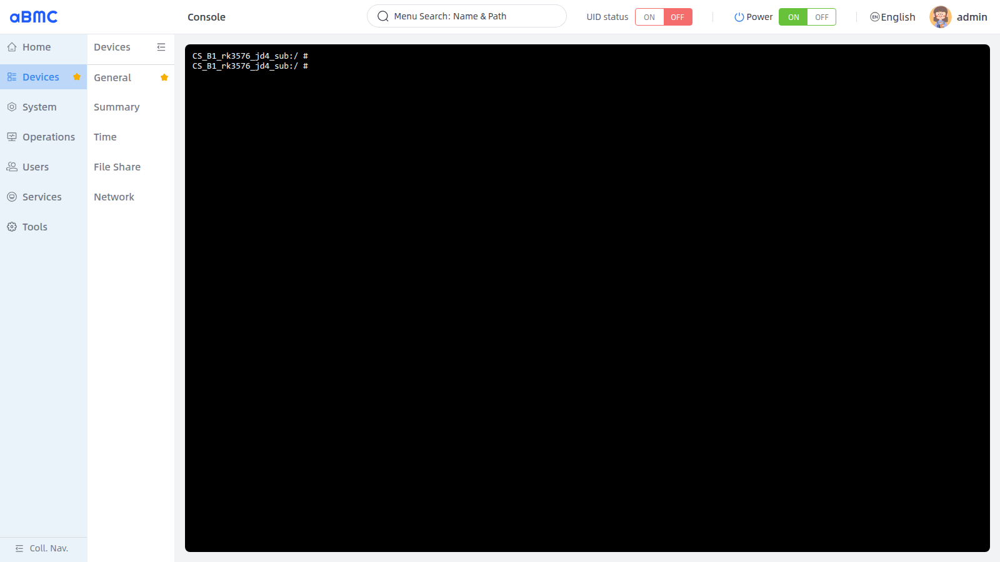
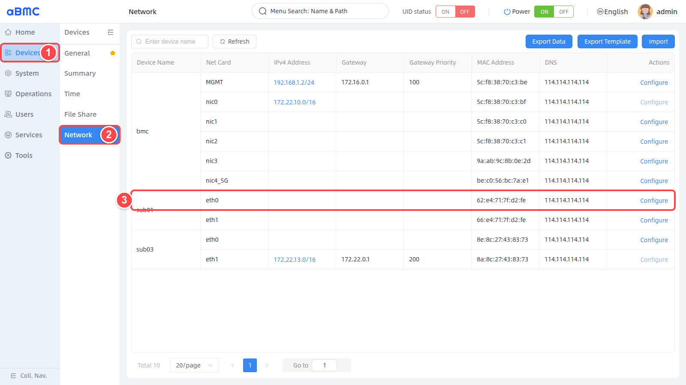
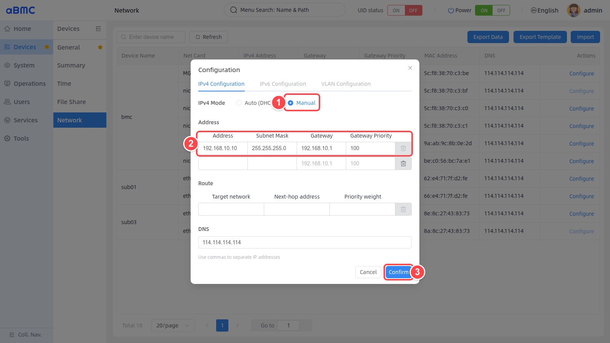
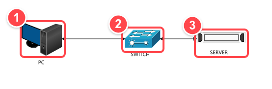

# 访问子节点

## aBMC Shell

### 打开 aBMC Shell 入口

1. 登录 aBMC Web 页面后，在左侧导航栏中选择 **Home**。
2. 在右侧 **Quick access** 区域找到 **Remote console**。
3. 确认控制台类型显示为 **BMC SHELL**，单击 **Launch**。



### 选择 Shell 调试模式

1. 确认页面已经打开 **Open Debugging** 窗口。
2. 在 **Debug Mode** 中选择 **Shell**。
3. 单击 **Confirm**，在新浏览器窗口中打开 BMC 终端。



### 确认 Shell 连接

终端显示类似 `root@bmc:~#` 的提示符时，表示已经连接到 BMC 管理控制器，可以执行所需的 BMC 系统维护命令。


<Callout title="操作对象说明" type="warn">
  aBMC Shell 操作的是 BMC 管理控制器，不是计算子节点。终端中执行的命令会直接影响 BMC 系统，请在确认命令作用和影响范围后再执行。
</Callout>

## 串口登录

### 打开子节点调试窗口

1. 在左侧导航栏中选择 **Devices**。
2. 在设备菜单中选择 **General**，并在设备列表中找到要访问的子节点。建议选择状态为 **Online** 或 **Ready** 的节点。
3. 在目标节点的 **Shortcuts** 列中单击第一个终端图标，即 **Open Shell Command**。页面宽度不足时，可先将设备列表横向滚动到最右侧。



### 选择 Serial 调试模式

1. 在 **Open Debugging** 窗口中展开 **Debug Mode**。
2. 选择 **Serial**。
3. 单击 **Confirm**，在新浏览器窗口中打开该子节点的串口终端。



### 确认串口连接

1. 等待终端建立连接。
2. 如果终端暂时为空白，请在黑色终端区域单击一次，然后按 **Enter** 键唤醒串口输出。
3. 终端显示子节点提示符或登录提示时，表示串口连接成功。子节点操作系统如需登录，请使用该子节点自身的系统账号和密码；Web 账号 `admin/admin` 仅用于登录 aBMC 页面。


## ADB 登录

### 打开子节点调试窗口

1. 在左侧导航栏中选择 **Devices**。
2. 在设备菜单中选择 **General**，并在设备列表中找到要访问的 Android 子节点。建议选择状态为 **Online** 或 **Ready** 的节点。
3. 在目标节点的 **Shortcuts** 列中单击第一个终端图标，即 **Open Shell Command**。页面宽度不足时，可先将设备列表横向滚动到最右侧。


### 选择 ADB 调试模式

1. 在 **Open Debugging** 窗口中确认 **Debug Mode**。
2. 选择 **ADB**。
3. 单击 **Confirm**，在新浏览器窗口中打开该子节点的 ADB 终端。


### 确认 ADB 连接

1. 等待终端与目标子节点建立 ADB 连接。
2. 如果终端暂时为空白，请在黑色终端区域单击一次，然后按 **Enter** 键刷新提示符。
3. 终端显示类似 `CS_B1_rk3576_jd4_sub:/ #` 的提示符时，表示已经进入目标子节点的 ADB Shell，可以执行所需的节点维护命令。




## SSH 登录

### 配置子板静态 IPv4 地址

1. 在左侧导航栏中选择 **Devices**。
2. 在设备菜单中选择 **Network**。也可以直接访问 `http://172.16.100.172:443/#/deviceManage/boardNetManage`；实际使用时请替换为设备的管理地址和端口。
3. 根据 **Device Name**、**Net Card** 和 **MAC Address** 找到目标子板共享网口对应的网卡，然后单击该行的 **Configure**。



<Callout title="网卡选择" type="warn">
  必须选择与服务器共享网口对应的子板网卡。不要修改 `bmc/MGMT` 管理口或子板内部互联使用的网卡；如果无法确认接口，请结合产品网口说明、网卡名称和 MAC 地址进行核对。
</Callout>

1. 在 **IPv4 Configuration** 页签中，将 **IPv4 Mode** 设置为 **Manual**。
2. 按网络规划填写 **Address** 和 **Subnet Mask**；需要跨网段访问时，再填写 **Gateway** 和 **Gateway Priority**。
3. 检查地址没有被其他设备占用后，单击 **Confirm** 保存配置。



图中使用以下示例配置，实际部署时必须替换为现场规划的地址：

| 参数 | 示例值 | 说明 |
| --- | --- | --- |
| Address | `192.168.10.10` | 目标子板共享网口的静态 IPv4 地址。 |
| Subnet Mask | `255.255.255.0` | 对应 `/24` 网络前缀。 |
| Gateway | `192.168.10.1` | 跨网段访问时使用；电脑与子板位于同一二层网络时可以不配置。 |
| Gateway Priority | `100` | 多个网关或默认路由并存时使用，取值应符合现场网络规划。 |
| DNS | `114.114.114.114` | 使用 IP 地址进行 SSH 登录时不是必填项。 |

保存后返回 **Network** 页面，确认目标网卡的 **IPv4 Address** 已更新。网络配置生效期间，该子板的网络连接可能会短暂中断。

### 接入服务器共享网口

1. 使用网线将维护电脑接入交换机。
2. 确认电脑端口与服务器端口属于同一交换网络和 VLAN。
3. 使用网线将服务器共享网口接入同一交换机。



将维护电脑设置为与子板静态 IP 相同的网段，且地址不能重复。例如子板为 `192.168.10.10/24` 时，电脑可以设置为 `192.168.10.100/24`。

在电脑终端中测试网络连通性：

```bash
ping 192.168.10.10
```

能够收到子板回复后，再执行 SSH 登录。如果无法连通，请检查共享网口接线、交换机 VLAN、电脑 IP、子板静态 IP 和防火墙配置。

### 在电脑上执行 SSH 登录

1. 打开电脑的终端、PowerShell 或其他 SSH 客户端。
2. 使用子板操作系统的用户名和静态 IP 建立连接。SSH 默认端口为 `22`。
3. 首次连接时核对主机指纹，确认无误后输入 `yes`，再输入子板操作系统密码。

```bash
ssh <SUBBOARD_USER>@<SUBBOARD_STATIC_IP>
```

以下命令使用本节示例 IP：

```bash
ssh <SUBBOARD_USER>@192.168.10.10
```

SSH 服务使用非默认端口时，通过 `-p` 指定端口：

```bash
ssh -p <SSH_PORT> <SUBBOARD_USER>@192.168.10.10
```

终端显示目标子板的命令提示符时，表示 SSH 登录成功。

<Callout title="SSH 登录凭据" type="warn">
  SSH 使用的是子板操作系统账号和密码，不是 aBMC Web 的 `admin/admin`。登录前应确认子板已经启用 SSH 服务、目标账号允许远程登录，并且防火墙允许对应的 SSH 端口。
</Callout>