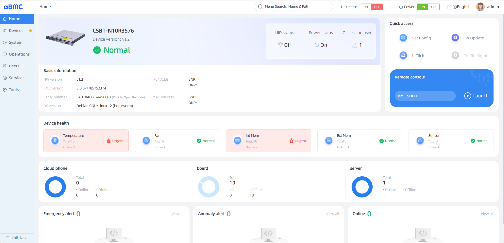
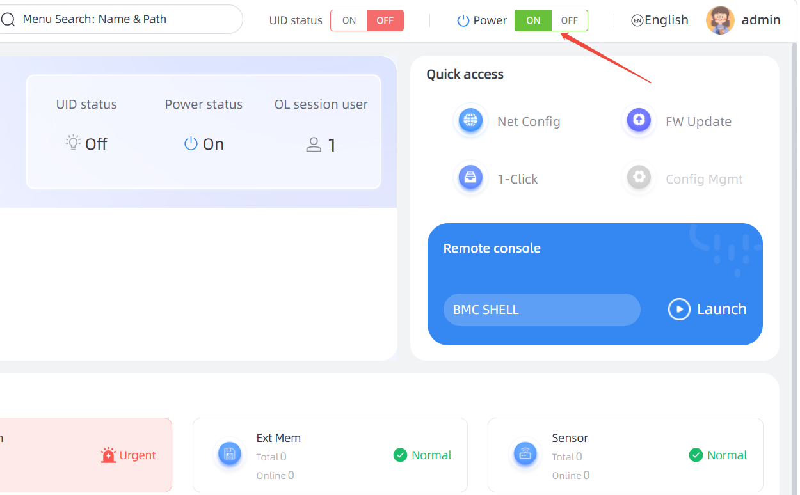

# 电源操作

## 服务器上电

### 上电操作步骤

1. 开机前确认服务器整机完全下电。
2. 将品字电源线一端插接至服务器电源接口。
3. 电源线另一端接入 PDU 机柜配电单元或合格供电插排。
4. 闭合漏电保护开关，给 PDU / 供电插排送电。
5. 若服务器刚完成断电操作，需静置等待不少于 30 秒后方可重新上电。

### 安全警示

> **严禁带电插拔电源线缆至服务器电源接口**；带电插接易产生电弧，极易击穿、损伤电源内部 MOS 功率管，缩短电源使用寿命；极端情况下会直接造成服务器电源失效、无法启动。

### 上电方式

服务器有以下几种上电方式：

**方式一：通过 Power 按键开机（电源按钮/指示灯为绿色常亮）**

1. 通过短按前面板的电源按钮，将服务器上电。电源按钮位置请参见前面板指示灯和按钮。

**方式二：通过 aBMC WebUI 上电**

1. 通过 aBMC WebUI 首页右上角的电源按键开机进入“服务器上下电”界面。
2. 单击“上电”，出现上电提示时单击“确定”将服务器上电。

> 系统默认“通电开机策略”为“保持上电”，即服务器的电源模块通电后系统自动开机。用户可通过 aBMC 修改“通电开机策略”。

**方式三：通过远程虚拟控制台将服务器上电**

1. 通过浏览器远程登录 aBMC。
 
2. 通过aBMC WebUI首页右上角的电源按钮设置为“ON”，服务器完成整机上电。
 

## 服务器下电

  <ul style="padding-left: 24px; margin: 10px 0;">
    <li>下电后，所有业务和程序将终止，因此下电前请务必确认服务器所有业务和程序已经停止或者转移到其他设备上。</li>
    <li>本章节的"下电"指将服务器下电至 Standby 状态（电源按钮指示灯为黄色常亮）。</li>
    <li>服务器强制下电后，需要等待 10 秒以上，以确保服务器完全下电，此时可进行再次上电操作。</li>
  </ul>

服务器有以下几种下电方式：
- 服务器处于上电状态，通过短按前面板的电源按钮，可将服务器正常下电。
- 通过远程虚拟控制台将服务器上电。