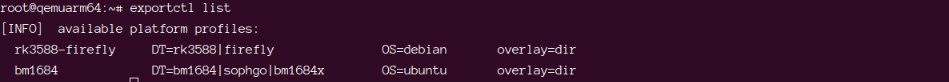
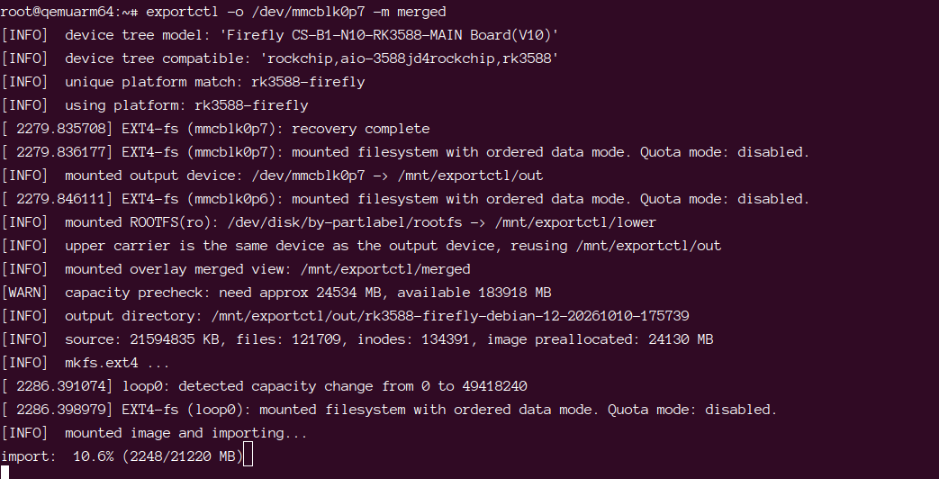
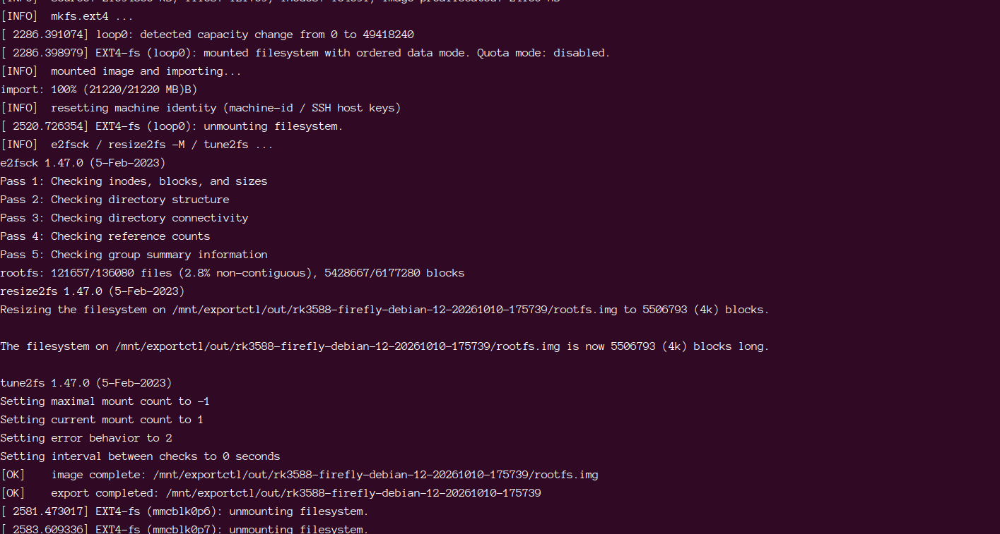
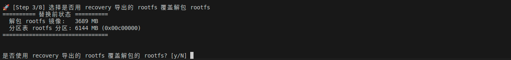

# rootfs 导出与打包

该工具的作用是可以让客户在 Recovery 模式下，导出当前设备中的 rootfs。

使用该工具的原因有以下两点：
1. 客户在设备上部署了自己的第三方软件，需要对设备的内容进行固化导出，得到的这个 rootfs 固件可以配合 '固件打包工具'，生成完整的烧录固件，以方便后续设备的批量升级。
2. 在 Recovery 模式下进行导出比之前在 normal 环境（正常跑系统的时候）下导出更加干净，不会存在一些临时变量/软件环境不包含的问题。

该教程涉及到的软件工具有两个：
1. `exportctl` 导出工具
2. `firmware-kits` 打包工具

生成产物如下：
1. `rootfs.img` 分区镜像
2. `update.img` 系统固件

具体请参考下述操作。

## 1. 设备端环境部署

在设备正常系统中完成你的部署工作，例如：

```bash
sudo apt-get install -y <你的软件>
sudo cp <你的文件> /opt/
```

这些第三方的客户内容一般会保存在系统的 rootfs-rw 分区，该部分内容之后会被 `exportctl` 一起打包进 `rootfs.img` 里面

## 2. recovery 模式

在设备正常系统中执行：
```bash
sudo reboot recovery
```

此时设备会重启并且进入 recovery 模式（此时主机与设备的通讯方式只有串口以及 ADB 的方式），为了方便，最好使用串口的方式。

### 2.1 查看可导出平台

```bash
exportctl list
```


预期会看到类似：

```text
rk3588-firefly
bm1684
```



### 2.2 导出 rootfs

```bash
exportctl -o /dev/mmcblk0p7 -m merged
```



参数说明：

- `-o` 可以直接指定 ext4 块设备
    - 示例中的 `/dev/mmcblk0p7` 指的就是设备的 `userdata` 分区。换句话，就是最后导出的 rootfs.img 直接保存在了设备的 `userdata` 分区了
    - 假如你接入了 U 盘，那么也可以直接指定为 U 盘的块设备，例如 `-o /dev/sda1`。最后会导入到 U 盘里面
    - 也可以直接指定已挂载的目录，例如 `-o /mnt/usb`。 最后会导入到目录里面
    - 需要**注意的是,使用的块设备必须是 `EXT4`的分区格式，其他格式暂时不支持。所以如果是常规的 `FAT` 格式的 U 盘需要先格式化为 `EXT4` 格式才行**
- `-m merged` 表示导出完整 rootfs，是默认这么写就行了；


### 2.3 导出结果

产物目录格式：

```text
<输出目录>/<平台>-<系统>-<版本>-<时间戳>/
```



默认生成：

```text
rootfs.img
```

如果是按照上述指令 `exportctl -o /dev/mmcblk0p7 -m merged` 生成的，那么最终生成的路径为：`userdata/<平台>-<系统>-<版本>-<时间戳>/rootfs.img`
其他块设备如 U 盘的也是一样，也是类似的 `/sdaMountPath/<平台>-<系统>-<版本>-<时间戳>/rootfs.img`

### 2.4 其他可选参数

| 参数 | 说明 |
| ---- | ---- |
| `-m ro` | 只导出只读基础层 |
| `-m rw` | 只导出可写层 |
| `--no-img` | 只导出目录树，不打包 img |
| `--keep-identity` | 保留 machine-id / SSH 主机密钥 |

### 2.5 常见报错

| 报错 | 处理 |
| ---- | ---- |
| `不是 ext4 文件系统` | 只使用 ext4 分区作为导出目标 |
| `输出设备已被挂载` | 先卸载其它挂载点，或改用目录方式 |
| `输出空间不足` | 清理空间或换更大存储 |


## 3. 使用 rootfs 重新打包固件

在得到 `rootfs.img` 之后，就可以重新进行设备固件的打包。

首先需要了解 `firmware-kits` 工具的使用，可参考[定制固件](dev_sub_firmware.md)。

在重新打包固件流程中，有关键的一个阶段便是进行 `rootfs.img` 的替换阶段，会先询问是否使用 recovery 导出的 `rootfs.img` 覆盖解包出的 rootfs：



1. 选择 `y` 时，按提示提供导出的 `rootfs.img` 路径
2. 选择 `N` 时，继续使用基础固件中解包出来的 rootfs
3. 随后按提示调整分区大小
4. 再进入 rootfs 完成文件放入或软件修改


## FAQ [step]

### Q：导出一定要进 recovery 吗？[step]
是。recovery 下更适合导出一致、干净的 rootfs。

### Q：recovery 模式下没有 exportctl 命令怎么办？[step]
请参考 [BMC 固件升级](bmc_firmware_upgrade.md)，烧录最新的固件才支持。

### Q：导出的 rootfs.img 为什么比系统分区小？[step]
因为导出后会做收缩处理，属于正常现象。

### Q：recovery 里 /tmp 能放导出文件吗？[step]
可以临时使用，但不建议作为正式导出目标。优先使用 ext4 块设备或已挂载目录。

### Q：导出途中中断了怎么办？[step]
重新执行 `exportctl` 即可，输出目录会按新的时间戳重新生成。

### Q：默认导出只有 rootfs.img 吗？[step]
是，默认直接生成 `rootfs.img`。

### Q：导出会不会占用设备 userdata 空间？[step]
会。导出到设备分区时，请提前确认目标分区空间充足。


