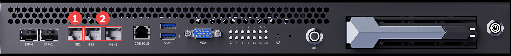
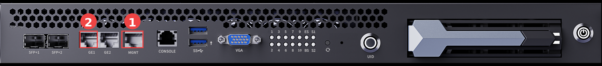

# 网络接线方式

本章节介绍服务器网络的通用接线方法。以下接线方式可以满足大部分使用场景；如有特殊要求，或需要了解服务器内部的网络拓扑，请联系商务获取技术支持。

接网线前，先了解一下各个网口的作用：

- **MGMT 口**：直连 BMC，是服务器的带外管理口。
- **SFP+1、SFP+2、GE1、GE2 口**：服务器的业务网口，均连接至内部三层交换机，内部交换机再连接各子板。

带外管理是指不依赖操作系统与业务网络的远程管理通道：服务器只要接通电源，即使尚未开机或系统故障，也可以通过 MGMT 口访问 BMC，进行远程开关机、硬件监控、固件升级等操作，详见「访问 BMC」章节。

**以下两种接线方式任选其一，均可以使整台服务器与外网通信；区别在于带外管理通道与业务网络是否共用同一根外网线。**

## 单根外网线：业务与带外管理共用上联

**工具准备**

- 网线 × 2（一根用于连接外网，一根用于互连 MGMT 口与 GE2 口）

**接线步骤**

1. 将一根网线接入服务器的 GE1 口（图中 1），另一端接入外部网络。
2. 使用另一根网线将 MGMT 口与 GE2 口直连（图中 2）。

说明：MGMT 口直连 BMC，将其与 GE2 口互连后，BMC 管理网口即可经由内部交换机与外部网络通信。该方式下，带外管理与业务网络共用 GE1 口的同一根外网线。

接线位置如下图所示：

## 双根外网线：业务与带外管理独立上联

**工具准备**

- 网线 × 2（一根连接 MGMT 口，一根连接 GE1 口）

**接线步骤**

1. 将一根网线接入服务器的 MGMT 口（图中 1），另一端接入外部网络。
2. 将另一根网线接入服务器的 GE1 口（图中 2），另一端接入外部网络。

该方式下，带外管理（MGMT 口）与业务网络（GE1 口）各自独立上联，互不影响。

接线位置如下图所示：

