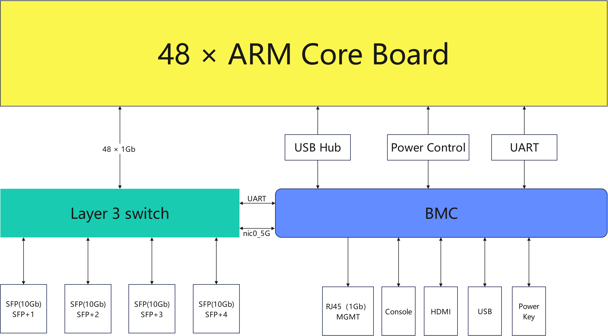

# 产品规格和组件

## 服务器规格

| 指标项 | 规格 |
| :--- | :--- |
| **服务器形态** | 2U 机架式服务器 |
| **计算节点型号** | 支持 48 路分布式计算节点 |
| **显示接口** | 1080P VGA 接口 |
| **USB** | 2 个 USB 3.0 接口 |
| **网络接口** | - 4 个 10Gbps SFP+ 共享网口|
| **Console 接口** | 1 个用于调试的 RJ45 Console 接口 |
| **灯和按键** | - 1 个 POWER 按键灯 |
| **风扇** | 4 个冗余风扇 |
| **屏幕** | 1 个触摸显示屏 |
| **系统管理** | - 适配 aBMC 管理系统（支持 Redfish、VNC、NTP、监控高级及虚拟媒体） - 1 个 10/100/1000Mbps RJ45 管理网口 |
| **安全特性** | - 管理员密码 - 故障告警 - 应急 recovery 模式 |

## 环境规格

| 指标项 | 规格 |
| :--- | :--- |
| **温度** | - 工作温度：5℃～40℃（41℉～104℉） -  存储温度（24H）：-40℃～+65℃ -  存储温度（3个月以内）：-30℃～+60℃（-22℉～+140℉） -  存储温度（6个月以内）：-15℃～+45℃（5℉～113℉） -  存储温度（1年以内）：-10℃～+35℃（14℉～95℉） -  最大温度变化率：20℃（36℉）/小时、5℃（9℉）/15分钟 |
| **相对湿度（RH，无冷凝）** | - 工作湿度：8%～90% -  存储湿度（3个月以内）：8%～85% -  存储湿度（6个月以内）：8%～80% -  存储湿度（1年以内）：20%～75% -  最大湿度变化率：20%/小时 |

<Callout title="硬盘存储时间要求" type="info">
由于SSD硬盘和机械硬盘（包括NL-SAS、SAS、SATA）存储原理的限制，不能在下电状态下长期保存，若超过最长存储时间，可能导致数据丢失或者硬盘故障。在满足存储温度与存储湿度的条件下，硬盘的存储时间要求如下：
* SSD硬盘最长存储时间：
    * 下电状态且未存储数据：12个月
    * 下电状态且已存储数据：3个月
* 机械硬盘最长存储时间：
    * 未打开包装或已打开包装且为下电状态：6个月
最长存储时间是依据硬盘厂商提供的硬盘下电存放时间规格确定的。
</Callout>
 

## 物理规格

| 指标项 | 规格 |
| :--- | :--- |
| **尺寸（高×宽×深）** | 机箱：88.8mm (2U) × 430.0mm × 724.0mm |
| **安装尺寸要求** | 可安装在满足 IEC 297 标准的通用机柜中： - 宽 19 英寸 - 深 800 mm 及以上  滑道的安装要求如下： - 可伸缩滑道：机柜前后方孔条的距离范围为 543.5 mm ～ 848.5 mm |
| **满配重量** | - 净重：23.1kg - 包装材料重量：25.3kg |
| **能耗** | 整机因搭载的计算单元数量和种类不同，能耗存在差异。以下为参考值： - 待机能耗：150 W - 最大能耗：450 W |
| **电源** | - 电源模块不支持热插拔 - 服务器连接的外部电源空气开关电流规格推荐如下： &nbsp;&nbsp;- 交流电源：32 A &nbsp;&nbsp;- 直流电源：63 A - 电源功率应大于最大能耗，并保留不少于 50 W 的余量 |

### 拓扑示意图

#### 硬件逻辑结构图
| 符号 | 名称 | 说明 |
| :--- | :--- | :--- |
| nic0_5G | 以太网卡（速度 5 Gbps） | 支持 VLAN 划分 |
| Layer 3 switch | 内部三层交换机 | 支持 VLAN 划分、网络聚合和 QoS 等功能 |

#### 网络拓扑图
根据硬件结构逻辑图可知，阵列式服务器中集成的ARM核心板与BMC是通过一个三层交换机实现告诉网络互联的，该三层交换机支持VLAN划分和网络聚合，这就可以方便用户根据实际业务需求灵活配置网络隔离策略，**具体的网络拓扑图联系工程师获取**。。

## 组件
### 前面板按键及指示灯

| 标识 | 指示灯/按钮 | 状态说明 |
| :--- | :--- | :--- |
| | 电源按钮/指示灯 | **电源指示灯说明：** - 黄色（常亮）：表示服务器处于待机（Standby）状态。 - 黄色（闪烁）：表示 BMC 管理系统正在启动。 - 绿色（常亮）：表示服务器已经开机。 - 熄灭：表示服务器未上电。  **电源按钮说明：** - 上电状态下短按该按钮，可以正常关闭子板 OS。  **详细关机过程：** - 第 1至5 秒：绿色（闪烁）——通知子计算单元需要在 5 秒内有序关闭业务程序。 - 第 5至20 秒：黄绿（交替闪烁）——子计算单元正式开始关机。 - 第 20 秒：黄色（常亮）——各个计算单元下电（除 BMC 外均下电）。 - 待机状态下短按该按钮，可以进行上电。 |
| | 重置按键 | - **重启 BMC**：短按。 - **重置密码**：长按 5 秒，至 BS 灯慢闪。 - **恢复出厂**：长按 10 秒，至 BS 灯快闪。 - **误按恢复**：按住不松开（约 15 秒），至 BS 灯恢复常亮。 |
| | OTG USB（下方） | 可使用 U 盘对 BMC 进行 OTG 升级。 |

### 网络接口

| 标识 | 接口名称 | 说明 |
| :--- | :--- | :--- |
| SFP+1 - SFP+4 | SFP+ 端口 | - 万兆光口默认速率为 10 Gbps。 - 如果是千兆网络的环境下，需手动切换到 1 Gbps。 |
| MGMT | RJ45 | - 用作 BMC 管理网络。 - 1000/100/10 Mbps 自适应。 |
### 调试接口

| 标识 | 接口名称 | 说明 |
| :--- | :--- | :--- |
| Console | RJ45 | - BMC 调试串口 - 波特率为 115200 |
### 显示接口

| 标识 | 接口名称 | 说明 |
| :--- | :--- | :--- |
| HDMI | HDMI 接口 | - BMC 直出 HDMI。 - 分辨率为 1080P。 |