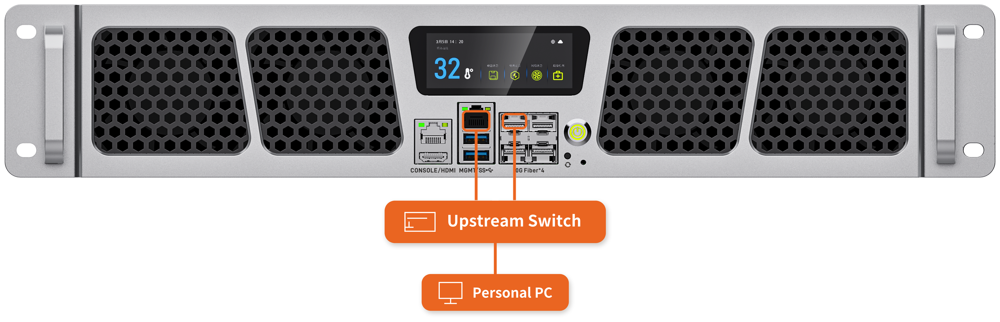
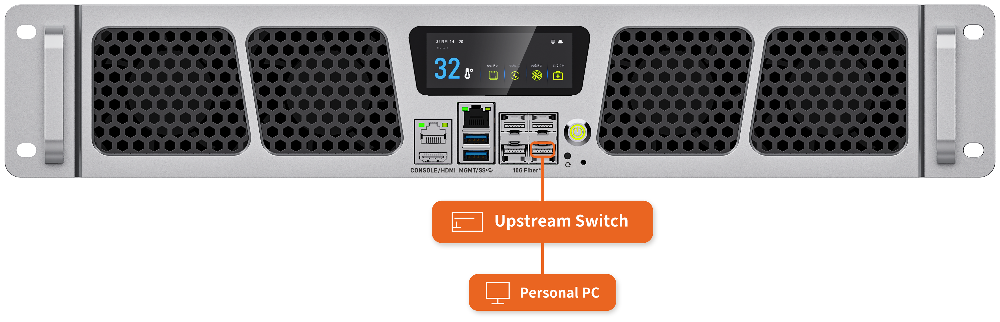

# 网络接线方式

本章节介绍服务器网络的通用接线方法。以下接线方式可以满足大部分使用场景；如有特殊要求，或需要了解服务器内部的网络拓扑，请联系商务获取技术支持。

接网线前，先了解一下各个网口的作用：

- **MGMT 口**：直连 BMC，是服务器的带外管理口。
- **SFP+1～SFP+4 口**：服务器的业务网口，均连接至内部交换机。

带外管理是指不依赖操作系统与业务网络的远程管理通道：服务器只要接通电源，即使尚未开机或系统故障，也可以通过 MGMT 口访问 BMC，进行远程开关机、硬件监控、固件升级等操作，详见「访问 BMC」章节。

**接线方式分为带外管理和带内管理两种，任选其一都可以让整机连上外网；推荐优先使用带外管理。**

<CodeBlockTabs defaultValue="OutOfBand">
    <CodeBlockTabsList>
        <CodeBlockTabsTrigger value="OutOfBand">带外管理</CodeBlockTabsTrigger>
        <CodeBlockTabsTrigger value="InBand">带内管理</CodeBlockTabsTrigger>
    </CodeBlockTabsList>

    <CodeBlockTab value="OutOfBand">
      

      **工具准备**

      - 万兆光口转 RJ45 模块 × 1
      - 网线 × 2（一根连接 MGMT 口，一根连接外网光口上的模块）

      **接线步骤**

      1. 将一根网线接入服务器的 MGMT 口，另一端接入上游交换机（Upstream Switch）。
      2. 将万兆光口转 RJ45 模块插入服务器的 SFP+1～SFP+4 中任意一个光口（以 SFP+1 为例），另一根网线一端接入该模块，另一端接入同一台上游交换机（Upstream Switch）。

      该方式下，带外管理（MGMT 口）与业务网络（SFP+ 口）各自独立上联、互不影响；上游交换机再连接个人电脑（Personal PC）等终端，服务器即可与外部网络通信。
    </CodeBlockTab>

    <CodeBlockTab value="InBand">
      

      **工具准备**

      - 万兆光口转 RJ45 模块 × 1
      - 网线 × 1（连接上游交换机）

      **接线步骤**

      1. 将万兆光口转 RJ45 模块插入服务器的 SFP+4 光口，网线一端接入该模块，另一端接入上游交换机（Upstream Switch）。

      说明：CSC2 的 BMC 管理网口本身接入内部交换机，与 SFP+1～SFP+4 口同处一个业务网络。因此只需一根网线将 SFP+4 口上联，BMC 管理流量即可借道业务网络与外部网络通信，无需再将 MGMT 口与业务网口互连；MGMT 口仍可按上一节的方式用于带外管理。上游交换机再连接个人电脑（Personal PC）等终端。
    </CodeBlockTab>
</CodeBlockTabs>