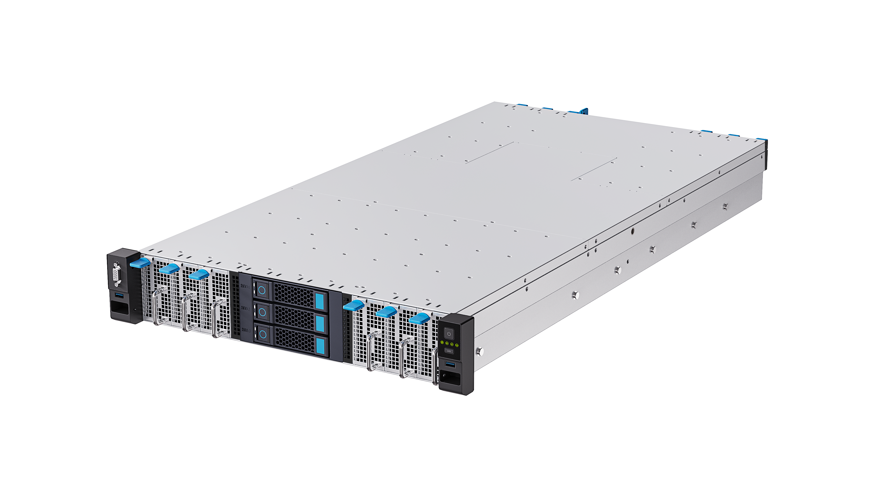
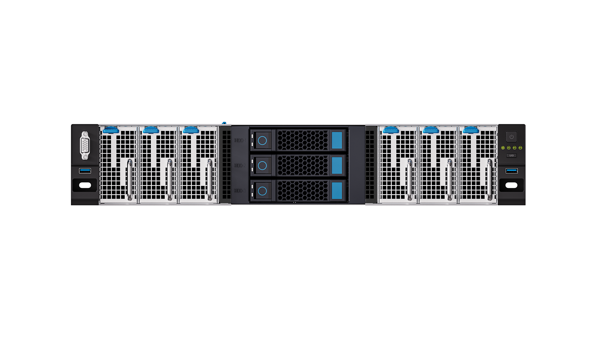
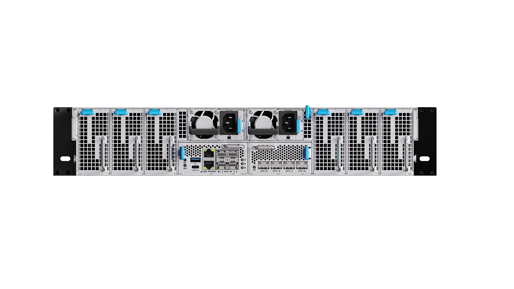

# 简介
CSD2-N96 是一款2U机架式的ARM准系统高密度阵列式服务器。该服务器面向互联网、AI边缘计算、云计算、大数据和视频边缘计算等领域，具有高性能计算、低能耗、易管理和易部署等优点。

功能亮点
- 服务器准系统 aBMC
    搭载Firefly自研BMC管理系统，萤火服务器高级管理系统（Firefly Advanced Baseboard Management Controller，以下简称aBMC）是专门面向阵列式服务器设计开发的服务器嵌入式管理系统。通过它可以高效实现阵列式服务器的监控、简化配置、异常告警、远程运维（如软件KVM）和虚拟换管理等功能。aBMC提供CLI命令行和Redfish等系列管理工具，为二次开发提供了丰富的潜力。
- 灵活配置
    用户可以根据业务需要自由搭配计算单元种类和数量，按需定制最优部署方案，适配不同业务场景需求。
- 网络管理
    集成三层交换机，支持VLAN、QOS等主流网络配置功能，可灵活划分网络区域、优化网络服务质量，全方位保障客户网络运行安全与稳定。
- 高能效
    采用高效ARM指令集架构，有效规避x86指令集转ARM指令集过程中的性能损耗，兼顾设备运行性能与能耗表现，具备优异的能效比。

## 物理视图
### 正面图

### 背面图

### 透视图

