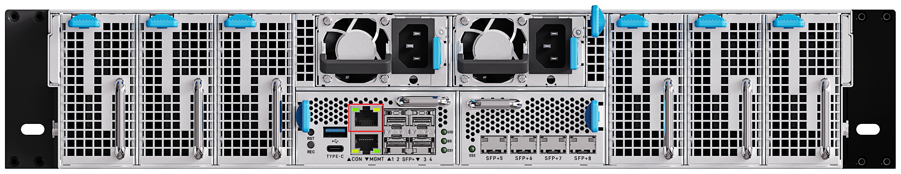

# 服务器的串口使用

串口是访问服务器最直接、最底层的方式。当网络无法连接、显示无输出、远程手段全部失效时，串口就是最坚实的后盾：通过它可以查看启动日志、登录命令行，定位无法远程排查的问题。

## 准备串口线

服务器的调试串口为 RJ45 接口，请使用内置 **FT232 芯片**的 USB 转 RJ45 串口线（Console 线）连接，推荐线材：[淘宝购买链接](https://detail.tmall.com/item.htm?id=704142723329&skuId=5200647198949)。

<Callout type="info" title="线长选择">
建议选择 1m 线长。串口线越长信号衰减越明显，线材过长可能导致通信异常。
</Callout>

<Callout type="info" title="驱动说明">
采用 FT232 芯片的串口线在较新版本的 Windows 操作系统中免驱。如果 PC 无法识别串口设备，请从 FTDI 官网[驱动下载页面](https://ftdichip.com/cn/drivers/)下载并安装驱动。
</Callout>

## 调试串口位置

调试串口位于整机后面板，为丝印 **▲CON** 的 RJ45 接口，其正下方的 **▼MGMT** 为管理网口，请注意区分：

## 连接串口终端

1. 将串口线的 USB 接口接入 PC，RJ45 接口接入服务器调试串口。
2. 确认 PC 已识别到串口设备：
    - Windows：打开「设备管理器 → 端口（COM 和 LPT）」，查看新增的 COM 口；
    - Linux：执行 `ls /dev/ttyUSB*`，查看新增的串口设备（通常为 `/dev/ttyUSB0`）。
3. 打开串口终端工具（如 PuTTY、MobaXterm、minicom），按 **115200-8-N-1**（波特率 115200，数据位 8，无校验位，停止位 1）连接该串口。
4. 按 **Enter** 唤醒终端，出现命令行提示符即表示连接成功，之后即可查看启动日志或登录命令行系统。

> 若终端输出乱码，请首先检查波特率是否为 115200。若通过串口仍无法定位问题，可参考[异常排查](op_issues_troubleshooting.md)。