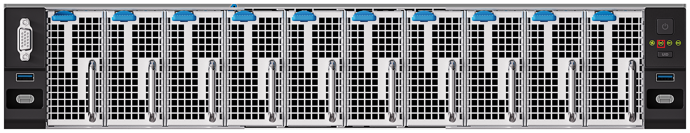
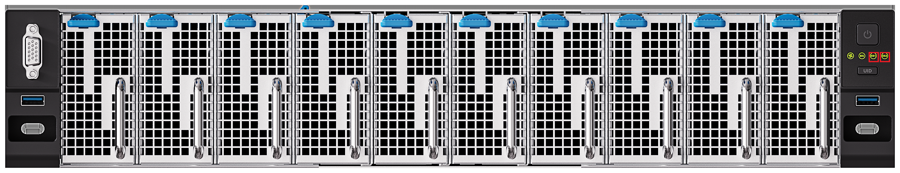
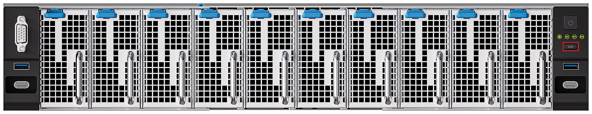

# 服务器状态识别

服务器接入三角插头后，BMC 自动上电。

开始使用服务器前，请通过服务器上的指示灯判断当前运行状态。

## BMC 状态指示灯

前面板上标有丝印 BS 的指示灯，是 BMC 的系统状态灯。指示灯为红绿双色灯，通过亮灭和颜色指示 BMC 的运行状态：

- **熄灭**：BMC 未上电。
- **绿色常亮**：BMC 正常进入系统。
- **红色常亮**：BMC 出现故障。

服务器背面也设有一颗 BS 指示灯，状态含义与前面板一致：

## 交换机指示灯

前面板标有丝印 ES1、ES2 的两颗指示灯，分别是两颗三层交换机的系统状态灯。指示灯为绿色单色灯，通过亮灭和闪烁频率指示对应三层交换机的运行状态：

- **熄灭**：交换机未上电或出现故障。
- **快闪（4 Hz）**：交换机正在启动。
- **慢闪（1 Hz）**：交换机正常工作。

服务器背面同样设有 ES1、ES2 指示灯，状态含义与前面板一致：

## 风扇指示灯

风扇指示灯为红绿双色灯，通过颜色指示风扇的运行状态：

- **绿色常亮**：风扇工作正常。
- **红色常亮**：风扇出现故障。

## UID 按键灯

UID 按键灯是一盏蓝色按键灯，按键与指示灯一体化设计，按下按键后，按键灯亮起。

服务器背面也设有一盏 UID 指示灯：

UID 灯用于帮助运维人员快速定位服务器。当机房中部署多台同款服务器时：

- **远程点亮 UID 灯**：远程运维人员发现服务器异常时，可在 aBMC Web 页面控制 UID 灯亮起，现场人员据此定位异常服务器。
- **现场按下 UID 按键**：aBMC Web 页面的 UID 虚拟 LED 会同步亮起，远程运维人员可确认待下架的服务器，方便下架前进行数据操作。

## 电源按键/指示灯

前面板有一个电源按键，用于控制所有子板的上电与下电。按键灯通过颜色和闪烁状态指示子板的电源状态：

- **熄灭**：服务器未上电。
- **蓝色闪烁**：冷启动后的开机阶段，电源尚未就绪；电源就绪后转为绿色常亮，并默认开启所有子板。
- **绿色常亮**：子板处于开机状态。此时再次按下按键，按键转为蓝绿交替闪烁，子板开始关机；关机完成后转为蓝色常亮。
- **蓝色常亮**：子板均处于关机状态。此时再次按下按键，按键转为绿色常亮，子板将陆续上电开机。