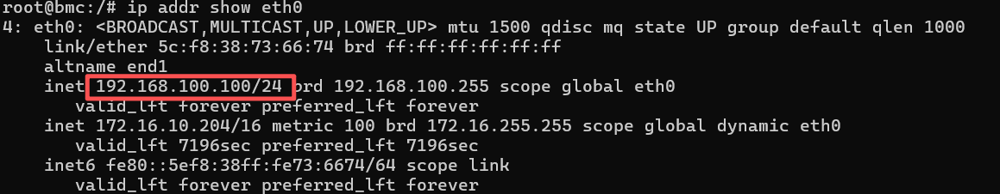

# 访问 BMC
## 登录须知
aBMC 出厂预置了一套默认参数，便于初次调试，下表汇总默认的登录与网络配置。


<table border="1" cellPadding="8" cellSpacing="0" width="100%">
  <thead>
    <tr>
      <th>类别</th>
      <th>名称</th>
      <th>默认值</th>
    </tr>
  </thead>
  <tbody>
    <tr>
      <td rowSpan="2">aBMC 管理系统数据</td>
      <td>登录用户名</td>
      <td>admin</td>
    </tr>
    <tr>
      <td>登录密码</td>
      <td>admin</td>
    </tr>
    <tr>
      <td rowSpan="2">aBMC 管理网口 IPv4 地址<br/> GEM 网口</td>
      <td rowSpan="2">管理网口 IP 与子网掩码</td>
      <td>默认 IP 地址： 192.168.100.100</td>
    </tr>
    <tr>
      <td>默认子网掩码：255.255.255.0</td>
    </tr>
    <tr>
      <td rowSpan="2">BMC Linux 用户数据<br/>● 用于 SSH 登录</td>
      <td>登录用户名</td>
      <td>bmc 或 firefly</td>
    </tr>
    <tr>
      <td>登录密码</td>
      <td>与用户名相同（即 bmc/bmc 或 firefly/firefly）</td>
    </tr>
  </tbody>
</table>

> 安全提示：Web 与 SSH 使用相同的默认账号密码，首次登录请立即修改，并定期轮换更新，降低设备入侵风险。

## 登录方式 [step]

两种方式各有适用场景，日常运维推荐优先使用 Web：

- **Web**：管理网口与操作 PC 网络互通后，用浏览器完成整机监控、固件升级等操作；
- **SSH**：习惯命令行，或需要批量、脚本化运维时。

本机型未提供 Console 调试串口，Web 与 SSH 登录依赖 aBMC 管理 IP，请先完成下方「登录前准备」。

### 登录前准备
#### 服务器网络接线
登录前将 aBMC 管理网口接入局域网，保证操作 PC 与 BMC 管理 IP 互通。


支持两类管理网口，按需选用：
- **共享网口**：复用服务器业务网卡，同时承载业务流量与 BMC 管理流量；
- **专用 GEM 网口**：独立硬件网口，仅传输 BMC 管理指令，隔离业务网络。

#### 查询 aBMC 管理 IP
Web 与 SSH 登录都需要 aBMC 管理 IP。在服务器本地 Linux 系统中执行 `ip` / `ifconfig` 命令，即可读取 GEM 网口的 IP 地址。


若暂时无法进入服务器系统查询，可先按《登录须知》表中的默认 IP 访问，登录后再核对或修改。

以下按登录方式分别说明具体步骤。

<CodeBlockTabs defaultValue="Web_login">
    <CodeBlockTabsList>
        <CodeBlockTabsTrigger value="Web_login">Web</CodeBlockTabsTrigger>
        <CodeBlockTabsTrigger value="Ssh_login">SSH</CodeBlockTabsTrigger>
    </CodeBlockTabsList>

    <CodeBlockTab value="Web_login">
      ### Web 远程控制台登录
      aBMC 提供可视化的 Web 管理界面，可完成服务器整机监控、硬件运维、固件升级等操作。

      #### Web 客户端环境要求
      浏览器兼容性与分辨率标准如下：
      | 浏览器 | 最低版本 | 分辨率要求 |
      | :--- | :--- | :--- |
      | Google Chrome | 48.0 及以上 | ≥1366×768，推荐 1600×900 及以上 |
      | Mozilla Firefox | 50.0 及以上 | ≥1366×768，推荐 1600×900 及以上 |
      | Internet Explorer | 11 及以上 | ≥1366×768，推荐 1600×900 及以上 |
      | Microsoft Edge | 97 及以上 | ≥1366×768，推荐 1600×900 及以上 |

      #### Web 页面登录步骤
      以 Chrome 浏览器为例：
      1. 在浏览器地址栏输入 `https://<aBMC 管理 IP>`，首次访问会弹出证书安全告警。
          
      2. 点击页面上的 `Advanced（高级）`。
      3. 选择 `Proceed to (site) (unsafe)（继续访问，不安全）`，忽略告警并跳转到登录页。
          
      4. 输入《登录须知》表中的默认账号密码（`admin`/`admin`）登录，进入整机总览面板：
          - 设备面板：查看 ARM 计算单元硬件运行状态、执行底层 Shell 命令；
          
          - 固件升级页面：批量更新各计算单元固件；
          
          
    </CodeBlockTab>

    <CodeBlockTab value="Ssh_login">
      ### SSH 远程登录
      1. 在本地使用系统自带的 `ssh` 工具，或 MobaXterm 等终端软件；
      2. 输入 aBMC 管理 IP 登录，BMC Linux 账号密码为 `bmc`/`bmc` 或 `firefly`/`firefly`（密码与用户名相同）。

      例如：

      ```bash
      ssh bmc@<aBMC 管理 IP>
      ```

      > 默认账号视设备版本而定：请先尝试 `bmc`/`bmc`，若无法登录，再改用 `firefly`/`firefly`。
    </CodeBlockTab>
</CodeBlockTabs>

> 完整功能说明参考 [aBMC Web 使用手册](/docs/server/bmc-software/aBMC/preface)。
> 以上方式均无法登录时，请参考[异常排查](op_issues_troubleshooting.md)。