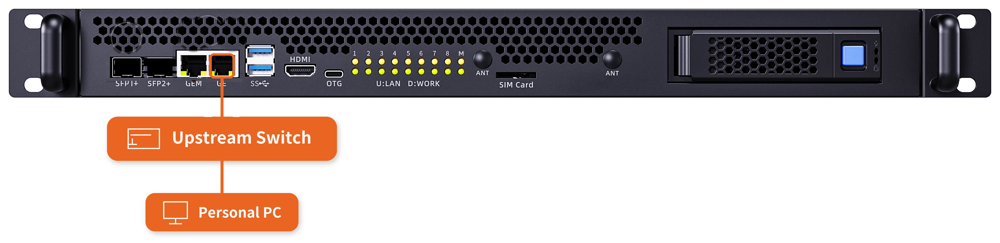

# 网络接线方式

本章节先说明服务器内部的网络连接关系，再介绍通用的接线方法。以下接线方式可以满足大部分使用场景；如有特殊要求，请联系商务获取技术支持。

接网线前，先了解一下各个网口的作用：

- **GEM 口**：直连 BMC 的 MGMT 网口，是服务器的带外管理口。
- **SFP+1、SFP+2、GE 口**：服务器的业务网口，均连接至内部交换机，内部交换机再连接各子板与 BMC。

带外管理是指不依赖操作系统与业务网络的远程管理通道：服务器只要接通电源，即使尚未开机或系统故障，也可以通过 GEM 口访问 BMC，进行远程开关机、硬件监控、固件升级等操作，详见「访问 BMC」章节。

## 内部网络拓扑 [step]

上面这些网口在服务器内部可以分成业务通道和管理通道两部分：

- **业务通道**：机箱上的 SFP+1、SFP+2、GE 口接入内部交换芯片 SWITCH1，由 SWITCH1 连接各子板的 PHY1 网口；BMC 也通过 pci_net 接入 SWITCH1。
- **管理通道**：BMC 通过 usb_net 接入另一颗交换芯片 SWITCH0，SWITCH0 连接各子板的 PHY0 网口；BMC 的 MGMT 口则直接引出到机箱的 GEM 口，不经过任何交换芯片。

也就是说，每块子板（SUB01–SUB08）上都有 PHY1、PHY0 两个网口，分别挂在 SWITCH1 与 SWITCH0 上，而 GEM 口是 BMC 的直连出口。正因为带外管理走的是独立通道，下文带外管理方式才能直接给 BMC 单独拉一根外网线。

## 网线连接方式 [step]

**接线方式分为带外管理和带内管理两种，任选其一都可以让整机连上外网；推荐优先使用带外管理。**

<CodeBlockTabs defaultValue="OutOfBand">
    <CodeBlockTabsList>
        <CodeBlockTabsTrigger value="OutOfBand">带外管理</CodeBlockTabsTrigger>
        <CodeBlockTabsTrigger value="InBand">带内管理</CodeBlockTabsTrigger>
    </CodeBlockTabsList>

    <CodeBlockTab value="OutOfBand">
      

      **工具准备**

      - 网线 × 2（一根连接 GEM 口，一根连接 GE 口）

      **接线步骤**

      1. 将一根网线接入服务器的 GEM 口，另一端接入外部网络。
      2. 将另一根网线接入服务器的 GE 口，另一端接入外部网络。

      该方式下，带外管理（GEM 口）与业务网络（GE 口）各自独立上联，互不影响。
    </CodeBlockTab>

    <CodeBlockTab value="InBand">
      

      **工具准备**

      - 网线 × 1（连接 GE 口与外部网络）

      **接线步骤**

      1. 将网线接入服务器的 GE 口，另一端接入外部网络。

      说明：GE 口与 BMC 均接入内部交换机，GE 口上联外网后，管理流量与业务流量共用同一网络通道，通过业务网络即可访问 BMC，无需再单独连接 GEM 口。
    </CodeBlockTab>
</CodeBlockTabs>