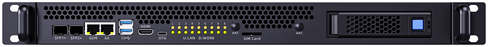

# 服务器状态识别

服务器接入三角插头后，整机自动上电。

开始使用服务器前，请通过服务器上的指示灯判断当前运行状态。

从服务器正面看，可以看到上下两排指示灯：

- **上排黄灯**：表示 1～8 号子板的网络数据交换状态。子板进行网络数据交换时，对应指示灯会闪烁。
- **下排绿灯**：表示 1～8 号子板的系统运行状态。子板正常进入系统后，对应指示灯常亮；如果子板发生故障且无法进入系统，对应指示灯熄灭。