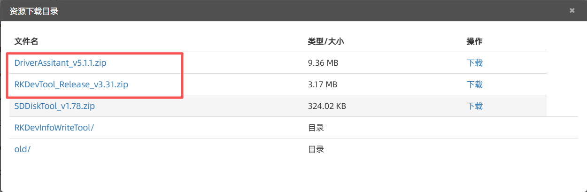
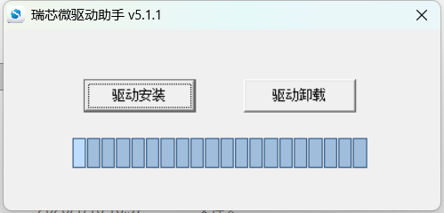
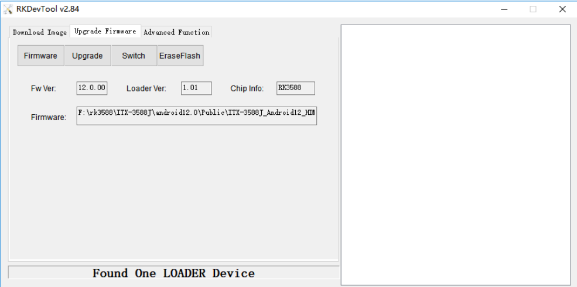
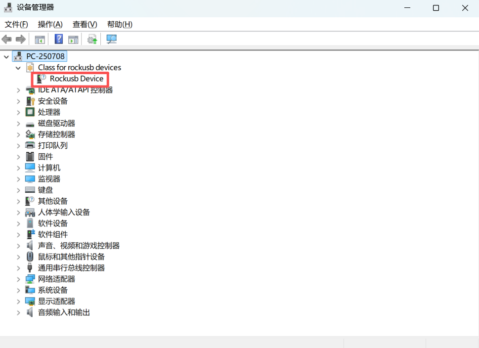
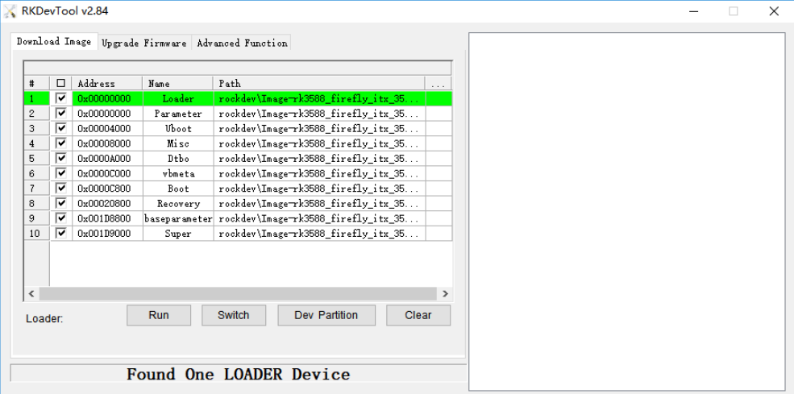
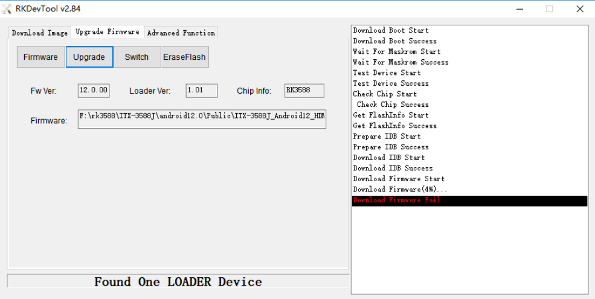

# BMC 固件升级

本文介绍 CSB1-N10R3588 BMC 固件升级流程。升级方式主要分为两类：

- 正常系统可访问时，进入 **Loader** 模式后升级。
- BMC 无法正常启动时，进入 **MaskRom** 模式进行恢复升级。

<Callout title="升级前请确认" type="warn">
  BMC 固件升级会重写底层存储内容。升级前请确认固件与设备型号匹配，并保证供电稳定。升级过程中不要断电、拔出 Type-C 数据线或重复执行升级命令。
</Callout>

## 准备工具 [step]

- 良好的 USB-A 数据线。
- 瑞芯微官方升级工具。
- Windows 或 Linux 主机。
- 与 CSB1-N10R3588 BMC 匹配的固件，例如 `update.img`。

## 安装升级工具 [step]

<CodeBlockTabs defaultValue="windows">
  <CodeBlockTabsList>
    <CodeBlockTabsTrigger value="windows">Windows</CodeBlockTabsTrigger>
    <CodeBlockTabsTrigger value="linux">Linux</CodeBlockTabsTrigger>
  </CodeBlockTabsList>

  <CodeBlockTab value="windows">
    1. 下载 [RKDevTool](https://www.t-firefly.com/doc/download/172.html#other_572)。
      
    2. 解压工具包。
    3. 进入 `DriverAssitant_v5.1.1` 目录，运行 `DriverInstall.exe`。
    4. 为保证驱动版本正确，建议先选择 **驱动卸载**，再选择 **驱动安装**。
      
    5. 驱动安装完成后，进入 `RKDevTool_Release_*`，运行 `RKDevTool.exe`。
      
  </CodeBlockTab>

  <CodeBlockTab value="linux">
    Linux 下无须安装设备驱动，需要安装 `upgrade_tool`、`adb` 和 `fastboot`。

    下载 [Linux UpgradeTool](https://www.t-firefly.com/doc/download/172.html#other_571)，解压后安装到系统路径：

    ```bash
    unzip Linux_Upgrade_Tool_xxxx.zip
    cd Linux_UpgradeTool_xxxx
    sudo mv upgrade_tool /usr/local/bin
    sudo chown root:root /usr/local/bin/upgrade_tool
    sudo chmod a+x /usr/local/bin/upgrade_tool
    ```

    下载 [Linux adb fastboot](https://en.t-firefly.com/doc/download/149.html)，解压后安装到系统路径：

    ```bash
    sudo mv adb /usr/local/bin
    sudo chown root:root /usr/local/bin/adb
    sudo chmod a+x /usr/local/bin/adb

    sudo mv fastboot /usr/local/bin
    sudo chown root:root /usr/local/bin/fastboot
    sudo chmod a+x /usr/local/bin/fastboot
    ```
  </CodeBlockTab>
</CodeBlockTabs>

## 进入升级模式 [step]

使用 USB-A 数据线连接主机和服务器的 OTG 接口。


进入 Loader 模式有多种方式，选择以下方式的任意一种即可。


<CodeBlockTabs defaultValue="loader_by_cmd">
  <CodeBlockTabsList>
    <CodeBlockTabsTrigger value="loader_by_cmd">命令</CodeBlockTabsTrigger>
    <CodeBlockTabsTrigger value="loader_by_button">按键</CodeBlockTabsTrigger>
  </CodeBlockTabsList>

  <CodeBlockTab value="loader_by_cmd">
  ### 通过系统命令进入loader

  USB-A 数据线连接完成后，可通过串口调试终端、`adb shell` 或 HDMI 键盘进入系统，执行：

  ```bash
    reboot loader
  ```
  </CodeBlockTab>

  <CodeBlockTab value="loader_by_button">
    ### 通过 Recovery 按键进入 loader

    设备断电后，按住 BMC 板上的 **RECOVER** 按键，然后给服务器上电。主机识别到 Loader 设备后，可以松开 **RECOVER** 按键，并按正常流程烧写固件。

    
  </CodeBlockTab>
</CodeBlockTabs>

## loader模式确认 [step]
根据操作系统不同，确认 Loader 模式所使用的升级工具与操作方式也有所区别。

<CodeBlockTabs defaultValue="windows">
  <CodeBlockTabsList>
    <CodeBlockTabsTrigger value="windows">Windows</CodeBlockTabsTrigger>
    <CodeBlockTabsTrigger value="linux">Linux</CodeBlockTabsTrigger>
  </CodeBlockTabsList>

  <CodeBlockTab value="windows">
    打开 `RKDevTool.exe`。如果 BMC 已进入 Loader 模式，工具底部会提示 **Found One LOADER Device**。

    

    如果已经执行 `reboot loader`，但工具仍未识别到设备，请打开 Windows 设备管理器，确认是否存在 **Rockusb Device**。

    

    如果没有 **Rockusb Device**，请重新安装 Rockusb 驱动，或更换 USB 接口和 Type-C 数据线后重试。
  </CodeBlockTab>

  <CodeBlockTab value="linux">
    执行 `upgrade_tool` 查看连接状态。如果 BMC 已进入 Loader 模式，输出中会出现 `Loader`。

    ```bash
    sudo upgrade_tool
    ```

    示例输出：

    ```bash
    List of rockusb connected
    DevNo=1 Vid=0x2207,Pid=0x330c,LocationID=106    Loader
    Found 1 rockusb,Select input DevNo,Rescan press <R>,Quit press <Q>:q
    ```
  </CodeBlockTab>

</CodeBlockTabs>


## 烧写程序 [step]
### 完整固件烧写
将完整的固件镜像一次性烧录到全部存储分区，会覆盖所有分区内容，包含系统、配置、数据等全部信息。适用于全新烧录、固件大版本升级、系统异常恢复场景。执行后原有用户配置会丢失，烧写完成后设备会恢复出厂状态。面向需要整机固件重置、全量升级的客户使用。
<CodeBlockTabs defaultValue="windows">
  <CodeBlockTabsList>
    <CodeBlockTabsTrigger value="windows">Windows</CodeBlockTabsTrigger>
    <CodeBlockTabsTrigger value="Linux">Linux</CodeBlockTabsTrigger>
  </CodeBlockTabsList>

  <CodeBlockTab value="windows">
    #### Windows 工具

    统一固件通常为 `update.img`，烧写步骤如下：

    1. 打开 `RKDevTool.exe`。
    2. 切换到 **Upgrade Firmware** 页面。
    3. 点击 **Firmware**，选择需要升级的 `update.img`。
    4. 确认工具显示固件信息。
    5. 点击 **Upgrade** 开始升级。

    如果升级失败，可尝试先点击 **EraseFlash** 擦除 Flash，然后重新升级。

    
  </CodeBlockTab>

  <CodeBlockTab value="Linux">
    #### Linux 工具

    ```bash
    sudo upgrade_tool uf update.img
    ```
  </CodeBlockTab>
</CodeBlockTabs>
### 单分区烧写

仅对指定的单个分区进行烧录更新，不会改动其他分区的数据。支持单独更新内核、U‑Boot 等局部组件，保留其余分区的用户配置与业务数据。多用于小版本迭代调试、局部故障修复，升级效率更高，无需完整重刷整个固件。适合针对性客户，部分客户仅需更新某一个分区，无需刷写全部固件。
<CodeBlockTabs defaultValue="windows">
  <CodeBlockTabsList>
    <CodeBlockTabsTrigger value="windows">Windows</CodeBlockTabsTrigger>
    <CodeBlockTabsTrigger value="Linux">Linux</CodeBlockTabsTrigger>
  </CodeBlockTabsList>

  <CodeBlockTab value="windows">
    #### Windows 工具

    只需要更新单个或多个分区时，可以烧写分区镜像：

    1. 切换到分区烧写页面。
    2. 勾选需要烧录的分区。
    3. 确认每个分区对应的镜像路径正确。
    4. 点击 **Run** 开始升级。
    5. 升级结束后设备会自动重启。

    
  </CodeBlockTab>

  <CodeBlockTab value="Linux">
    #### Linux 工具

      ```bash
      sudo upgrade_tool di -b /path/to/boot.img
      sudo upgrade_tool di -r /path/to/recovery.img
      sudo upgrade_tool di -m /path/to/misc.img
      sudo upgrade_tool di -u /path/to/uboot.img
      sudo upgrade_tool di -dtbo /path/to/dtbo.img
      sudo upgrade_tool di -p parameter
      sudo upgrade_tool ul bootloader.bin
      ```

      如果因 Flash 异常导致升级失败，可尝试低级格式化或擦除 EMMC：

      ```bash
      sudo upgrade_tool lf update.img
      sudo upgrade_tool ef update.img
      ```

      ### fastboot 烧写动态分区 [step]

      ```bash
      adb reboot fastboot
      sudo fastboot flash vendor vendor.img
      sudo fastboot flash system system.img
      sudo fastboot reboot
      ```
  </CodeBlockTab>
</CodeBlockTabs>

## 常见问题 [step]

### 烧写失败 [step]

如果烧写过程中出现 **Download Boot Fail**，或工具提示升级失败，通常与以下原因有关：

- USB-A 数据线质量较差。
- 数据线或接口接触不良。
- 主机 USB 接口供电能力不足。
- 驱动未正确安装。
- 固件与设备型号不匹配。

处理建议：

1. 更换 USB-A 数据线。
2. 更换主机 USB 接口。
3. Windows 下重新安装 Rockusb 驱动。
4. 确认固件包与 BMC 匹配。
5. 如仍失败，可先擦除 Flash 后重新烧写。

